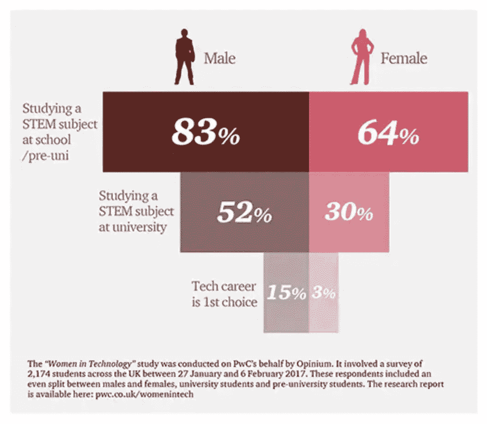

# 为什么更多的女性应该学习如何编码，以及如何开始

> 原文：<https://betterprogramming.pub/why-more-women-should-learn-how-to-code-and-how-you-can-start-3a255efe8fd3>

## 说服更多女性进入科技行业，打破陈规，分享初学者的简单学习方法

照片由[思想目录](https://unsplash.com/photos/Nv-vx3kUR2A)在 [Unsplash](http://unsplash.com) 上拍摄

T4 每天有 17 亿用户使用脸书，谷歌每分钟处理大约 380 万次搜索。你知道这些人有什么共同点吗？你可能会说:“访问互联网。”但是如果你从一个更全面的角度来考虑，除了他们是一个非常多样化的群体之外，他们没有任何共同点。

在我的一次旅行中，我坐在蒙古的一个蒙古包里，离下一个城市有一天的车程，等着见一位已经“骑马”的冠军鹰饲养员。接待我的那位女士和我没有共同语言，她拿出手机，要求把我加到脸书上。那个女人和我本来就不一样，但我们用的是同样的产品。

# 为什么这很重要？

这个故事之所以重要，是因为尽管我们最喜爱的科技产品的用户群极其多样化，但创造这些产品的劳动力却不是。在美国，只有 26%的计算机从业人员是女性，只有 3%。)是非裔美国人。此外，在过去的 20 年里，女性软件工程师的雇佣只增加了 2%。那不是很多样化。

现实是，为了让科技行业创造出伟大的产品并引导真正代表其服务人群的创新，它需要改善其种族和性别代表性。

# 问题源自哪里？

科技招聘似乎是这个问题的明显替罪羊。但大多数大型科技公司的雇主都非常清楚这个问题，并努力提高他们的多样性和包容性。行业领导者非常清楚这个问题，并且正在努力解决这个问题。当然，这一过程仍然存在问题，但证据表明，问题的根本原因发生在招聘阶段之前，是一个观念问题。

普华永道最近的一项研究发现，在英国，只有 3%的女性将科技职业作为第一选择。美国的情况也好不到哪里去，在 T2，2019 年计算机科学毕业生中只有 21%是女性。如果仅仅是这种代表性不足还不能激励你，作为一名女性，去调查一个主宰我们日常生活的行业的职业生涯，那么本文旨在找出一些先天的、性别特定的技能，这些技能可以让女性对科技公司如此有价值，但在查看传统的科技职位描述时往往会被忽略。

女孩不太可能在学校和大学学习 STEM 课程。来源:普华永道，2017 年

# 你可能已经具备了成为一名伟大的程序员的条件

图片由 [NESA 制作](https://unsplash.com/photos/IgUR1iX0mqM)在 [Unsplash](http://unsplash.com)

## 你很有创造力

如果我让你想象一个软件开发人员，你会想到什么样的刻板印象？你认为哪些技能很重要？我敢打赌，创造力不是你想到的第一个技能。但事实是软件工程需要大量的创造力。

当我学会编码的时候(剧透一下:我在大学没有学过计算机科学)，我惊讶于我的创造力无时无刻不在受到挑战。很明显，前端开发人员需要很好的设计和很强的创造力，但是作为后端开发人员，你也不会有一天不发挥你的创造力。

你需要成为一个创新的问题解决者，去弄清楚不同的技术如何能够协同工作，形成一个庞大而复杂的整体。在编码中，通常没有硬性的规则，也没有解决问题的唯一方案。相反，这有点像诗歌，都是关于如何让语言发挥作用的。你将形成自己的风格和独特的解决方案来应对每一个挑战。

## 你擅长现代语言

与地球上的其他居民相比，语言赋予人类构建和交流几乎无限数量的思想或概念的能力；代码也不例外，对于可以传达或创建的内容没有限制。我个人在学校喜欢拉丁语(我知道，完全是极客警报)，在编码的几天里，我对自己说，“等一下，这就像拉丁语一样；通过运用一些简单的规则，我能够创造或理解意义。”这里的主要区别是，开始编码时的学习曲线要陡峭得多，你会比外语学得更快。

## 你是一个团队成员

让我们想象一下典型的软件开发人员和他们拥有的技能。你是否在想象一个孤独的人站在笔记本电脑前，没日没夜地工作，却没有和其他人说过一句话？编程不完全是团队成员的工作，这绝对是我几年前的一个误解。其实恰恰相反。

编程的复杂性意味着你几乎从不独自工作。一个成品由不同团队创建的数百个组件组成，这些组件必须完美地相互协作。这不仅需要团队合作，还需要对目标的共同理解。

作为一名初级开发人员，你将会有一个强有力的导师，与他的合作会比大多数工作更加密切。你甚至可以和另一个开发者结对编程；这实际上意味着您在一台计算机上与另一名开发人员一起工作。你们中的一个人是司机，写代码，而另一个人观察和评论。我不知道你如何能以比这更合作的方式工作。

# 如何开始

Avel Chuklanov 在 [Unsplash](http://unsplash.com) 上拍摄的照片

## 在线资源

有许多不同的在线编程课程通常是免费的或者基本上是免费的。这是你可以遵循的一个可能的学习途径:

1.  参加免费的女性编码网络研讨会。我知道编码学校 [Le Wagon](https://www.lewagon.com/events) 定期举办这些，还有其他选择。这些网络研讨会是获得洞察力和确定编码是否适合您的绝佳机会。
2.  下一步，我会建议做一些关于代码学院的免费课程。可以学习几种语言:HTML、CSS、Javascript、jQuery、Python、Ruby、PHP。我建议从 HTML 和 CSS 开始，立即给你设计一个简单网站的能力，然后进展到 Ruby 或 Python，进入后端开发。
3.  一旦你学会了基础，让你的创造力来指导你的学习，并开始学习更高级的概念和开始你的第一个项目。有许多方法可以实现这一点，以下只是两种可能的解决方案。我个人是在一个训练营学习编码的(我做的那个叫做 [Le Wagon](https://www.lewagon.com/) ，但是还有很多其他的)。这里的主要好处是有老师一直一对一地回答你的问题，结构化的学习方法，并保持负责任。如果你不想参加完整的训练营，你可以在 Udacity 注册一个[纳米学位。](https://www.udacity.com/)他们以极低的成本为编码训练营提供类似的支持，与领先的公司一起设计课程，并提供许多有趣的学习途径(如网络安全入门)。

我根据我的经验给出了上面的建议，这是通向开发人员职业生涯的许多途径之一；像往常一样，有许多条路通向罗马。如果你有不同的经历，有其他的建议，或者有问题，请发表评论，我们可以继续讨论如何增加这个领域的代表性。