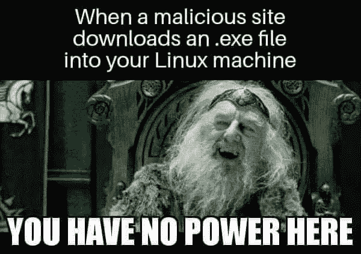
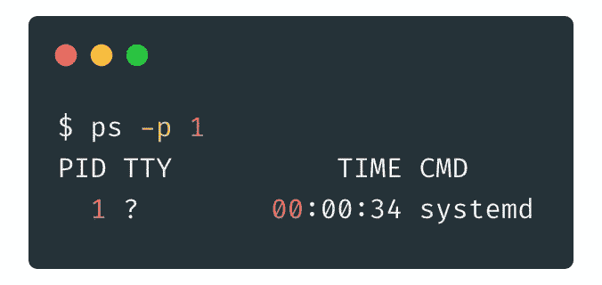
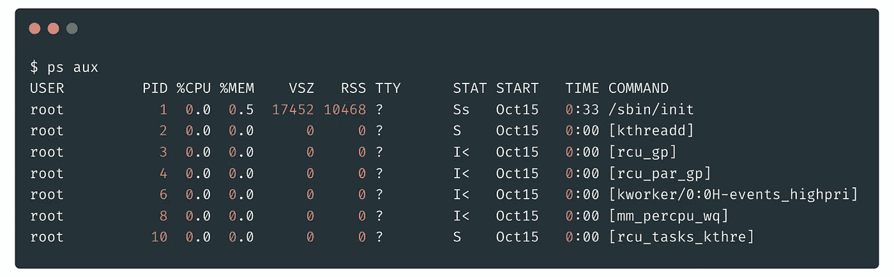
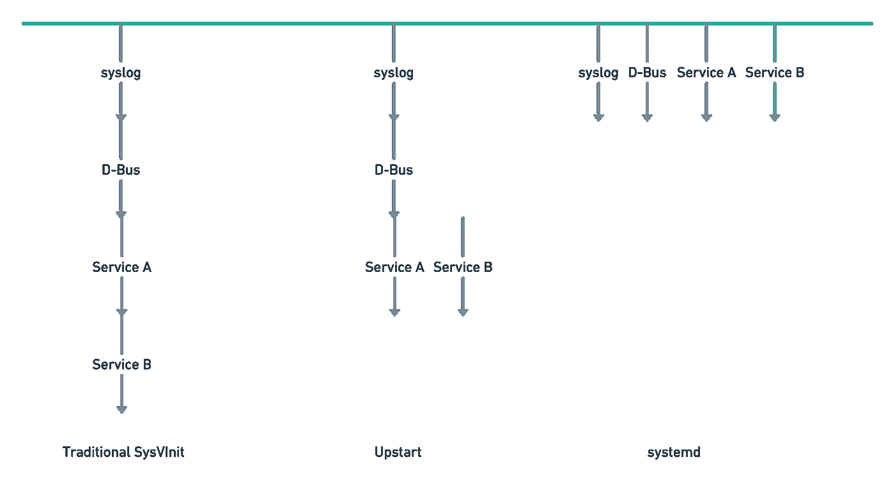

# 每个人都讨厌 systemd

> 原文：<https://betterprogramming.pub/why-most-linux-users-hate-systemd-c591eef3d034>

## 探索 Linux 最激烈的圣战之一

安德烈·亨特在 [Unsplash](https://unsplash.com/) 上的照片

如果有一件事是技术人员喜欢参与的，那就是圣战。

没有什么能比得上那种自以为是的感觉，把工作日的一半时间花在告诉各种网络陌生人他们是白痴上。

无论是嘲讽最新的 Vim 用户仍然停留在他们的终端；与你的 Windows 好友分享关于恶意软件的最新信息；或者丁池·马科斯是穷人的免费赠品，同时嘲笑苹果粉丝为它支付了过高的价格。

每个技术领域都有一场圣战。

图像由作者创建，但灵感来自众所周知的模因

然而，有一场圣战你可能没听说过。从 2010 年开始，这已经不是什么新鲜事了。但就争夺而言，它的排名接近榜首。

是`[systemd](https://systemd.io/)`。

如果你是一个狂热的 Linux 用户，那么你已经很了解`systemd`的知识了。在这种情况下，你可以跳过这篇文章，直接去评论你的观点。我知道你想。

但是如果你是一个像我一样对 Linux 只有肤浅了解的软件工程师，那么你可能不熟悉`systemd`肮脏的过去。

直到几年前，当我和一些工作中的系统管理员一起喝酒时，我才意识到这出戏。

“人类，螺丝`systemd`。这是 Linux 遭遇的最糟糕的事情，”其中一个人滔滔不绝地说道。他无数的空瓶子给了他向唱诗班布道的勇气，因为大多数其他人都点头同意。

我也点头附和，尽管我不知道他在说什么。那天晚上回到家，我在谷歌上快速搜索了一下，了解了一下大致情况。哦，天啊，它把我带进了兔子洞。或者粪坑，看你怎么看了。

虽然关于这件事已经写了很多，但我还是忍不住发表了自己的意见。这篇文章将讲述 Linux init 系统的历史，`systemd`的崛起，以及为什么它在各个 Linux 社区变得如此声名狼藉。

我不想挑起任何旧仇。这篇文章的目标是让技术领域的不同人士了解 Linux 生态系统的核心组件。

我将尽可能不偏不倚地陈述事实，同时仍然使其相对简短和有趣。我确实对那件事有一些想法，但是我将把那些留到最后。

注意:虽然我对这个话题做了很多研究，但我不是专家。如果你发现明显的错误或不准确，请让我知道，我会更新它。

# systemd 之前 Linux init 系统的历史

要了解`systemd`的现在，我们必须了解它的过去，以及最初为什么要创造它。为了做到这一点，我们需要了解 init 系统。

当你打开电脑时，会发生很多事情。其中之一是创建第一个进程，也称为 PID1。之所以称为 PID1，是因为它是 ID 为 1 的进程。

作者图片

PID1 对于操作系统来说非常重要。它是整个系统的父进程。一般来说，当你在电脑上工作时，你会使用很多进程。

当你在一个终端中运行`ps aux`时，你可以看到它们。

“ps aux”命令的输出示例—作者提供的图像

所有不是 PID1 的进程都是它的直接或间接派生。

在过去，PID1 扮演着简单而重要的角色。它是一个后台运行的守护进程，执行一系列启动脚本来引导系统中的其余服务。

虽然简单，但也需要稳定。因为 PID1 是所有其他进程的父进程，所以如果它崩溃或退出，它将带走系统的其余部分。在 Linux 历史的大部分时间里，各种发行版都使用基于 Unix 的 System V 的 init 系统，称为`[**sysvinit**](https://wiki.archlinux.org/title/SysVinit)`。

`sysvinit`非常适合 20 世纪 80 年代至 21 世纪初的计算机，因为它意味着在静态环境中运行。它以预定义的顺序同步发布启动脚本。在当前脚本完成之前，它不会执行下一个脚本。这种方法效率低，速度慢，但当时还不错。

然而，随着时间的推移，硬件变得更加动态，Linux 内核变得更加异步。设备会在不可预知的时间启动，导致发行版开发者不得不[创建黑客和解决方案](https://www.reddit.com/r/archlinux/comments/4lzxs3/why_did_archlinux_embrace_systemd/)。此外，用户希望能够在机器启动后插入外部驱动器。`sysvinit`不是为处理这个而设计的。

此外，`sysvinit`不是一个功能齐全的服务经理。它不能完全跟踪进程，导致孤立的进程。它也没有很好地处理依赖性需求。

对于各种 Linux 发行版的维护者来说，很明显`sysvinit`已经过时，需要被替换。

# systemd 的兴起

由于`sysvinit`的缺点，人们开始寻找精神上的接班人。创建了几个项目来继承这个衣钵。这些项目中最引人注目的是新贵**。**

**Upstart 是对`sysvinit`的一大改进。它使用了一个事件模型，能够根据系统中的事件启动和停止流程。这使得它能够利用现代硬件的异步特性，而不需要复杂的变通方法。**

**在其巅峰时期，Upstart 被整合到各种 Linux 发行版中，如 Ubuntu、Fedora、RHEL 和 openSUSE。但是它也有缺点。Upstart 没有利用并行性，使得启动过程比需要的要慢。它也有一些值得注意的错误。**

**市场上仍有竞争的空间。输入`systemd`。**

**Lennart Poettering 和 Kay Sievers 创造了`systemd` 2010，并大量模仿苹果的[发布会](https://en.wikipedia.org/wiki/Launchd)。它旨在改进 init 进程——很像 Upstart。然而，与新贵不同的是，`systemd`以一种完全不同的方式去做这件事。**

**在 Lennart Poettering 的帖子[反思 PID1](http://0pointer.de/blog/projects/systemd.html) 中，他指出:**

> **对于快速有效的启动，两件事至关重要:**
> 
> **-少启动**多启动**。**
> 
> **-并启动**多**在*并联*。**

**`systemd`如何工作是一个令人困惑的问题。它有时被称为系统引导的依赖或基于事件的模型。虽然使用`systemd`的发行版可能会以这种方式使用它，但是`systemd`是围绕[套接字激活](https://0pointer.de/blog/projects/socket-activation.html)设计的。**

**虽然深入研究套接字激活超出了本文的范围，但我可以给出一个简短的概要。**

**当计算机启动时，它会产生各种服务和进程。这些进程相互连接，并通过一个[套接字](https://www.geeksforgeeks.org/socket-in-computer-network/)相互对话，这个套接字本质上是一个用于通信的缓冲通道。如果一个服务试图与另一个尚未激活的服务连接或通信，它将失败。然而，`systemd`所做的是同时激活所有的服务套接字。**

**因此，如果一个服务试图与一个不活动的服务通信，消息将在套接字中缓冲，直到服务准备好。这允许`systemd`并行启动所有不同的服务和进程，从而加快启动速度。**

**如[反思 PID 1](https://0pointer.net/blog/projects/systemd.html) 中所述:**

> **更多地并行启动意味着，如果我们必须运行某个程序，我们不应该序列化它的启动(就像 sysvinit 所做的那样)，而是同时运行它，以便可用的 CPU 和磁盘 IO 带宽达到最大限度，从而使总体启动时间最小化。**

****

**各种 init 系统对比—图片由作者提供— [受](https://0pointer.de/blog/projects/socket-activation.html)启发**

**所有这些使得`systemd`成为一个高效的初始化进程。然而，`systemd`并没有就此止步。**

**Poettering 认为，PID1 有一个特殊的作用，具有独特的特权，这是利用不足。除了高效启动系统，他还设想将`systemd`作为构建操作系统的基础和平台。**

**受诗人眼光的影响，`systemd`的范围逐年扩大。它已经从一个 init 系统扩展到一个包含 69 个独立二进制文件的完整软件套件。从它自己的网站:**

> **systemd 是 Linux 系统的一套基本构建块。它提供了一个系统和服务管理器，作为 PID 1 运行，并启动系统的其余部分。**
> 
> **[systemd 包括]一个日志守护程序，用于控制基本系统配置(如主机名、日期、区域设置)的实用程序，维护已登录用户和正在运行的容器和虚拟机的列表，系统帐户、运行时目录和设置，以及用于管理简单网络配置、网络时间同步、日志转发和名称解析的守护程序。**

**虽然`systemd`的功能集自 2010 年以来有所增加，但它的受欢迎程度和影响力也在增加。**

**由于 Poettering 与红帽的关系，Fedora 在 2011 年创立后不久就采用了`systemd`。Arch 和 openSUSE 在 2012 年迅速跟进。Debian 坚持了一段时间，但最终，它和 Ubuntu 在 2015 年跟进。**

**在撰写本文时， [13 个 Linux 发行版默认运行](https://en.wikipedia.org/wiki/Systemd#Adoption)`[systemd](https://en.wikipedia.org/wiki/Systemd#Adoption)`。虽然我找不到确切的百分比，但可以肯定地说，绝大多数 Linux 用户都在使用`systemd`。**

**毫无疑问是有影响力的，但是这种受欢迎是有代价的。**

# **围绕 systemd 的戏剧**

**说*大家*都讨厌`systemd`显然言过其实。大多数 Linux 用户要么喜欢它，要么不关心它。**

**然而，它的通过充满了戏剧性和混乱。少数敢于直言的人开始诅咒自己的名字。他们创建了[多个](https://ihatesystemd.com/) [网站](https://web.archive.org/web/20140424123646/http://boycottsystemd.org/) [指出其各种缺陷](https://nosystemd.org/)和 [systemd-free Linux forks](https://en.wikipedia.org/wiki/Devuan) 。有些人甚至亲自侮辱它的创造者。甚至已经到了死亡威胁介入的地步。**

**这不仅仅是软件上的分歧。值得一问的是，为什么会这样，怎么会这样。**

**通过我的研究，我发现了许多对`systemd`的批评，但它们似乎都分为三个不同的类别。**

# **创造者**

****

**Lennart poeting—图片来源:[维基百科](https://en.wikipedia.org/wiki/Lennart_Poettering#/media/File:Lennart_poettering.jpg)**

**创造者和围绕`systemd`的社区是愤怒的共同来源。Linux 的创造者 Linus Torvalds 在 Linux 邮件列表上的一次激烈的交流中，著名地称 Kay Sievers 为“该死的首席女演员”[。](http://lkml.iu.edu//hypermail/linux/kernel/1404.0/01488.html)**

**虽然凯·西弗斯是`systemd`的联合创作者之一，但伦纳特·诗化是它的代言人。因此，他受到了强烈的反对。Poettering 面对自由/开源软件群体中许多人的愤怒的主要原因之一是他的公众形象。**

**作为`systemd`的首席开发者，伦纳特·庞特是一个公众人物。他有自己的[维基百科页面](https://en.wikipedia.org/wiki/Lennart_Poettering)，关注的[适度推特，以及](https://twitter.com/pid_eins)[分享自己想法的博客](https://0pointer.net/blog/)。**

**我读过他的一些帖子。它们构造得非常好，经过深思熟虑。如果你对他的唯一接触是来自那些作品，你可能会想所有的仇恨从何而来。**

**然而，在谈到 [GitHub 问题](https://github.com/systemd/systemd/issues/6237)、[黑客新闻评论线程](https://news.ycombinator.com/item?id=19024912)和社交媒体时，Lennart 也非常直言不讳。而且是在那些他更倾向于不加过滤的场地。**

**Lennart 经常因为他对 bug 的态度和不愿接受指责而受到批评。以至于他在 2017 年获得了最差供应商回应奖。**

**但是有一段话比这更重要。当你在谷歌上搜索诗人的名字时，首先出现的是[2014 年他上传到 Google+的一篇文章](https://web.archive.org/web/20141007181442/https://plus.google.com/app/basic/stream/z13rdjryqyn1xlt3522sxpugoz3gujbhh04)。在这篇文章中，他讨论了整个 Linux 社区是一个非常有害的环境。以至于他不断收到仇恨信息，甚至死亡威胁。**

**他给新来者的建议是“脸皮厚一点，或者逃跑”。**

**这在各种 Linux 和开源社区中引起了不小的轰动。虽然许多人同意他的观点，但其他人指责伦纳特的行为方式与托沃兹相似。**

**创作者的古怪行为和个人生活是否应该影响公众对其作品的看法，这是有争议的。毕竟，虽然 Torvalds 过去与 systemd 开发人员有过争执，但他仍然喜欢这个软件。**

**在接受 Slashdot 采访时，托瓦尔兹表示:**

> **不得不说，我真的没有得到 systemd 的仇恨。我认为它在 init[的状态上改进了很多。]**
> 
> **是的，我和一些维护者有一些性格问题，但那是关于你如何处理错误报告和当事情出错时接受责备(或不接受责备)。如果人们认为这意味着我不喜欢 systemd，我会让你们失望的。**

**然而，对于 systemd 的批评者来说，Poettering 的争议性声明使一个已经两极分化的项目更加分裂。**

# **复杂性和设计**

****

**蒂莫·沃尔茨在 [Unsplash](https://unsplash.com?utm_source=medium&utm_medium=referral) 上的照片**

**`systemd`经常被它的愤世嫉俗者称为*膨胀器*。很容易看出为什么。它的代码库有超过 100 万行代码。对于大多数其他项目来说，这不是问题。但是`systemd`是个特例。**

**正如我前面说过的，PID1 有一个重要但不稳定的角色。因为它是所有其他进程的父进程，所以如果它崩溃，整个系统都会崩溃。**

**过去，`sysvinit`和 Upstart 解决这个问题的方式是在范围上保持简单。它们的简单性有助于增加它们的稳定性。这就是问题所在。**

**`systemd`是最不简单的事情。这是一个包含 69 个二进制文件的完整软件套件。它的作用范围已经从仅仅是一个 init 系统发展到接管操作系统的许多其他部分。人们认为不需要修理的部分。**

**这是故意的。Poettering 在多个场合表达了他对一个更加统一和集成的 Linux 生态系统的渴望。从用户体验的角度来看，这是有意义的。从个人经验来说，能够登录任何集成了`systemd`的操作系统，并了解如何启动和停止服务是一个很棒的特性。但这也带来了权衡。**

**在过去,`systemd`的复杂性和它在 Linux 生态系统中的大规模采用被证明是一对可怕的组合。它所做的任何改变，尤其是如果它不是向后兼容的，会影响几乎所有运行 Linux 机器的人。**

**一些显著的例子是:**

*   **`[systemd](https://lwn.net/Articles/490413/)` [吸收 udev](https://lwn.net/Articles/490413/) 。**
*   **[引入一个变化](https://news.ycombinator.com/item?id=11782364)，当用户默认退出时，它会终止后台进程。**
*   **GNOME 使`[systemd](https://lwn.net/Articles/520892/)` [成为硬依赖](https://lwn.net/Articles/520892/)并阻止任何非`systemd`系统使用它。(没有`systemd`也可以运行 GNOME，因为需要[很多变通办法](https://github.com/dantrell/gentoo-project-gnome-without-systemd)。)**

**然而，Linux 社区中的许多人认为`systemd`的复杂性是必要的。根据一位 ArchLinux 开发者的说法:**

> **大多数 systemd 批评家认为的“膨胀”，我认为是解决一个复杂问题的必要的复杂性。**

# **打破常规**

****

**克里斯·劳顿在 [Unsplash](https://unsplash.com?utm_source=medium&utm_medium=referral) 上的照片**

**我看到的对`systemd`抱怨的最后一个，也可能是最大的一个原因是，它是对其前身的重大改变。无论是实施还是理念。**

**一些最大的抱怨[来自系统管理员。](https://www.reddit.com/r/sysadmin/comments/9tinha/why_there_is_so_much_hate_toward_systemd/)**

**系统管理员花费大量时间摆弄和配置操作系统。他们这样做是为了工作和生计。当你扰乱他们的生活时，他们往往会对此形成强烈的意见。**

**此外，他们讨厌二进制日志。**

**另一个让许多人竭力反对的变化是与 UNIX 哲学的决裂。**

**UNIX 哲学认为一切工具应该 [*做一件事，并且做得很好*](https://en.wikipedia.org/wiki/Unix_philosophy#Do_One_Thing_and_Do_It_Well) 。虽然 poeting 很快指出`[systemd](https://0pointer.de/blog/projects/the-biggest-myths.html)` [是二进制文件](https://0pointer.de/blog/projects/the-biggest-myths.html)的集合，但是许多二进制文件*相互依赖*，并没有像宣传的那样使其解耦和模块化。**

**此外，`systemd`不遵守 POSIX 标准——毫无疑问受到 Lennart 的[个人对 POSIX](https://en.wikipedia.org/wiki/Lennart_Poettering#Controversies) 的看法的影响。这将`systemd`与 Linux 生态系统联系在一起，疏远了它的 BSD 兄弟。**

**对许多人来说，这是压垮骆驼的最后一根稻草。虽然他们可以原谅我列出的其他问题，但是背离 UNIX 和 POSIX 标准太过分了。他们把它视为圣杯，而不管它给系统带来多少好处或改进。**

**不要乱用 UNIX。**

# **我个人的想法**

**在阅读了大量的博客文章、邮件列表和论坛帖子之后，我已经形成了自己对这个问题的一些想法。**

**作为一个日常只使用 Linux 的 surface 特性的软件工程师`systemd`再合适不过了。它是为我的用例而设计的。**

**也就是说，我很同情那些认为`systemd`有重大问题的人。似乎有最大问题的群体是具有复杂用例的超级用户，例如大型系统的系统管理员。对他们来说，这不仅仅是一种爱好。这是他们的生计。**

**当你花了几年，甚至几十年的时间为一个系统开发脚本、工具和知识时，当所有这些东西在一个版本中被弃用时，你会感到震惊。为了升级到新版本，需要花费时间和精力来重写和移植这些工具。**

**尽管 Python 第 3 版已经发布了 13 年，但仍有如此多的系统运行 Python 第 2 版，这是有原因的。**

**`systemd`在过去 10 年里一直是一个有争议的话题，原因之一是它的采用不是一个奇点，而是一系列不幸的事件。**

**由于自由/开源软件的性质，每个 Linux 发行版在不同的时间分别采用了它。每一次收养都引发了一次又一次同样的争论。强化每个人的观点和决心。**

**从工程和架构的角度来看，`systemd`已经做出了许多明智的决定。与此同时，整合 Linux 生态系统的大片区域也有其自身的缺点。**

**正如软件中的一切一样，没有完美的解决方案，只有折衷。**

# **最后**

**对我来说，`systemd`的历史代表了科技行业最好和最坏的一面。从积极的一面来看，有许多经过深思熟虑的[演讲](https://www.youtube.com/watch?v=o_AIw9bGogo)、[文章](https://blog.darknedgy.net/technology/2020/05/02/0/index.html#rise)和[讨论](https://lwn.net/Articles/698822/)，它们教会了我很多关于 Linux 和 init 系统的知识。比我在日常工作中学到的还要多。**

**但是消极的一面是对`systemd`创作者的在线骚扰和死亡威胁——不管是不是玩笑。**

**科技专业人士可以从围绕`systemd`的戏剧中学到很多东西。**

**在我看来，`systemd`最大的失败是它的沟通。我确信`systemd`的创造者们是出于好意。但是，如果有相当多的人称你为“傲慢者”,包括 Linux 的创造者，那么还有增长的空间。**

**另一方面，`systemd`知道它的受众。它提供了一个免费的、可维护的服务，比它的前身更好、更现代。这使得许多 Linux 发行版进行转换变得很容易。**

**在我看来，一个软件在不到十年的时间里占据了 Linux 生态系统 99%的份额是相当了不起的。不管你对诗歌有什么看法，我渴望有一个项目哪怕只有 1/10 的成功。**

**[订阅我的时事通讯](https://medium.com/subscribe/@SunnyB)当我写了一篇新文章时，你会得到更新。**