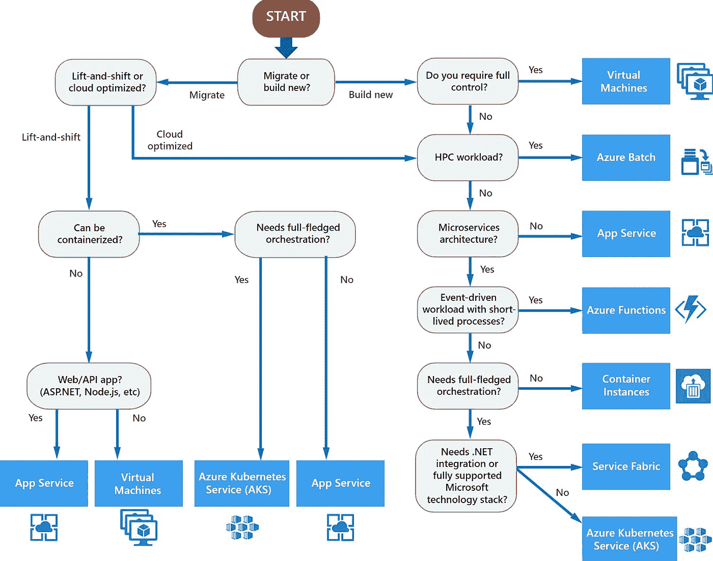

# 为什么不用 Kubernetes？

> 原文：<https://betterprogramming.pub/why-not-use-kubernetes-52a89ada5e22>

## Kubernetes 真的适合您的堆栈吗？

什么时候选择 Kubernetes？

许多团队很高兴开始使用 Kubernetes。有些人对 Kubernetes 本身提供的弹性、灵活性、可移植性、可靠性和其他优势感兴趣。有些人是技术爱好者，他们只是想有机会使用这个平台，了解更多。一些开发人员希望获得这方面的经验，这样他们就可以在简历中增加另一项高要求的技能。总的来说，现在大多数开发人员都想在某个时候使用 Kubernetes。

这可能是个好主意，也可能不是。

# Kubernetes 旨在解决分布式架构问题

根据[官方文档网站](https://kubernetes.io/docs/concepts/overview/what-is-kubernetes/)的定义，

> *“Kubernetes 为你提供了一个灵活运行分布式系统的框架。它负责您的应用程序的扩展和故障转移，提供部署模式等等。”*

它不仅仅是为分布式系统设计的，而是为容器化的应用程序设计的。尽管如此，它确实提供了许多资源，使管理和扩展分布式系统变得更加容易，比如微服务解决方案。它也被认为是一个编排系统。

> [自动化](https://www.redhat.com/en/topics/automation)和编排是不同的，但相关的概念。自动化通过减少或取代与 IT 系统的人工交互，转而使用软件来执行任务，以降低成本、复杂性和错误，从而帮助您提高业务效率。
> 
> 一般来说，自动化指的是将单一任务自动化。这不同于流程编排，流程编排是指您如何自动化涉及多个不同系统的许多步骤的流程或工作流。当您开始将自动化构建到您的流程中时，您可以编排它们自动运行。
> 
> — [什么是编排？RedHat 官网](https://www.redhat.com/en/topics/automation/what-is-orchestration)

换句话说，Kubernetes 使管理复杂的解决方案变得更加容易，如果没有适当的编排系统，这些解决方案很难维护。虽然您可以自己实现 DevOps 工程实践，但是如果您从几十个服务扩展到几百个服务，这是不可伸缩的。

# Kubernetes 很复杂

为了利用它的特性，开发人员和 IT 操作员必须了解容器、网络、安全性、可移植性、弹性和 Kubernetes 本身。为了正确使用其工作负载，您应该了解每个组件是如何工作的。要管理集群，您应该了解它的架构、存储、API 和管理系统，这与传统的虚拟化环境有很大不同。为了扩展解决方案，您应该学习如何集成工具来部署、监控和跟踪服务，例如 [Helm](https://helm.sh/) 和 [Istio](https://istio.io/) 。这里加入了许多新概念，所以你的团队必须为这个挑战做好准备。

# Kubernetes 对于小型解决方案来说价格昂贵

为了理解原因，让我们强调一下 Kubernetes 的一个关键概念— *弹性*。为了利用这一点，您需要额外的节点—超过运行应用程序所需的最低数量。如果一个节点关闭，请求的单元将被重新定位到可用节点。对于生产工作负载，建议至少使用三个节点来实现弹性。

很容易想象，如果只托管一个应用程序，这是不值得的。但是，即使您有十个或更多，您也必须考虑集群的维护成本是否值得。

维护环境的成本还包括运营支持。平台越复杂，就应该有越专业的人参与进来。这可能意味着雇佣第三方专业公司来提供支持或包含支持服务的解决方案，如 Openshift。

# 何时选择 Kubernetes

根据您使用的架构、应用程序的数量以及它们相互依赖的程度，以及您的团队的运营能力，可以检查 Kubernetes 是否是所有可用技术中的合适选择。

有了[容器的网络应用](https://azure.microsoft.com/en-us/services/app-service/containers/)，你就有了一个完全可以生产的环境。借助标准计划、SSL 特性和[应用洞察](https://docs.microsoft.com/en-us/azure/azure-monitor/app/cloudservices)，您可以轻松获得一个安全、可扩展和受监控的环境。

如果你只处理孤立的应用程序，或者少量连接的应用程序，也许 Azure Web 应用程序和运行在同一个虚拟网络中的[容器实例](https://azure.microsoft.com/en-us/services/container-instances)的组合就足够了。

另一方面，如果您有越来越多的容器化应用程序，那么在 Kubernetes 中托管它们是很有趣的。您将能够在一个单一的集中式环境中托管多种类型的应用程序，如 web 应用程序、API 和重复作业。您的团队将能够专注于 Kubernetes，而不是几个云原生解决方案。

如果你处理分布式场景，比如微服务，那就去做吧。分布式架构很复杂，而 Kubernetes 的设计就是为了让它变得更简单。我想不出任何其他平台比 Kubernetes 对分布式应用程序来说更加完整和可扩展。

# 结论

当你处理少量的容器化的应用程序时，孤立的或者它们之间很少依赖的，其他的主机选项，像[Azure Web Apps for Containers](https://azure.microsoft.com/en-us/services/app-service/containers/)或者[Azure Container Instances](https://azure.microsoft.com/en-us/services/container-instances/)——或者它们的组合——可能更简单甚至更便宜。

如果你的团队对 Kubernetes 感到满意，并且你有越来越多的容器化应用，那么集中托管在一个单一的 Kubernetes 平台上可能是值得的，比如 [Azure Kubernetes Service](https://azure.microsoft.com/en-us/services/kubernetes-service/) 。

Kubernetes 是一个旨在提高性能和减少分布式系统操作工作量的平台。它基本上构成了一个复杂的场景，就像微服务一样，*没有*操作复杂。

如果您没有处理许多应用程序，没有使用分布式架构，或者没有可用的专家在您的员工中工作，您将无法利用 Kubernetes 提供的优势——因为*它不是为您制造的*。你最终会给你的解决方案增加一个意外的和不必要的复杂性。

如果您想更好地了解容器化应用程序的托管选项以及何时选择每个选项，请查看下面的文章:

 [## 选择 Azure 计算服务- Azure 架构中心

### Azure 提供了多种托管应用程序代码的方式。术语“计算”指的是…

docs.microsoft.com](https://docs.microsoft.com/en-us/azure/architecture/guide/technology-choices/compute-decision-tree)