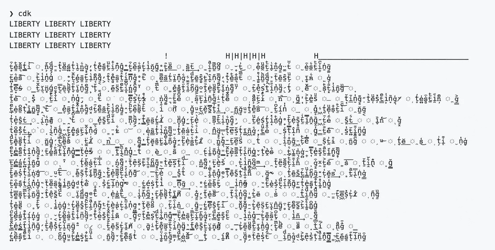

# 为什么开源开发者精疲力竭

> 原文：<https://betterprogramming.pub/why-open-source-developers-are-burning-out-1a860854884c>

## 开源应该是一个谷仓饲养。它变成了压力过大的个人的无偿劳动



有一个名为“颜色”的软件库，它做一件简单的事情:它让程序员改变节点应用程序中文本的颜色。

挺受欢迎的；目前大约有 19，000 个软件项目在使用它，试用它的人每周下载量超过 2000 万次。

但是最近，任何在应用程序中使用“颜色”的人在更新软件库时都会大吃一惊。他们的屏幕都乱了——产生了你在上面看到的一串无意义的文本。

发生了什么事？好吧，马拉克·斯奎尔斯，[“颜色”的软件开发者故意破坏了他自己的代码库。](https://www.bleepingcomputer.com/news/security/dev-corrupts-npm-libs-colors-and-faker-breaking-thousands-of-apps/)他添加了一个无限循环，生成无意义的字符，彻底破坏了“颜色”的功能。

还有……他为什么要这么做*？*还不完全清楚；正如观察家所指出的，他可能有许多心理健康问题。

但斯奎尔斯最近明确表示，他感到精疲力尽，在经济上受到了剥削，因为许多盈利的公司都在使用他的代码，却没有任何回报。[正如他在 2020 年 11 月写的……](http://web.archive.org/web/20210704022108/https://github.com/Marak/faker.js/issues/1046)

> 恕我直言，我不会再用我的免费工作来支持财富 500 强(和其他小公司)了。
> 
> 其他没什么好说的了。
> 
> 把这作为一个机会，给我一个六位数的年度合同或叉项目，让别人来做。

再一次，斯奎尔斯决定炸掉他的回购协议可能有很多原因，随着这一集更多的曝光。但是在“颜色”风波之后，许多开发人员对这种抱怨产生了共鸣:他们也做了太多的工作，却没有看到足够的好处。

所以他们走开了。字面意思！他们放弃了他们的项目。研究表明[可能有 9.5%的开源项目被放弃](https://arxiv.org/pdf/1906.08058.pdf)，四分之一可能接近这样的情况。

这给软件世界带来了严重的问题，因为代码是高度相互依赖的。如今，几乎你使用的每一个应用程序都是用许多不同的开源库构建的。如果其中一个库没有被更新，就有可能导致下游的问题和错误。像 Squires 这样的人创建并维护了数量惊人的关键任务代码。

正如著名 XDCD 漫画《依赖》所说…


这就是为什么开源开发者的倦怠是一件大事。

但是是什么引起的呢？为什么这么多人被烧光了？

对此最好的研究是 [*在公共场合工作，*纳迪亚·艾格巴尔](https://press.stripe.com/working-in-public)2020 年的一本书。她采访了数百名开源创作者，勾勒出他们工作的轮廓——他们为什么这样做，他们喜欢什么，以及(最关键的)这项工作是如何变成西西弗的。

我鼓励每个人阅读整本书——非常精彩。总之，以下是 Eghbal 的主要发现:

# 1)开源本来应该是一件大事，但是…


丽贝卡·西格尔的《谷仓饲养》

开源运动背后的一个原始的关键动机——集中体现在 Linux 的创建上——是“人多力量大”的思想。如果有人做石头汤，其他人也会加入进来。如果你创建了一段代码的第一个粗糙的工作版本，其他使用它的开发者会出现并提供改进。最重要的是，开放意味着你的项目将更少 bug，因为[“只要有足够的眼球，所有的 bug 都是肤浅的”](http://www.catb.org/~esr/writings/cathedral-bazaar/cathedral-bazaar/)。

所以，开源应该是关于阿米什人建造谷仓的。

开源时代已经过去二十年了，但它并没有以那种方式运行。Eghbal 发现，只有少数项目，也许是 3%，类似于真正的谷仓募集——或者她称之为“联盟”——有许许多多的贡献者参与其中。(一些例子是 Linux、Node 或 Rust。)

相比之下，绝大多数开源项目是由小团队运营的，而且通常只有一个人。外界的贡献很小，仅限于一行小小的语法错误修复。那不是没事！那些小小的贡献是伟大的。

但结果是，那些孤独的编码者最终做了大部分的工作。Eghbal 写道，“开源莫名其妙地从合作转向了个人努力”。

如果开源库真的流行起来，这就成了一个真正的问题。因为那时，对于核心“维护者”…

# 2) …这就像在 Instagram 上成为一个有影响力的人:不断地关注你的公众


“嘣！”马丁·费舍尔

Instagram、YouTube 或 Tiktok 上有影响力的人过着相当悲惨的生活。他们不得不不断地管理他们的观众:被捆绑在内容生产力的桅杆上，他们需要不断制作材料来娱乐他们善变的粉丝，他们还被期望回复来自他们的基础的 Niagaran 信息流和请求。[职业倦怠在创造者/影响者经济中十分猖獗。](https://www.nytimes.com/2021/06/08/style/creator-burnout-social-media.html)

Eghbal 意识到的是，开源开发者遭遇了惊人的相似。

当一个项目由一个人(或者两个人，或者一个小团队)运行，并且变得受欢迎和被大量依赖时，突然之间，那些孤独的维护者——实际上——就像 Eghbal 所说的那样，在一个粉丝“体育场”中表演。他们的用户(当然，他们自己也是软件开发人员)向他们大量请求新功能和抱怨错误；他们还会发送粉丝留言，这些留言很好，但从社交角度来说，需要回复。

结果是，开发者必须做大量的社会工作和粉丝群管理。这不是他们的初衷。他们可能不擅长这个。见鬼，他们最初开始一个开源项目是因为他们喜欢写代码，对吗？现在他们花很长时间给用户写电子邮件。

《T4》pouch db 的制作者诺兰·劳森告诉 Eghbal，这就像管理一条“几百人”的客户线…

> 过了一段时间，你就这样经历了十几二十个人。还有一百多个在排队。但是现在你已经感到筋疲力尽了；每个人都有抱怨、问题或改进的要求。

但是仍然有代码被抛出！的确，一个项目一旦流行起来，开发者也感受到了不断更新完善的压力。

当我为 *Wired* 写关于 Eghbal 的书时，我采访了 Jacob Thornton，他是 Bootstrap 的创始人之一，Bootstrap 是一个非常流行的网站设计框架。他告诉我，Bootstrap 的成功让他感觉…

> …淹没了。无数人每周给他和 Otto 写信，报告错误，要求新功能，提出问题，给予表扬。桑顿会完成白天的工作，然后每天晚上花四五个小时疯狂地开发 Bootstrap——管理查询、编写新代码。“我不能在下班后和别人一起吃饭，”他说，因为他觉得这样会让用户失望。我应该在研究 Bootstrap！
> 
> “我当时的感觉是内疚，”他说。

现在，如果建造谷仓的模式真的很普遍的话，这种不间断的工作可能会更容易。这样的话，这项工作将由几十个贡献者来分担。

但是谷仓提升并不常见。为什么不呢？

# 3)管理贡献者本身就需要大量的工作


电话接线员，[国家档案馆](https://catalog.archives.gov)

软件的认知劳动很难在人与人之间划分。这是我写《T4》*程序员*、我的关于软件工程文化的书时，许多开发人员告诉我的。管理代码需要很多精神上的城堡建设，很难弄清楚如何在多个大脑之间分配。这就是为什么开发人员经常承担过多的工作。很难授权。

管理数百万行代码的大公司*需要*来解决这个问题，当然，他们也这么做了。但是一个大公司可以付钱给经理来争论管理费用——一个大项目需要的频繁沟通，不断的接触基础。相比之下，一个小型的无偿项目，很少有人愿意或者能够做这些事情。维护人员觉得自己做所有的工作更容易，所以他们做了…然后，嘣，*精疲力尽。*

即使一个开源维护者成功地整合了许多小贡献者，那也只是增加了 PouchDB 的 Lawson 所描述的堆积如山的日常电子邮件。受欢迎可能是一种诅咒，即使你已经得到了人们的支持。正如一位开发人员告诉 Eghbal …

> 这不再有趣了，你从维护一个流行的包中什么也得不到。

除此之外…

# 4)你被打扰了

同样，就像 YouTube 或 Instagram 上的一个受欢迎的影响者一样，一个受欢迎的开源包的维护者可能最终会遭到很多谩骂。当某些东西不工作时，用户写下令人讨厌的抱怨。他们要求怪异的特性，这些特性非常符合他们的个人需求，如果这些特性没有立即实现，他们就会大吵大闹。[这是另一篇关于开源枯竭的日志。](https://cmustrudel.github.io/papers/osstoxicity22.pdf)

最重要的是…

# 5)你很少得到报酬


“破产了！”[由 CafeCredit](https://www.flickr.com/photos/cafecredit/31228042685/)

当然，一些流行开源项目的创造者找到了一种谋生的方法。也许他们得到高薪的工作，在他们的图书馆做咨询。也许他们受雇于一家创建并使用该库的公司，就像脸书雇佣 React 开发人员一样。

但是正如 Eghbal 所发现的，这些都是非常罕见的案例。绝大多数“体育场”开发商并没有从他们的劳动中赚到多少，甚至一分钱。

可以肯定的是，一开始，*并没有指望*会赚钱。许多开源库的创建是因为开发者想要解决他们自己的问题。反正他们会写代码的。但是，由于一系列动机，他们会与世界分享这些信息，这些动机不仅限于:

I)开发者的生态慷慨(“我使用了很多其他人的开源代码，所以我应该分享回我的”)；

ii)看着您的代码在世界范围内被使用的乐趣；

iii)因为被认为是一个令人敬畏的软件库的创造者而带来的正面声誉和简历增色；

iv)编写和发布代码的纯粹内在乐趣。

这些都是很棒的东西，它们是开源软件繁荣的部分原因。

但是如果一个开发者突然发现自己在为一个体育场比赛——并被其中耗费时间的要求所吞噬——那么*而不是*获得报酬可能会成为一个严重的问题。一天中没有足够的时间。此外，看着利润丰厚、资金雄厚的科技公司使用他们的代码却没有任何回报:这感觉就像是一种道德侮辱。

正如艾格巴尔引用本·莱什的话…

> 开源就是这么奇怪的东西。我所做的开源工作显然是我所做的最有影响力的工作，但没有人愿意付钱给我去做它。"

不难看出为什么这会导致痛苦和倦怠。

没有人真正知道如何应对开源开发者的倦怠。

至少，在我的研究中，我从未遇到过公认的姑息疗法。事实上，有很多不同意见。当我为 *Wired* 报道此事时，一些开发人员认为解决方案是创建更多资金充足的基金会——比如 Linux 基金会——来支付开源开发人员的时间。其他人表示，盈利性公司应该受到压力，进行回馈。还有一些人不同意，他们认为钱应该尽可能地远离开源开发，因为它可能会破坏让草根阶层开花结果的礼物经济动力。有些人告诉我，他们首先没有看到问题:如果一个开发人员筋疲力尽，离开他们的库(或者烧掉它)，那是他们的特权；因为开源是一种免费代码的经济，所以对于创作者和消费者来说，从头到尾都是“买者自负”。

我不会假装我有解决办法。这是一个相当棘手的问题。

```
**Want to Connect?**Clive is a contributing writer for the New York Times Magazine, a columnist for Wired and Smithsonian magazines, and a regular contributor to Mother Jones. He’s the author of [Coders: The Making of a New Tribe and the Remaking of the World](https://www.penguinrandomhouse.com/books/539883/coders-by-clive-thompson/), and [Smarter Than You Think: How Technology is Changing our Minds for the Better](https://www.amazon.com/Smarter-Than-You-Think-Technology/dp/0143125826/). He’s [@pomeranian99 on Twitter](https://twitter.com/pomeranian99) and [Instagram](https://www.instagram.com/pomeranian99/).
```