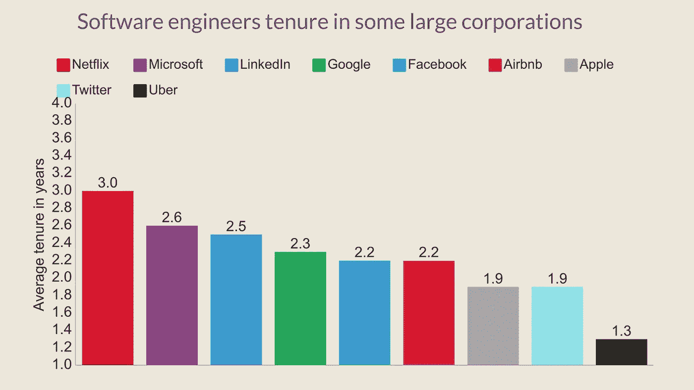
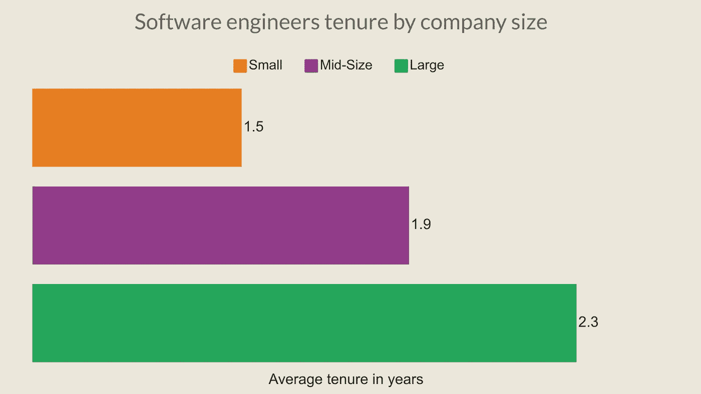

# 为什么程序员不应该长期呆在一家公司

> 原文：<https://betterprogramming.pub/why-programmers-shouldnt-stay-in-one-company-for-a-long-time-67bf07f011a6>

## 至少在最初的十年里

由 [Unsplash](https://unsplash.com?utm_source=medium&utm_medium=referral) 上的[procylink 访客管理系统](https://unsplash.com/@proxyclick?utm_source=medium&utm_medium=referral)拍摄

最近，我和一个两个月前加入我公司的程序员聊天。他以初级程序员的身份入职，在一家公司呆的时间从来不会超过一年半。

他并不孤单。我见过的大多数优秀程序员，除非是公司股东，否则 1-3 年后就离职了。

开发者这么做有很多原因，也很正常。我们将讨论开发人员为什么这样做，但让我们看看他们现在有多正常的一些统计数据。

# 统计数字

不久前，一名员工一生都在一家公司工作。但是现在情况变了。现在找新工作比较容易。

在某些领域，情况依然如此。但是在技术领域，几乎不可能认为程序员/开发人员会在一份工作上呆超过 10-15 年。

你可以找到一些程序员在一份工作上干了十年甚至更长时间的案例。但是如果你问一个入行不到五年的程序员，大部分人都会说对一份工作不感兴趣，不想待很久。

使用 [Hackerlife](https://hackerlife.co/blog/san-francisco-large-corporation-employee-tenure) ，我制作了一个图表，展示了从居住在三藩市的一万多名软件工程师那里收集到的数据。图表显示了一些科技巨头中程序员的平均任期。

鸣谢:作者

上面的可视化集中在大公司。这些大公司几乎 50%的程序员在两年内离开，75%的人在三至三年半后离开。

而其他行业专业人士的平均任期为 [4.2 年](https://www.bls.gov/news.release/tenure.nr0.htm)，这个数字非常低。科技巨头实际上更有能力留住程序员。这种情况在初创公司和中等水平的科技公司中要糟糕得多。

## 我和程序员的经历

作为一名招聘人员，我在面试中遇到过很多程序员。我总是问他们上一份工作:他们在哪里工作，在那里工作了多长时间，或者为什么离开。

我说不出确切的数字，因为我没有统计，但我发现几乎 70-80%的候选人在两年内离开了他们的工作。

我很少找到在一家公司工作五年以上的应聘者。200 多名候选人中可能有 2-3 名。我看到的比较少，因为我们是创业公司。在一家公司工作了很长时间的开发人员通常不会来一家初创公司工作。

# 为什么程序员不应该呆很长时间

## 学习机会

这是一个程序员在一定时间后应该跳槽的最大原因。程序员职业生涯初期，需要学习的东西很多。

新程序员和公司在第一年都从对方那里学到了很多东西。公司从他们以前的经验中学习，程序员从他们的技术栈、项目和高级开发人员中学习。

在一家公司工作一年后，一个程序员做东西，成为一名重要的员工。但通常，程序员并不这么认为。

所以，一年后，程序员从公司里学不到什么东西。如果公司是科技巨头，那么当然会有。但在中小型公司，学习机会变得更窄。

这大概也是程序员更快离开小公司的原因之一。小公司软件工程师的平均任期只有 1.5 年，而大公司是 2.3 年。

鸣谢:作者

问题是，学习在哪里结束？老实说，从来没有。这并不意味着你必须在整个职业生涯中如此频繁地换工作。

大约十年后(或多或少)，你可以晋升到一个不用经常换工作的职位。但那是另一个很长的讨论。

## 更好的职业

技术堆栈的变化比以往任何时候都快。这就是为什么学习对于程序员来说是一个永无止境的过程。这也是为什么编程是世界上独一无二的工作之一的主要原因之一。

程序员应该换工作，不仅是为了学习，也是为了更好的职业。在一家公司做这份工作会让职业发展变慢。

通常情况下，一家公司的发展速度不会像程序员发展技能那样快。在这种情况下，公司无法满足开发商的要求。

所以即使你很忠诚，很敬业，即使你找到了很多学习的机会，如果你觉得你应该得到更好的职业，你也应该离开。

# 临终遗言

那么，你应该什么时候离职呢？老实说，没有正确的答案。你必须找到你的答案。我只是分享了我的观点和一些统计数据。

我也见过我的程序员朋友。跳槽的人比在单个公司呆久了的人定位更好。这也会帮助你变得更加自信。

如果你现在的公司陷入某种危机或者你突然被解雇，你不会有太大的麻烦。而如果你不开心或者没有被善待，你绝对应该趁早离开。

你为多少家公司工作过？请在评论中与我们分享你的经验！