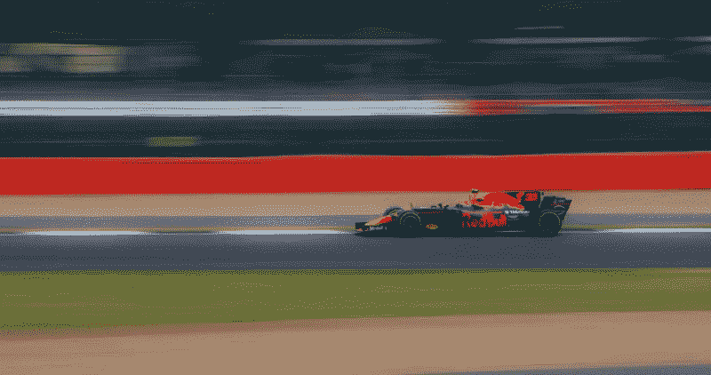

# 为什么“死亡行军”项目没有听起来那么糟糕

> 原文：<https://betterprogramming.pub/why-project-death-marches-aren-t-as-bad-as-they-sound-41425e134d30>

## 有了这样一个不祥的名字，你会不惜一切代价避免死亡行军。但是它们确实有一些好处

照片由[汉娜·魏](https://unsplash.com/@herlifeinpixels?utm_source=unsplash&utm_medium=referral&utm_content=creditCopyText)在 [Unsplash](https://unsplash.com/s/photos/tired-computer?utm_source=unsplash&utm_medium=referral&utm_content=creditCopyText) 上拍摄

我最近刚从第一次死亡行军中走出来。

对于门外汉来说，[死亡行军](https://en.wikipedia.org/wiki/Death_march_(project_management))是软件行业中的一个术语，用来描述属于以下情况之一的开发项目:

*   由于不切实际的范围而注定失败
*   为了赶上最后期限而长时间过度工作

我的死亡行军是长期过度劳累的那种。不好玩。

这种情况持续了大约一个月，然后逐渐减少，一切恢复正常。

但作为一名领导者，我回顾了过去的一个月，并试图了解利弊:哪些进展顺利，哪些可以做得更好？我真诚地希望我不会再做这样的事情，但是如果我做了，我怎样才能做得更好呢？

我也花了一些时间弄清楚*值不值*？从最终结果来看，一个月 16 小时无周末的工作制合理吗？

看你问谁了。

如果你问高层领导，这绝对值得。项目按时完成，我们交付给了一个满意的客户。

如果你问经理，大部分是值得的。没人喜欢把人逼得那么紧。但它确实提供了一些团队建设的机会。

如果你问开发商，你会得到一个混合包。那些喜欢每天学习并抓住成长机会的开发人员看到了曙光。他们很高兴有机会展示他们的技能和学习。其他的开发者…就不那么多了。

# 好人

不管你的观点是*值得吗*，每个参与其中的人都会同意死亡行军有很多好处。正如我们都意识到的，有些比其他的更令人惊讶。

## 高能见度

我们的产品从未受到如此多的关注。是的，我们处于压力之下，关注度可能不是 100%正面，但人们在使用我们的应用。我们不断收到关于现有功能、新功能、UX 问题、可支持性、未来功能以及其他一切的反馈。

对于那些专门研究绿地开发的人来说，你知道这有多重要。没有死亡行军，团队每两周在 sprint review 中得到反馈。但随着死亡行军，这是每天。我们能够[快速迭代我们的设计](https://uxdesign.cc/itturat-ituratte-iterat-iterate-iterate-65199c4d5d53)，比以往任何时候都更快地整合反馈。

*照片由* [*格伦·惠勒*](https://unsplash.com/@glenwheeler?utm_source=unsplash&utm_medium=referral&utm_content=creditCopyText) *上* [*下*](https://unsplash.com/s/photos/fast?utm_source=unsplash&utm_medium=referral&utm_content=creditCopyText)

## 超级速度

我们能够在一个日历月内完成大约三个月的工作。当然，这花费了我们在三个月内所花费的大致相同的时间，但是我们的交付日期是这样的。开发人员日复一日地密切关注手头的问题，从不需要在一个周末后恢复工作。

加上不断的反馈，我们实施的迭代将开发速度提高了 10 倍。在相对较短的时间内完成了令人难以置信的大量工作。

## 巧妙的新解决方案

当你如此长时间地如此接近一个应用程序时，事情开始变得明朗起来。你开始想出聪明的解决方案，以你以前可能没有意识到的方式解决问题。

您可以更好地理解您的应用程序，了解它的来龙去脉和微妙之处([这是解决方案架构师的必备技能](/how-to-switch-from-software-developer-to-solutions-architect-5e0c12bdc4b1))。你开始更聪明地工作，而不是更努力。当你从死亡行军中走出来的时候，你的应用已经领先了几个月，并且比最初计划的功能更加丰富。

# 红旗

从项目经理的角度来看，我刚刚列出的所有这些优点听起来都很棒。酷的新特性、加速的时间表和产品强化都是项目经理(或者任何人，真的)想要的新软件版本。

但它被称为死亡行军是有原因的。这个名字是不祥的，因为你不应该一直这样做。以下是我的一些重要观察。

## 烧坏

这是显而易见的。在我玩过的每一款赛车游戏中，你都可以用 NOS 给你的车一个短时间的助力。赛车向前冲得比周围的一切都快，但最终，NOS 用完了。你回到正常速度，不能再用了。

这是死亡行军。你可以在短时间内加快速度，但是不管你喜不喜欢，这个动作将会减慢到正常的速度。开发人员筋疲力尽。经理们精疲力竭。分析师们精疲力竭。

留意这个。这些迹象因人而异，但它们总会以某种方式出现。无论是工作质量下降，对同事变得暴躁，还是拒绝做某些任务，管理倦怠都应该是领导者的首要任务。

如果你开始注意到你的开发人员有精疲力竭的迹象，给他们放一天假。令人惊讶的是，三月中旬一点点的放松会带来什么。

*照片由* [*马頔*](https://unsplash.com/@pechka?utm_source=unsplash&utm_medium=referral&utm_content=creditCopyText) *上* [*下*](https://unsplash.com/s/photos/door?utm_source=unsplash&utm_medium=referral&utm_content=creditCopyText)

## 单向门

高可见性和智能解决方案的缺点之一是做出仓促决定。通常不参与应用程序开发的人可能会要求你做出改变，你需要确保花时间分析这个要求。

不要只是说“是的，我们可以这样做”，然后把自己逼到墙角。你已经比平时更接近应用程序，并且能够提出快速、聪明的解决方案。

但是仅仅因为你*可以*并不总是意味着你*应该*。亚马逊将此称为[单向门](https://www.inc.com/jeff-haden/amazon-founder-jeff-bezos-this-is-how-successful-people-make-such-smart-decisions.html)。这是一个一旦做了就无法摆脱的决定。

请记住，您正在构建一个产品。一旦你走出死亡之路，你必须确保不要做出可能伤害未来发展的决定。

## 工作/生活平衡

作为一个领导者，这个很难管理。有些人就是喜欢工作。他们起床，去工作，工作完了就去睡觉。冲洗并重复。你必须确保人们为自己和家人抽出时间。

这和倦怠有点不同。工作/生活平衡侧重于关系，而倦怠侧重于自我。死亡行军中的开发人员试图与他们所爱的人保持某种一致性是极其重要的。每周工作 80 小时以上对任何人来说都是困难的，但对他们的家庭来说也是困难的。

不需要太多，但是要确保时不时地检查一下你的员工——问问他们过得怎么样。给他们一个和朋友出去或者约会的机会。你将获得新的活力和继续前进的意愿。

## 分析瘫痪

聪明的新解决方案的反面是可怕的分析瘫痪。简单来说，这意味着[你在过度思考解决方案](/stop-overthinking-your-complex-solutions-and-start-building-simple-ones-712400ea8385)，你没有进步是因为你无法决定该怎么做。

有时候，当你坚持这么久，你的判断就会变得模糊。事情似乎不像以前那么清楚了。你视野狭窄。

[成为强大的解决方案架构师的第一步](/how-to-switch-from-software-developer-to-solutions-architect-5e0c12bdc4b1)是后退一步。把你的应用程序看做一个系统，看看移动的部分是如何相互协作的。当你视野狭窄时，你不会那样做。你专注于一个领域，做出一个可能正确也可能不正确的决定。

死亡行军游戏的名字是速度。沉迷于应该只花几个小时的设计不是你如何看待自己完成一个设计的。

# 结论

对一家企业来说，死亡行军可能是一件美妙的事情。您加快时间进度，提出新的解决方案来改进产品，并与客户建立信任。

但是它有严重的缺点。过度工作会对你的员工造成一些真正的伤害。每个人都感觉到了，不仅仅是开发商。经理、QA、BA、专业服务人员、技术作家，所有与软件有关的人都突然受到了工作浪潮的冲击。

作为一名领导者，你必须对你的员工保持高度关注。用力推他们，但不要超过临界点。每个人都表现出不同的压力迹象，而你的工作就是识别它并纠正它。

死亡游行有时是不可避免的灾祸。谨慎使用它们，因为归根结底，公司最重要的部分是人，而不是软件。