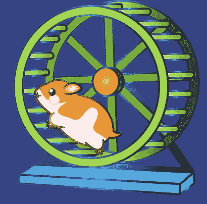

# 项目经理为什么辞职

> 原文：<https://betterprogramming.pub/why-projects-managers-quit-20854eb13d6b>

## 项目经理跳出仓鼠轮的真正原因

请不要像 Pixabay 的那样出售我的作品

根据 [2021 年项目管理报告](https://www.girlsguidetopm.com/project-management-statistics/)，在任何给定的时间点，在项目管理行业的所有经验水平中，34%的人正在考虑离开。

与此同时，大约 40%的项目经理(pm)正在寻找他们的下一个角色，所以有很多变动。除了承担已经充满压力的工作之外，这还会带来很多饥饿、努力、不满和幻灭感。

我个人认识很多跳出这个职业的人。这发生在新冠肺炎带领大家重新评估他们的生活之前，是一个太普遍的情况。太累了，太疲惫了，缺乏职业发展，缺乏热情，家庭环境的变化都是拖人后腿的因素。

如果项目管理对你来说很好，它可能是一条充实、刺激和令人兴奋的职业道路。如果不是这样，事情开始出错，它会很快下地狱。我可以肯定地说，因为这是我自己的亲身经历。

导致人们死亡的因素有很多，但主要有以下几个。

# 工作生活平衡

项目管理的本质是你尽可能好地计划它，并在事情出错时管理它。这意味着，当棕色的臭东西撞到旋转的东西时，你作为中枢和关键人物，需要在那里回答问题，试图找到解决方案，并评估事件中哪里出了问题。

我曾经有一次 IT 变更失败，导致我在一个家里从早上 8 点工作到第二天中午，家里有一个 4 岁的孩子和一个轮班的丈夫。我被要求进行持续数周的升级，每周四个晚上从晚上 10 点开始，到凌晨 4 点结束，然后在我丈夫起床上班时睡几个小时，这样我就可以勉强应付学校的运转。无论你怎么看，这都是不可持续的。

许多项目管理不是朝九晚五的工作，it(和大型企业机器)真的不关心你的责任或你的健康。此外，如果你在收缩，你很少有一个安全网，因为你可以在任何时候出去。

# 工作不稳定

当我第一次加入某家英国通信公司时，在入职过程中，我们几个人都有一个被解雇的故事，原因是成功地引入了一项让我们变得过时的变革。这些都是正式的固定工作，而不是合同工。

问题是，在项目管理中，你要负责不同的、有时间限制的工作，这很容易导致你被解雇。在一个理想的世界里，这不会是一个问题，因为会有储蓄和某种缓冲，但生活并不总是这样。因此，总会有一种潜在的恐惧和担心，担心自己会被扫地出门。

我还注意到，在金融机构中，只雇佣合同制项目经理是很常见的做法，其中很少有人能获得永久职位。不管这实际上是否可能，它可能会变得有点“我会爬过我祖母温暖的尸体，以表明我今天已经努力完成了这件事”。有完全不合理的大量喊叫。

# 缺乏支持

矩阵管理是一种出色的组织管理。当它工作的时候。项目经理很少能直接控制人，因此不能对某人说“这样做，否则会有这样的后果。”当每个人都在船上，这是伟大的，所有人都在为一个共同的目标而努力。好的老板和同事是上帝赐予的礼物，但是如果你得不到直线管理层的回应和支持，你就会变得无助和绝望。

压力的另一个来源是利益相关者，他们本该支持你，并在情况变得艰难时向你伸出他们的权威之手。

# **客户和组织文化**

如果客户是笨蛋，古怪，或者比鱼的排气管还紧，不得不讨厌交付项目会增加不必要的压力。

我有客户要求的上线日期，他们不知何故忘记了整个部门正在开会。在试图引起管理人员的恐慌之后，我不得不解释说，如果路由器没有插上电源，你就无法 ping 通它。责任总是由你来承担。

"要想在这方面取得成功，你需要有点混蛋的样子。"

一个同事这么说，我实话实说，我觉得他可能是对的。孩子出生前我很无情，但孩子出生后，这似乎有点毫无意义。我想我失去了对血的品味。

# 烧掉

正如你所想象的，一份必须忍受以上所有痛苦的工作会让你精疲力尽。不幸的是，完全的倦怠很难恢复。持续的高水平压力是我上面列出的所有问题的自然结果，最终，这对你的精神和身体健康有严重的负面影响。

归根结底，你必须做当时对你来说正确的事情，但我认为很多公司需要考虑如何对待这些有用但不受重视的人。

# 来源

[https://www . girlsguidetopm . com/project-management-statistics/](https://www.girlsguidetopm.com/project-management-statistics/)