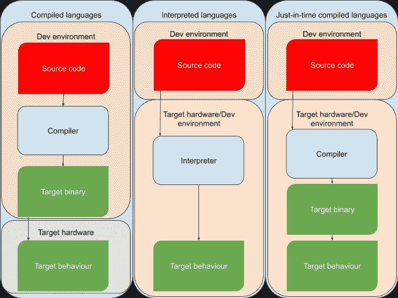

# 为什么用 Python 写的 Python 比普通 Python 快

> 原文：<https://betterprogramming.pub/why-python-written-in-python-is-faster-than-regular-python-b682992d5812>

## 我们需要更深入

克里斯蒂安·恩格梅尔在 [Unsplash](https://unsplash.com?utm_source=medium&utm_medium=referral) 上拍摄的照片。

实话实说:Python 很慢。当我说 *Python* 时，我指的是 CPython，它的参考基于 C 的实现。这就是 PyPy 发挥作用的地方。它是用 Python(！)比 CPython 快 4.4 倍。怎么会？请继续阅读。

> "如果你想让你的代码运行得更快，你应该使用 PyPy . "——[吉多·范·罗苏姆](https://www.pypy.org/)(字面意思是创造了 Python)

有竞争力的程序员是第一批利用 PyPy 能力的人。有时候，用 Python 编写的解决方案会耗时太长而失败，但是用 PyPy 运行的相同代码会成功通过。怎么会？

# 不同的方法

你可能知道 Python 是我们所说的*解释的*语言。CPython 逐行读入源代码并执行它。解释语言(包括 JavaScript)有许多优点:

*   解释器非常容易编写。
*   [强大的元编程能力](https://everyday.codes/python/abstract-classes-and-meta-classes-in-python/)。
*   没有编译时失败。

当然，也有一些缺点:

*   运行时解析源代码的严重性能开销。
*   没有编译时失败。

您可以看到我在优点和缺点中包括了“没有编译时失败”。可能有些时候你需要不同的行为(例如，当你在做原型或者生产的时候)，但是我仍然倾向于把它看作一个缺点。

PyPy 做事有点不一样。这不是一个纯粹的解释器，而是实现了跟踪实时(JIT)编译。

# 即时编译

即时编译是解释和常规提前编译之间的中间地带。实时编译器不执行源代码本身，而是生成一组几乎立即执行的低级指令(通常是汇编指令)。

作者照片。

这个插图应该有助于你理解其中的区别。在编译语言(C，C++，Rust)中，编译阶段被严格划分到开发环境中。它生成一个可运行的二进制文件，然后发送到生产环境。在解释语言中，情况正好相反:源代码(after * entification，hello JS)被完整地推向生产，在那里解释器将执行它。JIT 语言也提供源代码(或字节码，如 Java 或 C#)，但它是作为常规编译语言编译和运行的，而不是逐行解释的。

这并不是说一种方法比另一种好。每个用例都会根据其独特的需求做出正确的选择。但是，如果性能很重要，并且您喜欢使用 Python 解释器，PyPy 将是您的选择。

# 跟踪实时编译

就像编译或解释一样，有不同的方法来实现实时编译。传统的是方法/函数范围的。当您的代码调用一个函数时，JIT 编译器将获取它的源代码，编译并提供可执行的二进制文件。PyPy 采用了稍微不同的方法，这是由 Python 的独特特性和用例决定的。

PyPy 的编译器评估循环，而不是每个方法调用。由于 Python 大量用于数据科学、机器学习以及高级算法和数据结构的广泛使用，这是最有意义的。简而言之，PyPy 是 Python 之上的一个优化层。

PyPy 并不严格处理你所理解的循环。除了常规的`for`和`while`构造，如果 PyPy 检测到编译工作值得的话，它会优化任意代码块。

# 缺点

当然，PyPy 也是一个有缺点的工具。即使您获得了巨大的性能提升，也要记住以下几点:

*   并非所有 Python 都受支持。你的大部分代码都是这样，但是如果你处理低级别的 CPython 实现细节或者有一些 Cython 绑定，这就不行了。
*   回到未来。PyPy 的当前版本是 3.4，而 Python 目前稳定在 3.8。但是回溯是我们 Python 们非常擅长的事情(现在对 Python v2 开发人员大喊)。
*   优化是好的，但这不是编写糟糕代码的借口。如果你的代码人类无法读懂，你怎么能指望 PyPy 理解它呢？
*   **还在。如果您做一些繁重的多线程工作，请继续阅读其他实现。**

**与任何工具一样，在采用它之前，您应该考虑所有的细节。但是下次你登录 Codeforces 进行挑战的时候，试试 PyPy 吧。你的`O(n^3)`怪物有可能通过，而只有纯 Python 的`O(n log n)`才能通过。**

# **源代码**

**虽然 CPython 和 PyPy 的源代码超出了这篇更一般的文章的范围，但我在 [CPython (C 代码)](https://github.com/python/cpython/blob/master/Modules/mathmodule.c)和 [PyPy (Python 代码)](https://github.com/mozillazg/pypy/blob/50d6bf76ef1f93c234ab42d4dd4a3b974f9665d6/pypy/module/math/app_math.py)中找到了这些实现阶乘函数的文件。**

# **其他实现**

**除了 CPython 和 PyPy，还有其他著名的 Python 实现:**

*   **[无栈 Python](https://github.com/stackless-dev/stackless/wiki) 。这是同样的蟒蛇，但没有 GIL。它最显著的用途是作为在线游戏的后端。**
*   **IronPython 是 Python 的. NET 实现，为你的 Python 和 C#代码提供了非常简单的互操作。**
*   **[JPython](https://www.jython.org/) 是一样的东西，但是用 Java。**

# **结束语**

**谢谢你的阅读，我希望你喜欢我的文章。请在评论中告诉我你和 PyPy 的经历吧！**

# **资源**

*   **[PyPy 常见问题解答](https://doc.pypy.org/en/latest/faq.html)**
*   **[追踪即时编译](https://en.wikipedia.org/wiki/Tracing_just-in-time_compilation)**
*   **[CPython 中的全局解释器锁](https://wiki.python.org/moin/GlobalInterpreterLock)**
*   **[Python 3.9 的新特性](https://medium.com/better-programming/take-a-look-at-the-awesome-new-features-coming-in-python-3-9-8753c494de39)**