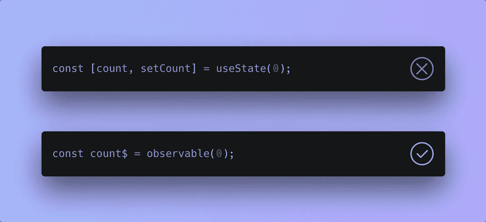

# 为什么 React 钩子是错误的抽象

> 原文：<https://betterprogramming.pub/why-react-hooks-are-the-wrong-abstraction-8a44437747c1>

## 以及您可以使用的替代 API



作者照片。

在开始之前，我想表达我对 React 团队多年来所做的工作的感激之情。他们创造了一个很棒的框架，在很多方面，这是我对现代网络的介绍。他们为我相信我将要提出的观点铺平了道路，如果没有他们的独创性，我不会得出这些结论。

在今天的文章中，我想介绍一下我所观察到的钩子的缺点，并提出一个替代的 API，它有同样的能力，但警告更少。我现在要说的是，这个[替代 API](https://malerba118.github.io/elementos-docs/) 有点冗长，但是它在计算上更少浪费，在概念上更准确，并且它是框架不可知的。

# 钩子问题#1:在渲染过程中附着

作为设计的一般规则，我发现我们应该总是首先尝试不允许我们的用户犯错。只有当我们无法阻止用户犯错时，我们才应该在他们犯错后通知他们。

例如，当允许用户在输入字段中输入数量时，我们可以允许他们输入字母数字字符，然后如果我们在他们的输入中发现字母字符，就向他们显示一条错误消息。然而，如果我们只允许他们在字段中输入数字字符，我们可以提供更好的 UX，这将消除检查他们是否包括字母字符的需要。

React 的行为非常相似。如果我们从概念上考虑钩子，它们在组件的整个生命周期中都是静态的。我的意思是，一旦声明，我们就不能从一个组件中移除它们或者改变它们相对于其他钩子的位置。React 使用 lint 规则，并会抛出错误，试图阻止开发人员违反钩子的这一细节。

从这个意义上说，React 允许开发人员犯错误，然后试图在以后警告用户他们的错误。为了理解我的意思，考虑下面的例子:

当计数器递增时，这会在第二次渲染时产生一个错误，因为组件将删除第二个`useState`钩子:

```
**Error**:Rendered fewer hooks than expected. This may be caused by an accidental early return statement.
```

组件第一次渲染时钩子的位置决定了 React 在随后每次渲染时必须找到钩子的位置。

鉴于钩子在组件的生命周期中是静态的，我们在组件构造时声明它们，而不是在呈现阶段，不是更有意义吗？如果我们在组件的构造过程中附加了钩子，我们就不再需要担心钩子规则的实施，因为钩子在组件的生命周期中不会再有机会改变位置或者被移除。

不幸的是，函数组件没有构造函数的概念，但让我们假设它们有。我想象它看起来会像下面这样:

通过在构造函数中把钩子附加到组件上，我们就不用担心它们在重新渲染时会移位。

如果你在想，“你不能只把钩子移到构造函数上。他们*需要*在每个渲染上运行以获取最新的值“在这一点上，你是完全正确的！

我们不能把钩子从渲染函数中移走，因为我们会破坏它们。这就是为什么我们要用别的东西来代替它们。但是首先，钩子的第二个主要问题。

# 钩子问题#2:假设的状态变化

我们知道，每当组件的状态改变时，React 都会重新呈现该组件。当我们的组件因大量的状态和逻辑而变得臃肿时，这就成了问题。假设我们有一个组件，它有两个不相关的状态:A 和 b。如果我们更新状态 A，我们的组件会因为状态改变而重新呈现。即使 B 没有改变，任何依赖于它的逻辑都会重新运行，除非我们用`useMemo` / `useCallback`包装那个逻辑。

这是一种浪费，因为 React 本质上是说“好的，在渲染函数中重新计算所有这些值”，然后每当遇到`useMemo`或`useCallback`时，它就退回到那个决定并放弃。然而，如果 React 只运行它需要运行的东西，那就更有意义了。

# 反应式编程

反应式编程已经存在很长时间了，但是最近才成为 UI 框架中流行的编程范例。

反应式编程的核心思想是变量是可观察的，只要可观察值发生变化，观察者就会通过回调函数得到通知:

注意传递给`observe`的回调函数是如何在我们改变`count$`可观察值时执行的。你可能会对`count$`末尾的`$`感到疑惑。这被称为[芬兰语符号](https://medium.com/@benlesh/observables-and-finnish-notation-df8356ed1c9b)，简单地表示变量持有一个可观测值。

在反应式编程中，还有一个计算/导出的可观察量的概念，它既可以观察也可以被观察。以下是跟踪另一个可观察值并对其应用`transform`的衍生可观察值的示例:

这类似于我们之前的例子，除了现在我们将记录一个加倍的计数。

# 提高反应性

在介绍了反应式编程的基础之后，让我们来看看 React 中的一个例子，并通过使它更具反应性来对它进行改进。

假设一个应用程序有两个计数器和一个依赖于其中一个计数器的派生状态:

在这里，我们有逻辑在每次渲染时将`countTwo`的值加倍，但是如果`useMemo`发现`countTwo`拥有与前一次渲染相同的值，那么加倍后的值将不会在那次渲染中重新导出。

结合我们早期的想法，我们可以将状态责任从 React 中分离出来，而是将我们的状态设置为构造函数中的可观察图。每当可观察对象改变时，可观察对象将通知组件，以便它知道重新呈现:

在上面的例子中，我们在构造函数中创建的观察对象通过闭包在 render 函数中可用，这允许我们设置它们的值来响应 click 事件。`doubledCountTwo$`观察`countTwo$`并在`countTwo$`的值改变时仅将的值加倍*。请注意，我们不是在渲染过程中而是在渲染之前获得双倍计数。最后，我们使用`observe`函数在任何可观察到的变化发生时重新渲染我们的组件。*

由于以下几个原因，这是一个很好的解决方案:

1.  状态和效果不再是 React 的责任，而是一个专用的状态管理库的责任，它可以跨框架使用，甚至不需要框架。
2.  我们的 observables 只在构造时初始化，所以我们不必担心违反钩子规则或者在渲染时不必要地重新运行钩子逻辑。
3.  我们通过选择仅当值的依赖性改变时才重新导出值，来避免在不必要的时候重新运行派生逻辑。

通过对 React API 进行一些修改，我们可以将上面的代码变成现实。

这实际上与 Vue 3 使用其组合 API 的方式非常相似。尽管命名不同，但看看这个 Vue 片段是多么惊人地相似:

如果这还不够令人信服，看看当我们引入一个构造器层来反应函数组件时`refs`变得多么简单:

我们实际上消除了对`useRef`的需要，因为我们可以在构造函数中声明变量，然后在组件的生命周期中从任何地方读/写它们。

或许更酷的是，我们可以很容易地使`refs`可见:

当然，我在这里实现的`observable`、`derived`和`observe`都有问题，没有形成一个完整的状态管理解决方案。更不用说这些人为的例子忽略了几个考虑因素，但不用担心:我在这件事上花了很多心思，我的想法最终产生了一个新的反应式状态管理库，名为 [Elementos](https://malerba118.github.io/elementos-docs/) ！


作者照片。

Elementos 是一个框架无关的反应式状态管理库，强调状态的可组合性和封装性。如果你喜欢这篇文章，我强烈建议你去看看！