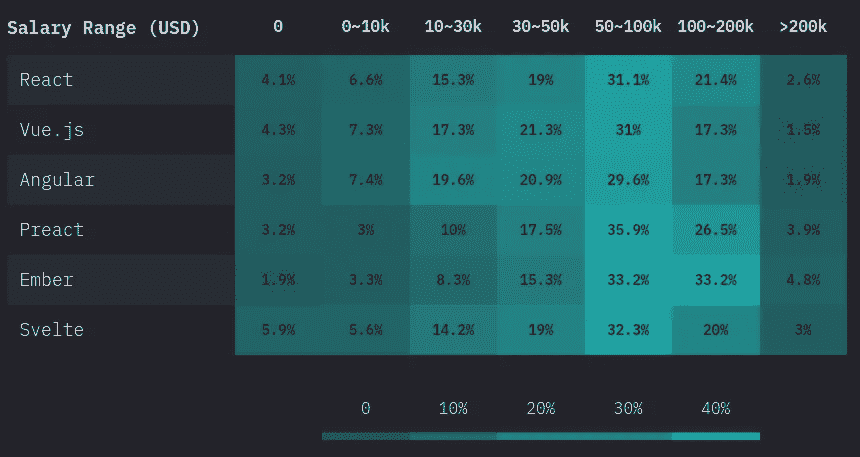
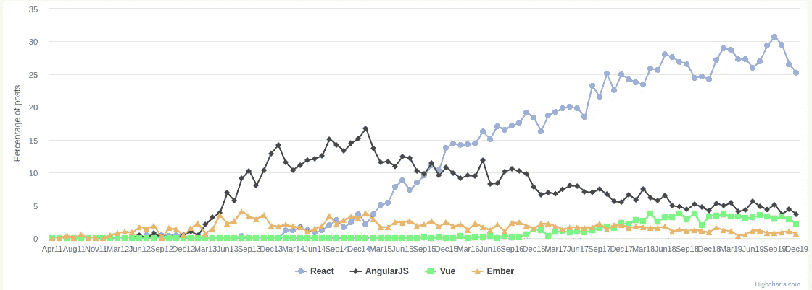
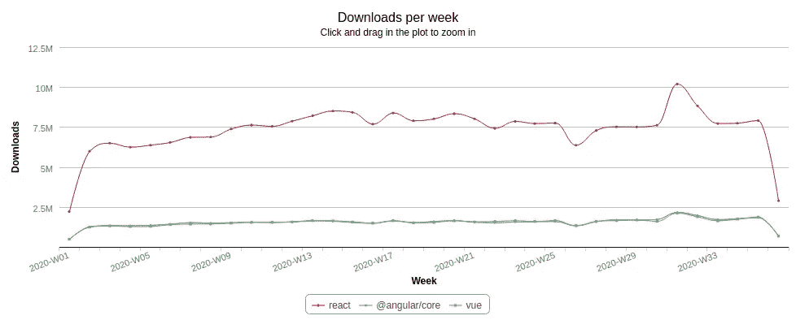

# 为什么 React 对新开发人员来说是一个很好的职业起点

> 原文：<https://betterprogramming.pub/why-react-is-a-great-career-starter-for-new-developers-618910e09c25>

## 学习最流行的框架可以带来高薪机会

莎拉·多维勒在 [Unsplash](https://unsplash.com/s/photos/minimalism?utm_source=unsplash&utm_medium=referral&utm_content=creditCopyText) 上的照片

React、Vue.js、Angular 是 2020 年前端开发的首选 UI 库/框架。本文本质上不是一篇比较文章，而是我将指出 React 是新开发人员的最佳选择的所有原因。在相关的地方，我可能会做一些比较，目的是让 React 的一些优势更加清晰。

在过去，我已经独立地分析了所有三个 UI 库，并且我为自己的项目选择了 Vue。即使我个人使用 Vue，如果你问我作为一个新的开发者应该学习哪一个，我会建议你学习 React。

这不是我轻易得出的结论。这不是一篇片面的文章，它以最好的方式呈现 React，而忽略了重要的事实。我将解释为什么 React 对于一个有抱负的 web 开发人员来说是一个很好的起点。这并不意味着无论如何想象，棱角分明或 Vue 都是不好的起点。

在本文的其余部分，我将解释 React 略胜一筹的原因，尤其是对于 web 新手来说。

# 机会

我相信 React 的主要原因是它有最多的机会。这是一个越来越受欢迎的 UI 库，有许多高薪工作，并且非常多样化。

## 工作市场

来自[州](https://2019.stateofjs.com/front-end-frameworks/)的表格

根据 Javascript State 的调查数据，薪水越高的职位越多。这意味着如果你达到了更高的水平，你更有可能找到一份高薪的工作。

在上表中，你可能会注意到 [Ember](https://emberjs.com/) 在较高的工资范围内有较高的百分比。但是 Ember 远没有 React 受欢迎，React 在 GitHub 上有 156k 颗星星，Ember 只有 21k。

图表来自[黑客新闻趋势](https://www.hntrends.com/2019/dec-another-year-on-top-for-react.html?compare=AngularJS&compare=Ember&compare=React&compare=Vue)

从 HackerNews Trends 的图表来看，很明显 React 比其他框架有更多的职位空缺。

由于黑客新闻主要由初创公司使用，这一数据在一定程度上可能会有偏差。尽管如此，显而易见的是，反应工作岗位很多，而且在不断增长。

## 你可以达到更高的水平

React 拥有丰富的开源组件生态系统，您可以使用它来扩展其功能。图书馆本身是多样化的，你可以学到很多东西，成为某种程度上的专家。

可以说，成为一名 React“专家”需要您了解优秀的 JavaScript，理解 DOM 如何工作，以及 web 开发中的其他重要因素。

React 在这方面值得特别一提，因为并不是所有的前端库(Vue 和 Angular 除外)都有足够的深度让你成为专家。你可以长时间使用它，这就是为什么有高级 React 开发者职位可以支付超过六位数的工资。

## 移动应用程序开发

在第一次学习 React 后，你有一个很好的选择，那就是学习 React Native，这是一个框架，允许你从一个代码库为 iOS 和 Android 设备构建应用程序。

React Native 可以说是跨平台应用程序开发的最强大的选项。谷歌的[波动](https://flutter.dev/?gclid=EAIaIQobChMIgtfTn-OT7AIVTdbACh2B1QPQEAAYASAAEgKSbPD_BwE&gclsrc=aw.ds)也增长了很多，但 React Native 仍然掌握着缰绳。

脸书自己也使用 React Native 开发自己的移动应用程序，这表明它作为一个框架是多么强大。

当然，有很多反对混合应用的观点，支持开发原生应用。但是特别是对于较小规模和较简单的应用程序，React Native 可能是一个很好的选择。

React Native 不仅是一个你可以学习的强大框架，它也是一个很好的职业选择，有许多高薪工作可供选择。

## 在您自己的项目中使用

React 是一个高性能和可靠的 UI 库，您可以在自己的项目中使用。如果你开始一项新的业务，管理一个产品，或者必须创建一个快速原型，学习 React 将使你很容易钻研代码并创造一些东西。

如果你是企业家，了解像 React well 这样的前端框架可以让你构建原型并快速测试新想法。这不是唯一的选择，但是因为它可以帮助你快速开发 UI 特性，所以它是一个很好的选择。

# 社区和生态系统

选择新框架时要考虑的一件事是它周围的社区。开源项目中的社区是所有使用它、提问、讨论或为这些项目做出贡献的开发人员。

React 在 GitHub 上拥有超过 155，000 颗星星，其庞大的社区使您可以轻松:

*   找到你面临的问题的解决方案
*   查找第三方插件和扩展来构建新功能
*   雇佣有经验的开发人员
*   通过贡献保持项目的活力

有免费和高级 React 主题，您可以使用它们更快地构建新项目。您可以找到高级输入或 UI 组件来更快地构建新特性，并且您还可以使用高级组件来提高性能，这一点我们将在稍后讨论。

感谢围绕该项目的大型社区，有许多东西您不必自己构建，但相反，您可以使用久经考验的开源包来节省开发时间。

完全公平地说，Vue 和 Angular 也有相当大的社区，所以这个好处不仅限于 React。但事实上它是三个中最受欢迎的，拥有最大的社区。

## 高级功能

React 是一个丰富多样的 UI 库，有许多内置方式和第三方包，有助于高级功能和性能优化。

要学习 React 中的高级概念，可以阅读文档的高级指南部分。[优化性能](https://reactjs.org/docs/optimizing-performance.html)是一个很好的起点，对于任何使用时速度缓慢的 React 应用程序都很有用。

例如，Vue 作为一个独立项目，很难跟上更高级的用例以及超大规模的应用。React 是为大规模应用而制造的，因为它被脸书用于几乎所有的产品中。

# 学问

## 容易吗？

如果我必须给出一个快速的答案，那就是不。例如，Vue 实际上更容易学习，因为它引入了更少的概念。

## 值得学习吗？

是的。这是一个非常简单的答案，因为我相信这是目前发展最快、需求最大的技术之一。即使您最终没有在工作中使用 React，学习前端概念并在高水平上了解 JavaScript 也可以为您提供许多其他机会。

## 先决条件

在学习 React 之前，你需要了解 HTML、CSS 和 JavaScript。如果在 HTML、CSS 和 JavaScript 技能方面需要帮助，您应该更新技能或选择 React 的初级课程。

你对 web 浏览器的工作原理、DOM 等概念以及现代 web 应用程序的设置了解得越多，就越容易理解 React。

但是，即使没有所有的部分到位，潜水可以帮助你学到很多东西。

## 反应概念

React 并没有引入太多的概念，至少相对于 Angular 这样更结构化的框架来说是这样的。

开始使用 React 时，您需要学习的是 JSX，它是一种 JavaScript 语法扩展，将 HTML 代码与 JavaScript 结合在一起。

JSX 让学习曲线变得有点陡峭，但我请你耐心点。Vue 和 Angular 的模板语法可以不费吹灰之力理解，但是学习 JSX 是 React 入门的必经之路。

## 有什么学习资料？

我最喜欢从阅读官方文档开始学习新技术。我不建议每个人都这么做，尤其是没有经验的开发人员。

React 的文档写得非常好，很容易理解。如果你像我一样喜欢通过官方文档学习新技术，React 会让你轻而易举地学会。

如果没有，那么至少阅读一下[入门指南](https://reactjs.org/docs/getting-started.html)和主要概念部分，以理解 React 是关于什么的。

对于许多人来说，在线课程是一种很好的学习方式，幸运的是，React 很容易找到很好的课程。在 [Udemy](https://www.udemy.com/) 、 [edx](https://www.edx.org/) 和其他在线课程网站上，有大量由优秀讲师授课的高评分课程。

# React 将走向何方？

来自 [npm-stat](https://npm-stat.com/charts.html?package=%40angular%2Fcore&package=vue&package=react&from=2020-01-01&to=2020-09-01) 的比较

如果我们看看 npm 的[周下载图表](https://npm-stat.com/charts.html?package=%40angular%2Fcore&package=vue&package=react&from=2020-01-01&to=2020-09-01)，我们可以看到 React 的下载次数比 Vue 和 Angular 多得多。尽管 Vue 增长相对较快，但我们仍然看到 React 增长最快。

这意味着 React 非常受欢迎，而且还在不断流行。流行对于像这样的开源项目非常重要，因为:

*   更多的开发者使用它意味着有更多的工作岗位。
*   你可以很容易地找到解决问题的方法。
*   有很多现成的解决方案和第三方包。
*   这个项目有更多的贡献者，可以开发更多的功能，并且有更好的测试。

React 由脸书开发和维护，脸书不会很快离开。与 Vue 相比，它是一个独立的项目，你会明白 React 有更好的生存机会，因为一个强大的实体保证了它的维护和长期支持。

平心而论，像 Vue 和 Laravel 这样的独立项目发展如此之快，以至于他们的社区非常强大，所以这方面的差异并不是很大。

React 作为一个项目支持逐步更新，有一个稳定的发布日历，和数以百计的积极贡献者，这对于它的长期支持是至关重要的。

可悲的是，许多开源项目在几年内就消失了，因为 web 发展得非常快。没有人能够保证哪些技术能够存活下来，或者它们可能被什么所取代，但是 React 有非常好的机会存活下来并长期发展，而不会变成一个死亡的项目。

正如本文开头所述，这并不是对 React 为什么是一个好选择的偏见和片面的解释。如果你是一个没有经验的开发人员，我列举了为什么学习 React 对你的职业生涯有好处的所有理由。

React 不会去任何地方，因为它非常受欢迎，由脸书维护，在三个最常用的项目中贡献者最多。

学会反应后的可能性是无穷无尽的。你有很好的职业选择，或者你可以选择更深入，把你的技能提高到一个更高的水平(或者两者都有)。

React Native 为您提供了一个深入移动应用开发的机会，而无需学习两种全新的语言——kot Lin 和 Swift——如果您想要创建原生应用，通常需要学习这两种语言。

由于该项目仍在快速发展，我预测未来的机会会比现在更好。就业市场在未来可能会变得饱和，但就目前而言，有许多空缺职位可供你申请。

如果你被说服了，我建议你开始学习 React，开始提升你的前端开发技能。