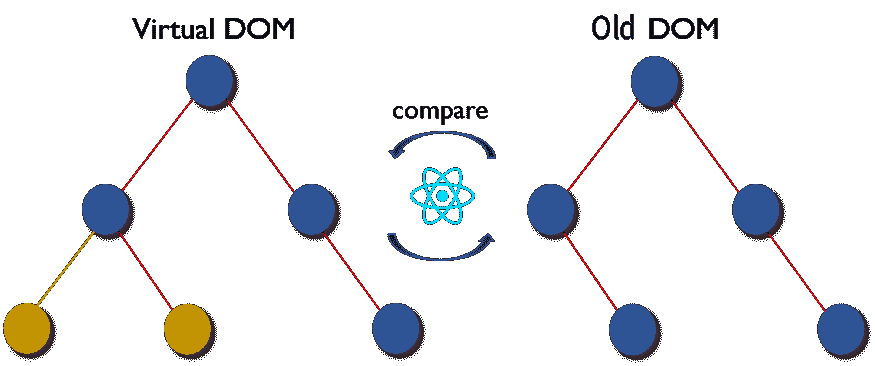

# 为什么键在 React 中很重要

> 原文：<https://betterprogramming.pub/why-react-keys-matter-an-introduction-136b7447cefc>

## 以及为什么您不应该忽略控制台中的关键警告


作者照片。

在 React 中处理任何类型的列表时，如果您忘记包含一个`key`属性，您将经常会遇到这个警告:

```
Warning: Each child in a list should have a unique "key" prop
```

那么，React 为什么告诉你要包含键，为什么它很重要？

在本文中，我将解释 React 键的基本概念，为什么它们很重要，以及如何正确使用它们。让我们跳进来吧！

# 什么是反应键？

简单地说，它们是在列表的子元素中传递的属性，目的是:

*   确定添加了哪些元素。
*   确定哪些元素被更新。
*   确定哪些元素被删除。

因此，密钥作为元素的标识，就像护照用于标识人一样。

# 我们为什么需要它们？

此时，您可能想知道为什么我们需要钥匙。毕竟，我们可以通过元素的 ID、类名、父/子、索引、属性等来识别元素。答案是因为 React 的 [Diffing 算法](https://reactjs.org/docs/reconciliation.html)。

# 差分算法:简要说明

React 应用程序由组件树组成。每当任何组件中出现属性或状态更改时，React 都会将其组件重新呈现到虚拟 DOM 中。diffing 算法从根节点开始，在组件树的每一层比较新的虚拟 DOM 和旧的 DOM。



照片由[扎伊尔扎](https://blog.zairza.in/how-reactjs-works-behind-the-scene-e25689f4b2c5)拍摄。

该算法找到更新实际 DOM 所需的最少操作数。它是这样做的:

## 1.按类型比较节点(即`<div>`与`<span>`)

如果它们不同，则销毁并从头构建一个新组件。

```
// virtual DOM
<div><MyComponent/></div>// real DOM
<span><MyComponent/></span>
```

在这种情况下，这会导致`<MyComponent/>`被销毁和重建。

## 2.如果节点类型相同，则按属性进行比较

如果它们不同，只更新属性。

```
// virtual DOM
<div className="after" title="stuff" />// real DOM
<div className="before" title="stuff" />
```

在这种情况下，这导致将`className`更新为`after`。

# 列表呢？

对于列表，React 将同时在它们的两个子节点上递归，找出任何差异，然后将它们修补到真正的 DOM(如果有的话)。

在这种情况下，这会导致在`<li>second</li>`之后添加`<li>third</li>`。

到目前为止，一切顺利。但是现在，不是在列表的底部添加一个元素，而是在开头添加一个新元素，会怎么样呢？

这个例子将导致 React 将每一个`<li>`重新呈现给真实的 DOM，因为它没有意识到它可以简单地将`<li>zero</li>`添加到列表的开头。

这种低效率会导致问题，尤其是在较大的应用程序中。因此，键为这个问题提供了一个简单的解决方案。

# 使用钥匙的正确方法:id

您可以轻松地向列表元素添加键，如下所示:

```
<li key="1">first</li>
<li key="2">second</li>
<li key="3">third</li>
```

键应该是唯一的标识符，这样每个元素都可以被正确地识别。因此，建议使用一些唯一生成的`id`作为密钥。您甚至可以将键分配给动态呈现的列表:

```
const todoItems = todos.map((todo) =>
  <li key={todo.id}>
    {todo.text}
  </li>
);
```

# 使用键的错误方法:索引

当对列表进行某些更改时，使用`index`作为键会导致问题。见[我做的这个演示](https://cdn.hashnode.com/res/hashnode/image/upload/v1599068972819/lz8pCKOZ8.gif?auto=format,compress&gif-q=60)来说明这个问题。

注意，当向学生列表添加新元素时，`Notes`属性没有正确映射，因为列表的索引是键。

因此，属性的值(`greenroots`和`mycodinghabits`)将总是位于索引 0 和 1，即使它们对应的列表元素已经改变了它们在列表中的位置。

让我们看看[如果我们使用`Student ID`作为键，它会是什么样子。](https://cdn.hashnode.com/res/hashnode/image/upload/v1599068096879/rLfwCVVE9.gif?auto=format,compress&gif-q=60)

这里有一个[并排对比](https://cdn.hashnode.com/res/hashnode/image/upload/v1598988192522/8kCzUo9Bf.gif?auto=format,compress&gif-q=60)。

# 结论

键的主要目的是帮助 React 区分元素，提高区分虚拟和真实 DOM 时的性能。要使用键，只需在元素内添加道具，如`<li>`。

唯一 id 是分配给键的最佳值。如果列表是静态的(不能更改)并且其中的元素没有`id`属性，那么只能使用`index`作为键。

感谢您的阅读。希望这篇文章有用。如果你有任何问题，请在下面评论。

# 资源

*   [反应差分算法](https://reactjs.org/docs/reconciliation.html)
*   [反应列表和按键](https://reactjs.org/docs/lists-and-keys.html)
*   [演示回购](https://github.com/victoria-lo/react-keys-tutorial)
*   [参观演示](https://victoria-lo.github.io/react-keys-tutorial/)