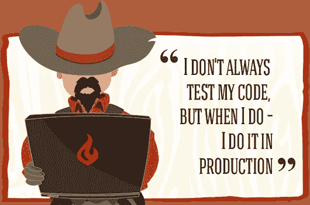

# RSpec 测试失败的原因(以及如何修复它们)

> 原文：<https://betterprogramming.pub/why-rspec-tests-fail-and-how-to-fix-them-402f1c7dce16>

## 知道如何排除测试故障是一项基本的软件技能


美国宇航局第一次发射，1950 年🚀

美国宇航局最早发射火箭的尝试是在 40 年代末和 50 年代初由无人火箭组成的[保险杠](https://en.wikipedia.org/wiki/RTV-G-4_Bumper)计划的一部分。接下来的十年见证了许多次火箭发射——一些成功了，而另一些爆炸了。

然后，在 1961 年，苏联成功地用第一枚载人火箭将宇航员尤里·加加里送上太空，使他成为历史上第一个遨游太空的人。

与之形成对比的是万虎，一个被称为“第一宇航员”的中国传奇人物。在他的上升过程中，他坐在一把连着几十个火箭的椅子上。这个故事的大多数版本都是杜撰的，胡没能活着再次尝试太空飞行。


万虎，[百科](https://en.wikipedia.org/wiki/Wan_Hu)

万虎的故事是一个警示:在拿重要资源(比如我们的生命)冒险之前，我们应该首先在一个受限的环境中测试我们的想法。

现在在航空、汽车、制药、银行和教育领域都能看到软件的身影。这使得软件质量比以往更加重要，软件测试是提高质量的重要部分。

# 为什么要测试软件

单元测试是针对错误和错误的前线防御。没有自动化测试，生产部署更像是祈祷好运。最终，最终用户成为你的测试对象。

自动化测试在软件开发生命周期(SDLC)的早期捕获错误，导致[可测量的成本节约](https://abstracta.us/blog/test-automation/true-roi-test-automation/)和软件质量的整体提高。

然而，即使当需求非常清晰，并且利益相关者一致时，工程师在将他们对需求的理解转化为可执行代码时也会犯错误。

错误可以有多种形式，包括逻辑、算术和连接性错误，以及过时的依赖、对数据的假设、糟糕的文档或缺乏适当的版本控制的结果。错误通常也是不可预见的副作用的结果。

单元测试迫使我们批判性地思考，并验证我们的代码表现出某些行为。通过这种方式，测试起到了与编辑器相同的作用，可以防止可能导致语法或类型错误的细微打字错误。

对于像 Ruby 这样的解释型语言来说，这尤其有用，因为许多异常都是运行时错误，而不是编译时错误。

当单元测试在多个类似生产的系统之间被组合并针对真实数据运行时，它们就成为集成测试。这就是像 [RSpec](https://rspec.info/) 这样的行为驱动开发(BDD)框架异常强大和令人沮丧的地方。

与 [Rails](https://rubyonrails.org/) 非常相似，RSpec 结合像 [factory_bot](https://github.com/thoughtbot/factory_bot) 、 [DatabaseCleaner](https://github.com/DatabaseCleaner) 、 [Capybara](https://github.com/teamcapybara/capybara) 、 [Timecop](https://github.com/travisjeffery/timecop) 和 [VCR](https://github.com/vcr/vcr) 这样的库，提供了看起来很像 [Ruby Magic](https://magic-ruby.com/) 的功能。但是一旦您熟悉了这些工具，就有可能对每个系统进行协调和独立的测试。

在花时间编写(和重写)了许多 RSpec 测试之后，我想指出我在编写和调试测试时遇到的微妙和不那么微妙的问题。

# *RSpec 测试如何失败*

测试持续失败*或间歇失败*。**

*测试中的可重复性很重要，因为如果没有可重复性，开发人员会质疑测试的价值，最终会质疑测试本身(想想吧，有狼来了综合症的男孩)。*

*持续失败的测试更容易被发现，通常是精神疲劳的结果。*

*间歇性失败的测试称为*片状测试* ，更难分析。它们通常是由不确定的行为、不可用的外部服务、非事务性更改、关于数据的假设、副作用以及与日期和时间相关的边缘情况引起的。*

*下面是 RSpec 测试失败的原因以及如何修复它们。*

# *健忘*

*磕碰太多或无意磕碰。*

> *存根为测试过程中的呼叫提供固定的答案，通常对测试程序之外的任何事情都不作出响应。——马丁·福勒，[模仿不是树桩](https://martinfowler.com/articles/mocksArentStubs.html)*

*RSpec 没有明确要求使用测试间谍来产生[消息预期](https://relishapp.com/rspec/rspec-mocks/docs/basics/expecting-messages)。相反，它提供了`[receive](http://rspec.info/documentation/2.14/rspec-mocks/RSpec/Mocks/Matchers/Receive.html)` [匹配器](http://rspec.info/documentation/2.14/rspec-mocks/RSpec/Mocks/Matchers/Receive.html)，可以在任何对象上使用它来预测分支行为。*

*虽然这种方法提供了更简洁、更方便的语法，但也很容易忘记默认情况下`receive`匹配器存根目标方法。*

*房地产 101 告诉我们，房价只会上涨。*

*现在，我们可能想在 RSpec 中测试这个假设:*

*令我们惊讶的是，当我们运行这个测试时，它失败了，并出现以下错误:*

```
*Failure/Error: expect(house.price).to be > 649000
       expected: > 649000
       got:        649000*
```

*事实证明，`receive`匹配器会存根化目标方法，除非我们使用`and_call_original`来取消存根化。这个没有署名的`appreciate_a_lot`，结果是房价不变。*

*一种策略是将分支测试与结果测试分开。这保持了测试用例的简洁，避免了不经意间的方法错误。*

*一种更通用的方法是尽可能少地使用存根，以避免测试和生产代码路径之间的差异。最重要的是，与上面的例子不同，[不要 stub 测试中的系统](https://thoughtbot.com/blog/don-t-stub-the-system-under-test)。*

*TL/DR:记住，存根是`receive`匹配器的默认行为；使用`and_call_original`取消存根，但保留消息预期。*

# *内存和数据库中的差异*

*有许多方法可以找到和更新活动记录模型，但是默认情况下，活动记录将使用一个名为`id`的整数列作为表的主键。*

*最终，随着 Rails 4.2 的出现，出现了 GlobalID，一个应用范围内的统一资源标识符(URI)。因此，Rails 特性包括主动作业支持，直接传递模型。*

*这使得将模型作为参数传递给乔布斯变得更加容易。然而，它也掩盖了幕后发生的事情，这可能会在测试过程中造成混乱。*

*活动作业在内部使用`GlobalID::Locator.locate`来反序列化模型`GlobalID`。然后，它使用主键执行数据库查询。*

*现在，编写这样一个测试是很诱人的，因为表面上看起来我们是在直接传递`user`对象。*

*第一个测试失败，出现如下错误:*

```
*Failure/Error: expect(user).to receive(:perform_send_welcome_email!)

   (#<User:#..>).perform_send_welcome_email!(*(any args))
           expected: 1 time with any arguments
           received: 0 times with any arguments*
```

*第二个测试也失败了，但出现了不同的错误:*

```
*Failure/Error: expect(user.welcome_email_sent?).to eq(true)

       expected: true
            got: false

       (compared using ==)*
```

*这两个测试都失败了，因为被测试的主题，一个特定的`User`，在数据库中是相同的，但在内存中不是。数据库更改不会自动传播到内存中的模型。*

*第一个测试可以使用像`[expect_any_instance_of(User)](https://relishapp.com/rspec/rspec-mocks/docs/working-with-legacy-code/any-instance)`这样的匹配器，而第二个测试可以用`[#reload](https://apidock.com/rails/ActiveRecord/Persistence/reload)`轻松完成，它将活动记录与数据库重新同步。*

*TL/DR:了解内存和数据库中的差异；根据需要使用`#reload`将记录与数据库重新同步。*

# *非决定论*

*有时通过，有时失败。*

**

*[随机数发生器](https://hsm.utimaco.com/solutions/applications/random-number-generator/)*

## *随机性*

*[计算机能生成真正的随机数吗？](https://engineering.mit.edu/engage/ask-an-engineer/can-a-computer-generate-a-truly-random-number/)不尽然，至少在没有特殊硬件的情况下不会。相反，计算机通过从诸如光标移动、按键、硬盘访问等熵池中提取数据来模拟随机性。*

*这些“随机”源然后被组合在一个位置(如`[/dev/random](https://en.wikipedia.org/wiki//dev/random)`)用于需要伪随机行为的应用。*

*不管行为是真随机还是伪随机，测试随机性都是相当困难的。不出所料，它也是不确定行为的一个明显来源。考虑一个`Dice`类:*

*调用`roll`应该会返回一个 1 到 6 之间的随机数，就像真的骰子一样。*

*接下来，我们编写测试来验证这种行为。也许我们还包括一个测试来验证骰子没有以某种方式加权(或者也许这个代码是用于赌博服务的，我们想要不准确的结果)。*

*我们在本地进行测试，他们通过了。他们在 CI 再次通过。几天后，我们注意到第二次测试出现了间歇性故障。最简单的解决办法是完全避免随机性。当这不可能时，我们可以提供一个“种子”给`[Random](https://ruby-doc.org/core-2.4.0/Random.html)`类。*

*注意:这与我们通过手动设置`[--seed](https://relishapp.com/rspec/rspec-core/docs/command-line/order)`选项来调试随机排序的 RSpec 测试时使用的过程相同。*

*伪随机数发生器(PRNGs)只是将一个输入映射到一个看似随机但确定的序列的函数。使用一个固定的种子为我们提供了一个固定的序列，从而提供了确定性的结果。*

*现在，`total`总会让出`191`，并且测试会一直通过！尽管我们也引入了测试和生产条件之间的不一致。幸运的是，这种情况并不常见。*

## ***唯一约束***

*随机性更有可能表现为在具有唯一约束的模型工厂中随机生成的数据之间的*冲突。**

*与`ObjectId`或类似 UUIDs 发生冲突的几率非常低，但与描述重复的概率是 1:1000。当需要随机生成的属性时，最简单的解决方案是从更大的随机库中选择。*

*注意: [Faker](https://github.com/faker-ruby/faker) 是另一个很棒的工具，可以在测试工厂中用来创建独特的结构化数据，而没有冲突的风险。*

*TL/DR:避免测试随机性。如果不能，指定一个种子和/或使用*更多*随机*随机*像`[SecureRandom](https://ruby-doc.org/stdlib-2.5.1/libdoc/securerandom/rdoc/SecureRandom.html)`一样。*

# ***跨测试的状态保存***

*阿恩·哈特茨的文章很好地总结了这一点:[在 RSpec 中使用](https://makandracards.com/makandra/11507-using-before-all-in-rspec-will-cause-you-lots-of-trouble-unless-you-know-what-you-are-doing) `[before(:all)](https://makandracards.com/makandra/11507-using-before-all-in-rspec-will-cause-you-lots-of-trouble-unless-you-know-what-you-are-doing)` [会给你带来很多麻烦，除非你知道自己在做什么](https://makandracards.com/makandra/11507-using-before-all-in-rspec-will-cause-you-lots-of-trouble-unless-you-know-what-you-are-doing)。*

*`before(:all)`在事务块之外创建数据，跨测试持久化更改。*

*最佳实践(Rspec 支持使用`--order rand`选项)是以随机的顺序运行测试，以揭示测试之间隐含的依赖关系。在随机排序的测试之间持续的数据自然会导致不一致。*

*这里有一个关于*而不是*如何使用`before(:all)`的例子:*

*如果按照定义的顺序运行测试，第二个测试将会失败:*

```
*Failure/Error: raise AlreadyVotedError

# ./voter.rb:26:in `vote'*
```

*这就是为什么 RSpec 提供惰性求值的`let`和急切求值的`let!` 助手方法。[何时使用 RSpec](https://stackoverflow.com/questions/5359558/when-to-use-rspec-let) `[let](https://stackoverflow.com/questions/5359558/when-to-use-rspec-let)`提供了更多的细节，但简言之:*

*总是选择`let`而不是实例变量。*

*TL/DR:一直用`let`，不要用`before(:all)`。*

# ***网络通话***

*大多数应用程序依赖第三方服务，如支付处理的 [Stripe](https://stripe.com/) 或 [Square](https://squareup.com/us/en) ，日志记录的 [Splunk](https://www.splunk.com/) ，监控的 [New Relic](https://newrelic.com/) 。*

*这意味着应用程序会产生大量的网络请求。虽然我们可以相信这些服务提供商的工程师已经彻底测试了他们的客户端库，但是在我们的应用程序中测试这些库的使用也是很重要的。*

*不幸的是，并不是所有的客户端库都支持集成测试环境。即使他们这样做了，网络问题也可能导致像这样的测试暂时失败。在编写契约测试时，最好不要超出远程边界进行测试。*

```
*# --- Caused by: ---
# Net::HTTPServerException:
#   503 "Service Unavailable"*
```

*这就是像 VCR 这样的工具有用的地方！*

*VCR 允许开发人员“记录和重放”HTTP 交互，包括由第三方工具生成的交互。这使得测试快速、确定、准确，并且不依赖于网络可用性或外部服务。*

*测试被包装在一个`use_cassette`块中，以便在第一次执行时，创建一个 YAML 文件来保存响应。*

*关于更深入的信息，RubyGuides 有一个关于使用和配置 VCR 的很好的教程[。](https://www.rubyguides.com/2018/12/ruby-vcr-gem/)*

*TL/DR:在测试中使用预先录制的 HTTP 响应来提高整体速度、可靠性和准确性。*

# *时间*

*不是冻结时间。*

*一个月有 28-31 天，一年有 365 天，有 2027 天尼克松是总统。实际上，一个儒略年大约有 365.25 天(更准确地说是 [365.2422 天](https://pumas.jpl.nasa.gov/files/04_21_97_1.pdf))。*

*或者，每四年可以被称为闰年，我们只需要多加一天。二月总是得到那一天，因为它是最短的一个月。*

*一些国家如美国(和地区)跨越 11 个时区，而其他国家如中国只观察一个时区(UTC+8)。然后，出于一些疯狂的原因，一些国家每年两次增加或减少时钟，试图使工作时间与阳光相协调。*

*测试工作可靠，在 01:00-23:00 之间。*

*不用说，时间是非常复杂的，跨边界测试时间是非常困难的。我听说过这种被称为*灰姑娘测试*的测试，因为它们会在午夜变成南瓜。*

*为了让这些测试更加可靠，最好成为一名时间领主…或者至少在 RSpec 中学会如何冻结和旅行时间。*

*这是一个有许多`Events`的`Venue`模型的例子。如果我们想要一个即将到来的音乐会的列表，我们可以将开始时间与当天进行比较。*

*然后，在测试过程中，我们要确保这个范围返回今天发生的或将来会发生的音乐会。*

*这个测试看起来没问题。它甚至可以从单一来源获得开始时间，以保证一致的增量。如果这个测试在一天的界限内运行，例如在午夜之前(11:59:59pm)，就会出现问题。*

*如果在 concert 创建期间花费了足够的时间，`upcoming_concerts`可能会在第二天被调用，导致第一个期望失败。*

*用`Timecop`解决这个问题最简单的方法是冻结时间`before :each`并返回`after :each`。这样，在测试期间，时间在之间流逝*,而不是*。***

*TL/DR:使用 [Timecop](https://github.com/travisjeffery/timecop) 在 RSpec 中冻结和可预测地移动时间；防御性地测试时间界限和边缘案例。*

# *副作用*

## ***活动记录回调***

*活动记录提供了方便的生命周期[回调](https://api.rubyonrails.org/classes/ActiveRecord/Callbacks.html)在状态改变前后，易于“设置和忘记”。彻底的测试应该包括这些回调，但是有时有必要回避它们。*

*这就是`[skip_callback](https://apidock.com/rails/ActiveSupport/Callbacks/Callback/ClassMethods/skip_callback)`的用武之地。它既可以用于规范工厂，也可以用于单独的测试。考虑一款`User`车型:*

*虽然 stub `send_welcome_email`是可能的，但是在现实世界的应用程序中，这个方法可能被深埋在堆栈跟踪中，结果只是许多回调中的一个。*

*或者，也许回调应该在一个任务之前异步运行，但是所有的任务都是为了一个特定的测试而内联运行的。无论是哪种情况，都可以指示活动记录跳过特定模型的回调。*

*可能需要一个`User`模型才能将`Address`视为住宅。*

*然而，在`perform_enqueued_jobs`块中创建`User`并将其与`Address`相关联会触发创建后回调，并最终触发`SendWelcomeEmail`作业。*

*也就是说，应该避免跳过回调，以支持更显式的工厂、记录的网络调用和特定于环境的配置。*

*例如，在“测试”环境中，发送电子邮件可以在 ActionMailer 中全局处理[。如果您选择`skip_callback`，记得调用](https://stackoverflow.com/questions/19983221/actionmailer-testing-with-rspec)`[set_callback](https://api.rubyonrails.org/classes/ActiveSupport/Callbacks/ClassMethods.html#method-i-set_callback)`来恢复其他测试的回调。*

*TL/DR: `[skip_callback](https://apidock.com/rails/ActiveSupport/Callbacks/Callback/ClassMethods/skip_callback)`可避免主动记录回调，但慎用。*

# ***活动作业队列适配器***

*活动记录回调的一个常见用例是将活动作业排队。在底层，活动作业被配置为使用特定的 [QueueAdapter](https://api.rubyonrails.org/classes/ActiveJob/QueueAdapters.html) 。这个适配器决定了队列的顺序(如 FIFO、LIFO 等)。*

*RSpec 的一个常见适配器是 [TestAdapter](https://api.rubyonrails.org/classes/ActiveJob/QueueAdapters/TestAdapter.html) ，它可用于验证特定作业是否成功入队。*

*但是，TestAdapter 在默认情况下并不实际执行这项工作！*

*根据您测试的内容，还有其他的适配器，比如 InlineAdapter 中的[，它们通过像`perform_now`一样处理`perform_later`调用来立即执行作业。](https://api.rubyonrails.org/classes/ActiveJob/QueueAdapters/InlineAdapter.html)*

*或者，TestAdapter 有一个方法`perform_enqueued_jobs`，顾名思义，它实际上同步执行排队的作业。*

*与回调一样，无论是否实际执行工作，测试都是有价值的。RSpec 提供了有用的活动工作匹配器，如`[have_enqueued_job](https://relishapp.com/rspec/rspec-rails/docs/matchers/have-enqueued-job-matcher)`匹配器。*

*这些助手方法允许分离关注点，使得在一个规范中测试作业的逻辑，而在另一个规范中测试触发作业的逻辑成为可能。*

*TL/DR:使用`TestAdapter`来跟踪和执行排队的活动作业。*

# *太具体了*

*排序不一致的数据。*

*像*散列*和*数组*这样的集合用于存储相关数据，并且都是按照插入顺序枚举的。*

*在测试过程中，这导致了隐式特定于顺序的比较，通常是在创建和比较活动记录模型集合时。例如，一个`Cat`可以有多个`toys`。*

*然后编写一个简单的测试来确认一个`Cat`实际上可以有许多玩具。*

*[factory_bot](https://github.com/thoughtbot/factory_bot) 的`create_list`助手创造了三个与我们的猫 Lovie 相关的玩具。*

*这里的问题是，虽然`create_list`将返回 creation 一贯订购的三个独特的玩具，但协会将根据订购范围返回。如果没有提供订单，则默认为按 ID 排序。*

*对于顺序 id，这不会造成问题，因为按创建或顺序排序应该是相同的。然而，`ObjectID`的前四个数字代表自 Unix 纪元以来的秒数。*

*不使用`eq`来比较两个数组，我们可以使用冗余命名的`match_array`匹配器，它与顺序无关。*

*TL/DR:在与排序无关的情况下比较集合时，使用`hash_including`、`include`和`match_array`。*

# ***负面测试预期***

*阴性测试是一个特例。与正面测试不同，非常容易编写过度具体的测试，最终什么也测试不到。考虑一个方法中的代码路径，它不会引发自定义错误。*

*对`price_per_sq_ft`的测试可能看起来像这样:*

*第一个测试期望出现错误，而第二个测试期望出现错误*而不是*。第二个测试的问题是微妙的，但幸运的是这是一个很常见的事件，RSpec 实际上默认警告开发人员。*

***警告**:*

*使用`expect { }.not_to raise_error(SpecificErrorClass)`会有误报的风险，因为任何其他错误都会导致期望通过，包括 Ruby 提出的错误(例如`NoMethodError`、`NameError`和`ArgumentError`)，这意味着您想要测试的代码甚至可能无法到达。*

*而是考虑使用`expect { }.not_to raise_error` or `expect { }.to raise_error(DifferentSpecificErrorClass)`。*

*RSpec 警告清楚地解释了该测试的问题。*

*在上面的例子中，第二个测试实际上引发了`TypeError: nil can’t be coerced into Fixnum`，因为我们没有定义`@sq_ft`！这就是过于具体的负面测试的问题，他们可能会错过像这样的真正问题。*

*TL/DR:偏爱阳性测试胜过阴性测试；更广泛地编写负面测试，尤其是在错误处理方面。*

# *资源*

*有很多关于使用 Ruby、Rails、active record、RSpec、factory_bot 和自动化测试的优秀文章。*

*以下是我发现的几个特别有用的例子。*

*   *[更好的规格](https://www.betterspecs.org/)。*
*   *[RSpec 风格指南](https://rspec.rubystyle.guide/)。*
*   *有时会失败的测试。*
*   *[关于时间(时区)](https://thoughtbot.com/blog/its-about-time-zones)。*
*   *[我应该如何测试随机性？](https://softwareengineering.stackexchange.com/questions/147134/how-should-i-test-randomness)*
*   *[古怪的测试——永无止境的战争](https://hackernoon.com/flaky-tests-a-war-that-never-ends-9aa32fdef359)。*
*   *[RSpec:感谢您以随机顺序运行我的测试](https://spin.atomicobject.com/2012/08/09/rspec-thank-you-for-running-my-tests-in-random-order/)*
*   *[如何用 RSpec、Capybara、Database_cleaner 设置 Rails】。](https://medium.com/better-programming/how-to-set-up-rails-with-rspec-capybara-and-database-cleaner-aacb000070ef)*
*   *[检测良好。金字塔不好。冰淇淋甜筒最难吃](https://medium.com/@fistsOfReason/testing-is-good-pyramids-are-bad-ice-cream-cones-are-the-worst-ad94b9b2f05f)。*

**

*单元测试的基础知识*

# *最后的想法*

> *在满足时间表的甜蜜被遗忘后，质量差的痛苦仍然存在。*

*测试失败可能会令人沮丧，尤其是当不清楚失败的原因时。然而，不要忘记测试背后的总体目标:验证行为，并提醒工程师潜在变化背后的意外后果。*

*尽管失败的测试令人沮丧，但是没有测试会导致不可预测和不可靠的部署。随着软件系统规模和复杂性的增长，直接投入生产的风险也在增长。另一种方法是按下代码，然后交叉手指。*

*当然，如果在回顾了这些例子之后，你的测试仍然失败，那么总有可能是因为有一个 bug！*

*毕竟，这就是测试的目的:在 SDLC 的早期识别 bug。在测试期间捕获 bug 比在生产中捕获 bug 更好(也更便宜)。*

*快乐的虫子挤压！*