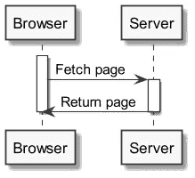
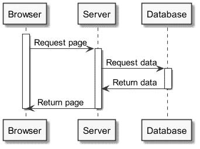
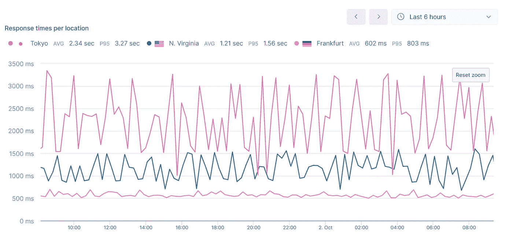
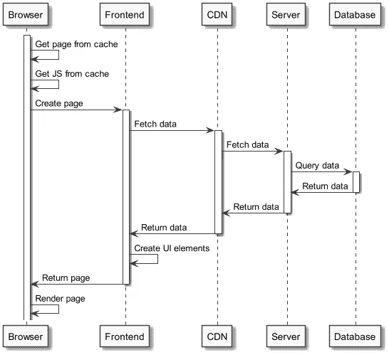
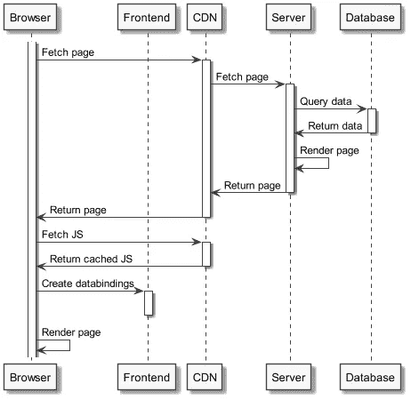

# 为什么单靠服务器端渲染不是解决方案

> 原文：<https://betterprogramming.pub/why-server-side-rendering-alone-is-not-the-solution-c3f501327f09>

## 以及为什么混合渲染方法可以

乔希·索伦森在 [Unsplash](https://unsplash.com/s/photos/pathway?utm_source=unsplash&utm_medium=referral&utm_content=creditCopyText) 上的照片

自 20 世纪 90 年代中期浏览器网景黯然失色以来，JavaScript 已经成为万维网的一部分。从 21 世纪初的 JQuery 开始，随着 2010 年 AngularJS 的发布而加速，JavaScript，尤其是单页面应用程序(SPA)越来越受欢迎，并且已经成为大中型 web 应用程序的首选解决方案。

与纯 HTML 页面相比，SPAs 有很多优势，比如能够在不同的页面之间共享定制组件。然而，也有缺点。其中包括:加载时间。

与在浏览器中立即呈现的静态 HTML 相比，spa 就像网页中的页面。因此，spa 需要额外的时间才能对用户可见和可用。

> 当用户导航到 SPA 时，初始页面下载被认为是“基础页面”。基本页面包括 HTML 框架、核心 CSS 和用于获取和构造新内容的 JavaScript 框架。诸如图像和字体之类的必要资源也可以由基本页面加载。
> 
> SPA 框架欺骗浏览器不要在每次导航时重新加载页面；相反，它们通过 XMLHttpRequests(xhr)更改 URL 并获取新内容。“虚拟页面”不是从服务器加载的，而是通过 xhr 更新的。"【appdynamics.com —[AppD 方法:性能监控单页面应用|博客(T6)】](https://www.appdynamics.com/blog/product/the-appd-approach-performance-monitoring-single-page-applications/)

因此，每当我们访问 Gmail 这样的 SPA 时，最初，浏览器并不知道这个 SPA。只有在浏览器获取并执行了 JS 文件之后，SPA 才能开始工作并创建实际的用户界面。

当我们导航到一个水疗中心时，后台会发生以下事情:

1.  **浏览器**:取 index.html
2.  **浏览器**:解析 HTML
3.  **浏览器**:获取附加 JS
4.  **浏览器**:执行 JS
5.  **App** :如有必要，获取附加数据
6.  **App** :创建 UI 元素
7.  **浏览器:**渲染 UI 元素

与呈现静态 HTML 页面相比，这要多很多步骤，后者只需要第一步(获取)、第二步(解析)和第七步(呈现)。

图 1:静态网站的流程图。图片来源:作者

虽然互联网通常很快，但是客户端和服务器之间的每个连接都会增加和减少加载时间。我们将在后面看到客户机和服务器之间的物理距离如何进一步增加响应时间。这就是为什么我们已经习惯了看这些加载动画，对不对？

图 2:谷歌风格的加载动画。图片来源: [Giphy](https://giphy.com/gifs/google-icon-loading-jAYUbVXgESSti)

SPAs 带来了更多的挑战，如应用程序响应能力——不是在视窗大小方面，而是应用程序对用户输入的反应速度——会受到太多数据绑定的影响。此外，在企业环境中，一旦一个页面上有多个 SPA，就必须考虑单点登录和在一个或多个应用程序之间共享信息等问题。

> "数据绑定会根据应用程序的状态自动更新您的页面。您可以使用数据绑定来指定图像源、按钮状态或特定用户的数据等内容。
> — [角度绑定语法](https://angular.io/guide/binding-syntax)

但是，让我们关注一下加载时间这个话题，看看我们如何通过改善 spa 的加载时间来改善用户体验。

# 通过服务器端渲染加快加载速度

因此，如果 SPAs 的一个缺点是在用户浏览器中呈现应用程序需要更长的时间，那么为什么不在服务器上呈现整个页面呢？这听起来像是合乎逻辑的结论。如果客户机获取数据和生成 UI 的时间太长，那么就在服务器上准备好一切，然后完整地发送给客户机。

图 3:服务器端呈现的应用程序的流程图。图片来源:作者

在服务器上呈现的 web 应用程序不需要在运行时获取数据。因此，涉及的往返行程更少，移动部件更少，损坏的东西也更少。这种方法还改善了用户体验，因为用户不必等到应用程序准备就绪并可用。一旦应用程序进入浏览器，它就准备好了。

还有:从稳定性和弹性的角度来看，服务器端渲染可能是我们能做的最好的事情。每当两个应用程序通过网络相互通信时，都存在通信错误的风险。有可能服务器的响应速度比预期的要慢，或者根本没有响应。

在任何情况下，服务器端呈现方法都比前一章中描述的 spa 呈现涉及更少的往返。这解释了为什么不需要加载动画，为什么初始加载感觉比 SPA 快。为了说明 SPAs 环境中必要的往返，下面的图 4 显示了单页应用程序启动的流程图。

图 4:单页面应用程序的流程图。图片来源:作者

那么，服务器端渲染应用的缺点是什么呢？**可扩展性**。这是一个令人失望的消息，因为听起来我们已经找到了快速加载和改善用户体验的解决方案——圣杯。问题是，因为服务器组装 UI，所以 UI、服务器和数据(base)需要彼此靠近。否则，我们将失去前面提到的所有优势。此外，正如我们将在下一章中看到的，延迟随着用户和服务器之间距离的增加而增加。

那么我们如何在全球范围内扩展 web 应用程序呢？

# 单页应用程序的显著优势

应用程序和数据的分离。这听起来很简单，然而，这种分离在优化加载时间方面是一个真正的游戏规则改变者，也是 spa 相对于服务器端渲染应用的优势。原因如下:减少网页加载时间最简单的方法就是缩短用户和内容之间的距离。

下面的截图显示了客户端和服务器之间的距离对加载时间的影响。这张图片展示了我在世界上三个不同地方的侧边项目的加载时间:

*   德国法兰克福
*   美国弗吉尼亚州
*   日本东京

checkly.com 检查 https://www.blauspecht.io 性能的截图

显而易见，对于来自东京的请求，响应时间要比来自德国的请求长得多。那是当然的，因为 [t](https://www.blauspecht.io) he 的申请是托管在德国的纽伦堡。

纽伦堡和日本东京之间的距离是 9200 公里或 7500 英里。由于距离很远，加载时间平均为 2.34 秒

在德国法兰克福，用户会体验到大约 4 倍的加载速度，平均大约 0.6 秒。这是因为法兰克福和纽伦堡之间的距离是 225 公里或 140 英里。另一方面，如果我们将应用程序托管在东京，那么，当然，东京用户的加载时间会非常短，而我们的德国用户会经历更长的响应时间。

因此，理论上，我们可以为全球用户优化加载时间。此外，我们越接近用户部署应用程序，用户接收内容的速度就越快。从技术角度来看，没有什么可以阻止我们这样做，因为 spa 是高度可扩展的:

*   **spa 不依赖于任何服务器端技术**。每个 web 服务器都可以提供仅包含文本内容(JS 和 CSS)和图像等媒体文件的 spa。
*   我们可以独立于各自的后端部署和运行 spa**，因为 spa 将在运行时获取必要的数据。**

那么，我们如何让我们的内容和网络应用尽可能靠近我们的客户呢？这时候像 [Fastly](https://www.fastly.com/products/cdn) 、 [Cloudflare](https://www.cloudflare.com/cdn/) 这样的专业公司和 [AWS](https://aws.amazon.com/cloudfront/) 这样的大玩家就开始发挥作用了。他们有专门的内容交付网络(CDN)服务，利用数据中心外的所谓[边缘服务器](https://www.cloudflare.com/learning/cdn/glossary/edge-server/)尽可能高效地向全球客户提供网页。

> “一个 [CDN](https://www.cloudflare.com/learning/cdn/what-is-a-cdn/) 边缘服务器是一台存在于网络的逻辑极限或[边缘](https://www.cloudflare.com/learning/serverless/glossary/what-is-edge-computing/)的计算机。边缘服务器通常充当不同网络之间的连接。CDN 边缘服务器的主要目的是尽可能靠近发出请求的客户机存储内容，从而减少[延迟](https://www.cloudflare.com/learning/performance/glossary/what-is-latency/)并缩短页面加载时间。”— [什么是 CDN 边缘服务器？|云辉](https://www.cloudflare.com/learning/cdn/glossary/edge-server/)

我们在上面看到，德国用户接收德国托管内容的速度大约是日本用户的四倍。使用 cdn，我们可以缩短用户和应用程序之间的物理距离。我们将在后面看到加载时间如何影响转换率和公司收益。

图 5:在全球多个地点托管内容的 CDN。图片来源:diagrams.net

但是，首先，让我们看看如何将服务器端渲染和 SPA 方法结合起来，以获得两个世界的好处:SPA 的可伸缩性和更少的往返，这是服务器端渲染应用程序的一个承诺。

# 混合方法会是什么样子

我们能两全其美吗？还是我们必须坚持一种方法？为了找到答案，让我们再次解构一个 SPA 的加载，找到痛点和可能的解决方案。

再次查看图 4，我们可以注意到浏览器总共需要三个请求来从 web 服务器获取所有需要的内容。通过巧妙地组合不同的渲染策略、缓存和利用交付网络，我们可以将这些网络请求减少到最低限度。

因此，图 5 显示了有效的缓存策略如何减少网络请求。

图 6:浏览器缓存减少了网络请求。图片来源:作者

当然，缓存只是针对不包含用户数据的内容的解决方案。否则，我们会将单个用户的数据传播给全世界的其他人。然而，这是一种有效的策略，它最大限度地减少了网络请求，因此不仅减少了加载时间，还减少了与可靠性和弹性相关的额外挑战。

尽管如此，仍有改进的空间。例如，我们可以通过在服务器上渲染，将一些负载从前端应用程序转移到我们的服务器上。

图 7:预先呈现的页面减少了前端应用程序的负载。图片来源:作者

在上面的图 7 中，您可以看到大部分工作是在服务器上完成的。事情是这样的:

1.  浏览器调用 CDN 获取页面，CDN 调用服务器，因为页面不可缓存。
2.  服务器查询数据库，将数据呈现在 HTML 页面中，并将整个页面返回给浏览器。
3.  浏览器解析页面并从已经缓存了内容的 CDN 中获取 JS。
4.  SPA 不需要创建 UI 元素(参见图 6 ),因为服务器已经提供了它们。SPA 必须做的唯一事情是接管呈现的应用程序，并设置数据绑定以对用户输入做出反应；一个过程 vue.js 调用[补水](https://ssr.vuejs.org/guide/hydration.html)。

利用缓存、CDNs 和服务器端渲染，我们创建了一个高度优化的应用架构，可以在全球范围内扩展。缺少的一部分是我们如何复制我们的数据并将其存储在我们的用户附近，以进一步减少延迟。简而言之，当然，已经有一些久经考验的服务，如 [MongoDB Atlas](https://www.mongodb.com/cloud/atlas/multicloud-data-distribution) 或 [AWS Aurora](https://docs.aws.amazon.com/AmazonRDS/latest/AuroraUserGuide/AuroraMySQL.Replication.CrossRegion.html) 。

在工具和框架方面:比如有 [Next.js](https://nextjs.org/) 或者 [Nuxt.js](https://nuxtjs.org/docs/concepts/server-side-rendering/) ，已经实现了混合渲染策略。另一方面，如果你有一个不依赖于 React 或 Vue 等框架的简单客户端应用程序，你也可以使用一个简单的服务器端渲染引擎，如 [Amy](https://www.npmjs.com/package/node-amy) 。

现在，最后，让我们看看为什么响应时间很重要，以及它们如何影响您的业务。

# 为什么考虑加载时间很重要

当然，快速响应时间有一个商业案例，它不仅仅是拥有比竞争对手更快的网页。这也是为了吸引用户。

杰基·杰弗斯(Jackie Jeffers)写的一篇题为“[站点速度(仍然)影响着你的转化率](https://www.portent.com/blog/analytics/research-site-speed-hurting-everyones-revenue.htm)”的文章对比了 2019 年电子商务页面的页面速度。

> “我们的研究表明，78%的网站页面加载时间不超过 5 秒，22%的页面加载时间不超过 5 秒。”[https://www . portnet . com/blog/analytics/research-site-speed-having-everyones-revenue . htm](https://www.portent.com/blog/analytics/research-site-speed-hurting-everyones-revenue.htm)

她还展望了从 2014 年到 2019 年，作为研究一部分的网站的加载时间是如何减少的。

> “相比之下，当我们在 2014 年进行这项研究时，50%的网站平均加载时间超过 5 秒。在 5 秒以上的页面加载时间内，网站数量增加了一倍以上，提高了网站速度，减少了加载时间。”
> [https://www . portnet . com/blog/analytics/research-site-speed-having-everyones-revenue . htm](https://www.portent.com/blog/analytics/research-site-speed-hurting-everyones-revenue.htm)

最有趣的是，杰基·杰弗斯指出了电子商务公司的潜在收益是如何受页面速度影响的。

> “如果 100 个人为了 50 美元的产品访问你的网站，这可以说明你潜在收入的差异:
> 
> 在 8.11%的转换率下，不到 1 秒的页面加载时间产生 405.50 美元
> 
> 在 6.32%的转换率下，1 秒的页面加载时间产生 316.00 美元
> 
> 在 4.64%的转换率下，2 秒的页面加载时间产生 232.00 美元
> 
> 在 2.93%的转换率下，3 秒的页面加载时间产生 146.50 美元

Jackie 解释了为什么企业需要不断改善装载时间。这不仅关系到竞争和保持领先，还关系到吸引用户，将您的努力货币化，并为您公司的未来铺平道路。

在这个故事中，我们展示了为什么没有一种渲染方法可以在速度方面带来最大的好处。因此，我们定义了一种有效的应用架构，利用混合渲染方法、cdn 和缓存来提高应用和网络级别的性能。

感谢阅读。如果您有任何反馈或进一步的想法，可以通过 Twitter [@stfsy](https://twitter.com/stfsy) 联系我，