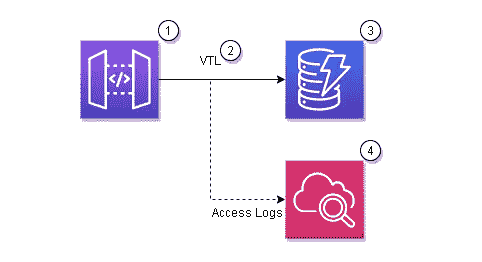
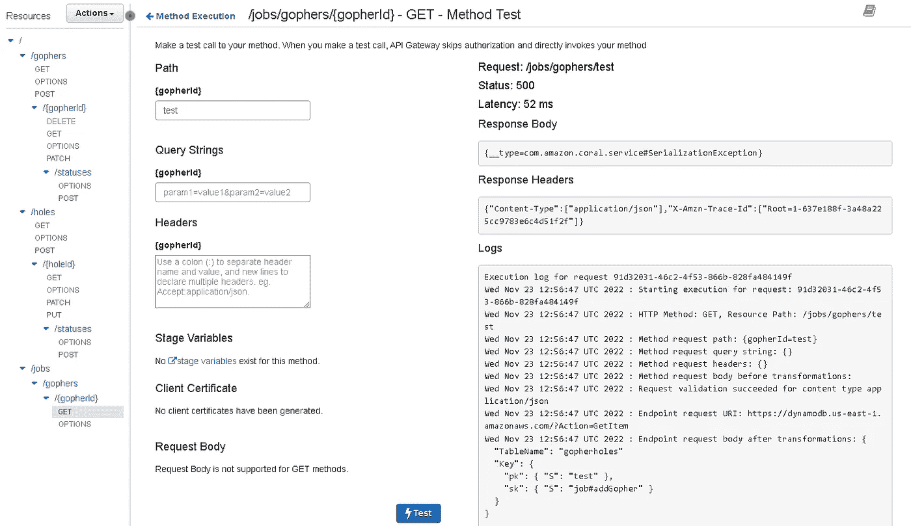
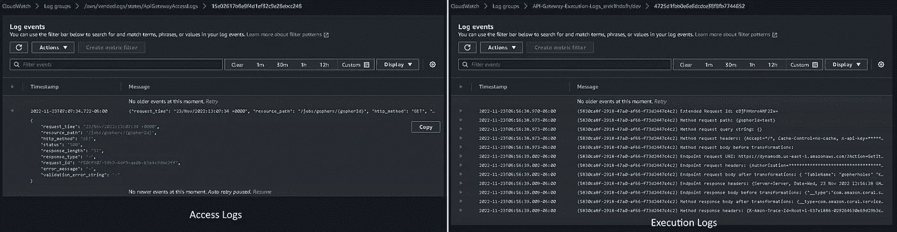
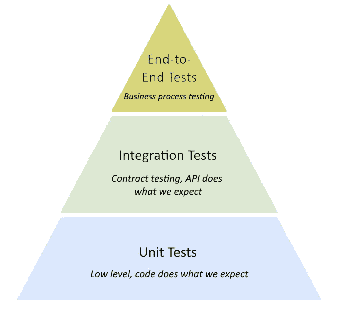

# 为什么无服务器直接集成没有听起来那么可怕

> 原文：<https://betterprogramming.pub/why-serverless-direct-integrations-arent-as-scary-as-they-sound-7358102e967>

## API 网关直接集成被神秘和怀疑所笼罩。但他们不应该。原因如下。

图片由 Freepik 上的 [upklyak](https://www.freepik.com/free-vector/fear-fright-depression-mental-problems-girl-character-with-introversion-disorder-hide-blanket-schizophrenia-neurological-psychological-sickness-linear-cartoon-flat-vector-illustration_25845392.htm#query=scared&position=3&from_view=search&track=sph) 提供

上周，我在[无服务器峰会](https://www.serverless-summit.io/)上参加了一个小组讨论。我们就应用程序现代化、测试事件驱动架构以及回答观众的问题展开了热烈的讨论。

但是有一个问题我们没有机会回答。所以我想花点时间讨论一下，因为最近有人向我提过几次。

提出的问题是“*你关心测试无 lambda 函数和它们的整体可维护性吗？*

当我在 Twitter 上谈论构建 Express Step 函数工作流而不是 Lambda 函数时，我也看到了一些关于这个概念的犹豫。

听到来自社区的担忧并不奇怪。当我们谈到新的、未被广泛使用的模式时，比如与 API Gateway 的直接集成，人们会感到害怕。是改变。人们不喜欢改变。尤其是开发商。

因此，让我们来谈谈直接集成，一些常见的问题，以及为什么它们可能是或可能不是一个问题。

# 直接集成的组件

当我说直接集成时，我的意思是将 API Gateway 中的一个 REST API 直接连接到另一个 AWS 服务，而不使用 Lambda 函数。在 Step Functions 、DynamoDB、SQS 和一百多个服务中有直接集成。

要将一个 API 网关端点连接到另一个 AWS 服务，如 DynamoDB，您可以使用 [VTL](https://velocity.apache.org/engine/devel/vtl-reference.html) 和 [API 网关映射模板](https://docs.aws.amazon.com/apigateway/latest/developerguide/api-gateway-mapping-template-reference.html)。VTL 本身就是一头野兽，但是如果加上 API Gateway 支持或不支持的功能，你会有一个陡峭的学习曲线。

在 VTL 之外，您有一个 IAM 角色和日志。基本就是这样。直接集成如此吸引人的一点是活动部件非常少。

1.  API 网关中的 REST API
2.  VTL 制图模板
3.  直接连接的 AWS 服务
4.  CloudWatch 中的执行和访问日志

与带有 Lambda 功能的集成相比，直接集成提供了更少的部件、更低的延迟、无冷启动和更低的成本。

那么，这一切都是为了什么呢？

# 关注直接集成

在我进行的许多关于 VTL 和直接集成的对话中，总会提到一些问题。

## VTL 是艰难和令人困惑的

毫无疑问，VTL 还有待改进。我不是来争论这个案子的。但是我在这里要做的是提醒你不要混淆复杂和陌生。如果你对任何东西都不熟悉(不仅仅是 VTL ),这看起来会比实际情况更复杂。当我第一次开始使用 GraphQL 时，我认为它非常复杂。但那只是因为我没有花时间去真正学习它和理解它的细微差别。

VTL 也是如此。通过练习，你开始掌握让它歌唱的细节。您将学习如何转换对象、迭代嵌套数组、设置头和响应代码，并利用 AWS 的[内置 util 功能](https://docs.aws.amazon.com/apigateway/latest/developerguide/api-gateway-mapping-template-reference.html#util-template-reference)。

是的，这是你的开发团队必须学习的另一件事，但是它很快成为云开发中被接受的一部分，尽管很烦人。你不能“从街上雇人”来维持直接整合的想法很快就变得不真实了。

所以给它一些练习，[复习一些例题](https://github.com/allenheltondev/gopher-holes-unlimited/blob/master/openapi.yaml#L67)，拥抱它！

## 直接集成是不可能调试的

我第一次构建与 DynamoDB 的直接集成并得到一个`502 Bad Gateway`响应代码时，我不知道该怎么做。我去查看日志，但是没有。我习惯于从 Lambda 函数中查看 CloudWatch 日志，但是我无法为我的集成找到它们。几乎立刻我就没有事情可做了。感觉我无处可去排除故障。

我不知道，有两种方法可以摆脱这种情况。

API 网关控制台允许您直接测试端点，并在出错时查看详细的响应。这可用于调试映射模板的问题，或识别端点正在使用的角色的任何缺失权限。

*在 API 网关控制台手动测试*

您还可以在 REST API 上配置执行和访问日志。这些日志不仅向您显示哪里出错了，还向您显示了谁在调用您的端点的详细信息。默认情况下，这些日志是关闭的，并且不是直接集成所独有的。根据你的 API 获得的流量，你的 API 的访问和执行日志可能会很昂贵，这是我推测为什么它们默认是关闭的。

API 网关控制台将自动显示执行日志。但是，一旦您在基础架构中以代码形式(IaC)启用它们，这些日志将被推送到 CloudWatch，并且您可以以与 Lambda 函数集成相同的方式支持直接集成，假设您通过查看日志来排除它们的故障😄

*来自 API 网关的访问和执行日志*

将执行日志与访问日志配对将为您提供足够的信息来调试直接集成中出现的任何问题。

要在 IaC 中设置日志，您可以配置您的 [API 资源，并设置日志组、角色和 API 网关帐户](https://github.com/allenheltondev/gopher-holes-unlimited/blob/master/template.yaml#L53)。

## 您失去了一层业务验证

前几天我和 Alex Debrie 谈论直接集成，他提出了一个很好的观点。当你直接连接到像 DynamoDB 这样的服务时，你失去了一层业务规则和验证，否则你通常会在 Lambda 函数中得到。

不出所料，亚历克斯是个聪明人，他提出了一个合理的担忧。99.9%的时候，业务规则是作为代码内部的逻辑实现的，所以当直接集成时，您会错过这一点。但它并不像表面上看起来那样黑白分明。

API Gateway 为进入 API 的请求提供了[健壮的模式验证](https://docs.aws.amazon.com/apigateway/latest/developerguide/api-gateway-method-request-validation.html)。您可以在 [JSON schema draft 4](https://datatracker.ietf.org/doc/html/draft-zyp-json-schema-04) 中定义请求体，API Gateway 将确保消息有效负载符合模式。如果没有，请求将被阻塞，无法进入您的集成。

虽然这不是一个代码驱动的业务规则引擎，但它确实提供了一个满足许多用例的验证层。

如果您需要基本消息结构之外的验证，您的选择是有限的。如果您直接集成到 DynamoDB 之类的东西，并且在保存或更新之前需要一个业务逻辑层，*Lambda 函数是一个不错的选择*。

但是如果您正在[与 Step Functions](https://github.com/allenheltondev/serverless-idempotency-momento/blob/main/openapi.yaml#L240) 集成，您可以在您的状态机中添加业务逻辑作为状态。

## 您不能对它们进行单元测试

单元测试位于测试金字塔的底部。它们旨在验证您的代码是否如您所愿。但是在直接集成中，没有代码，一切都是配置！*那么你真的需要测试它吗？*

测试金字塔

是的。是的，你确实需要测试它。

但是在这种情况下，我们将*升级*我们的测试。我们依赖集成测试，而不是依赖单元测试来验证我们的代码。这些测试与我们代码的实际实现相对，而不是本地测试它们(因此有了*上移*的心态)。

您可以对您的端点运行[模糊测试](https://github.com/allenheltondev/postman-contract-test-generator)来测试您的请求的每一个排列。这将彻底测试您的直接集成，并确保无论提供的有效负载如何，您都能得到您想要的响应。

拥有一组强大的测试和一个[回滚机制](https://dev.to/aws-builders/automatic-aws-cloudformation-rollbacks-upon-a-test-failure-in-your-ci-pipelines-pfh)对于直接集成的成功至关重要。因为您依赖于要部署的集成来有效地测试它，所以在出现问题时能够回滚是必须的。

因此，虽然您可能无法在本地进行单元测试，但它们是可测试的资源。你不会把任何未经测试的东西推向生产！

# 结论

就像我们在无服务器中看到的许多事情一样，将直接集成整合到您的应用程序中是一种思维方式的转变。

您正在学习一种新语言(VTL)，解析一组不同的日志，依赖业务层的模式验证，并将测试机制迁移到云中。

老实说，我明白为什么它是可怕的。在尝试移除基础架构时，会有数量惊人的额外工作和考虑事项。

对于一些人来说，提升开发团队的技能以支持新事物可能不值得投资。在应用程序的维护周期中，向开发人员传授 VTL 和直接集成流程是一项持续的成本，这会增加您的总拥有成本。

新技能的代价是管理更少的资源、更快的响应时间、更低的月账单，以及更少的对[服务限制](/solutions-architect-tips-how-to-design-around-serverless-service-limits-15e12b5c4235)的资源争用，如并发 Lambda 函数执行。

这不仅仅是关于最初的构建，而是关于您的解决方案的长期寿命。就像 [Lee Gilmore](https://twitter.com/leejamesgilmore) 在他的推文中建议的那样，增加另一个机制来构建和调试会不会对你的组织造成太大的干扰？您的企业有多愿意投资让您的应用程序保持运行的工程师？

有几个决定推动了直接集成的有效性，这些决定超越了“开发人员构建的难易程度”。组织上的顾虑可能会影响做新事情的决定。

由解决方案架构师来教育和告知新解决方案的有效性以及像直接集成这样的模式的好处。

最终选择权在你。在我的团队中，他们取得了巨大的成功，我希望你的团队也能如此。

编码快乐！