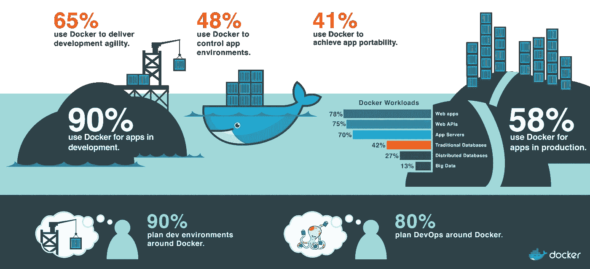
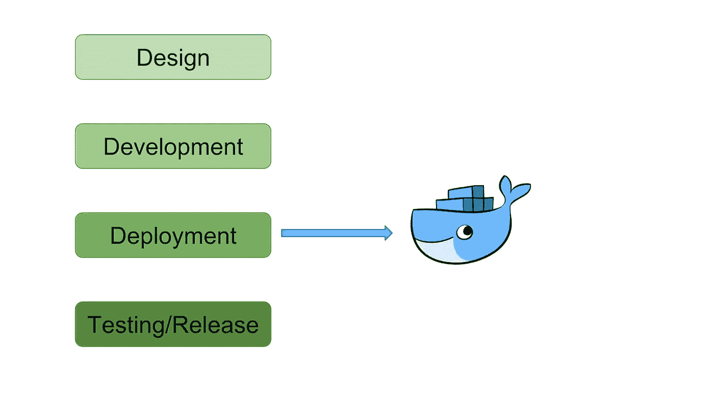
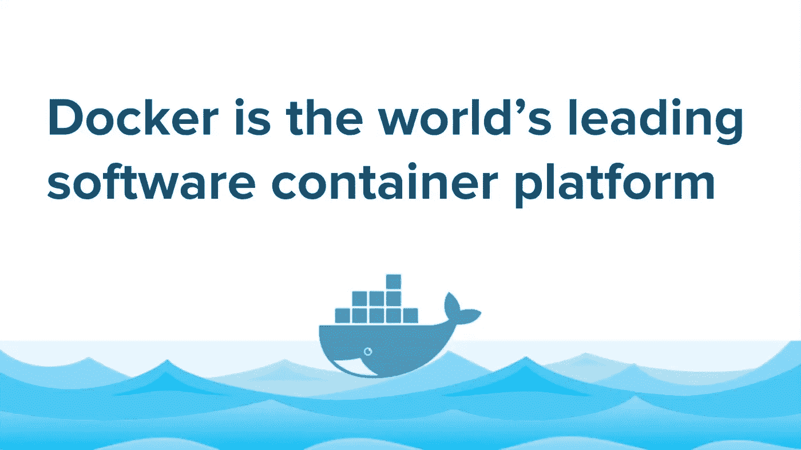
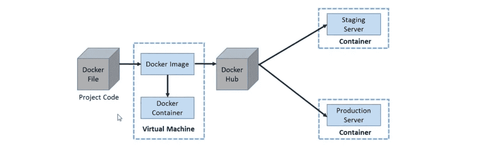
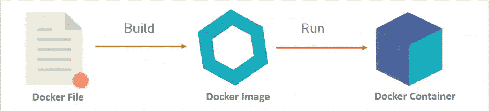
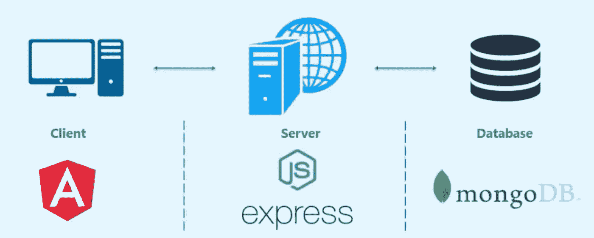
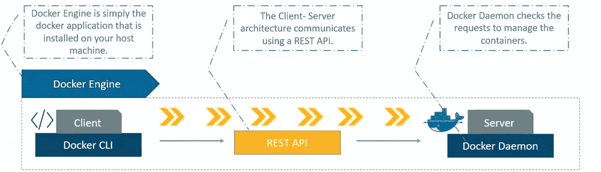

# 你为什么应该关心容器化？

> 原文：<https://betterprogramming.pub/why-should-you-care-about-containerizing-45383062d4df>

## Docker 入门，第一部分

第一个问题是:什么是 [Docker](https://www.docker.com/) ？

如果您是一名开发人员，您可能会面临软件在您的机器上工作，但不能在测试环境中工作的问题。Docker 在非常基础的层面上解决了这个问题。

# Docker 什么时候开始发挥作用？

Docker 在软件开发生命周期(SDLC)的部署阶段发挥作用。Docker 使应用程序部署过程变得非常简单，并解决了许多相关问题。

## **码头工人是做什么的？**

软件不仅仅是一段代码。它由前端组件、后端服务器、数据库以及信封、库和依赖项组成。我们必须确保所有组件都能正常工作，软件能在所有平台上运行:手机、平板电脑、电脑以及所有不同的操作系统。如果我们画一张所有组件和平台的图表，我们会看到每个组件都与每个平台相连——它看起来像一个神经网络！

一个简单的比喻可以用来理解这一点:想象你要搬家，你必须带着你所有的东西去一个不同的国家。你要搬的东西有不同的大小和形状，有不同的要求(易碎，“这一端”等等。).你必须考虑运输、包装、专家劳务、装运。但是如果你有一个容器，所有这些问题都消失了，你所要做的就是把你的东西妥善地包装在容器里。

Docker 是一个工具，旨在通过使用*容器*来简化应用程序的部署和运行。容器允许开发人员将应用程序与它需要的所有部分打包在一起，比如库和依赖项，然后作为一个包发送出去。Docker 将通过将它发送到目的地并在所有可能的平台上运行来处理其余部分。

开发人员需要考虑的是如何制作软件，他们可以打包软件，而不需要考虑软件运行平台的要求。

# 如何创建 Docker 容器

Docker 文件用于构建 Docker 映像，该映像还将包含所有项目代码。同一个 Docker 映像可用于旋转多个容器，每个容器都对底层映像进行修改。这个最终的图像可以上传到 Docker 的 hub，并与其他合作者共享，用于测试和部署。建立码头工人的形象是主要的挑战。Docker 容器只是 Docker 图像的一个实例。

## 定义

Docker 文件:一个文本文档，包含用户可以在命令行调用的所有命令，以组合一个图像。

Docker Image:只读模板，用于创建 Docker 用户构建的容器；存储在 Docker hub 或您的本地注册表中。

Docker 容器:独立的应用程序平台，包含运行从一个或多个映像构建的应用程序所需的一切。

# 什么是 Docker Compose？

通常，我们会使用一个容器来托管一个服务器。设想一个大型产品，它使用许多必须单独运行或在单独的虚拟机(VM)中运行的 web 服务器。在这种情况下，这么多不同的虚拟机运行会使计算机过热，减慢所有进程。相反，我们有一个名为 Docker Compose 的独立容器，其中包含一个 Docker Composer。如果我们在 Composer 中有两个 Docker 映像，它将在所有两个实例中运行，允许它们彼此交互并监视它们。

假设您正在使用 [MongoDB](https://www.mongodb.com/) 、 [Express](https://expressjs.com/) 、 [Angular](https://angular.io/) 和 [Node.js](https://nodejs.org/en/) 开发一个全栈应用程序。你必须使用三个 Docker 文件夹来存放三个容器。一个容器用于 MongoDB，即数据库，一个容器用于服务器，即 Express 和 Node.js 的组合，另一个容器用于 Angular(前端客户端)。

如果你不知道全栈应用是如何工作的，首先你有客户端，用户在其中工作。用户向应用程序发送请求，然后应用程序将请求发送给服务器。服务器，即后端，执行所有的功能。然后，服务器从数据库(本例中为 MongoDB)获取数据，并将其发送到前端给用户。容器中的所有 Docker 文件都由 Docker Compose 文件控制，Docker Compose 文件是用 [YAML](https://yaml.org/) 编写的。在 YAML 文件中，您必须指定容器所在的位置，以及 Composer 用来与其他容器交互的端口号。

简单地说，Docker Compose 用于运行多容器应用程序。每个容器将运行一个独立的应用程序，它可以与同一主机中的每个容器进行通信。

Docker 使用客户机-服务器架构。请参见下图了解详情。

