# 你为什么应该考虑转向微软新的 Edge 浏览器

> 原文：<https://betterprogramming.pub/why-should-you-consider-shifting-to-microsofts-new-edge-browser-c011af8e5c77>

## 微软的新浏览器比 Chrome 有优势吗？

马丁·比约克在 [Unsplash](https://unsplash.com/s/photos/browser?utm_source=unsplash&utm_medium=referral&utm_content=creditCopyText) 上的照片

你一直使用谷歌浏览器作为你的默认网络浏览器吗？嗯，我们很多人都在做同样的事情。为什么这么问？为什么不呢？Chrome 提供了一个易于使用的界面，许多定制功能，以及一个可供选择的扩展商店。

但是，如果我告诉你，有更好的东西可以做你一直在做或试图用 Chrome 做的事情的 80%,但不占用你的 CPU 和内存，你会怎么样？我向你介绍微软 Edge，或者我应该说，微软的*新* Edge。

# 旧边缘的问题

在过去的几年里，Edge 受到了用户和开发者的批评和抱怨。客户抱怨它太慢，网站加载时间太长，Gmail 出故障，等等。

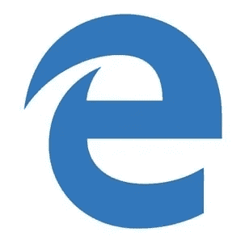

当微软第一次决定将其芯片放在 EdgeHTML 上时，该公司预计在两三年内将有 10 亿台设备运行 Windows 10，其中包括几亿台 Windows 手机。那个计划并不完全成功。

对于运行非 Windows 操作系统的其他桌面设备，Edge 从来不是一个选项，因此限制了它的功能。开发者抱怨说，出于同样的原因，他们无法在微软的浏览器上测试他们的网站。

常见的问题包括互联网中断、页面无法加载以及无法找到下载内容。这些问题大部分都有解决方案，但是市场上已经有更先进的浏览器在做这项工作了。所以 Edge 并没有被人们看好。

# 什么变了？

其实很多！

在本文中，我们将比较不同的浏览器，以了解 Edge 的真正潜力。我们比较的主要焦点是谷歌浏览器，因为它被认为是 2020 年的头号网络浏览器。

让我们先来谈谈微软 Edge 的优点，它可能会说服你做出改变。

# 安装兼容性

全新的 Microsoft Edge 可用于各种 Windows 客户端和服务器操作系统:iOS (11.0 及更高版本)、Android(KitKat 4.4 或更高版本，采用基于 ARM 的处理器)、Sierra (10.12)及更高版本的 macOS，对 Linux 的支持即将推出。

查看微软官方文档,了解哪些操作系统支持微软 Edge 版本 77 及更高版本。

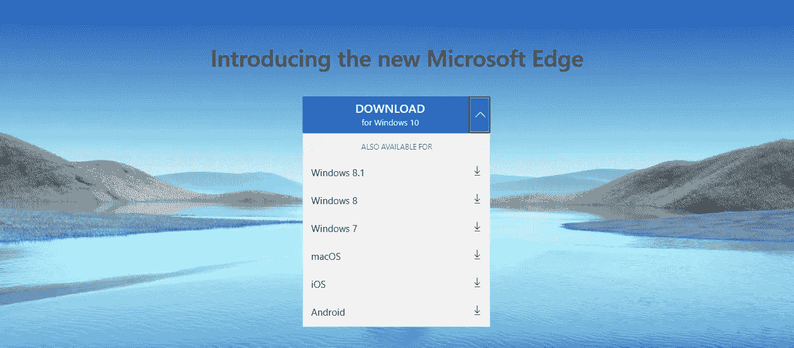

# 做出改变

如果你以前是 Edge 用户，甚至是 Chrome 用户，安装和切换到新浏览器是没有痛苦的。安装完成后，它会为您提供一个导入所有先前浏览设置的选项。如果您进行导入，您会发现您以前的所有书签、扩展、缓存、用户配置文件和其他设置都已转移到您的新 Edge。

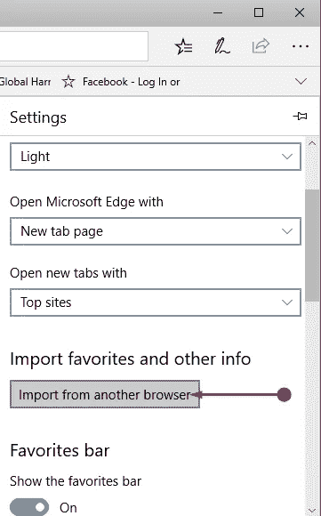

一旦完成，还有更多让你惊讶的事情。与旧的 Edge 不同，现在有多种方式来定制浏览器的外观。

# 用户界面

与 Chrome 不同，Edge 不会给你很多定制选项，但它已经足够让你开心了。

老 Edge 用的是微软自己的 EdgeHTML 和 Chakra 引擎。为了更好地适应客户的需求，Edge 在 2019 年被重建为基于 Chromium 的浏览器，使用 Blink 和 V8 引擎(谷歌 Chrome 基于相同的引擎)。

多亏了这个新的基于 Chromium 的引擎，Edge 变得和你期望的 Chrome 很相似(在 UI 和特性方面)。说到书签栏，Chrome 和 Edge 都只在新标签页上显示。Edge 为你提供了三个预定义的主题，并让用户能够使用他们自己的自定义主题。

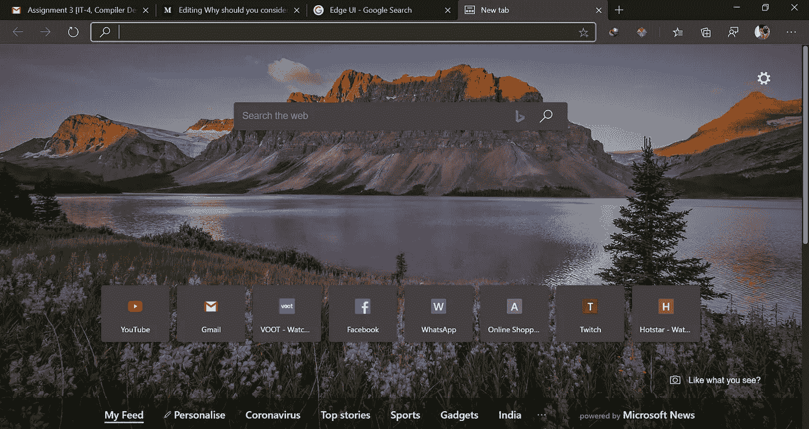

“聚焦”主题显示您最常访问的网站，“灵感”每天显示不同的图像，“信息”为您提供典型的 Microsoft 自定义新闻源。最后，通过“自定义”主题选项，您可以混合搭配所有三个功能，并创建自己的主题。

Chrome 只有一个主题选项，你选择另一个主题的唯一方法是安装第三方扩展。

虽然最初的微软 Edge 浏览器具有丙烯酸外观的效果，并在整个体验中突出显示，但新的 Chromium 版本的 Edge 消除了这一点。来自 Chrome，我感觉就像在家里一样。

# 安装扩展

给你的网络浏览器添加扩展一直是增加功能的一种方式，Chrome 用户可以从 Chrome 网络商店安装大量的扩展。因为 Chrome 和 Edge 都是建立在 Chrome 之上的，你已经在 Chrome 中使用的大部分扩展都有可能只需点击一下就可以切换到你的新 Edge。

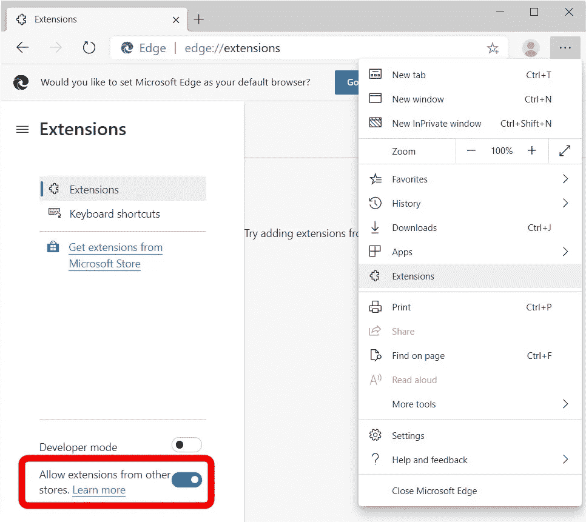

要使用此功能，您需要点击右上角的三个点，然后选择“扩展”然后将左下方的滑块“允许其他商店的分机”切换到“开”你之前从 Chrome 安装的所有扩展都将被导入到 Edge。

获得 Edge 扩展的官方方式是访问微软商店，但你不会在那里找到很多扩展，因为微软只挑选了其中的几个，这些扩展经过了大量的安全检查，以确保用户获得最好的服务。希望很快会有更多的扩展出现在微软商店。

# 表演

我们都同意，不管 Chrome 有多好，它臭名昭著的一点是它消耗的内存量。我自己也是 Chrome 用户，相信我，当我说同时打开 Android Studio 和谷歌 Chrome 是一场灾难时——你会有一种你的笔记本电脑随时可能着火的刺痛感！

谷歌 Chrome 曾经以轻巧快捷著称。但这几年一直停滞不前。如果你不小心的话，Safari 和 Firefox 也会反应迟钝。但是新的微软 Edge 是不同的——它是迄今最快的浏览器之一。没有明显的滞后。这是你应该转行的最大原因。

为了让你相信这一切，我们运行了几个测试，比如 HTML5 测试(针对纯 HTML 性能)，Base Mark Web 3.0 测试(针对 JavaScript 和图形密集型工作负载)，以及使用 Google Chrome、旧 Edge 和 Firefox 的 WebXPRT 3(针对广泛的任务样本)。结果相当惊人。

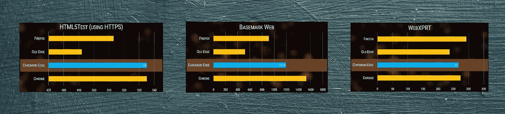

从纯粹基于性能的角度来看，新的 Edge 是旧的 Edge 的一大进步。Edge 似乎速度更快，使用的内存只有 Chrome 的 70-80%。如果你没有大量的内存，这将给你更快更流畅的浏览。Edge 也减轻了 CPU 的负担，减少了死机现象。

# 隐私

Microsoft Edge 通过跟踪预防来帮助保护您的隐私。Edge 为您提供三种不同级别的跟踪保护:基本、平衡和严格。

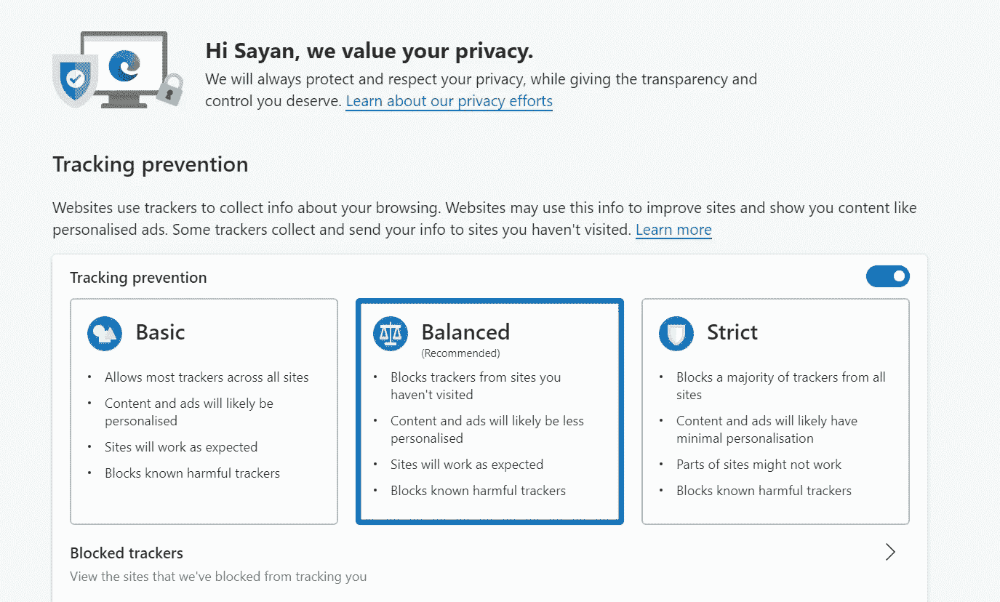

如果你对隐私不太挑剔的话，Balanced 是你的理想选择。Basic 将允许大多数追踪器，并阻止微软认为有害的追踪器。严格给你最大的隐私，阻止大多数的追踪器，但有些网站可能无法正常加载。

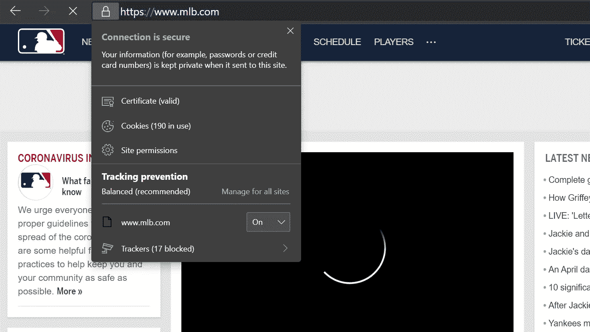

您可以在 Edge 上找到您访问的网站上哪些追踪器被阻止了。单击 URL 左侧的锁图标，然后单击菜单底部的追踪器查看列表。

Chrome 没有这个功能。

# 沉浸式阅读

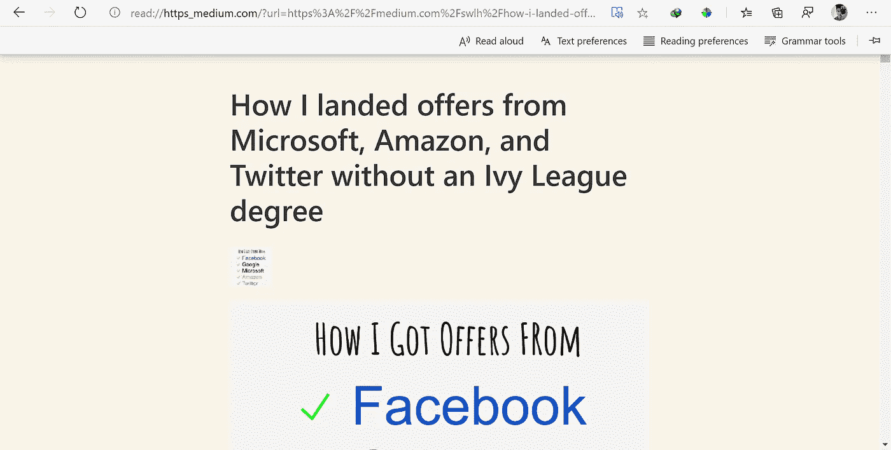

现在，广告可能很烦人。新 Edge 的一个很酷的功能是沉浸式阅读，它可以去除广告和其他杂物，让你的网页看起来更温暖。这个功能使文章更容易阅读。

要激活沉浸式阅读，点击地址栏右上角的沉浸式阅读器图标，瞧，你可以看到几个选项，可以调整字体大小、颜色、主题等等。

从其他浏览器中脱颖而出的一点是**朗读**功能，顾名思义，为你朗读页面内容。

# 收集

在新 Edge 的测试版中，收藏是一个非常受欢迎的功能。它允许用户从许多不同的来源收集信息，并把它们放在一个地方再次参考。

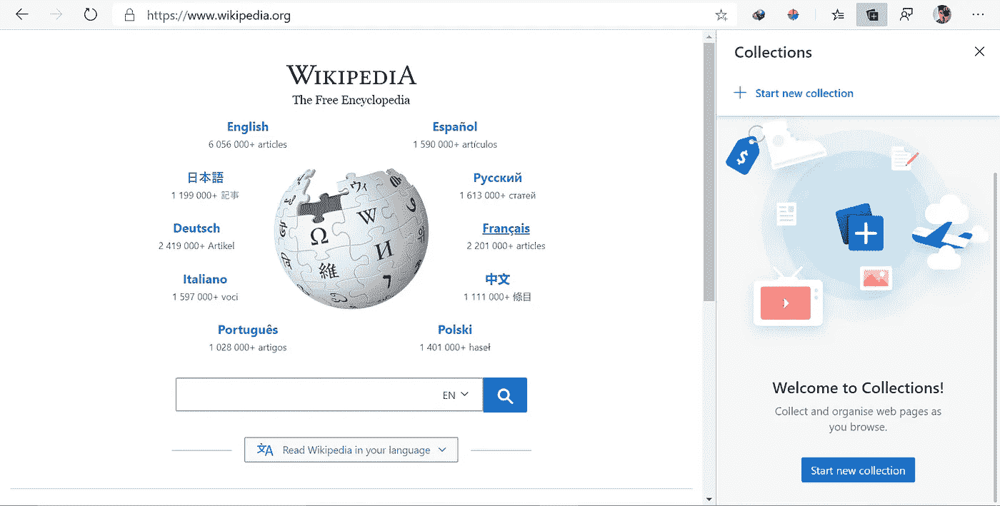

现在，如果您正在做一些研究，或者只是为了在以后的某个时间点参考而查找资料，这个特性可能会很方便。您不需要添加整个书签就可以返回到同一页面，现在您可以使用收藏来代替。

# 新的开源改进

由于新的 Edge 是基于开源渲染引擎 Chromium 构建的，因此开源社区做出了很多改进。

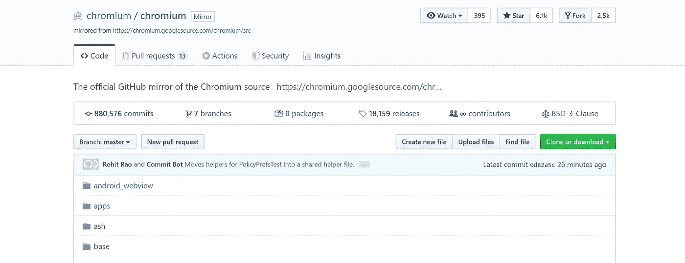

Edge 工程师不仅为他们自己的浏览器创建功能，还向 Chromium 开源项目提交建议。因为很多开发者都致力于让 Chromium 变得更好，不仅仅是 Edge，整个生态系统都从中受益。

总的来说，Edge 似乎已经有了很大的改进，并且比 Chrome 更有优势，运行时占用的资源也更少，并且节省了大量的内存和 CPU 资源。即使你过去发誓不再使用微软的浏览器，看看 Edge 也是值得的。