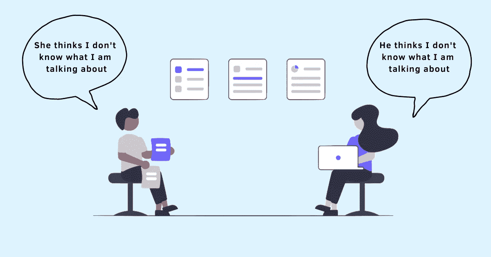

# 为什么聪明人会做傻事

> 原文：<https://betterprogramming.pub/why-smart-people-do-dumb-things-9bb506d9412d>

## 陷入多元无知的恶性循环，我们继续支持我们认为不好的行为

鸣谢:作者

我参加了为期 3 个月的严格的新兵训练营，旨在将我们从舒适的大学生活中摇向现实的公司世界。在新兵训练营，我们被分成不同的小组，每个小组都有指定的导师和伙伴。由于期望努力工作，长时间工作，大多数日子都过得不错。只是，有时候我不知道到底发生了什么。

来自组织不同部门的人会上来展示他们的产品和想法。我们的导师也详细讲述了一系列不同的事情。虽然其中一小部分有意义，但大部分没有意义。

我没有举手，没有提问，也没有澄清我不明白的事情，我觉得保持安静，隐藏自己的感情，只是简单地配合，是安全的。

我决定掩盖自己的无知，这是由我想融入社会的强烈愿望驱使的。似乎每个人都点头表示同意，而我是唯一一个对正在发生的事情一无所知的人。我越困惑，我周围的其他人似乎越放心。

> 当我们理解和消化信息时，它不一定是现实的真实反映。相反，它是我们对现实的表现，这是我们做决定的依据。本质上，我们受限于自然赋予我们的工具，我们做出决定的自然方式受限于这些工具的质量和准确性——丹·艾瑞里，可预测的非理性

我当时并不知道，但我现在知道我展示了一种行为，叫做共享错觉，或者心理学家称之为多元无知。

这个术语是由心理学家弗洛伊德·亨利·奥尔波特和他的学生丹尼尔·卡茨和理查德·尚克在 20 世纪 30 年代创造的。多元无知是一种心理状态，在这种状态下，我们认为自己的私人思想、感情、信仰、态度和判断与他人不同，但当我们是一个群体的一部分时，我们似乎都以同样的方式行事。

在上面的例子中，我害怕自己看起来很傻，所以不敢说出来。但是当我周围的其他人也不说话时，我认为他们明白了一切。换句话说，我对导致我行为的原因的假设与我对其他人同样行为的解释有很大不同。

# 是什么导致了多元无知

我们的感受和决定我们行为的社会文化规范之间往往存在差异。正是这种冲突导致了多元化的无知。

考虑这个例子。想象你得到了一次晋升，一个新项目，或者一个艰难的挑战。很可能你会感到不确定，自我怀疑，担心结果。然而，你被期望隐藏你的不适，从不分享你的恐惧，并表现出自信。

在另一个例子中，你工作中的[潜规则文化](https://www.techtello.com/organization-culture-problems/)可能会对组织中某个高层分配的工作表现出“不问问题”的态度。当你不同意他们要求你做的事情时，你该怎么办？你可能会强烈地感觉到这不是最好的策略、方法，甚至不是你作为一个团队应该追求的东西，但是你可能不会说出来，因为这需要违背你的组织所规定的文化规范。

正是这些期望加上这样一种信念，即其他人的行为方式只是因为他们真正相信这一点，才让你也在作秀。

这就像安徒生的故事*皇帝的新衣*。每个人都可以看到国王没有穿任何衣服，但相信其他人可以看到他们。他们所看到的和其他人所看到的不一样的假设告诉他们要保持安静，因为大声说话需要拿他们的智慧冒险。只有当一个孩子指出皇帝实际上没有穿任何衣服时，故事中的多元无知才暴露出来。

我们不遵从我们周围存在的文化和行为期望，而是遵从我们认为存在的版本。陷入多元无知的恶性循环，我们继续支持我们认为不好的行为。

称之为同辈压力，害怕被拒绝，我们渴望融入，或者仅仅是害怕出类拔萃，我们想的是一件事，做的是另一件事，因为我们被别人的真实观点所迷惑，并感到被迫坚持这种错觉。

# 多元无知如何影响工作

> 如今，如果任何事情有争议，我们都不会谈论它。我们把它藏在地毯下。以防万一这会让我们不舒服。所以我们避免谈论事情。这可不好。停止谈论事情是停止思考事情的第一步——戴夫·特罗特，一加一等于三

在群体环境中，我们大多数人从周围的人那里寻找线索来决定如何行动。如果每个人都在从事某种行为，比如赞同公司的战略建议，尽管这毫无意义，你可能也会感到有压力。

如果你相信你的队友对你的经理的有毒行为感到舒服，即使你暗地里鄙视它，你可能会继续容忍它，即使它让你痛苦。

你可能没有意识到工作负担过重，或者忽略了高水平的[工作压力](https://www.techtello.com/workplace-stress/)，并假设团队中的其他人都做得很好。

多元化的无知也会放大你作为一个骗子的感觉。你可能认为你周围的其他人很聪明，有才华，他们应该得到他们所拥有的，但你不这样认为。如果你是唯一一个自我怀疑的人，而你周围的人都显得很自信，那么你一定是个骗子。

[研究](https://www.emerald.com/insight/content/doi/10.1108/00251740310495081/full/html#)显示，多元化的无知会影响决策、商业道德、团队动力、绩效评估，甚至可能导致工作倦怠。

# 你能做些什么来避免陷入多元无知？

完全摆脱多元无知是不可能的。你能做的最好的事情就是承认它的存在，并质疑你的假设:

1.  是什么让我相信只有我一个人有这种感觉？
2.  我如何证明我的经历不是独一无二的，而是一种共享的经历？
3.  为什么我这么在乎别人的感受，他们知道什么，或者他们想要什么？
4.  如果我说了我需要说的话或者做了我需要做的事，即使其他人都不同意，最坏的结果会是什么？
5.  采取行动还是不采取行动，哪个更重要？

通过质疑你的假设，并把你的想法引向正确的方向，你可以减少多元化无知的影响，并建立必要的信心[表达你的观点](https://www.techtello.com/how-to-get-your-ideas-heard/)，挑战先入为主的观念，并克服你自己的自我认知的局限性。

不要在意别人怎么想，开始关心你想要什么。

## 摘要

1.  的确，我们的思想、感觉和情感只有我们自己看得见。但是，在类似的情况下，我们会对他人的行为做出不必要的结论，这也是事实。
2.  社会和文化规范加上我们的假设，即他人的行为反映了他们的真实感受，使我们坚持群体行为，即使我们可能不相信它，不喜欢它，甚至认为它是适当的。
3.  融入的欲望劫持了我们的个人信仰体系，让我们说和做与我们的原则和价值观相冲突的事情。心理学家称这种共有的错觉为多元无知。
4.  多元化的无知使我们无法提问，表达我们的不同意见，并使我们坚持工作中有问题的行为和做法。
5.  避免其影响的唯一方法是少依赖我们错误的判断，学会挑战我们自己的信念和假设。

关注我的推特了解更多故事。

*这个故事最初发表于*[*【https://www.techtello.com】*](https://www.techtello.com/pluralistic-ignorance/)*。*