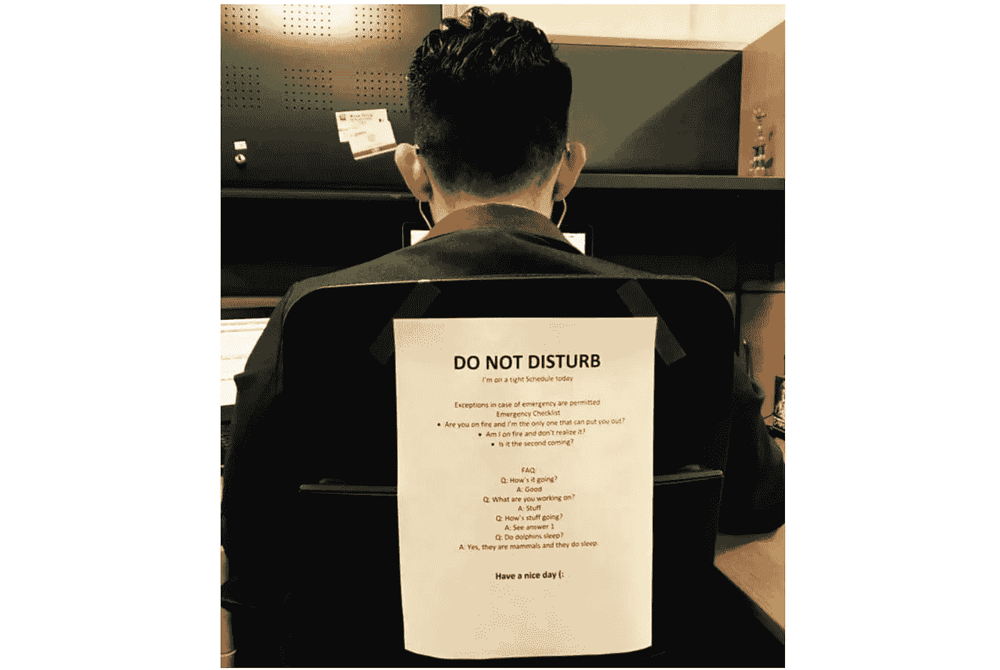

# 软件开发人员不应该在办公室工作

> 原文：<https://betterprogramming.pub/why-software-developers-werent-meant-to-work-in-offices-2177421d5fce>

## 以及为什么我计划永远远程工作

拉杰·拉纳在 [Unsplash](https://unsplash.com?utm_source=medium&utm_medium=referral) 上的照片

即使在疫情之前，我也会找到在家工作的理由。

差事，生病的宠物，水管工来了…他们不是编造的。但是当你想找借口的时候，你总能找到一个。

疫情允许我每天在家工作。

*软件开发人员真正享有远程工作的特权。不是每个人都这么幸运。*

后疫情时代，我不会回去了。即使这意味着换公司。

原因如下。

# 当没有人监督我们时，我们会更有效率

没有什么比写代码时被人监视更糟糕的了。不管结对编程时是另一个开发人员，还是 CEO 要求更新。

专注于完成困难任务而不用担心看起来很忙的能力会大幅提高生产力。

软件开发是脑力劳动，有时最有效的行动是呼吸新鲜空气。当你被困在一个复杂的问题上时，在公园里即兴散步可以给你的大脑空间去解决它。

在办公室，这并不总是可能的。期待你的经理问你去了哪里，为什么要去。

在家里，你可以在需要的时候休息一下，并在一天中你最有效率的时候优先处理任务。

在许多大公司，长时间工作并看起来有压力是有回报的。远程工作消除了这种行为的动机。

具有讽刺意味的是，这符合员工和公司的最佳利益。

# 通勤扼杀了我建造东西的灵感

在车流中或拥挤的火车上坐一个小时会让人扫兴。它消耗了你本可以投入到实际工作中的创造性能量。

谢天谢地，我们大多数人已经一年多没有通勤了。

## **老办公室套路**

早上 7 点起床。淋浴。在星巴克喝杯普通咖啡。乘坐拥挤的火车上下班。如果没有延误，就要准时上班。坐在我的椅子上，试着建立工作的动力。

## **当前在家工作的例行程序**

睡到早上 8 点。淋浴。煮一杯法式压榨咖啡。拉伸。冥想。上午 9 点在我办公桌前坐下，整装待发！

我哪天都会选择后者。

除非你喜欢播客或者喜欢看电视，否则每天花 2 个小时在火车上是浪费时间。

如果你没有睡好，跳过早上的通勤会让你在床上多呆一个小时。这会对你的情绪产生重大影响。

跳过晚上的通勤意味着有时间做业余爱好和做饭，而不是匆忙按时上床睡觉。

# 与办公室同事相比，宠物可能是一种进步

免责声明:我是在开玩笑，但我更喜欢我的社交生活和工作生活完全分开。

我并不反对我的同事。我只想和我的狗在一起。

不需要尴尬的闲聊天气。

照片由[安娜·施韦茨](https://www.pexels.com/@shvetsa?utm_content=attributionCopyText&utm_medium=referral&utm_source=pexels)从[派克斯](https://www.pexels.com/photo/portrait-of-shiba-inu-dog-4588013/?utm_content=attributionCopyText&utm_medium=referral&utm_source=pexels)拍摄

能够休息一下，和小狗一起玩耍是最好的减压方式。甚至有证据表明，和宠物呆在一起会降低皮质醇水平。

公司和联合办公空间都试图为员工创造减压的空间。我们有:

*   带豆袋椅的休息室
*   视频游戏控制台
*   备有小吃的厨房…

虽然年轻时的我会欣然接受这些额外待遇，但现在的我更愿意完成工作回家。

我会把啤酒和与同事一起玩 Xbox 留给 20 多岁的年轻人……无意冒犯年轻的科技工作者。

保持低压力和解决问题是我的工作。这在家里更容易做到。

# 告别合作空间

共同工作空间是 21 世纪最糟糕的发明。

来源: [Reddit](https://www.reddit.com/r/ProgrammerHumor/comments/b1vjiz/do_not_disturb/)

我曾在办公室、隔间和共享办公桌上工作过，我可以告诉你，共享办公桌是任何地方程序员的克星。

理论上，开放空间促进协作，但实际上，它们阻碍了专注的工作。人们很容易拍着你的肩膀开始谈话，不管是工作还是社交性质的。

出于这个原因，共同工作空间经常充满有趣的对话，你现在必须主动忽略。

我是那种既容易分心又深受上下文切换之苦的人。因此，如果我正在开发一个复杂的功能，一些大的干扰会打乱我一整天的工作。

不用说，我不喜欢共同工作空间。很好的解脱。

# 少开会。更少分心

试图充分利用远程工作的公司与被迫允许远程工作的公司之间存在巨大差异。

如果你的公司“得到”远程工作，你就成功了。

与直觉相反，远程工作时，我的会议更少了，分散注意力的懈怠信息也更少了。

当人们被迫每天在办公室工作 8 小时以上时，他们只是做些事情来打发时间，而不是尽可能高效地完成工作。

远程工作不存在这个问题。有快速完成工作的动机。你越早完成工作，你就能越早下班。

这对员工和公司都是双赢的。

# 额外收获:饮食更健康

真正的家常菜被低估了。

与此同时，美食街的汉堡保证会让你在下午陷入食物昏迷。

虽然不是每个人都会做饭，但是如果你会，在家工作是一种福气。

有一个可用的厨房，每天早上和晚上都有额外的一个小时(又名。没有通勤)让你有时间为自己和家人做饭，并养成其他健康的习惯。

真正的食物、高质量的睡眠和锻炼会比你在推特上读到的任何生活帮更能提高你的生产力。

我个人一直在周末制作和冷冻健康餐，我很快在烤箱中加热，并在工作日的午餐中与米饭一起食用。

更棒的是，我这样做还省钱。每天在外面吃饭很贵。

如果你在一年的停工期间没有学会烹饪，你就浪费了一个绝好的机会。

# 最后的想法

不应该用疫情来使在家工作正常化。

这告诉你办公室文化有多根深蒂固，经理们有多希望看到他们的员工工作。

虽然远程工作并不适合每一个人，但对于有经验的开发人员来说，它可以产生巨大的影响，因为他们的产出与专注状态的时间直接相关。这对员工和公司都有好处。

你的雇主会把你推回办公室吗？

你在家工作的优势可能比你意识到的要大。

这是一个卖方市场，公司都在争夺技术人才，从来没有像现在这样的公司。