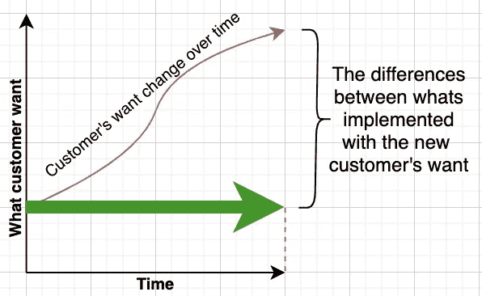

# 为什么软件应该足够好而不是完美？

> 原文：<https://betterprogramming.pub/why-software-should-be-good-enough-and-not-perfect-b741b07865d7>

## 完美是软件开发的敌人

卡罗琳·范·欧仁在 [Unsplash](https://unsplash.com?utm_source=medium&utm_medium=referral) 上的照片

学习钢琴时，我们被要求精益求精。每一个音符，每一个触感，都要像原创作曲家一样优雅。在学校，如果我们取得了 90%的分数，有时我们会被问，为什么我们没有取得最后 10%的分数。

进入软件开发，有时，我们带着这样的心态。然而，当我踏上软件开发之旅时，我意识到追求完美对我们弊大于利。

原因如下。

# 1.没有完美的编码方式

> “代码从来都不是‘完美的’代码永远只是“足够好””—马修·琼斯

在编程中，我们有数不清的方法来达到我们的目的。项目范围越大，我们能实现的架构模式就越多，更不用说我们编码的方式了。

每种方法都有其优点和缺点，并且根据情况的不同而有所不同。我见过无数的争论，争论为什么另一种方法不是理想的等等，人们可以给出无数的“如果…会怎样”的场景，但这些场景从来没有发生过。它消耗时间和精力。

为什么不满足于任何对当前范围有效的东西，然后继续前进。它可能有一些缺陷和局限性。我们可以在下一次迭代中改进它们，或者它可能会在未来发生变化，这就引出了下一点。

# 2.需求经常变化

> “人们不知道他们想要什么，直到你给他们看。”—史蒂夫·乔布斯

我们可能已经有了想要构建的软件的完整路线图。当我们向用户交付第一次迭代时，我们可以在脑海中计划和构建最终产品。

不幸的是，通常在交付第一次迭代之后，产品负责人会回来告诉我们市场已经改变了，我们需要将我们的计划转向新的需求。

图片来自作者在[对敏捷开发的另一种看法](https://levelup.gitconnected.com/another-view-of-agile-software-development-263590cd16b8)。

假设，如果我们已经为最终目标构建了坚实的架构，假设需求不会改变，我们通常会失望。我们构建的东西可能需要在下一次迭代中改变。

吸取经验教训，在当前迭代中做得足够好，并为变化做好准备。对于软件来说，最好的架构师就是它能够被轻松地重新架构。

# 3.没有完美的软件

> “如果调试是去除软件 bug 的过程，那么编程一定是把 bug 放进去的过程。”
> ――埃德格·w·迪克斯特拉

有一种说法是“有两种方法可以写出没有错误的程序；只有第三部作品。”([来源](https://www.brainyquote.com/quotes/alan_perlis_177353))。

虽然拥有一个高质量的产品是重要的，并且拥有可靠的测试覆盖对于确保可持续的软件开发是至关重要的，但是没有人能够保证一个没有错误的软件版本。

即使我们有一个 QA 过程，也没有办法进行测试，直到不再有 bug。因此，知道什么时候我们的软件发布有足够好的测试是很重要的。

除了有一个最佳测试的方法，让我们也有一个[反应质量保证](https://towardsdatascience.com/14-ways-to-improve-software-quality-other-than-testing-a62d14936575)的计划。

# 4.技术在不断发展

> 硬件设计经久耐用；
> 软件被设计来改变；变化是唯一持久的东西。

从事 Android 开发大约 8 年了，我想说我们做 Android 开发的方式每两年就要改变一次。更新的语言、架构模式、框架、工具不断涌现。

在软件开发中，几乎没有办法构建能够超越其提供的技术的软件。即使这项技术真的有能力，我们可能还没有完全掌握它。

因此，不要强迫自己去生产我们认为理想的产品，让我们利用目前可能的情况，首先以足够好的状态运送产品。

随着我们进入下一个迭代，我们随着技术趋势学习、改进和发展。

# 5.我们不能让每个人都快乐

> “我不能告诉你成功的关键，但失败的关键是试图取悦每个人。”——艾德·希兰

“我们应该构建这个功能还是那个功能？也许我们应该两者兼而有之，但那样会增加开发时间并使测试复杂化。”

“我们应该使用 Java 还是 Kotlin？我们有很多已经熟悉 Java 的开发人员，但 Kotlin 是下一个吸引人才的流行编程语言。”

“哦，我们有窃听器！但是我们还有一个功能要提供！我应该先做哪个？”

你收到消息了。追求更好的，或者寻找足够好的折衷。你不能两者兼得。

# 6.还有其他优先事项

> “史蒂夫(乔布斯)从来不编码”——史蒂夫·沃兹尼亚克

有时，我们作为开发人员认为业务围绕着编码。事实上，这两者是交织在一起的。

构建和发布可伸缩和可维护的高质量代码非常重要。但是做适合当前情况的事情是务实的。

例如，一个组织有一个仍然为业务服务的遗留代码库。一种方法是废弃整个软件，使用最新的技术堆栈从头开始重新编写。从技术角度来看，这是最好的，没有遗留代码需要保留。

然而，从组织的角度来看，它可能会危及业务，因为它要求快速改变现有的产品。

因此，考虑到因素，我们有什么，可以做什么，我们将不得不满足于足够好，使其通过，同时维持业务。

# 7.完美之前的上市时间

> “尽早发布，经常发布，倾听客户的意见”——埃里克·s·雷蒙德

以上是今天一个重要的软件开发实践。我会在上面再加一条“尽早发布，经常发布，小规模发布”。

有一个不完整的特性是可以的，只要它们足够好用。小的变更发布也降低了引入新的错误或问题的可能性，同时我们也获得了用户对变更的增量反馈。

因为我们无论如何都要做出改变，而且改变得很快，所以让我们让它在每个发布迭代中都足够好，并逐步改进它。

 [## 软件越早发布越好

### 频繁发布软件如何让每个人受益

better 编程. pub](/software-release-early-release-often-is-really-good-b4acb017e79) 

# 生活是完全不完美的

事实上，不仅完美在软件开发中是不理想的，在现实生活的许多方面也是不实际的。

因此，与其努力实现完美的软件开发，不如让我们以实用的软件开发为目标。

以下引用自《务实的程序员:从熟练工到大师》一书。

> “你不可能写出完美的软件。疼吗？不应该。接受它作为生活的公理。拥抱它。庆祝一下。因为完美的软件不存在。在计算机的短暂历史中，没有人写过一个完美的软件。你不太可能是第一个。除非你接受这个事实，否则你会浪费时间和精力去追逐一个不可能实现的梦想。”
> ― **安德鲁·亨特**