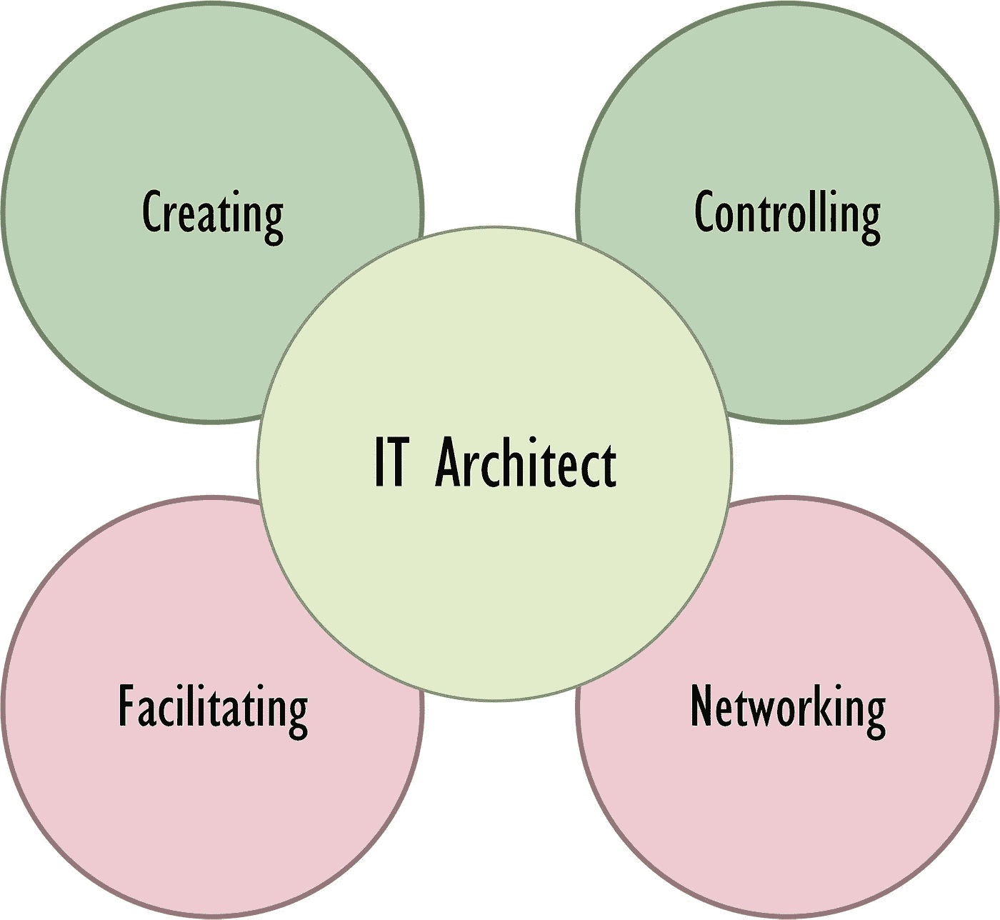

# 为什么一些软件架构师在工作中不开心

> 原文：<https://betterprogramming.pub/why-some-software-architects-are-unhappy-at-work-42a4188cbd30>

## 在转换角色之前，确保你了解后果

照片由 [Pexels](https://www.pexels.com/photo/man-in-suit-jacket-standing-beside-projector-screen-2173508/?utm_content=attributionCopyText&utm_medium=referral&utm_source=pexels) 的 [mentatdgt](https://www.pexels.com/@mentatdgt-330508?utm_content=attributionCopyText&utm_medium=referral&utm_source=pexels) 拍摄。

如果你问 IT 工程师或软件开发人员他们的职业道路，他们可能会告诉你他们想成为 IT 架构师。他们认为这是明显的下一步。

# 约翰

我想让你见见约翰。约翰是一名软件开发人员。他从事代码、基础设施和客户支持工作。他的日常工作包括监控电子邮件、调试代码、部署应用程序、准备演示文稿和编写文档。约翰什么都做。

约翰通过培训和认证来保持知识的更新。每个新项目开始时都会咨询约翰。他已经成为开发部门的基石。

John 的梦想是成为一名解决方案架构师。

但是在他的新职位上呆了几个月后，他感觉与项目团队成员脱节了。通常，他总是会依靠自己深厚的技术知识。

目前，他主要忙于创建高级项目计划。约翰怀念利用他深厚的技术知识。他不喜欢他的新角色。

# 同盟国

现在见见艾丽。Ally 是项目经理。她开始管理小项目，但她很快就负责更大的项目。Ally 让管理项目变得简单。

当一个 IT 经理的职位空缺时，Ally 决定申请。这是她职业生涯中的重要一步。

艾丽得到了这份工作，但几年后，她感到筋疲力尽。

处理几个项目很有压力，但还是可以管理的。管理 IT 部门是一个不同的学科。艾丽不喜欢她的新角色。

# **他们为什么不开心？**

架构师、工程师或项目经理的主要特征是他们是谁，而不是他们知道什么。

你可以增长知识，积累经验，但你不能改变你的自然行为。这种行为来自你的基因。这些基因以特定的角色定义了你快乐的很大一部分。

如果你观察幼儿园的孩子，你已经可以识别出天生的领导者。你还会发现孩子非常注重细节。

如果你在聚会上遇到他们，并询问他们的工作，你会发现他们中的大多数人从事的职业与他们的自然行为相符。

天生的建筑师处理事情的方式与工程师不同。项目经理和 IT 部门经理也是如此。

我们来做一个小的思维实验。

您的经理选择您作为新项目的新 IT 架构师。你带着充沛的精力和热情开始了你的新角色。您可以在两个不同的项目之间进行选择:

1.  第一个项目没有明确的目标、项目计划或需求。基本上你得到的是一张空白的画布。
2.  第二个项目有一个明确的目标、一个明确的项目计划和一组初始需求。

你选择哪个项目？

如果你热爱组织，你会选择第一类项目。您可以开始组织研讨会来定义项目。

如果你更多的是一个创造者，你会选择第二个项目。在这个项目中，你已经可以开始绘制第一份建筑蓝图了。

如果我们看一下 IT 架构师的四项活动，我们可以看到其中两项是关于创造的，其他的需要管理和组织。

# IT 架构师的活动

我们可以将 IT 架构师的活动分为创建、控制、促进和联网。

IT 架构师的四种活动。图片由作者提供。

创造和控制活动与热爱创造的人是一致的。促进和建立关系网是更适合喜欢组织的人的活动。

让我们看看这些活动对 IT 架构师意味着什么。

## 创造

在 [Unsplash](https://unsplash.com/search/photos/pottery?utm_source=unsplash&utm_medium=referral&utm_content=creditCopyText) 上由 [Quino Al](https://unsplash.com/photos/zjL2nfIoq3U?utm_source=unsplash&utm_medium=referral&utm_content=creditCopyText) 拍摄的照片。

对大多数建筑师来说，创造是第二天性。你有多年为客户创造解决方案的经验。您创建与公司的业务目标和战略目标一致的架构愿景。

作为 IT 架构师，您必须勾画出可能的解决方案，并帮助开发团队确定潜在的解决方案。你必须不断地寻找创新的方法，并且总是在寻找减少开发时间和提高质量的技术。

在创建活动中，您需要具备以下特征:

*   分析型。
*   认识并能够使用模式。
*   构建愿景。
*   放下固定的思维定势。
*   相信过程。
*   接受新的见解。
*   有魄力。

## 控制

在 [Unsplash](https://unsplash.com/search/photos/steering?utm_source=unsplash&utm_medium=referral&utm_content=creditCopyText) 上 [Robert Bye](https://unsplash.com/photos/W2BgJm4Qd_4?utm_source=unsplash&utm_medium=referral&utm_content=creditCopyText) 拍照。

控制就是确保设想的解决方案成为现实。在开发过程中，您必须确保实现与架构保持一致。

这比听起来更难。即使你设计了一个伟大的架构，为组织提供了很多价值，你仍然必须推销你的愿景，而不是强加给项目团队。

这并不意味着一遍又一遍地重复你的愿景。相反，试着和团队一起创造解决方案。这有助于为你的想法和设计创造一个共同的基础。

在控制活动中，你需要以下特征:

*   对内容的热情
*   真正的
*   表达的
*   明确的
*   病人
*   透明的
*   公司

## 建立工作关系网

杰西卡·瑟森格拉斯在 [Unsplash](https://unsplash.com/search/photos/meeting?utm_source=unsplash&utm_medium=referral&utm_content=creditCopyText) 上拍摄的照片。

网络是 IT 架构师的一项基本活动。能够建立关系并找到合适的人选至关重要。你需要知道在哪里寻找人才，以及如何建立一个团队。你应该知道面试中应该包括哪个同事，以及哪个团队成员最适合某个特定的角色。

这还包括知道在哪里可以找到技术资源，如开发工具或现有的商业现成解决方案。

在社交活动中，你需要具备以下特质:

*   企业家的
*   显著的
*   自信的
*   透明的
*   公司

## 促进

由[万花筒](https://unsplash.com/photos/3V8xo5Gbusk?utm_source=unsplash&utm_medium=referral&utm_content=creditCopyText)在 [Unsplash](https://unsplash.com/search/photos/woman-whiteboard?utm_source=unsplash&utm_medium=referral&utm_content=creditCopyText) 上拍摄。

IT 架构师应该能够充当推动者的角色。例如，举行工作面试以评估新成员的素质或指导团队成员。

如果你在深入的技术研讨会和董事会层面的演示中同样得心应手，那就最好了。

他们应该为不同的目的组织和促进研讨会，例如收集需求，定义质量指南，或者工具选择。

主持人的规则之一是，你不能与研讨会的结果有利害关系。作为 IT 架构师，这可能很困难，因为您可能对某个结果有偏好。确保你在研讨会期间保持客观。

在引导活动中，你需要具备以下特征:

*   移情作用的
*   敏感的
*   开玩笑的
*   直觉的
*   建立他人信心的诀窍
*   处理不确定性的能力

# 结论

我见过许多人申请了一份他们认为是职业生涯中的下一步的工作，但几年后因为不开心而放弃了。

如果成为一名 IT 架构师是你职业生涯的下一步，请确保你了解其后果。IT 架构师的角色包含的活动不仅仅是创建和控制。人际网络和促进也是这个职位的一个重要部分。

你可以增长知识，积累经验，但你不能改变你的自然行为。现在，这并不意味着从事不符合你自然行为的活动是不可能的。

但是你要确保你不会因为这些活动而失去快乐。

感谢阅读。我希望这篇文章能让您对 IT 架构师的工作有更多的了解。如果你有任何问题，请随时回复。