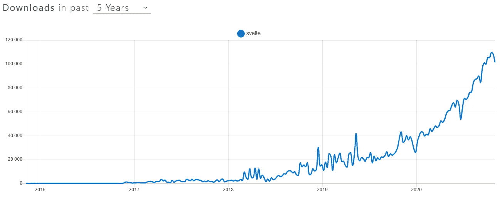
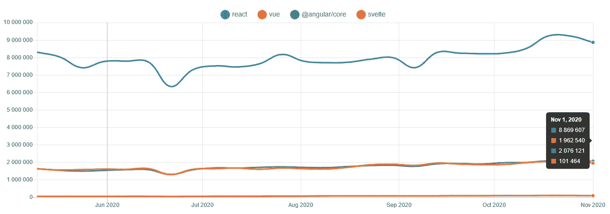
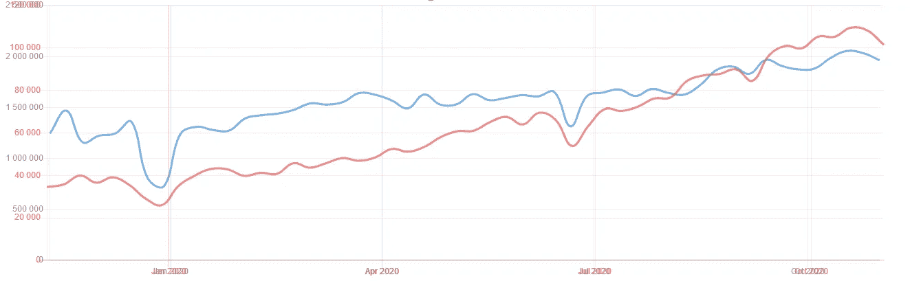

# 为什么苗条还没有准备好黄金时间

> 原文：<https://betterprogramming.pub/why-svelte-is-not-ready-for-prime-time-just-yet-and-why-itll-be-awesome-once-it-is-d3eb1a8de1ba>

## (以及为什么一旦有了就会牛逼)



在过去的 5 年里，每周的下载量。来源: [NPM 趋势](https://www.npmtrends.com/svelte)

在过去的几周里，我一直在用 Svelte 做个人项目，我对此很满意，尽管在这个过程中遇到了一些障碍。这篇文章旨在探索我遇到的问题，以及苗条的好处——所有这些都是基于几周的经验。如果你是一个苗条的新人，或者试图更好地了解当前的 JavaScript 前端框架，这篇文章可能会对你有所帮助。

# 什么是苗条？

如果你正在阅读这篇文章，你可能已经听说过[svelet](https://svelte.dev/)了，所以简单回顾一下:svelet 是一种语言，也是一种用于创建现代网络应用的编译器。把它当成新的 React/Vue。它仍然使用 HTML、CSS 和 JS 来创建应用程序，但工具内部的工作方式有了根本的不同。


还没听说过 Svelte？观看作者 Rich Harris 的精彩演讲，他展示了 Svelte 的工作原理以及它与其他框架的不同之处。

# 不好的东西

现在让我们谈谈我的经历，从不好的事情开始。

## 类型脚本源映射

TypeScript 支持是在夏天出现的，所以不是很久以前，它显示了。我不能把这说得很微妙，所以…如果你使用 TypeScript 的话，源地图完全是糟糕的(如果你是认真写一个应用程序的话，你应该这样)。行号不匹配，大部分行根本不能放断点。

已经有一个开放的 [pull 请求](https://github.com/sveltejs/svelte/pull/5584)来获得与 JavaScript 相同的源地图，但是在合并之前，您只能使用`console.log`和`debugger`语句来调试代码。

## 使用 TypeScript 时没有 ESlint

这是另一个令人失望的地方:如果使用 TypeScript，就不能使用 ESlint，因为 ESlint Svelte 插件还不支持预处理程序(TS)。

同样，已经有一个[拉请求](https://github.com/sveltejs/eslint-plugin-svelte3/pull/62)来添加支持。所以在那之前要小心那些`[target=”_blank”](https://web.dev/external-anchors-use-rel-noopener/)`。

## 社区规模

作为最年轻的框架，它的采用率比旧的框架要低得多。它正在增长，尤其是在 2020 年，但在绝对数量上没有 Vue 那么快，所以它似乎还没有获得动力。



React、Vue、Angular 和 Svelte 在过去 6 个月的每周下载量。来源: [NPM 趋势](https://www.npmtrends.com/react-vs-vue-vs-@angular/core-vs-svelte)


在过去的 5 年里，每周的下载量。来源: [NPM 趋势](https://www.npmtrends.com/svelte)

这当然意味着:

*   与其他框架相比，专为 Svelte 设计的组件要少得多。
*   PRs 在合并之前需要相当长的时间(部分原因也是因为核心团队很小)。
*   您可能不会得到对堆栈溢出问题的快速响应。(请注意，在 Discord 上有一个[的瘦频道，你可以从一群非常好的人那里得到帮助！)](https://discord.com/channels/457912077277855764/506988048375087114)
*   最重要的是，人们不能确定苗条身材是否能长期生存。

**旁注**:在我看来，React 的大肆宣传事实上已经成为前端的新 Java。(它发展得非常快，因为它没有竞争对手，所以现在我们几乎别无选择，只能坚持下去)。Vue 的增长非常缓慢，而且不会很快赶上 React。斯维特现在只是个侏儒。



过去一年的周下载量，Svelte(红色)vs Vue(蓝色)。请注意，这些数字是在一个完全不同的尺度上，有许多因素可以影响它们。尽管如此，我们可以看到曲线对苗条(红色)来说更陡峭，这意味着相对而言苗条比 Vue(蓝色)增长得更快。资料来源:NPM 趋势( [1](https://www.npmtrends.com/svelte) )、( [2](https://www.npmtrends.com/vue) )

## 让新来的人困惑的东西

目前至少有两种官方方式来启动一个苗条的应用程序。一种是使用[模板](https://svelte.dev/blog/the-easiest-way-to-get-started#2_Use_degit)，另一种是使用[挖泥机](https://sapper.svelte.dev/)。什么时候用什么没有明确的解释。据我所知:

*   如果你正在建立一个 SPA，你最好使用模板+路由器，比如 [svelte-spa-router](https://github.com/ItalyPaleAle/svelte-spa-router) 。
*   如果你正在构建一个 SSR 应用程序，你会想要使用 Sapper(类似于 Next.js)。

但是还有更多。Sapper 仍然是 0.x 版本([团队声称它可以被认为是生产就绪，虽然](https://sapper.svelte.dev/faq#version-numbers))和 1.0 版本[即将到来…永远不会](https://www.youtube.com/watch?v=qSfdtmcZ4d0)。那是因为 Sapper 将会被苗条的 Kit 取代。

Svelte Kit 将统一创建 svelite 应用程序的方式，使用超快速的构建工具，并与已经使用 Sapper 编写的应用程序兼容。因此，如果你是一个苗条/工整的开发者，这是一件令人兴奋的事情。然而，对于新来者来说，这可能会令人困惑。

# 好东西

随着坏事情的结束，让我们开始好的事情。

## 教程和 REPL

Svelte 有一个[牛逼教程](https://svelte.dev/tutorial)。遵循它，你将在一两天内学会你需要知道的关于苗条身材的一切。还有一个很棒的 [REPL，](https://svelte.dev/repl)在那里你可以尝试各种东西，甚至下载你需要的一切来让它运行起来。

如果你像我一样花了几年时间编写 React 代码，并且曾经看过 Vue 单文件组件(SFC ),那么多亏了那篇教程，你会感觉很轻松。所以，如果你想看看语法是什么样子，就深入研究一下吧。

## 单文件组件(sfc)

还用我多说吗？:)单个文件组件简直太棒了。如果你用过 Vue 的 SFCs，你就知道为什么了。所有相关的代码都在同一个地方，它允许你快速地构建原型，而且你不用担心风格会互相混淆。

对于 Svelte，这是默认设置。我觉得这种体验比 Vue 好一点，因为实际上根本没有样板文件，你从 0 缩进开始，默认情况下样式是有范围的。让我们看看典型的 hello world 是什么样子的:

```
Hello world
```

是的，即使这是一个苗条的组成部分，它会完全按照你的期望渲染！如你所见，我没有开玩笑，零样板。

让我们看一些更复杂的东西，包括一些 JavaScript 和样式:

```
<script>
 let something = "hello";
</script><style>
 p {
  color: purple;
  font-family: 'Comic Sans MS', cursive;
  font-size: 2em;
 }
</style><p>This is a {something}.</p>
```

这将呈现为:


相比之下，想想你开始编写一个典型的 React 组件有多深，你需要做什么来设置它的样式。

## 含电池

Svelte 还带有应用程序状态管理的存储，以及运动/过渡工具，使创建动画变得容易。它也有一个类指令，插槽，特殊元素等。基本上，如果你在建一个 SPA，除了一个路由器(见上图)，你需要的东西都有了。所以，几乎没有决策疲劳。

## 没有虚拟 DOM

直到我开始使用 Svelte，我才意识到我实际上有多讨厌虚拟 DOM。我们在构建用户界面，但是我们把这个抽象层放在我们和用户界面之间。为什么？暂时停下来想一想，如果你真的真的需要并且想要使用一个虚拟 DOM，或者你最终使用它仅仅是因为它是库自带的。

虚拟 DOM 有许多缺点([性能](https://svelte.dev/blog/virtual-dom-is-pure-overhead)和直接访问 DOM 的困难，仅举几个例子)，然而唯一真正的好处可能是您可以编写具有可预测状态的声明性用户界面。它实现了这一承诺吗？根据我的经验，我只能说有一点。通过虚拟 DOM 做某些事情肯定比直接操作 DOM 容易。但与此同时，在 React 的例子中，我看到了太多糟糕的代码(其中一些是我写的)，纯粹是因为它给了程序员太多的权力，以至于我严重怀疑它是否有这种好处。

另一方面，Svelte 为您提供了一套简化 DOM 操作的工具，如 if 语句、循环、绑定、事件或插槽——所有这些都在编译时被转换为人类可读的 JS 片段([查看这里的 JS 输出选项卡，获取示例](https://svelte.dev/repl/833be1bf5ced46ef986917c2508d5c3c?version=3.29.7))。这是绝大多数情况下你真正需要的。

Svelte 的简单性与 HTML、CSS 和 JavaScript 的清晰分离相结合，是它真正闪光的地方。事实上，这就是网络建立的目的。

此外，因为您可以使用 Svelte 直接访问 DOM，所以您不局限于使用特定于框架的组件。因为你不会遇到任何奇怪的事情，就像在虚拟 DOM 的情况下一样，如果你想的话，你可以很容易地自己编写其中的大部分。

最后，因为 Svelte 不使用虚拟 DOM，事实上根本不使用任何运行时，它的[真的很快](https://youtu.be/AdNJ3fydeao?t=1140)，并且你开始使用的包大小非常小。

## 积雪+苗条=生产力天堂

听说过[积雪场](https://www.snowpack.dev/)吗？这是一个非常快速的前端构建工具，它创建 es 模块而不是开发包。几乎即时的开发服务器启动时间和热加载是你得到的。而且可以搭配苗条使用。与 React 不同，热加载工作可靠。说真的，就试试吧。你再也不想回到 Webpack 了。我甚至会称之为革命性的。但你可以不相信我，只要看看里奇·哈里斯的演示就知道了。到目前为止，我的经历完全相同。

在这里，里奇·哈里斯展示了积雪的速度

# 结论

那么，这里的外卖是什么？基于我使用 Svelte 大约三周的经验，我相信它目前是一个非常棒的工具，可以用来制作原型或组装小应用程序(在这种情况下，你不需要很好的 TypeScript 支持，或者可以忍受它的一些缺陷)。基本上，你可以用它来做任何你需要尽快提高效率的事情，你知道如果你不喜欢它，你可以随时扔掉它或者重写为 React 或 Angular。

就我个人而言，我认为苗条正在慢慢成为 Vue 应该成为的样子——一种现代的反应方式。一旦它变得更加成熟并获得关注，它可能会成为其他框架的默认选择。

…或者(请击鼓)，你知道，其他框架借用了 Svelte 的思想，Svelte 就像无数其他 JS 框架/库一样从历史中消失了。我们得看看。现在，我将继续在我正在做的个人项目中探索苗条，同时坚持安全的赌注——对需要不止一个开发人员的项目做出反应。