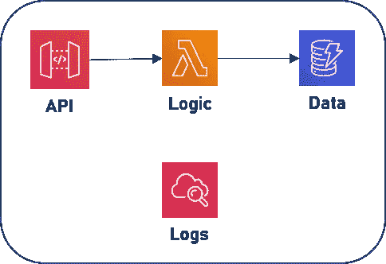
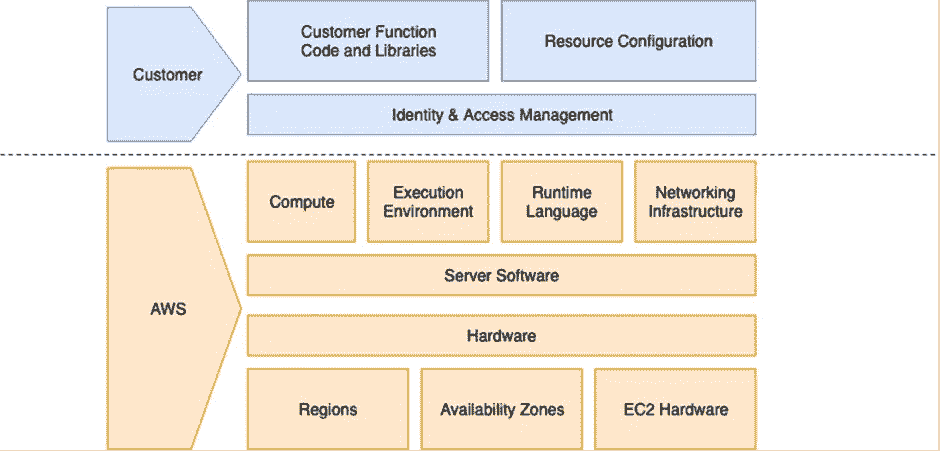

# 为什么威胁建模应该是您的无服务器开发的一部分

> 原文：<https://betterprogramming.pub/why-threat-modelling-should-be-part-of-your-serverless-development-c5fdd7788e53>

## 整合 it 以构建强大的解决方案

图片来源:作者

这是关于无服务器威胁建模的两部分系列文章的第一部分。

在第一篇文章中，我们讨论了与无服务器应用程序相关的威胁，并构建了一个将威胁建模作为开发过程一部分的案例。

在[第二部分](/a-few-steps-to-conduct-threat-modelling-in-serverless-applications-cefb89fa69dc)中，我将用简单的步骤解释威胁建模过程，这将帮助您理解、适应和扩展您的领域和开发实践。

“不要相信任何人！”“保护好一切！”“纵深防御！”这些短语在每一次技术会议上都有回响，尤其是在云计算和无服务器的会议上。

大多数组织采取各种措施来提高安全意识。有些流程和程序传达了安全的重要性，同时也提高了人们对入侵或破坏后果的认识。

有几本关于安全的书，有培训课程、安全比赛、认证和许多其他形式的资源和鼓励。对于工程师来说，根据工程师在设计解决方案中的经验和角色，安全资源通常处于不同的级别。

基础设施安全、数据保护和安全编程实践是我们大多数人都熟悉的几个方面。

在我们深入探讨无服务器的安全性之前，为了给讨论提供背景，让我们先简要了解一下威胁建模本身。

# 什么是威胁建模？

> “威胁建模是一个过程，通过这个过程可以识别、列举潜在的威胁，如结构漏洞或缺乏适当的安全措施，并确定缓解措施的优先级。”——[维基百科](https://en.wikipedia.org/wiki/Threat_model)

对我来说，威胁建模更像是一个思考过程，一个与您将要构建的无服务器应用程序的架构一起工作的思考过程。此过程有助于识别应用程序的潜在威胁，并纳入缓解计划。

威胁建模不一定只是一个人的想法。它可以是一个协作的头脑风暴会议，从与应用程序相关的每个人那里收集想法。

## 我可以在哪里应用威胁建模？

可以应用威胁分析和缓解的地方没有限制。威胁无处不在！威胁建模适用于企业应用程序、特定功能以及无服务器微服务。

这是一个常见的服务，它有四个主要部分:

*   消费者使用的 API
*   执行业务逻辑的 lambda 函数
*   维护客户数据的数据存储
*   日志存储和分析应用程序

无服务器服务。源作者

正如我们将在第二部分进一步展开的那样，即使这个简单的无服务器架构也可以从威胁建模中受益。

查看上图时，如果您正在考虑保护该 API 的方法，那么您的威胁分析已经开始了。

## 进展

要想出一个完整的威胁模型，我们需要与架构相关的想法。要有有价值的想法，我们需要正确的提示来引导我们。方法通常有助于实现这一点。

有几种方法和工具用于威胁建模。一种流行且广泛使用的威胁建模方法被称为 STRIDE。我会关注 STRIDE 的讨论。

STRIDE 代表:

*   清洁
*   **T** ampering
*   **R** 否定
*   信息披露
*   服务的重要性
*   特权的取消

以上是云和安全工程中熟悉的术语。在第二部分，我将进一步阐述它们，并展示它们如何增强建模过程。

有了这个超级简化的威胁建模概述，现在让我们将注意力转移到无服务器上。

# 无服务器中的安全误解

在我看来，对云及其保护措施没有清晰了解就开始无服务器之旅的工程师是在走捷径。这听起来可能有些苛刻，但是在构建安全的解决方案时，这种知识的缺乏可能会成为一个问题。

我遇到过一些开发人员，他们在编写和部署 lambda 函数时，对共享责任模型没有清晰的理解。他们通常不知道最小特权原则的含义。这种情况需要改善。

是的，工程师之间有这样的意识差距是可以理解的。

没错，在无服务器模式下，没有可供工程师管理的服务器。

的确，操作系统和更新由云提供商负责。

的确，完全托管的服务是由供应商管理的。

但是，这并不意味着无服务器应用程序中的一切都是云提供商的责任，因此是安全的。

## 无服务器共享责任模型

如下图所示，尽管 AWS 的责任范围进一步扩大，但作为无服务器工程师，我们仍有很大一部分工作要做。

共同责任模型(来源: [AWS 文档](https://aws.amazon.com/compliance/shared-responsibility-model/)

在无服务器中，说到我们的责任，不仅仅是保护服务边界。在这些界限之内的资源和其他实体也需要足够的关注。

正是在这一点上，威胁建模帮助我们拓宽思路，以获得架构更好的解决方案。

# 常见最佳实践

参与构建无服务器应用程序的团队已经在遵循一些最佳实践。他们使用这些实践，而不管他们是否熟悉任何形式的威胁建模。这是令人钦佩的，奠定了坚实的基础。

我们遵循最小特权原则。它指导我们使用执行任务所需的权限来构建资源。

*   例如，如果一个 lambda 函数查询一个 DynamoDB 表，那么它只需要该表上的“read”权限。

我们实施数据保护，例如对传输中的数据和静态数据进行加密。

*   例如，当在 S3 存储一个对象时，我们配置适当的加密策略，无论是服务器端、客户端还是自定义的。

我们签署消息并在收到数据时验证签名。

*   例如，我们在从合作伙伴 SaaS 应用程序接收数据时使用 SHA-256 等哈希算法。

我们保护 API 并在授权客户端使用服务之前对其进行身份验证。

*   例如，我们使用 Amazon Cognito 来管理 API 客户端及其作用域。

我们设置了 API 配额和速率限制来控制大量不请自来的电话。

*   例如，通过 AWS API Gateway，我们可以配置使用计划和节流限制。

除此之外，还有其他一些团队遵循的最佳实践，作为他们的无服务器开发标准和过程的一部分。

# 是否需要威胁建模？

如果我们已经遵循了最佳实践，是否真的需要威胁建模？

为了回答这个问题，让我把 [AWS 良好架构的框架](https://wa.aws.amazon.com/index.en.html)和[无服务器应用透镜](https://docs.aws.amazon.com/wellarchitected/latest/serverless-applications-lens/introduction.html)带到我们的讨论中来。

如您所知,《无服务器应用透镜》是评估无服务器架构的清单集。它们分为以下五大支柱:

*   卓越运营
*   安全性
*   可靠性
*   性能效率
*   成本优化

虽然无服务器应用程序镜头停留在较高的级别，有几个检查点来确保应用程序的良好架构，但另一方面，威胁建模更深入一层。

以体系结构为基础，威胁建模指导我们:

*   识别应用程序不同部分的潜在威胁，
*   分析每个威胁的可能缓解计划，以及
*   采取适当的措施保护整个应用程序。

本质上，威胁建模使得应用程序的架构非常好。

# 您的安全边界内的威胁

传统上，当我们谈到应用程序安全性时，我们主要想到的是保护应用程序免受外部威胁。当然，由于众所周知的原因，这很重要。然而，在这个安全边界内，无服务器应用程序的某些部分仍然需要免受威胁。

## 威胁案例示例

1.  你有一个生成折扣优惠券代码的服务。这些代码存储在数据库中，以便分发给您的客户。

作为设计过程的一部分，您通常会想:

*   谁需要访问这个数据存储，为什么？
*   您如何知道有人访问过这个数据存储？

2.您的应用程序出于研究目的处理成千上万人的医疗记录。

当您设计解决方案时，您是否总是在想:

*   记录什么数据，日志发送到哪里，谁可以访问它？
*   处理后的记录会怎么样？它们保留多长时间，出于什么目的？

## **隐私设计**

设计隐私(PbD)是许多组织采用的一种越来越流行的方法。其主要目的之一是防止信息泄露。

类似于设计安全性(SbD)与最小特权原则的紧密联系，当涉及到个人数据时，设计隐私的核心原则之一是默认的数据隐私。

威胁建模使您能够将此类数据可见性和信息泄露问题推到最前沿，以便您能够识别并采取适当的措施。

## 监管机构和合规

每个无服务器工程师都不需要了解不同的监管机构及其合规文件。但是，如果我们将必要的策略作为架构和解决方案设计的一部分，它们在实现过程中就会变得透明。

遵守 PCI DSS、GDPR、HIPAA 以及类似的法律和标准将会引发如下威胁分析问题:

*   如何防止有人故意篡改支付数据？
*   您如何确保客户数据不会离开受限制的国家或大陆？
*   您如何保护个人可识别的健康信息？

为我们现代数据驱动的生活开发无服务器应用面临许多挑战。如果得不到解决和预防，那么对企业来说，后果可能极其严重。因此，更好的流程(如威胁建模)对于提前识别和采取行动至关重要。

# 继续

威胁建模已经实践了很长时间。在无服务器中，它可以被认为是我们已经拥有的最佳实践的扩展。

威胁建模无疑有助于改进我们构建的保护企业及其客户的解决方案。除了无服务器的经济效益之外，它的接受、采用和成功也在很大程度上取决于这些核心原则。

[在本系列的下一部分](/a-few-steps-to-conduct-threat-modelling-in-serverless-applications-cefb89fa69dc)中，我们将看到如何将结构引入威胁建模过程。它将包括识别威胁、记录威胁和采取纠正措施的方法。