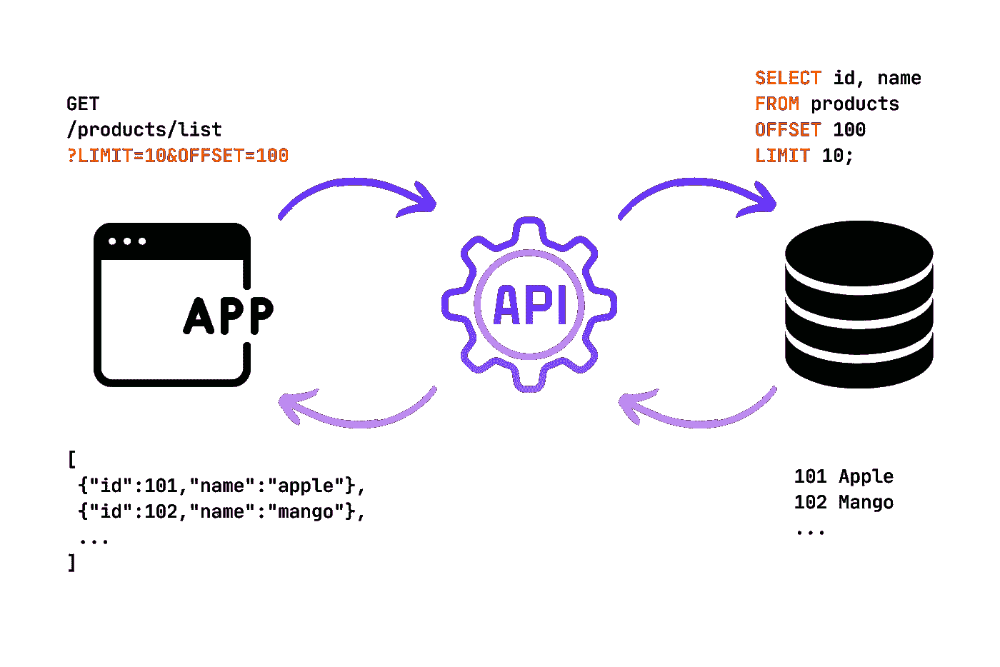
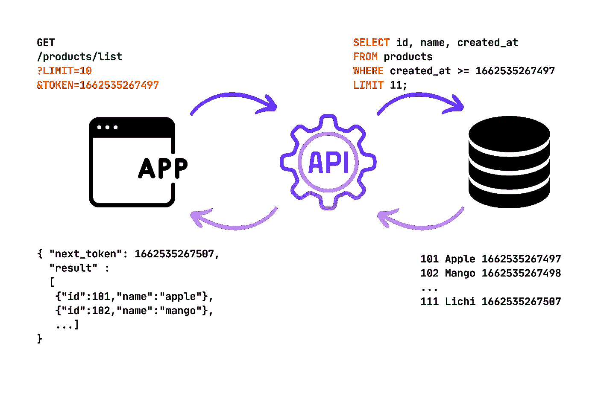

# 为什么基于标记的分页比基于偏移量的分页性能更好？

> 原文：<https://betterprogramming.pub/why-token-based-pagination-performs-better-than-offset-based-465e1139bb33>

## 几乎快了 1.5 倍


图片由作者授权。来自 Canva

几乎所有现代数字产品都必须包含某种分页 API。该 API 的主要作用是从一个大表中逐块检索数据，这样您的前端应用程序就不需要进行具有巨大负载的 API 调用。较小的有效负载导致较少的延迟。

# 基于偏移量的分页



开发分页 API 的一种常见方法是基于偏移量的。这里，前端要求*产品*表的*第 100th】行后的 *10 行*。当表很小时，这是无害的。然而，延迟随着*偏移值的增加而增加。**

**为什么？**因为数据库(不是所有种类的数据库)实际上为这个查询准备了`offset+limit`个行数。因此，当偏移值变大时，数据库必须经历`offset+limit`行。

让我们做一个快速实验。我在 PostgreSQL 数据库中准备了一个名为 *products* 的表，表中有`110001`行。它有三列；即`id`、`name`和`created_at`。

现在让我们运行这个查询，

数据库响应:

```
Limit  (cost=1.74..1.91 rows=10 width=27) (actual time=0.552..0.554 rows=10 loops=1)
  ->  Seq Scan on products  (cost=0.00..1909.01 rows=110001 width=27) (actual time=0.541..0.548 rows=110 loops=1)
Planning Time: 1.231 ms
Execution Time: 0.580 ms
```

在这里，我们可以看到数据库已经处理了 *110 行*，然后返回了 *10 行*。现在，让我们通过将偏移数增加到 *90000* 来抑制这种情况。

```
Limit  (cost=1561.90..1562.08 rows=10 width=27) (actual time=10.275..10.277 rows=10 loops=1)
  ->  Seq Scan on products  (cost=0.00..1909.01 rows=110001 width=27) (actual time=0.425..6.666 rows=90010 loops=1)
Planning Time: 1.070 ms
Execution Time: 10.302 ms
```

现在，你可以看到它已经读取了 *90010 行*，因为只返回了 *10 行*！执行时间也占用了大量的`10.302ms`。

# 基于令牌的分页



在这种类型的分页中，API 在每个页面上都向消费者发送一个`next_token`。这个令牌用于下一个 API 调用，依此类推。列或属性用于透视表中的数据。您可以选择任何符合要求的列。主要的想法是你必须提出*条件和参数*来帮助你浏览表格。如果创建时间是唯一的，那么通常的做法是选择行创建时间作为令牌。在上图中，`products`表的`created_at`列被用作令牌。您可以看到 API 已经将第*111*行的`created_at`作为`next_token`连同 10 个产品一起发送。然而，如果表变得更大，基于令牌的分页需要更少的延迟。

**为什么？**因为该查询使用查询中的条件过滤表，并从条件匹配的行开始扫描。简而言之，它只读取`limit`个行数。

**让我们在之前创建的`products`表上做一些实验**。我们将查询在早期实验中得到的相同结果。请注意，正确的索引会带来更好的性能。我让事情变得简单。

让我们对第*100*到第*110*行运行这个查询，

在这里，我们已经可以看到它的执行时间比以前少了。数据库已经过滤掉并且只计算了 *10 行*而不是 *110 行*。

现在，让我们用更大的令牌值来限制查询。该查询的目标是第 90000 到第 90010 行。

```
Limit  (cost=0.00..1.11 rows=10 width=27) (actual time=6.587..6.589 rows=10 loops=1)
  ->  Seq Scan on products  (cost=0.00..2184.01 rows=19735 width=27) (actual time=6.586..6.587 rows=10 loops=1)
        "Filter: (created_at >= '1662535267497'::bigint)"
        Rows Removed by Filter: 90000
Planning Time: 1.314 ms
Execution Time: 6.617 ms
```

你注意到巨大的不同了吗？执行该查询仅用了*6.617 毫秒*。数据库不必遍历 *90000* 行，相反，它通过表过滤，只读取 *10* 所需的行。

# 摘要

基于偏移量分页的数据库查询需要读取`offset+limit`行数，而基于令牌的查询只需要读取`limit`行数，并对条件进行额外处理。

```
Want to Connect?If you have any feedback, please ping me on my LinkedIn: [https://linkedin.com/in/shuhanmirza/](https://linkedin.com/in/shuhan-mirza/)
```