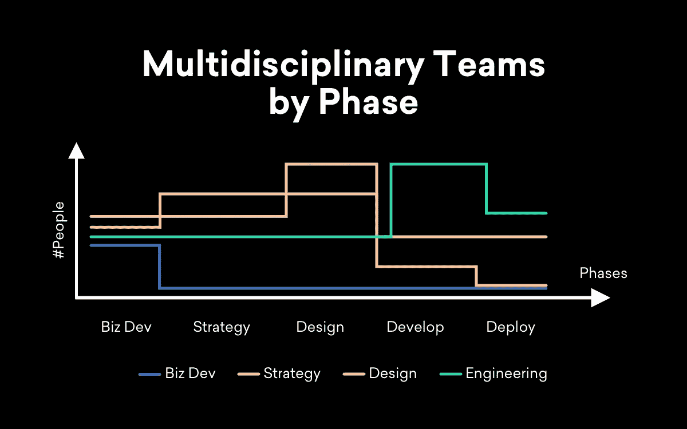
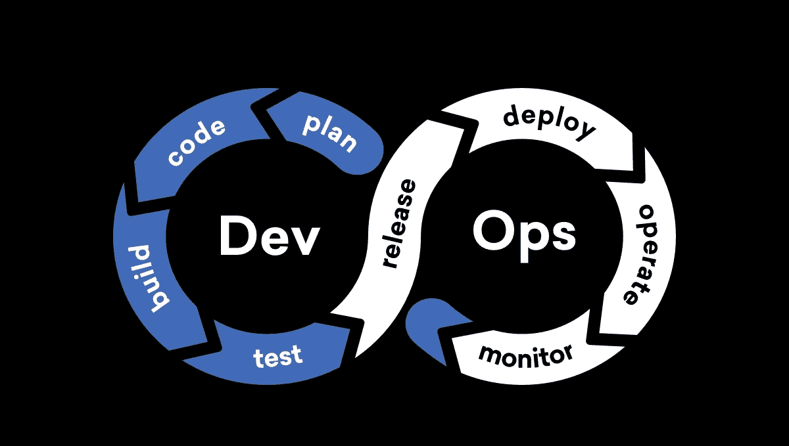
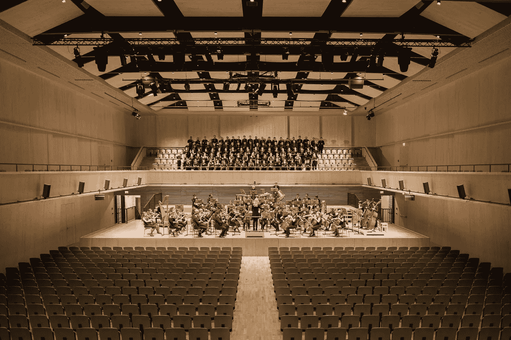

# 为什么真正的多学科团队可以开发出更好的产品

> 原文：<https://betterprogramming.pub/why-truly-multidisciplinary-teams-can-lead-to-building-better-products-c1b09e227067>

## 每个学科都需要一个席位

帕斯卡尔·斯威尔在 [Unsplash](https://unsplash.com/@pascalswier16?utm_source=unsplash&utm_medium=referral&utm_content=creditCopyText) 上的照片

想象你自己是一个软件架构师或者技术主管，一个项目经理带你进入一个新的软件项目。

她描述了客户和他们想要解决的问题，这肯定是一个有趣的项目。这是在一个非常有趣的领域为一个令人兴奋的品牌设计的，它可能会利用一些令人兴奋的技术。

你期待成为团队中的一员，将它带入生活。

“爽！”你告诉首相。“我们开始吧。动员会是什么时候？与战略、设计和客户会面，开始讨论我们想要在这里做什么，这将是一件非常棒的事情。”

“嗯，”她回答道。“那已经发生了。我们六周前就开始了。我们已经确定了产品需要做什么。我们已经和用户一起测试了一些设计，我们正准备将完成的设计交给你们的工程团队，这样我们就可以在两个月内推出 MVP。”

你可能会怀疑，但不幸的是，你以前见过这种情况。你叹气。“好的。告诉我更多这是做什么的，然后给我看设计。”

项目经理会告诉你更多的细节，这个解决方案对你来说听起来不错。但是他们正在谈论利用一些不成熟的技术，你还没有发现这些技术已经为黄金时间做好准备。

设计看起来不错，但是有些交互在目标平台上不是最容易实现的，你必须与设计师合作。

此外，有一个屏幕似乎需要大量数据。这些问题必须得到解决，这将意味着更多的设计时间，与客户更多的交流，因此客户会不高兴(“你为什么不早点计划这些事情？”).你看到错过的最后期限和未兑现的承诺。

我们不能避免这一切吗？

幸运的是，答案是肯定的，但更多的时候，我们没有做必要的事情，技术项目最终会出现这种情况。

创造一个产品是一个团队的努力，每个学科都有自己的角色，其中一些在某种程度上是重叠的，但是你需要在整个过程中让每个学科都参与进来，以便按时按预算开发一个健壮的解决方案。

# 每个学科都需要一个席位

托马斯·德鲁奥在 [Unsplash](https://unsplash.com/@thomasdrouaultphotography?utm_source=unsplash&utm_medium=referral&utm_content=creditCopyText) 上的照片

上面的例子是从软件架构师或技术主管的角度写的，但是类似的故事也可以从创意总监或首席设计师的角度写。想象一下，在一个项目中，设计师没有机会审查成品并提供反馈以确保其正常工作:

我听到外面的设计师在说什么？这种情况发生的频率也比你想象的要高？我怎么知道你会这么说？

因此，每个学科都需要一个席位，即使是在该学科的初级阶段开始之前或之后。

考虑下面的图表，它显示了一个团队的参与是如何随着过程的当前阶段而变化的(注意，这里没有包括项目经理，因为根据定义，他们已经包括在项目生命周期的这些阶段中):

在某种意义上，可以将这里概述的方法与 DevOps 相关的实践进行比较。

正如 DevOps 专注于学科间更好的协作(软件开发和操作)一样，在整个产品开发时间线中包含多学科团队旨在改善策略、设计和工程学科间的协作，并改善项目成果。

来源: [DevOps 是文化](https://medium.com/@neonrocket/devops-is-a-culture-not-a-role-be1bed149b0)，不是角色！作者:伊尔玛·科尔尼洛娃

大多数团队在项目的每个阶段都至少有一个团队成员，团队成员的数量随着时间的推移而变化，当他们的阶段是主要阶段时，团队成员的数量明显达到高峰。

战略家的数量在战略阶段是最多的，设计师的数量在设计阶段是最多的，工程师的数量在开发阶段也是最多的，当然，每个学科都有代表出席并全程参与。

在“设计”阶段完成后，设计师仍然参与其中，就像工程师在“开发”正式开始前参与一样。

# 这样一个真正的多学科团队能够实现什么？

兰迪·法特在 [Unsplash](https://unsplash.com/?utm_source=medium&utm_medium=referral) 上的照片

## 工程师

当工程从最早的以业务开发为中心的阶段就有一席之地时，整个过程就可以基于技术的能力并受到其启发。

其他团队成员可能对所讨论的技术有所了解，但是工程团队的成员会带来不同层次的了解，特别是如果他们以前已经用相同或相关的技术构建过一些东西。

## 设计师

当设计师在项目的开发阶段积极参与时，他们可以帮助确保工程团队交付的设计是预期的，并且以最佳方式处理任何必要的权衡。

很明显，交付所需的设计和用户体验也是工程设计的责任，正如设计和策略团队有责任充分理解技术以获得广泛的能力，但设计团队有责任确保最终产品交付他们想要的体验。

## 每个人都致力于把这个产品做到最好

通过这种方式，所有学科都致力于相互协作，以最大化其贡献，并帮助产品产生最大的影响。每个人都致力于把这个产品做到最好。

此外，每个规程与其他规程一起变得更加熟练，提升了整个团队的能力。他们绝不是专家，但其他学科没那么神秘。

例如，听到工程师询问错误状态可能会促使设计者在设计过程的早期考虑错误条件，并开发更模块化的设计方法，使其更容易合并负载、错误和空响应。此外，听到设计师质疑元素之间的间距或动画的流畅性，会促使开发人员花更多时间来确保这些细微差别尽可能准确和牢固。

这也有助于我们更好地相互沟通，因为我们有更多的机会与从不同角度或具有不同技能的人交谈。

俗话说，在你评价别人之前，一定要站在他们的立场上想想。

有什么更好的方法能对他人所面临的事情感同身受，而不是面对他们必须解决的问题以及他们用来谈论和解决这些问题的语言呢？

# 但是其他声音对这个话题有什么看法呢？

为了实践我所宣扬的，我邀请了来自 YML 其他几个学科的代表来撰写这篇文章，并分享他们对多学科团队好处的想法。

## YML 亚特兰大办事处负责人兼客户战略副总裁 Marcela Lay:

> *“当我们从第一天开始就包括所有学科进行合作时，我们就确保了在我们试图为客户解决的挑战上，从不同的角度进行报道。*
> 
> “它还提供了对决策影响每个学科的各种积极和消极方式的可见性，从而在定义最佳解决方案时实现正确的协作。”

## 瑞安·斯潘塞，YML 红木城的创意总监:

> *“开发人员经常被视为‘魔术师’，负责将设计任务或解决方案转化为代码。根据我的经验，我发现这种看法具有误导性，不能准确反映他们的实际技能。*
> 
> *“开发人员可能是房间里最有创造力的人，因为以创造性的方式解决问题是他们被驱使去做的事情——这是他们的热情所在。而问题总是有约束的，无论是时间，预算，还是资源* ***。***
> 
> *“开发人员首先是问题解决者，他们最擅长在一组约束条件下分解和解决问题。*
> 
> *“他们还提供了更好或更快解决问题的不同视角。*
> 
> *“一个例子可能是‘如果这个 API 需要几秒钟来显示信息会怎么样？“我们可以用不同的方式加载信息吗？”出于这个原因，创建一个健壮的设计和开发 QA 过程是非常重要的，在这个过程中，两个学科一起工作来推动和完善最终产品。*
> 
> *“我们的目标是确保产品不仅看起来完美，而且在现实世界的数据和约束条件下感觉流畅。”*

## YML 业务发展副总裁 Stephanie Wiseman:

> “我们不断提醒自己，好主意可能来自任何地方。实习生，初级设计师或者我们的文化团队。
> 
> *从第一天起就让每个学科(尤其是技术和工程)参与进来，可以确保我们从集体经验中汲取营养，创造出真正创新的、以客户为中心的解决方案。”*

## YML 高级资源经理帕特丽夏·阿隆佐:

> *“在项目启动时，每个专业都要有一名代表，这对于在流程早期发现潜在问题是不可或缺的。尤其是在资源配置方面。*
> 
> 虽然在项目评估阶段有些事情听起来可能是可行的，但是在启动练习期间，团队可能会意识到人员配备计划不太正确。
> 
> 提前完成这一步可以留出足够的时间为项目增加合适的资源。”

多学科团队的好处是显而易见的，但这并不意味着我们可以走捷径，在团队的整个生命周期中保持团队人员的最大化。这是对资源的浪费，而且考虑到我们要求团队成员完成的工作量，这通常是不可能的。

此外，鉴于沟通是我们在日常工作中所做的较为复杂的事情之一，我们希望团队小而灵活，以降低沟通的复杂性。

因此，每个学科的代表性必然会随着时间的推移而变化。

# 最后

现在你知道我们喜欢如何处理与 YML 客户合作的项目了。

要正确使用这种方法并不总是容易的，当你开始采用这种方法时，会有一些成长的烦恼，但是当它起作用时，结果是值得努力的。

我喜欢把这样一个真正的多学科团队想象成一个由管弦乐队伴奏的合唱团:没有什么比让所有这些乐器和声音一起演奏和演唱，相互支持，使整个声音比各个部分的总和更好更令人惊叹的了。

在 [Unsplash](https://unsplash.com/?utm_source=unsplash&utm_medium=referral&utm_content=creditCopyText) 上由[Manuel n Geli](https://unsplash.com/@gwundrig?utm_source=unsplash&utm_medium=referral&utm_content=creditCopyText)拍摄的照片

*本文原载于 Y 媒体实验室博客***。**