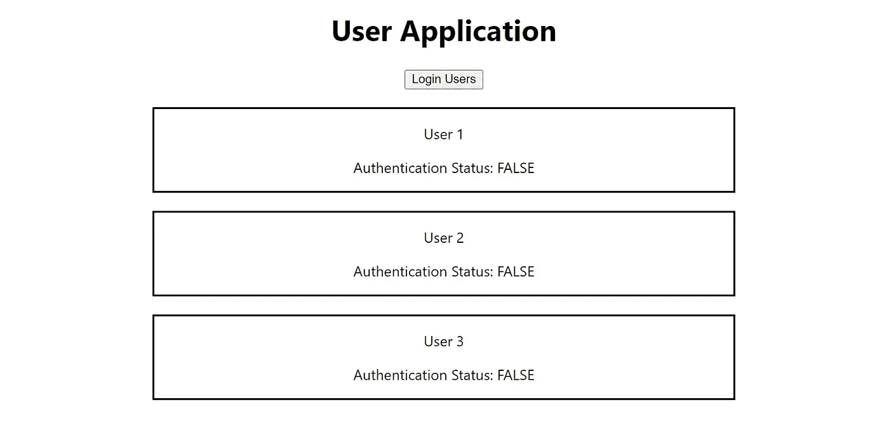
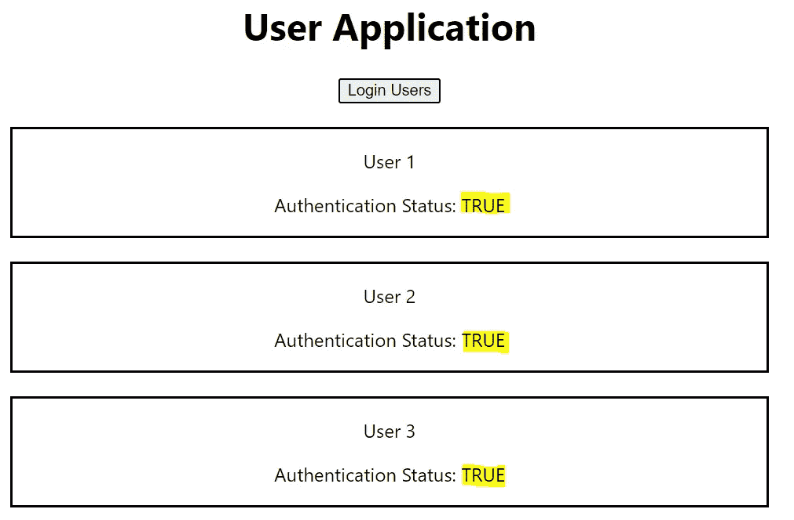
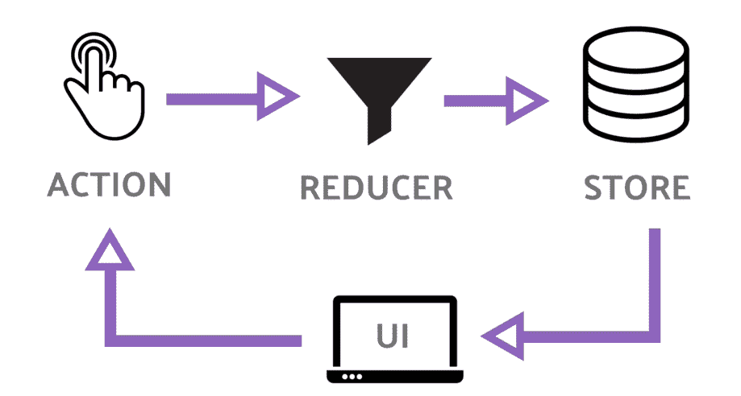

# 既然有了上下文 API，为什么还要使用 Redux 呢？

> 原文：<https://betterprogramming.pub/why-use-redux-when-we-have-context-api-95be70581148>

## 哪个状态管理解决方案适合您的项目？


作者照片。

[Redux](https://redux.js.org/) 这个问题的简单答案是“是的，因为它有助于我们的国家管理。”这没有错，但是我们有别的选择吗？

幸运的是，我们有。作为一名 JavaScript 开发人员，我逐渐明白我们不满足于一件事。我们需要替代方案。这就是 React 16.4 为我们提供[上下文 API](https://reactjs.org/docs/context.html#api) 的原因。

本文将帮助您理解和回答关于状态管理的最常见问题:

*   为什么不能直接用道具来管理状态(道具链)？
*   Redux 是什么，我们为什么要用它？
*   我们如何为我们的应用程序配置 Redux？
*   什么是上下文 API？
*   我们如何使用钩子来配置上下文 API？
*   最后，哪个选项更好？

*注意:如果你已经知道 Redux 是如何工作的，什么是道具链，你可以跳到上下文 API 部分。*

我将从一个演示应用程序开始，它将只显示多个用户以及他们的姓名和身份验证状态。为此，我们将有三个主要组件:应用程序组件、用户组件和用户组件。



# **App 组件**

这个组件(容器)将可以访问状态。我们的状态将有几样东西:一个`users`数组和另一个用于`authentication`的布尔字段。

我们将有一个登录用户按钮在我们的`App.js`里面。点击后，将登录所有用户(将其身份验证状态更改为`true`)。然后，我们将通过道具将用户和`isAuthenticated` 标志传递给`Users.js`。

我们的应用程序组件应该是这样的:

# **用户组件**

这个组件将是一个无状态组件。这里，我们将只映射来自`App.js`的用户，并将值作为道具传递给`User.js`:

# **用户组件**

`User.js`仅显示作为道具从`Users.js`接收的数据:

这是一个非常基础的应用。现在，当我们按下 Login User 按钮时，我们将所有三个用户的身份验证状态更改为`true`。



# 那么这个 App 到底是什么问题呢？

好吧，我们肯定能改进一件事。这可能与如此小的应用程序无关，但对于更大的应用程序却非常重要。我们可以解决道具链的问题。

## 道具链问题到底是什么？

在我们的应用程序中，我们将`isAuthenticated` 标志作为道具传递给`Users.js`，然后再作为道具传递给`User.js`。

但是我们甚至需要`Users.js`中`isAuthenticated` 的值吗？用户组件只转发`isAuthenticated`的值。它确实接收了作为道具的值，但并不真正关心。这没什么大不了的，因为这只会导致额外的冗余，降低组件的可重用性，因为无论我们在哪里使用 Users 组件，我们都必须将`isAuthenticated` 的值传递给它。

## 还原到救援

如前所述，Redux 是一个用于管理应用程序状态的 JavaScript 库。

我将试着解释 Redux 是如何工作的，在那之后，你可能会有一个它如何解决我们的道具链问题的想法。

所以 Redux 围绕着一个叫做商店的中心状态的想法工作。要改变状态，组件必须分派一个动作。这个动作然后被传递给 reducer，它改变了我们的应用程序的状态。



图片来自[维基百科](https://upload.wikimedia.org/wikipedia/commons/0/06/Ngrx-redux-pattern-diagram.png)。

这只是对 Redux 工作原理的一个简单总结。让我们回到它将如何解决我们的道具链问题的问题。为了理解这一点，让我们使用 Redux 来转换我们的项目。要使用 React 连接 Redux，我们需要遵循某种方法:

*   这里的第一步是将`redux`和`react-redux`安装到我们的应用程序中。
*   第二步，添加我们的店铺。商店应该在我们的应用程序开始之前创建，所以`index.js`将是添加我们的商店的好地方。所以我们就`import { createStrore } from ‘redux’`。然后，这个存储需要存储在一个常量变量中。我们把它命名为`store`，在这里我们将调用`createStore`函数并传递我们的 reducer。
*   因为我们需要传递我们的 reducer，所以我们必须为这个 reducer 创建一个文件，并将这个文件导入到我们的`index.js`中。我们的 reducer 文件看起来怎么样？如前所述，状态变化只能通过减速器发生。所以在我们的`reducer.js`中会有一个初始状态。reducer 函数有两个参数:state 和 action (它将接收来自组件的调度动作)。

*   我们的减速器目前正在返回状态。现在我们可以将这个减速器导入到我们的`index.js`中，并将这个减速器传递给`createStore` 函数(`const store = createStore(reducer)`)。我们现在已经创建了我们的商店。为了将这个商店连接到我们的 React 应用程序，我们需要一个特殊的包，我们已经安装了这个包(`react-redux`)。安装后，我们将不得不`import { Provider } from ‘react-redux’`。这个提供者需要包装我们的应用组件。提供者是一个助手组件，它允许我们将存储注入到应用程序中。

*   现在，我们如何从商店获取数据？为此，我们需要将`App.js`与商店联系起来。为此，我们使用了由`react-redux`包提供的叫做`connect`的东西。`connect` 是我们在`App.js`导出中使用的高阶函数。然而，`connect` 本身就是一个函数，返回一个函数，然后这个函数把组件作为输入(`export default connect()(App);`)。现在对于`connect`的第一次函数执行，我们可以通过一些配置。更准确地说，我们传递两条信息。首先，我们在组件中需要的整个应用程序状态的一部分。第二，我们需要从组件调度的动作。这两种配置命名为`mapStateToProps`和`mapDispatchToProps`(不一定同名，但这是最常见的命名约定)。现在，我们不再需要之前在`App.js`中使用的本地状态，我们也可以去掉`loginHandler`，因为我们将在我们的 reducer 中处理登录功能，这反过来又作为一个动作从我们的`App.js`中发出。现在可以使用`this.props`在我们的组件内部访问状态值。

*   最后，当我们按下登录用户按钮时，我们的 reducer 将返回更新后的状态。

*   现在我们已经在我们的应用程序中设置了 Redux，这里要做的最后一件事是将`isAuthentication` 标志的值从我们的中央状态直接传递给`User.js` ，而不是通过`Users.js`传递给。如何实现这一点？很简单。因为每个组件现在都可以直接访问状态(使用`connect`)，所以我们可以在`User.js`中直接访问状态值。试着尝试一下，但如果你做不到，下面是一个参考:

这样 Redux 就帮我们解决了道具链的问题。这在这么小的应用程序中可能无关紧要，但在更大的应用程序中使用 Redux 时，它使我们的工作变得容易得多。

# 上下文 API 和使用上下文挂钩

最后，我们现在到达了有趣的部分，上下文 API。首先，我们来搞清楚它到底是什么。

当我们需要来自多个组件中某个状态的某些数据，但是我们不想在多个层之间传递数据时，就需要上下文 API。

为此，我们将创建一个新文件`auth-context.js`。在这个文件中，我们将创建一个上下文对象。React 将提供对它的访问。

```
const authContext = React.createContext(); 
```

`createContext`允许我们用默认值初始化我们的上下文。这个`createContext`是一个 JavaScript 对象(技术上也可以是数组、字符串、数字等。)可以在不同的组件之间传递。给你。我们可以通过`isAuthenticated`的默认值。

注意:我们在项目中添加这个是为了更好的自动完成。

```
import React from 'react';const authContext = React.createContext({
    isAuthenticated: false,
});export default authContext;
```

现在我们可以在应用程序中的任何地方导入这个上下文，它需要包装应用程序中需要访问它的所有部分。我们必须使用`context`进口名称并在其后添加`.Provider`来包装它。

这就是我们的`App.js`渲染函数应该看起来的样子:

现在我们将`AuthContext`包装在`Users`组件中。然后，我们可以访问我们的`Users`组件及其所有子组件中`isAuthenticated`的值(在我们的例子中是`User.js`)。

有三种方法可以实现这一点。

## **使用消费者**

要做到这一点，可以直接去我们的`User.js`。在我们的渲染函数中，我们可以添加`AuthContext.Consumer`。不要忘记将`AuthContext`导入到我们需要访问`isAuthenticated`标志的区域。这就是我们的渲染函数现在的样子。现在这个`AuthContext.Consumer`就是我们的`JSX`组件。因为这是一些 JavaScript 表达式，我们需要用花括号把它括起来。您需要记住的唯一问题是，`Consumer`在开始和结束标记之间将一个函数作为子函数，这个函数将接受我们的`context`对象。最后，要获得`isAuthenticated` 标志，我们可以通过`context`获得。

## **使用上下文类型**

使用`Consumer`的问题是它只在渲染函数中运行，但是我们很有可能在组件的其他部分需要状态值(例如`componentDidMount()`)。我们将无法访问我们的上下文。
为了克服这个问题，React 16.6 给我们介绍了一个特殊的静态道具`contextType`，可以用在基于类的组件中(`static contextType = AuthContext`)。现在，这允许 React 在后台自动将这个组件与我们的上下文连接起来。这给了我们一个新的属性，我们可以在应用程序的任何部分使用它:`this.context`。
为了现在获得认证状态，我们只需使用:

```
<p>AuthenticationStatus:this.context.isAuthenticated.toString()}</p>
```

## **使用 useContext 挂钩**

最后，要在一个函数组件中使用这个，我们可以使用 React 提供的钩子，`useContext`。

```
const authContext = useContext(AuthContext);
```

现在我们可以在函数组件的任何地方使用这个`authContext`来访问`isAuthenticated` 标志。

```
<p>AuthenticationStatus: authContext.isAuthenticated.toString()}</p>
```

就是这样。我们现在已经学会了如何使用上下文 API 来管理我们的状态。

# 哪个更好？

现在我们已经了解了 Redux 和 Context APIs 是如何工作的，我们可以比较它们并了解它们的优缺点。

*   包大小:我们必须记住的一点是，redux 是第三方包库，不属于 React，因此我们需要安装依赖项——主要是其中的三个(Redux、react-redux、redux-thunk)。使用 Redux 是有代价的。安装这些依赖项会增加我们最终的包大小。相反，上下文 API 是 React 的一部分，所以我们的包大小保持不变。
*   样板代码:使用 Redux，我们需要有一个详尽的设置，我们需要建立一个商店，我们需要分派动作。然后，我们需要将商店与组件连接起来。有时候，这对开发人员来说是一种痛苦。很有可能一个人会迷失在代码中，漫无目的地游荡，不知道如何修复任何东西。基本上，你需要有一个实际操作的方法来使用 Redux。在我看来，上下文 API 包含较少的样板代码。随着 React 16.6 的推出，我们甚至不需要消费者。只需一行代码，您就可以访问您的上下文。
*   处理异步代码:在上下文 API 中，一旦掌握了窍门，触发 API(异步代码)相对简单(尤其是在使用钩子时)。你也不需要像`redux-thunk`这样的包来处理异步动作。

# 结论

通过这篇文章，您现在可以猜测为什么上下文 API 可以比 Redux 更好。不过，预计将推出 Redux 的新版本。它将包含更少的样板代码，效率更高。让我们拭目以待，看看效果如何。