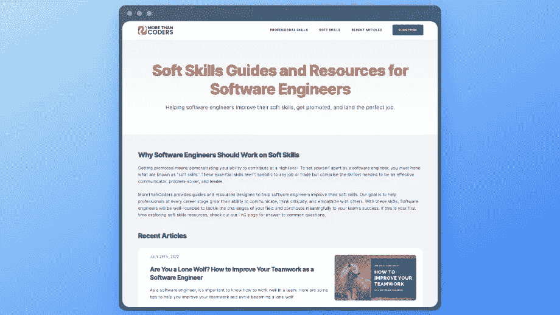
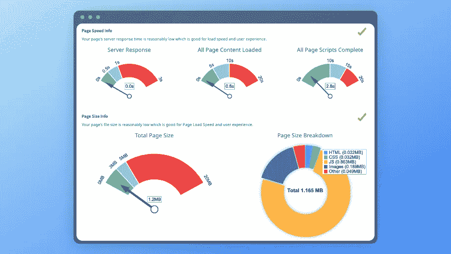
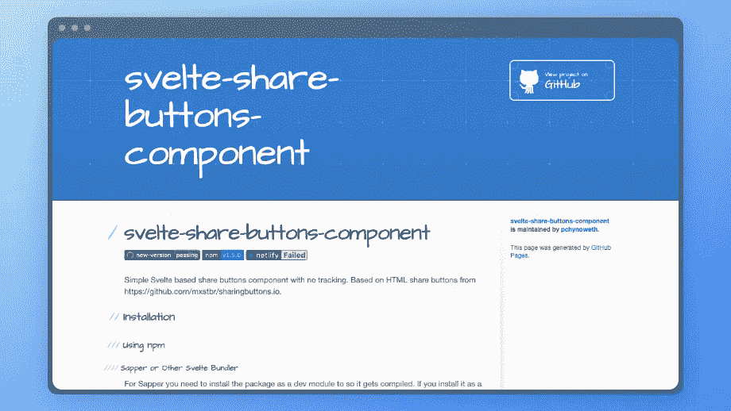
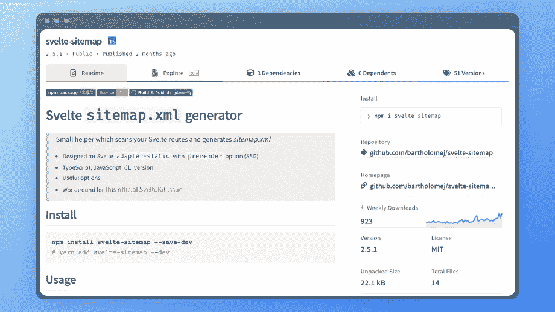
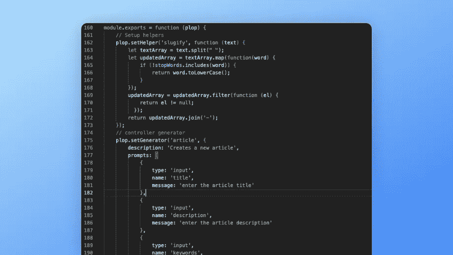

# 为什么我使用 SvelteKit 来建立超高排名的网站

> 原文：<https://betterprogramming.pub/why-use-sveltekit-to-build-super-high-ranking-websites-bf8f0cb8d6a2>

## 以及苗条如何帮助我在建立网站时节省时间和金钱


作者图片

大多数想开博客或网站的人认为他们需要使用像 WordPress 这样的平台才能成功。事实是，虽然许多这些平台可以让你的网站起飞，他们是非常困难的管理和优化搜索引擎优化。

假设你有一些基本的编码经验，利用像 Svelte 和 SvelteKit 这样的轻量级框架可以帮助你建立一个易于维护、可扩展和 SEO 友好的网站。让我们开始学习苗条吧。

# 什么是 Svelte 和 SvelteKit？

Svelte 允许你编写简单的 web 应用程序，而不需要 JavaScript 框架中的大量代码。React 和 Svelte 的主要区别在于，Svelte 不使用虚拟 DOM，这使得它的效率更高。Svelte 在构建时编译组件，而不是在浏览器中生成静态的 HTML、CSS 和 Javascript。

[苗条套装](https://kit.svelte.dev/)是苗条框架进化的下一步。与 web 标准紧密结合使得构建真正通用的应用程序成为现实。SvelteKit 还提供了几个使其在其他框架中独一无二的特性，比如其直观的 API 和组件开发方法。此外，SvelteKit 允许你为多个平台导出你的应用程序，如 [Netlify](https://www.netlify.com/) 和 [Vercel](https://vercel.com/) 。

# 为什么我选择使用 SvelteKit 来构建

当建立一个网站时，有许多不同的框架可以使用。我选择使用 Svelte 和 SvelteKit 来构建我的网站，因为我想要一个快速、轻量级、易于使用的框架。有了 Svelte，我可以快速轻松地创建自己的网站，而不必管理常见的配置和数据库问题。

WordPress 是写博客最流行的工具之一。虽然 WordPress 有很多优点，但它也有一些明显的缺点。WordPress 通常很慢而且很麻烦，因为它获取数据并呈现内容。相比之下，Svelte 要快得多，也更容易使用。



我最近为软件工程师建立了一个博客，学习软技能培训如何改善他们的职业生涯，名为 [MoreThanCoders](https://morethancoders.com?utm_source=medium&utm_medium=referral&utm_campaign=blog_post) 。通过这次经历，我磨练了我的技能，并开始欣赏这个框架。以下是我从使用苗条和苗条套件的建筑中获得的关键经验。

## Svelte 易于构建、部署和维护

简单意味着我的网站从长远来看更容易维护。Svelte 提供了一种简洁的方式来编写组件，从而减少整体代码。下面是一个简单的图像组件示例，如有必要，它包括属性:

```
<script>
    export let image_location;
    export let image_alt;
    export let has_attribution;
    export let attribution_name;
    export let attribution_link;
    export let credit_link;
</script>
{#if has_attribution}
    <div class="attribution">
        Photo by <a href={attribution_link}>{attribution_name}</a> on <a href={credit_link}>Unsplash</a>
    </div>
{/if}
```

这个简单的组件意味着我可以在我的应用程序中保持一致的图片，而不需要浏览每篇文章来更新它们。因为它是一个组件，所以我可以在我的文章中这样称呼它:

```
<Image
    image_location={image_1}
    image_alt="A man running through an empty airplane terminal."
    has_attribution={true}
    attribution_name="James Dean"
    attribution_link="https://morethancoders.com"
    credit_link="https://morethancoders.com/credit"
/>
```

因为这些组件是使用 Javascript 构建的，所以您可以快速部署代码，而无需像使用 WordPress 等工具那样配置服务器。

## 苗条套装提供了足够的结构

SvelteKit 提供了足够的结构来帮助而不是压倒性的。因为它是用户友好的，并且不太复杂，所以与 React 和 Vue 等框架相比，它更容易使用。

此外，由于它是一个成熟的应用程序框架，它利用了服务器端渲染(SSR)和代码分割等行业最佳实践。这些最佳实践有助于开发人员专注于构建优秀的应用程序，而不是配置环境。

## Svelte 和 SvelteKit 是搜索引擎友好的

Svelte 是一个超轻量级的组件框架，它允许开发人员以一种易于浏览器阅读和理解的格式编写组件。

因为 Svelte 是轻量级的，所以构建会导致更小的包和更少的 HTTP 请求。限制请求的数量对于 SEO 来说至关重要。SvelteKit 更进了一步，提供了一个完整的构建工具链，使得创建具有优秀 SEO 属性的 SSR 就绪应用程序变得容易。

我还可以更好地控制 HTML 的结构。WordPress 以拥有数千行代码和无处不在的插入而臭名昭著，除非它被大量编辑。增加文件大小和通过插件包含无数脚本会对 SEO 产生负面影响。



MoreThanCoders.com 网站绩效指标由[https://www.seoptimer.com/](https://www.seoptimer.com/)提供

# 开发苗条网站的工具

有很多工具可以帮助你学习苗条和构建高质量的应用程序。因为 Svelte 使用软件包，可以利用 NPM/纱，有许多软件包可以帮助您更快地发展。

## SvelteKit 文档

svelite 和 SvelteKit 文档是帮助你构建第一个 svelite 应用程序的绝佳工具。它们提供了清晰简洁的示例，引导您完成构建第一个应用程序的过程。我强烈建议在开始之前通读这两套文档。

## REPL 和例子

svelite 和 svelite kit REPL 和例子是开始构建你的苗条应用程序的好工具。使用 REPL，您可以计算表达式、插入和删除代码，并实时查看代码更改的结果。这些示例为您的应用程序提供了一个起点，并展示了如何实现各种功能。

## 纤细的分享按钮



组件是一个简单的组件，可以将社交分享添加到任何苗条的页面上。该组件提供了一种简单的方法，使您的博客或网站可以共享，而无需实现大量的第三方库。这个组件是 HTML 和 CSS 而不是 javascript 解决方案。

## 苗条的网站地图



[瘦网站地图生成器](https://github.com/bartholomej/svelte-sitemap)包扫描你的瘦应用程序，生成一个网站地图，可以帮助搜索平台，如谷歌抓取和索引你的网站。这个站点地图生成器是一个很好的例子，它展示了 Svelte 和 SvelteKit 如何提供足够的结构和支持而不显得笨重。

## 扑通. js

大多数框架都没有为创建或添加文件提供搭建式解决方案。这个空白就是[出现的地方。Plop.js 使用命令行生成文件并追加内容。](https://plopjs.com/)



我利用 Plop.js 为我的博客搭建新文章。我通过命令行输入基本信息，Plop.js 基于模板创建一个新的文章文件，更新数据存储，并为图像添加任何必要的文件夹。它节省了大量的时间，并防止我犯错误。

# Svelte 使您能够构建高质量的 Web 应用程序

用 Svelte 和 SvelteKit 构建 web 应用程序是一个很好的方法，可以用来构建你知道可以增加流量的网站。通过选择使用 Svelte 构建，您选择了一个简单易用的框架，这将使您作为开发人员的生活更加易于管理。

更不用说，Svelte 也是 SEO 友好的，这意味着你的网络应用程序将更容易被搜索引擎看到。有了这么多伟大的特性，难怪越来越多的开发者选择用 Svelte 来构建。

```
**Want to Connect?**If you are interested in learning more or reaching out, you can connect with me on [LinkedIn](https://www.linkedin.com/in/david-ziemann/).
```