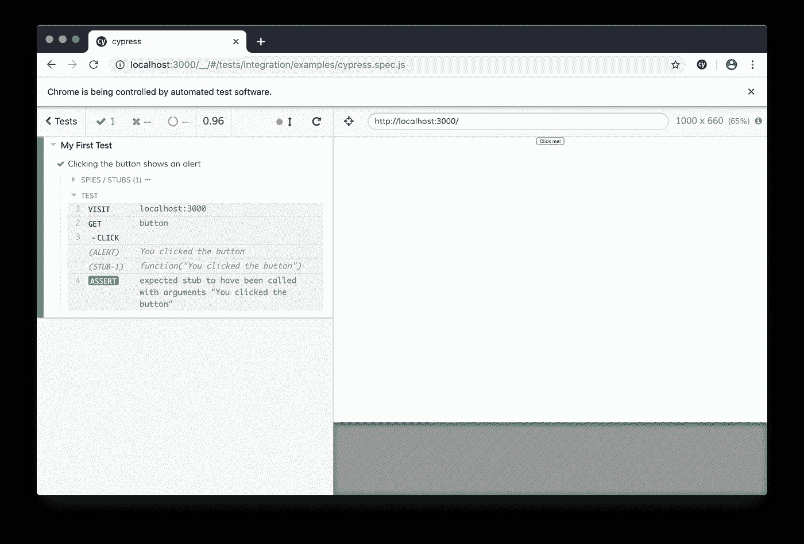

# 为什么使用 Cypress 比单元测试更好

> 原文：<https://betterprogramming.pub/why-using-cypress-is-better-than-unit-testing-e8234229be81>

## 回到为什么你首先应该写测试


柏树在意大利——照片由[克里斯托夫·范·伦特根](https://unsplash.com/@weblounge?utm_source=unsplash&utm_medium=referral&utm_content=creditCopyText)在 [Unsplash](https://unsplash.com/s/photos/cypress?utm_source=unsplash&utm_medium=referral&utm_content=creditCopyText) 上拍摄

# 单元测试

根据我的经验，前端单元测试通常会测试真正基本的组件功能。

我经常看到的一个单元测试的例子如下。

假设我有一个简单的`MyButton`组件，它接受一个单独的`buttonText`道具，并在被点击时显示一个警告。

我可以为这个按钮编写一个单元测试，如下所示:

现在运行测试将通过！

```
PASS src/MyButton.test.js
 ✓ displays the correct text value (23ms)
```

然而，真正的问题是:“这个测试有多大用处？”

我已经测试了一个非常基本的功能，如果我改变了按钮组件，我现在也需要更新这个测试。

在我看来，前端测试在模拟真实情况时是有用的。

你可以用单元测试来测试 100%的代码覆盖率，但是当组件开始相互通信时，你的应用程序仍然可能失败。

不要低估为所有组件编写单元测试所花费的时间。

真正重要的测试是那些测试用户每天使用的功能的测试。

比如:“用户可以购买产品吗？”以及“如果我以后更改了地址，我的订单会被运送到正确的地址吗？”

这些事情是不可能用单元测试来测试的，因为它们使用了你的应用程序的所有组件。

这就是你可以用[柏树](https://www.cypress.io/)的地方！

# 柏树试验

使用 Cypress，您可以编写测试来启动浏览器并自动导航您的应用程序。这是测试真实用例的理想方法，例如:“当我购买一个产品时，一切都正常吗？”

例如，我将创建一个非常简单的 Cypress 测试，测试当我单击`MyButton` React 组件时是否显示警告。

为了安装 Cypress，我运行以下命令:

```
yarn add cypress --save-dev
```

接下来，我创建一个包含实际测试的`cypress.spec.js`文件。

我告诉 Cypress 导航到我的应用程序的 URL 并点击按钮。然后，我模拟`window:alert`函数以确保它被调用。

现在，我下载 [Cypress app](https://www.cypress.io/) ，打开我的`cypress.spec.js`文件。运行时，Cypress 点击按钮，测试通过！



# 结论

请记住，我展示的 Cypress 测试示例是非常基础的，当您开始为真实用例编写自动化测试时，Cypress 的威力变得非常显著。

Cypress 已经多次将我从令人讨厌的错误中拯救出来，我肯定会推荐它！