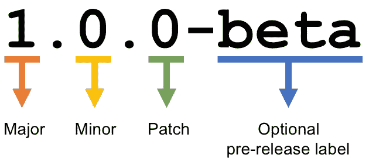

# 为什么版本控制很重要，以及如何正确地进行

> 原文：<https://betterprogramming.pub/why-versioning-is-important-and-how-to-do-it-686ce13b854f>

## 实现语义版本控制，以便每个依赖项都保持在同一页面上


照片由[克里斯汀·休姆](https://unsplash.com/@christinhumephoto?utm_source=unsplash&utm_medium=referral&utm_content=creditCopyText)在 [Unsplash](https://unsplash.com/search/photos/laptop?utm_source=unsplash&utm_medium=referral&utm_content=creditCopyText) 上拍摄

你可能想知道软件、游戏或应用程序上的数字意味着什么。类似于`11.2.3`或者`10.4.3.2arm64`的东西。

这些是应用程序当前的版本号或它所属的版本号。此外，对于同一版本，这被分为不同的类型。

# 版本控制的原因

但是我们为什么要版本化呢？有必要吗？

最有可能的是，随着应用程序的增长，项目中包含的依赖项的数量也会随之增长。依赖越多，事情就越难管理。

有时，您可能会发现很难在不中断与其他人的联系的情况下升级一个依赖项，因为其他人可能太紧密而无法升级。

其他时候，依赖关系过于松散。有些依赖项为未来提供支持，有时超出了需求。这是典型的依赖地狱。

一个简单的解决方案是使用一组通用的规则正确地开始版本控制，这有助于每个依赖项尽可能地保持在同一页面上。

这叫做[语义版本化](https://semver.org/)。

# 语义版本控制

语义版本控制有一些必须遵循的规则。这些规则可以在[网站](https://semver.org/)上找到。

我们考虑 X.Y.Z (Major)的版本格式。未成年人.补丁)。

*   不影响 API 的错误修正增加了补丁版本。
*   向后兼容的 API 添加或更改会增加次要版本。
*   向后不兼容的 API 变化增加了主版本。



你应该阅读规则，这样你就知道什么时候增加专业。未成年人。补丁的版本和何时不。

但是，每次更新项目的版本不是很繁琐吗？必须有几个文件需要更新，你需要记住你最后一次更新是什么时候。

听起来没什么意思。如果我告诉你你可以用更好的方法做这件事呢？

这就是 [bump2version](https://github.com/c4urself/bump2version) 的用武之地。[这个 GitHub 资源](https://github.com/c4urself/bump2version)可能是我发现的最好的版本控制 Python 库。会有多难呢？

```
pip install --upgrade bump2version
```

安装完成后，我们需要创建一个 bump 配置文件，这样脚本就能按照我们想要的方式运行。

让我们假设我们有一个目录`project_xyz`，其中还有另外两个目录:`Backend`和`Frontend`。

让我们假设`Backend`包含一个文件`setup.py`，而`Frontend`包含一个文件`build.sh`。每个文件都包含`Frontend`和`Backend`的版本。这些版本可以不同也可以相似，这取决于您是如何递增的(遵循规则)。

我们创建一个文件`.bumpversion.cfg`(注意它是隐藏的)。这个文件将定义版本应该更新到哪里和更新到什么。

我们将该文件定义如下:

当你想增加整个项目的版本时，你可以在`project_xyz`的根目录下运行一些命令，它会自动更新所有的文件。

简单如:

```
bump2version major // 0.1.0 --> 1.0.0bump2version minor // 0.1.0 --> 0.2.0bump2version patch // 0.1.0 --> 0.1.1
```

请注意，提到的所有文件都包含一行:

```
version = 0.1.0 //or the version updated
```

但是，每当您想要对单个文件执行此操作时(例如，您刚刚更新了`Backend`，并且想要仅递增该值)，您可能更喜欢:

```
bump2version minor Backend/setup.py
```

自定义版本也有一种递增方式:

```
to go from 0.5.1 directly to 0.6.1:bump2version --current-version 0.5.1 --new-version 0.6.1 patch Backend/setup.py
```

此外，还有一种在版本控制中添加消息的方法:

```
bump2version --message 'Build {$BUILD_NUMBER}: {new_version}' patch
```

当您使用所有这些信息提交 Git 时，这就是我所说的离原子 Git 使用又近了一步。

我希望你喜欢这篇文章，感谢阅读！