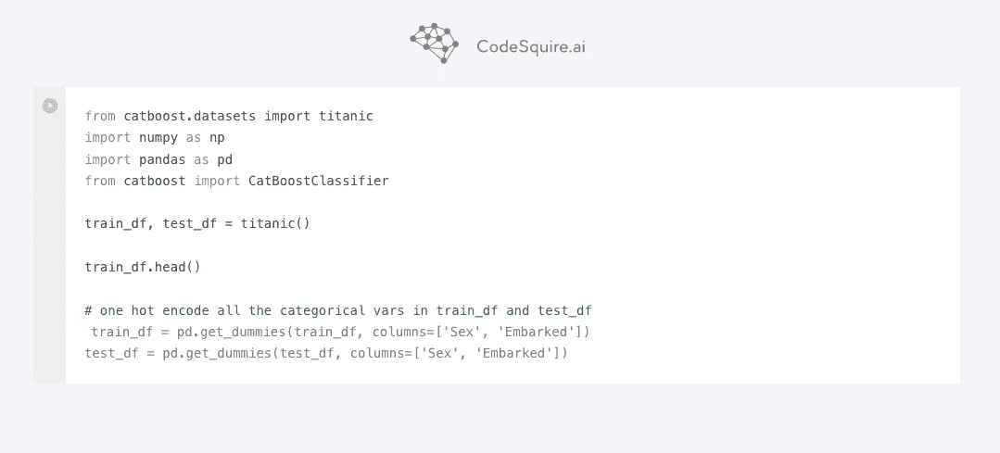
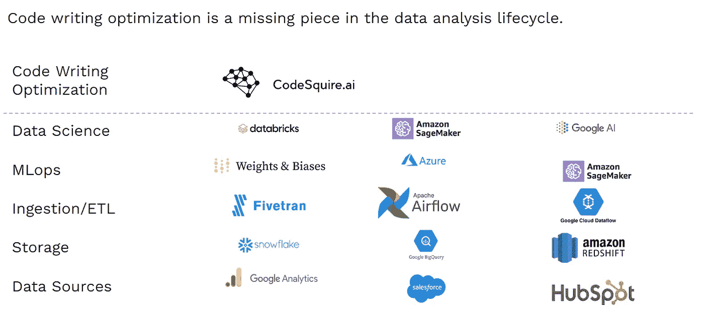
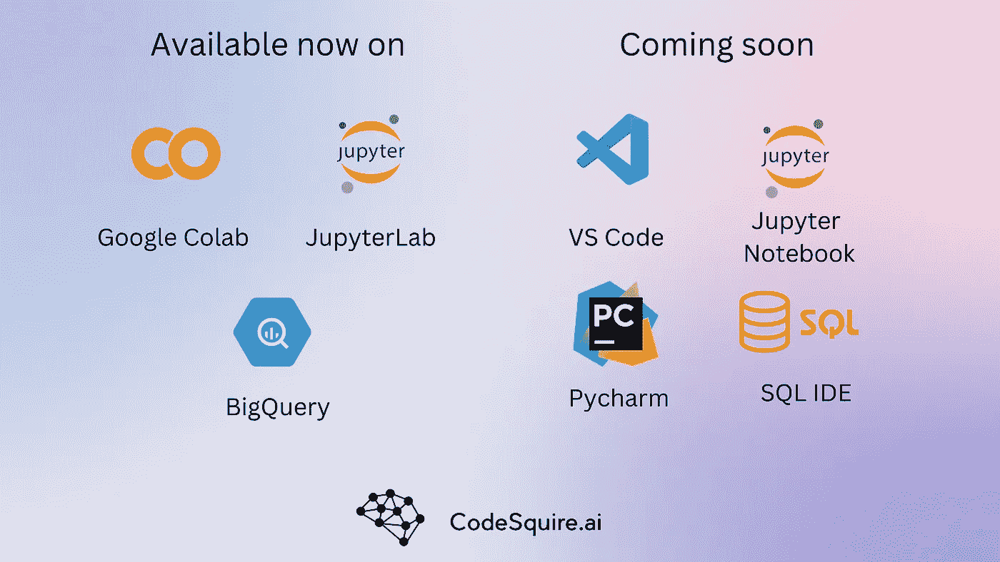
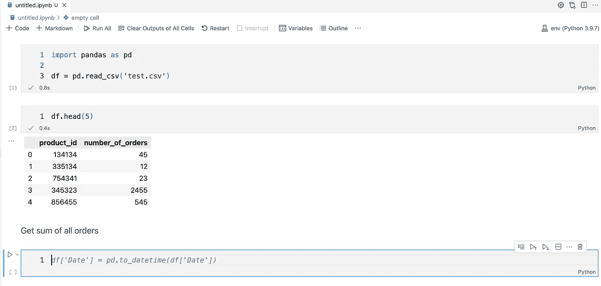
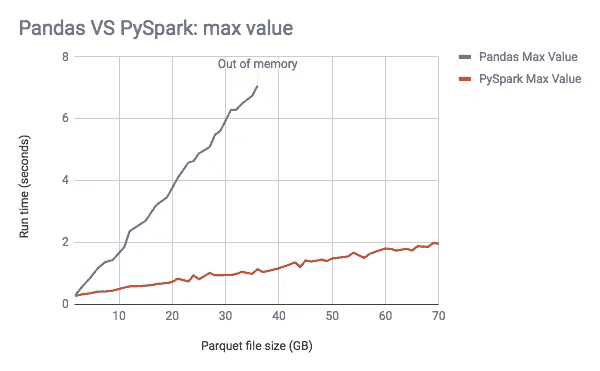

# 为什么我们需要为数据科学家设计的人工智能编码助手

> 原文：<https://betterprogramming.pub/why-we-need-an-ai-coding-assistant-designed-for-data-scientists-b2eff2bc090c>

## *Copilot 很棒但对数据科学来说还不够，它没有合适的笔记本支持，SQL 没用，没有数据感知，没有考虑到单元格输出。这就是为什么我们决定建立 codesquire . AI——一个专门为数据专业人士设计的人工智能代码编写助手。*

[来源](https://codesquire.ai/)

数据科学家是当今最受欢迎的工作之一。公司正在寻找能够帮助他们理解他们拥有的大量数据的人。随着越来越多的数据产生，对涉及数据科学的工作的需求只会增加。

由于处理数据的需求不断增长，成千上万的公司正在寻找简化数据科学家工作的方法，从 Stitch 和 Fivetran 这样的数据提取公司到 Weights & Biases 这样的 MLOps 公司。

数据科学最大的部分之一就是编写代码。

我们不断地编写代码来清理、转换、可视化和建模数据。自然，如果我们能有一个代码编写助手来帮助我们编写代码，那就太好了。

当然也有像 Github 的 Copilot 这样优秀的人工智能代码编写助手。但它们不是为数据科学家的需求量身定制的。我们需要一个理解数据科学领域的人工智能代码编写助手。

那么，一个面向数据科学家的人工智能代码编写助手应该具备什么特征呢？

# 1.支持 Jupyter 实验室、Jupyter 笔记本、Google Colab、Databricks 笔记本和 R studio。

*   **Jupyter 笔记本和 Jupyter 实验室** —目前为止，Github Copilot 仅支持 VS 代码、JetBrains 和 Atom IDEs。虽然肯定有很多数据科学家使用 VS Code 和 Pycharm，但更多的数据科学家在日常工作中使用 Jupyter Notebook 和 Jupyter Lab。笔记本界面非常适合数据探索和数据问题的迭代。
*   **DataBricks 笔记本** — Databricks 生态系统发展非常迅速。越来越多的公司转向 Databricks 的数据湖库解决方案，越来越多的 ML 工程师使用 DataBricks 的 MLFlow 进行他们的 MLOps 操作。随着越来越多的企业采用 DataBricks，Databricks 笔记本(在 data bricks 集群上运行的类似 Jupyter 的笔记本)的用户数量也在增加。我亲自采访了几个对 CodeSquire.ai 支持 Databricks 笔记本表示出兴趣的人。
*   **Google Colab** —我爱 Google Colab！每当一些新的酷模型出现在 HuggingFace 或 PapersWithCode 中，我都会尝试在 Google Colab 中快速启动它。通常这种快速启动会变成一个完整的项目。对 Google Colab 的支持是必不可少的。太多的数据科学家喜欢那些免费的 GPU。
*   **R studio** — R 是数据科学中非常流行的语言。事实上，它仅次于 Python，位居第二。所以支持 R studio，最流行的 R 用 IDE 是必须的。

CodeSquire.ai 已经在 Google Colab 中提供，并将于

VS 代码，Jupyter 笔记本，还有三周 JupyterLab。

# 2.笔记本电池输出和降价

从上面的截图可以看出，Github Copilot 在生成代码时并没有考虑单元格输出。虽然在上面的例子中，修复相当简单，但人们可以很容易地看到，在实际项目中，考虑笔记本电池输出是至关重要的。

数据科学工作是一个包含大量小实验的迭代过程。笔记本电脑的细胞输出通常会引导我们决定下一步要研究什么和探索什么。因此，向 AI 提供笔记本单元格输出上下文以指导其更好、更精确地输出是极其重要的。

此外，从上面的截图可以看出，目前的人工智能代码编写助手没有考虑 markdown。

数据科学家经常使用降价。将数据处理分成几个逻辑步骤，并让可能查看笔记本的人知道他们在看什么。这是帮助你的笔记本浏览者理解代码的好方法。

这就是为什么数据科学的 AI 编码助手在生成代码建议时应该考虑 markdown。

# **3。考虑多个表的 SQL 支持**

到目前为止，用 Copilot 生成 SQL 代码几乎没有用。如果想得到相关的输出，需要提供一个完整的表模式，大多数查询通常需要不止一个表。这意味着在注释中指定几个表的数据集模式只是为了获得正确的生成，这反过来会花费与从头编写 SQL 查询一样多的时间。

> 对于数据科学家来说，理想的人工智能编码助手应该优先考虑适当的 SQL 查询支持。

# **4。为了优化的目的，在库和语言之间进行翻译。【从熊猫到星火】(T5)**

数据科学家经常用熊猫。Pandas 很棒，但不是大数据 ETL 操作的最佳选择。因此，SQL、Dask、Modin 或 Spark 是大数据生产负载的更好选择。数据科学家经常发现自己将 panda 转换成 SQL，或者搜索类似 panda 的 Dask 或 Spark 方法。

> 一个允许数据科学家通过点击按钮将熊猫翻译成更高性能的替代品的功能将非常有用。

# **5。数据探索建议**

每个数据科学项目都需要大量的数据探索。

> 因此，拥有一个不仅可以编写代码，还可以推荐接下来的步骤的人工智能助手将是令人惊叹的！

例如，在计算一些列的平均值后，AI 可能会建议查看中位数和箱线图，以检查异常值。如果你正在建立一个管道来检测情绪，人工智能助手可能会推荐一种你尚未听说过的最先进的算法，或者相反的可以根据你的用例推荐一种不太准确但更有效的算法。

# 结论

创建一个满足上述特征的人工智能助手，需要一个数据科学领域的焦点。这就是为什么在 CodeSquire.ai 我们决定从一开始就建立一个专门为数据专业人士设计的 ai 编码助手。

所有的想法和更多正在 CodeSquire.ai 上开发

因此，如果你想尝试由数据科学家为数据科学家开发的人工智能编码助手，你可以从今天开始使用这个[链接](https://codesquire.ai?utm_source=medium&utm_medium=article&utm_campaign=why)进行注册。