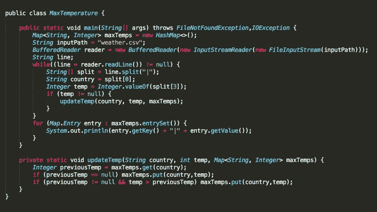
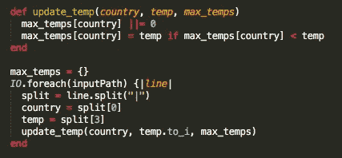
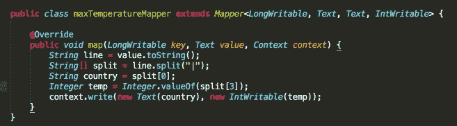
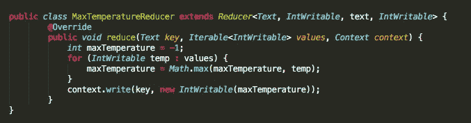
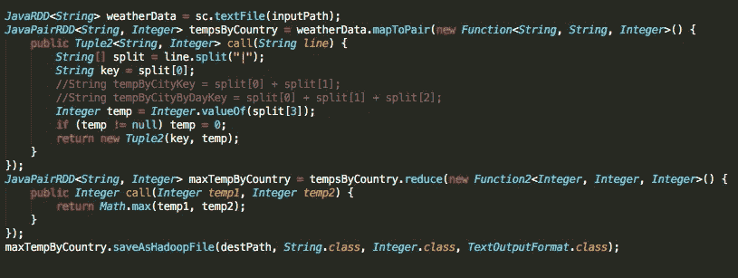

# 为什么我们需要 Apache Spark

> 原文：<https://betterprogramming.pub/why-we-need-apache-spark-51c8a57aa57a>

## 面对海量的新数据，我们需要一个工具来快速消化它们 Spark 就是答案

由 [Unsplash](https://unsplash.com?utm_source=medium&utm_medium=referral) 上 [Greg Rakozy](https://unsplash.com/@grakozy?utm_source=medium&utm_medium=referral) 拍摄的照片

数据就在我们身边。IDC 估计 2013 年“数字世界”的规模为 4.4 千兆字节(1 万亿千兆字节)。目前，数字世界每年增长 40%，到 2020 年，IDC 预计数字世界将达到 440 亿字节，相当于物理世界中每颗恒星的一位数据。

我们有很多数据，但我们不会丢弃任何数据。我们需要一种方法来大规模存储越来越多的数据，防止因硬件故障导致的数据丢失。最后，我们需要一种通过快速反馈循环来消化所有这些数据的方法。感谢宇宙，我们有 Hadoop 和 Spark。

# 一个例子

为了演示 Spark 的有用性，让我们从一个示例数据集开始。500 GB 的样本天气数据包括: **C *国家|城市|日期|温度***

假设我们被要求为这些数据计算每个国家的最高温度，我们从本地 Java 程序开始，因为 Java 是您第二喜欢的编程语言:

## Java 解决方案

然而，在 500 GB 大小的情况下，利用这种本地 Java 方法，即使是这样一个简单的任务也要花将近**五个小时**才能完成。

> " Java 糟透了，我就用 Ruby 写这个，然后很快就开始，Ruby 是我的最爱."

## 红宝石溶液

Ruby 成为你的最爱并不意味着它更适合这个任务。I/O 根本不是 Ruby 的强项，所以 Ruby 比 Java 需要更长的时间来找到最高温度。

使用 [Apache MapReduce](https://hadoop.apache.org/docs/stable/hadoop-mapreduce-client/hadoop-mapreduce-client-core/MapReduceTutorial.html) (我打赌你认为我会说 Spark) *可以最好地解决按城市查找最高温度的问题。这就是 MapReduce 的亮点:将城市映射为键，将温度映射为值，我们将在更短的时间内找到我们的结果，大约 15 分钟，而以前在 Java 中需要 5 个多小时。*

最大温度映射

最高温度降低器

MapReduce 是解决这个问题的完美可行的解决方案。与原生 Java 解决方案相比，这种方法的运行速度要快得多，因为 MapReduce 框架在将地图任务委托给我们的工作集群方面表现出色。行被从我们的文件并行地输入到每个集群节点，而它们被一次一行地输入到我们本地 Java 的 main 方法中。

# 问题是

计算每个国家的最高温度本身是一项新颖的任务，但这并不是开创性的分析。真实世界的数据带来了更麻烦的模式和复杂的分析，推动我们使用工具来填补我们特定的空缺。

如果我们被要求按国家和城市查找最高温度，而不是最高温度，然后我们被要求按天进行分解，会怎么样？如果我们把它混在一起，然后被要求找出平均气温最高的国家，会怎么样？或者如果你想找到你的栖息地，那里的温度永远不会低于 58 度或高于 68 度([塔那那利佛马达加斯加](https://en.wikipedia.org/wiki/Antananarivo)看起来还不错)。

MapReduce 擅长批量数据处理，但在重复分析和小反馈循环方面却落后了。在计算之间重用数据的唯一方法是将其写入外部存储系统(类似 HDFS)。MapReduce 在执行 Reduce 步骤之前，会在每个作业中写出其地图的内容。这意味着每个 MapReduce 作业将完成在其开始时定义的单个任务。

如果我们想要进行上述分析，将需要三个单独的 MapReduce 作业:

1.  *最高温度映射器，最高温度降低器，最高温度运行器*
2.  *maxtemperatebycitymapper，MaxTemperatureByCityReducer，maxtemperatebycitryrunner*
3.  *maxtemperatebycitybydaymapper，MaxTemperatureByCityByDayReducer，maxtemperatebycitybydayrunner*

很明显这很容易失控。

MapReduce 中的数据共享速度很慢，这是由于分布式文件系统的优势:复制、序列化以及最重要的磁盘 IO。许多 MapReduce 应用程序可能会花费高达 90%的时间来读写磁盘。

认识到上述问题后，研究人员开始开发一个专门的框架，可以完成 MapReduce 所不能完成的任务:在一个连接的机器集群上进行内存计算。

# 火花:解决方案

Spark 为我们解决了这个问题。Spark 为我们提供了紧密的反馈循环，并允许我们快速处理多个查询，而且开销很小。

以上三个映射器都可以嵌入到同一个 Spark 作业中，如果需要的话，可以输出多个结果。上面几行可以很容易地用来根据我们具体的工作要求设置正确的键。

使用 RDDs 实现 MaxTemperatureMapper 的 Spark

对于类似的任务，Spark 的迭代速度也将比 MapReduce 快十倍，因为 Spark 完全在内存中运行**——因此它永远不必从磁盘中写入/读取，这通常是一种缓慢而昂贵的操作。**

Apache Spark 是一个非常强大的数据分析和转换工具。如果这篇文章引起了兴趣，请继续关注:在接下来的几篇文章中，我们将深入探讨 Apache Spark 框架的细节。