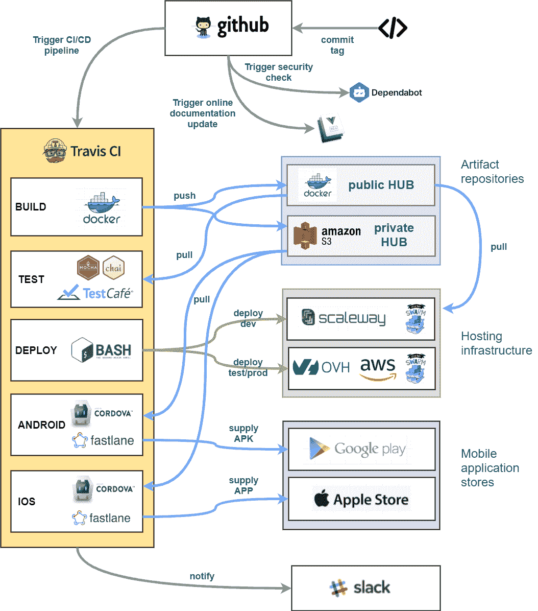
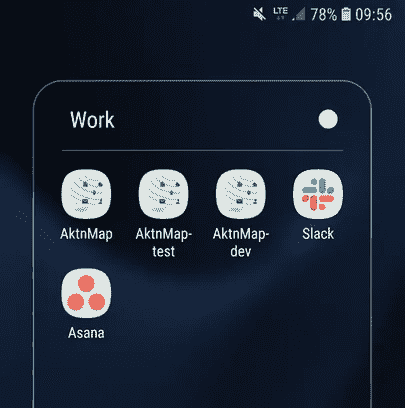
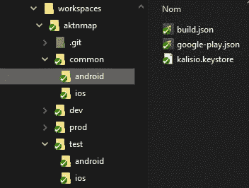

# 为什么我们在 CI/CD 流程中不再使用所谓的最佳实践

> 原文：<https://betterprogramming.pub/why-we-stopped-using-so-called-best-practices-in-our-ci-cd-process-2ff09811f633>

## 或者回避 npm 和否定 Google Play 流程的理由


我们的 Kano 应用程序的截图

# 序文

在 [Kalisio，](https://kalisio.com/)我们开发开源地理空间软件——也就是说，管理地理定位资产的软件，但比地理信息系统通常提供的方式更加友好和面向商业。我们已经建立了一个由各种工具和应用组成的强大生态系统，提供数十种 web 服务来交付我们的 SaaS 解决方案:

*   [Kaabah](https://kalisio.github.io/kaabah/) ，一个构建和运营 Docker 群基础设施的解决方案
*   [Kargo](https://kalisio.github.io/kargo/) ，一个基于 Docker 的部署地理空间服务的解决方案
*   一个极简的提取-转换-加载(ETL)工具
*   Weacast 是一个收集、发布和利用天气预报数据的平台
*   [KDK](https://kalisio.github.io/kdk/) ，一个简化构建地理空间网络应用的开发工具包
*   [Kano](https://kalisio.github.io/kdk/api/kano/) ，2D/3D 地图和天气预报数据浏览器
*   [Akt'n'Map](https://aktnmap.com/) ，一款管理赛场实时事件的应用


我们平台的高级视图

像 [Kano](https://kalisio.github.io/kdk/api/kano/) 或 [Akt'n'Map](https://aktnmap.com/) 这样的应用已经被开发为一组松散耦合的模块，使用 [KDK](https://kalisio.github.io/kdk/) 来防止构建一个[单片软件](http://whatis.techtarget.com/definition/monolithic-architecture)，确保 [s](https://en.wikipedia.org/wiki/Separation_of_concerns) 关注点分离(SoC ),并简化维护，至少从源代码的角度来看是这样的。

此外，我们通过这些解决方案的不同实例(例如配置)来管理专用基础架构，以便能够同时运行我们自己的生产版本、测试版本和测试版本，以及为我们的一些客户定制的版本。因此，我们需要依赖一个可预测的和自动化的过程来发布我们的应用程序。

# CI/CD 管道

持续集成和部署(CI/CD)管道的主要目的是创建/构建应用程序工件(web 应用程序和移动应用程序包的 Docker 映像),并将它们部署到类似生产的环境中，以便使用/测试它们。

我们的 CI/CD 管道如下图所示。



我们的 CI/CD 渠道

每个阶段执行的不同操作如下:

*   **构建**:检索源代码以创建 Docker 映像来运行 web 应用程序
*   **测试**:使用应用映像运行后端和前端测试
*   **部署**:使用应用映像在目标基础设施上部署 web 应用
*   **ANDROID** :构建 Android APK 并将其部署到 Google Play
*   **IOS** :构建 iOS IPA 并将其部署到 App Store Connect

到目前为止，一切顺利——这似乎很简单，不是吗？

然而，正如下文所解释的，我们很难让它在引擎盖下顺利工作。

# 当一些最佳实践被打破时

## 包管理器

[npm](https://nodejs.org/en/knowledge/getting-started/npm/what-is-npm/) 是用 Node.js 管理模块的事实上的解决方案。它很简单，对于独立的生产级模块非常有效。

然而，在开发过程中管理包时，它有一些缺点，特别是在大型生态系统中。

首先，使用未发布的(例如，开发中的)包的过程与使用已发布的包的过程非常不同。虽然在第二种情况下，一个简单的`npm install`就足以获得完整的依赖关系树，但是在第一种情况下，您需要克隆当前正在开发的依赖关系树的所有存储库，并[链接](https://docs.npmjs.com/cli/link)。

第二，由于链接过程发生在 Node.js 安装的全局级别，所以在您的环境中不容易拥有同一个模块的多个版本。

最后，当你有一个很大的依赖树并发布深层模块时，你必须在所有依赖模块上执行升级操作，这可能是痛苦的。事实上，如果你想有可预测的版本。你必须依靠[锁文件](https://docs.npmjs.com/files/package-locks)。当处理大型代码库时，这意味着必须在几十个存储库之间进行更改。

**注意:**由于`npm`管理链接模块的方式[发生了一些变化](http://codetunnel.io/npm-5-changes-to-npm-link/)，我们实际上更喜欢使用 [Yarn](https://yarnpkg.com/) 作为包管理器，但这并不限制本分析的范围。

## 应用商店

应用商店实际上是为本地应用而设计的，而不是基于网络的应用，在基于网络的应用中，前端(例如客户端)和后端(例如服务器)是物理分离的。

因此，发布应用的自然过程是将相同的应用捆绑包(例如，APK 或 IPA)从一个发布状态(例如，私有 alpha 发布)提升到下一个发布状态(例如，公共 beta 发布)。这意味着您不能根据发布状态更改包的默认配置。

由于您的客户端应用程序至少应该能够在不连接到您的服务器的情况下运行(在这种情况下，因为用户没有将浏览器指向正确的服务器 URL)，例如，很自然地将目标服务器 URL 作为其配置的一部分。

但是，如果您的不同版本有不同的端点，那么您必须依靠固定的第三方服务器来中继请求(不简单)或内置的 GUI 来允许用户更改目标服务器 URL(容易出错，并且不是真正的用户友好)。更具挑战性的是，你在任何时候都只能安装一个版本的应用程序，因为所有这些应用程序都共享同一个应用程序 ID。如果您的一些用户正在使用 alpha 版本，他们就不能再使用产品版本了。

## **敏感数据**

由于应用程序依赖于第三方服务，其配置必须包括敏感数据，如 API 密钥、SSH 凭证等。访问所需的服务。当然，如果您的存储库是公共的，这不应该被推到源代码控制之下。

首先，您可以使用在构建文件或存储库设置中设置的[加密环境变量](https://docs.travis-ci.com/user/environment-variables/)。当您有很多环境变量时，它开始变得棘手和不灵活——因为改变一个值需要额外的操作来加密数据。

此外，当您对同一个应用程序有不同的配置时，比如 alpha、beta 和产品版本，这种方法就不太适用。您必须使用命名约定(例如，`VARIABLE_ALPHA`、`VARIABLE_BETA`、`VARIABLE_PROD`)为每个可用配置复制**、**个变量。

最后但并非最不重要的是，如果你的一些秘密不是环境变量而是文件，这是行不通的。在这种情况下，您可以创建一个包含所有安全文件的`secrets.tar`，并使用 [Travis CLI](https://kalisio.github.io/kdk/tools/cli.html#travis-cli) 将加密到`secrets.tar.enc`。这个文件将在构建之前或任何你需要的时候被解密。

然而，同样的限制也适用:您必须使用命名或路径约定为每个可用的配置复制每个文件，并且更改任何文件都需要额外的操作来加密数据。此外，您还需要为原始机密文件找到一个安全的数据存储。

## 前端和后端分离

这种概念上的划分已经演变为每个人的专门开发人员角色，这仍然是整个行业的规范。

在众多观点中，最荒谬的观点之一可能是后端的变化不会影响前端——反之亦然。只有在保持 API 向后兼容的情况下，这才是正确的。事实是我们开发功能，而功能既不是后端也不是前端。很多时候，功能都是。

在这种情况下，工作量随着前端和后端的划分而增加，特别是如果您有很多模块。为了提交任何更改，需要进行两次同步提交，而不是一次。为了发布一个新特性，相同的过程被应用两次。当处理大型代码库时，这意味着必须在几十个存储库中进行更改和操作。

团队可伸缩性也是分离的一个理由，但是当与一个小团队一起工作时(就像我们这样)，最好减少沟通不畅，促进应用程序的顺利开发。

最后但同样重要的是，我们的模块的某些部分是使用同构 JavaScript 编写的，它既运行在客户端又运行在服务器端，因此这种分离在这些部分上没有任何意义。

## **永远**

严格使用 SemVer 实际上需要一个公共 API，这对于将库或模块集成到第三方应用程序中来说是很好的，但对于应用程序本身来说并非如此。

在这种情况下，用户希望次要版本是向后兼容的，具有以前次要版本产生的数据，但在现有功能的工作流程中具有一些新功能或增强功能。主要版本可能会通过删除现有功能并定义新的数据格式来打破这种向后兼容性。

# 我们如何通过定义自己的最佳实践来解决这个问题

如果你稍微思考一下，我们已经有了一个经过验证的可靠的解决方案来管理我们代码的多个版本:Git 分支。我们的想法是尽可能地坚持这个简单的概念，并相应地驱动我们的过程。

1 根据当前 Git 分支的价值，我们的 CI/CD 实际上有三种不同的风格:

*   **开发**:为了部署当前开发/alpha 版本，链接到我们代码的*主*分支
*   **测试**:为了部署当前的测试版本，链接到我们代码的*测试*分支
*   **prod** :为了部署当前的生产版本，链接到我们代码的*测试*分支上的*版本标签*

输出 Docker 图像工件使用预发布的 SemVer 表示法来标识产生它所使用的风格，例如 1.0.0-dev 或 1.3.0-test。

2 我们已经构建了一个简单的 [CLI](https://kalisio.github.io/kdk/tools/cli.html#kdk-cli) ，它基本上是开发基于 KDK 的应用程序时常用 Git/npm/Yarn 命令的多路复用器。

它允许我们使用一个命令轻松地克隆、安装、链接、解除链接和切换应用程序和所有相关模块上的分支。

CLI 依赖于我们称之为*的工作空间文件*，它定义了应用程序和正在开发的模块之间的依赖树。我们的应用程序模板的一个非常简单的示例工作区可以在这里找到—您可以用几个命令创建一个新的工作环境:

```
// Clone all required repositories with the target branch
kdk your_workspace.js --clone your_branch
// Install dependencies in all required modules
kdk your_workspace.js --install
// Link all required modules according to the dependency tree
kdk your_workspace.js --link
```

这里的关键点是无论什么风格(开发、测试或生产)，我们都使用相同的过程。

**注意:**在生产中，我们实际上克隆的是一个标签而不是一个分支，但是从 Git 的角度来看是一样的:一个特定的提交。

我们已经在不同的手机商店为每种口味发布了不同的应用。我们使用 [Cordova](https://cordova.apache.org/) 构建混合移动应用程序，每个应用程序只发布与相应风格相关的状态:

*   用于开发的私有 alpha 版本
*   用于测试的公共测试版
*   产品的公共版本



我们不同的 [Akt'n'Map](https://aktnmap.com/) 应用

4 我们使用一个名为*工作区*的私有 GitHub 存储库作为应用配置的安全存储后端。每个工作区都有每个风格(开发、测试、生产)的子文件夹，外加一个公共的文件夹，包含所有风格共享的配置文件。

为了避免复制太多的环境变量，我们还进行了合并。env 文件包含在 common 和 flavor 子文件夹中，以便构建最终的环境。



应用程序工作区示例

5 在我们的模块中，我们将前端和后端代码放在一起，以便从用户的角度解决一组特定的功能特性(例如，档案管理、计费管理等)。).

由于最终的前端包实际上是在使用 [webpack](https://webpack.js.org/) 构建应用程序时生成的，因此我们避免了在每个模块中管理前端构建配置的痛苦任务。

由于我们使用的是[Quasar](https://quasar.dev/)/[vue . js](https://vuejs.org/)，我们只发布原始组件文件(例如*。vue ),然后由 webpack 处理，并在运行时在应用程序中动态加载[。](https://quasar.dev/quasar-cli/cli-documentation/lazy-loading)

# 结论

我们不想在这里说我们的解决方案比众所周知的方法更相关，但我们假装最佳实践仍然需要受到挑战，特别是在构建大型生态系统和复杂应用程序时。

在这个方向上已经做了一些努力，但是显然没有放之四海而皆准的解决方案。例如，Google 构建了 [repo](https://source.android.com/setup/develop/repo) CLI 来简化在 Android 上开发时跨多个存储库的工作(类似于我们自己的 CLI)。

有了 Git [子模块](https://medium.com/@porteneuve/mastering-git-submodules-34c65e940407)，一个存储库可以利用来自其他存储库的代码，但是没有自动升级和对分支的支持(它只是一个指向子模块存储库的特定提交的指针)。

Monorepo 工具，如 [Lerna](https://github.com/lerna/lerna) ，通过合并库来简化代码库的物理结构，部分解决了这个问题。然而，你仍然需要通过升级和发布相同的软件包来管理你的代码库的逻辑结构。类似地，[位](http://bit/)将构建块(例如，组件或库)从任何存储库中隔离出来，以便在任何存储库中使用，但是您仍然必须管理逻辑结构。

我们知道我们没有找到完美的解决方案。然而，我们从自己的经验中吸取的主要教训如下:

无论您使用什么工具，如果您必须为每个逻辑组件执行单独的操作来发布您的应用程序，这将带来巨大的开销。

在我们的例子中，我们不需要执行特定的动作来发布，除了开发人员每天已经用 Git 执行的动作:提交、合并和标记分支。另一个好处是从基础设施到应用捆绑包的完全隔离的环境，这极大地简化了应用生命周期，并避免了开发相关问题对(预)生产的污染。当然，我们的方法也有缺点:

*   对发布不使用 npm 是违反直觉的，并且链接模块会导致生产中的重复依赖；
*   管理多个基础架构、应用程序等。使得配置部分更加复杂
*   使用动态导入，将为每个组件文件创建块，即使有些块在最终的应用程序中没有使用
*   如果没有模块中前端文件的构建过程，我们只能在应用程序级别执行前端测试

我们期待听到您的反馈和解决方案。