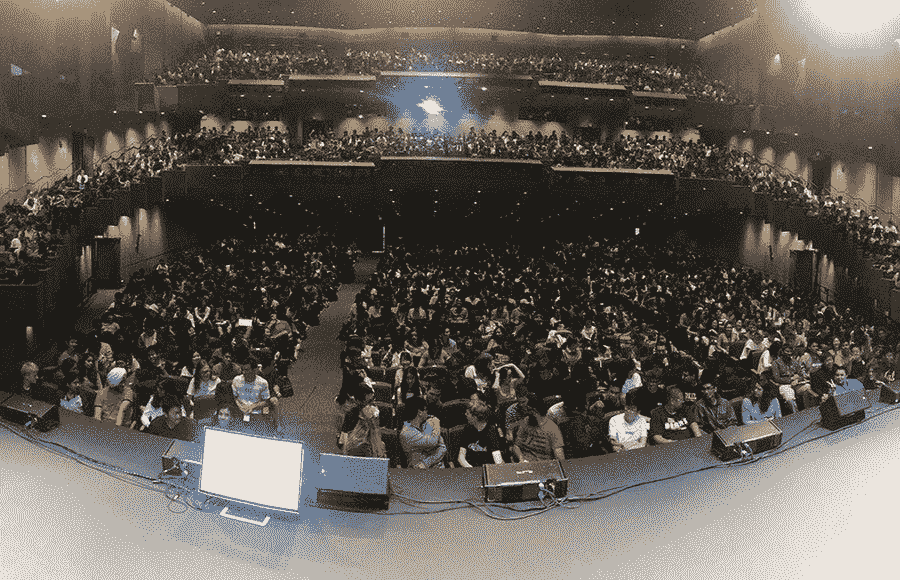
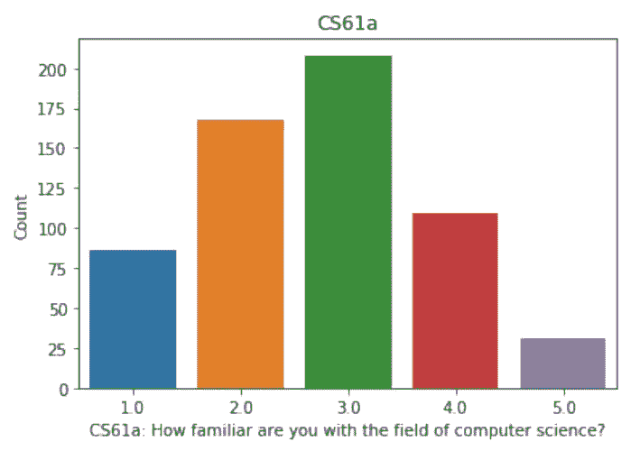
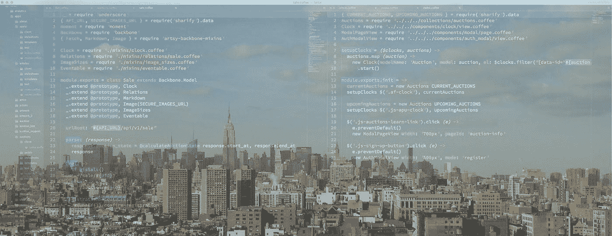
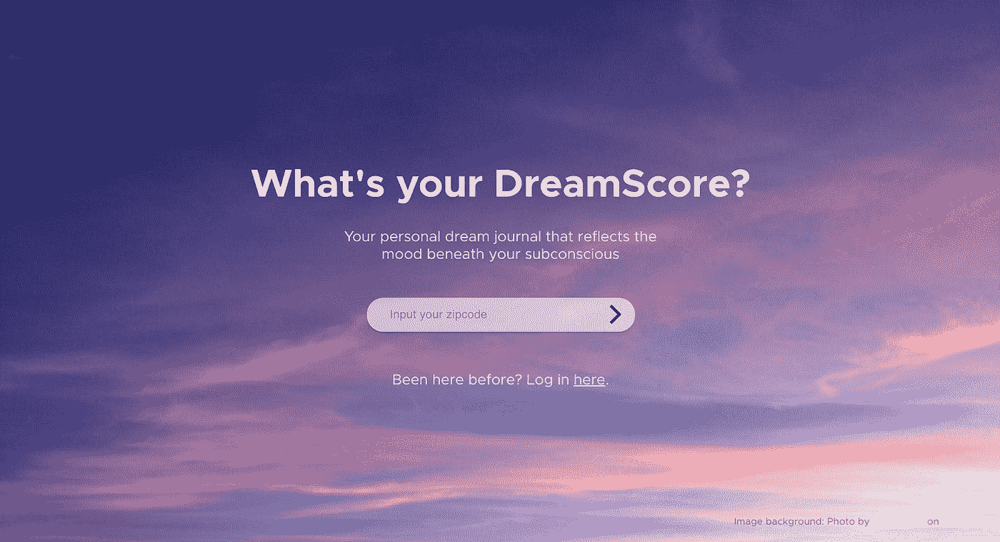
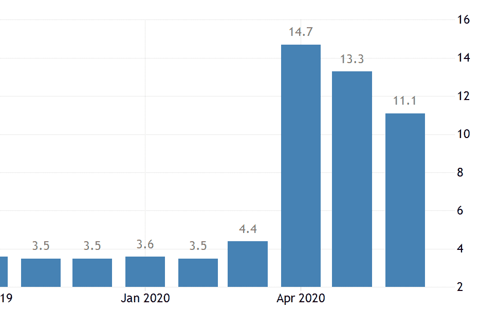
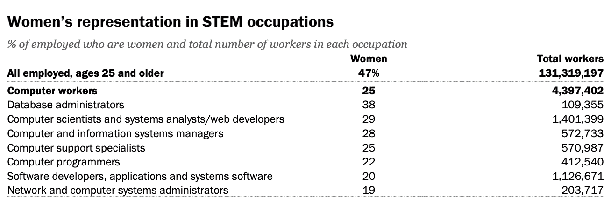

# 为什么女性不从事软件工程职业

> 原文：<https://betterprogramming.pub/why-women-dont-pursue-software-engineering-17d0dead24e9>

## 以及我如何得到我的第一个软件工程师的角色

克里斯蒂娜@ wocintechchat.com 在 [Unsplash](https://unsplash.com?utm_source=medium&utm_medium=referral) 上的照片

多年来，软件工程中的性别差异一直是一个热点问题。公司加大了多样性和包容性的努力，全女性和女性认同的新兵训练营变得更加突出，关于平等的对话成为主流对话。[然而问题依然存在。](https://www.cio.com/article/3516012/women-in-tech-statistics-the-hard-truths-of-an-uphill-battle.html)

大学里的计算机科学课程越来越受欢迎，使得计算机科学入门课程极具竞争力。对于那些有编程经验的人来说，成功的可能性更高，这对女性的影响更大。没有计算机科学学位，一个常见的选择是软件工程训练营。然而，公司通常要求或强烈支持计算机科学学位，一些开发人员对新兵训练营的毕业生怀有负面的偏见。

这些机构——公司和大学——能做些什么来为女性创造更有利的环境呢？我们的男性同事，无论是同事还是学生，能帮上什么忙呢？

我成为软件工程师的曲折道路(我在下面分享)帮助我更好地理解了哪里有进入的障碍和改进的机会。

我对那些希望赋予追求软件工程职位的女性权力的盟友的两个最重要的见解是:

1.  **公开承认你的挣扎，从你有时(如果不是经常的话)困惑或迷失的底线开始行动。**
2.  **重申改变你的想法或选择一条不那么舒适的道路会让你在未来获得更大的成功。**

以下是我的故事:

# **计算机科学 61A**

*加州大学伯克利分校的计算机科学导论课《计算机科学 61A》是全国最大的面授课程之一。(***)**

*上面是 2019 年秋季学期开始时，加州大学伯克利分校计算机科学专业入门课程计算机科学 61A 的 2000 名学生的照片。(我是 2012 年春拍的 CS61A，看起来差不多。)*

*我发现自己置身于学生的海洋中，有一些重要的事情需要注意:*

1.  *根据 2018 年秋季的人口统计数据，这些学生中有 39%是女性。*
2.  *他们中的许多人将不会获得计算机科学学位。(2017 年，在伯克利，只有 22%的计算机科学学位授予了女性。)*
3.  *由于其受欢迎程度，伯克利的 CS 专业是有上限的，这意味着他们需要在这门课和其他两门 CS 入门课程中获得平均 B+或以上的成绩才能申报该专业。(根据《T4》《纽约时报》关于这一趋势的报道，在 2013 年至 2017 年间，全国本科计算机专业学生增加了一倍多，超过 106，000 人。)*
4.  *在 2018 年的一项研究中，CS61A 超过一半的学生有过经验，他们对计算机科学的熟悉程度达到了五分之三或更高。*
5.  *与女生相比，有编码经验的男生比例过高。根据[大学委员会](https://www.collegeboard.org/releases/2019/participation-csp-nearly-doubles)的数据，2019 年，参加计算机科学 AP 考试的学生中，只有不到三分之一是女性。*

**

**根据 2018 年秋季进行的一项* [*研究*](https://www2.eecs.berkeley.edu/Pubs/TechRpts/2019/EECS-2019-96.pdf) *，大多数参加 CS61A 的学生已经熟悉了计算机科学。**

*没有隐含的偏见或女性进入工程职业所面临的任何其他挑战，重要的是回到这幅图并记住女性在 18 岁时就已经落后了。我已经落后了，而 2000 人的班级规模让那些落后的人很容易从缝隙中溜走。*

# ***迷路***

*在这一学期的课程中，我独自在计算机实验室艰难地完成了习题和实验。当我的一个测试案例通过或者在一次考试中得分超过 C+时，我会充满自豪。我现在意识到，大多数软件工程师都有一种在白痴和天才之间反复切换的经历。但那时，我感到孤独。即使在我的 30 个学生的实验室里，我也感到孤独。我是为数不多的几个女性之一，我的项目伙伴经常以自己完成项目而告终，或者进展太快以至于我跟不上。*

*我最终成功地完成了 CS61A，并开始了 CS61B，这可能更难。不幸的是，我的正式 CS 生涯即将结束。我在 CS61B 一学期的大部分时间都是在一个地下计算机实验室里度过的，比喻性地(有一次是身体上的)用头撞电脑显示器。我真的不适合做这个。*

# ***选择不同的东西***

*我放弃的主要原因是我觉得我的计算机科学课和我的余生有冲突。作为大学校报的艺术和娱乐编辑，我的工作要求很高，作为伯克利学生合作社和泛希腊女生联谊会的成员，我的社交生活也很活跃。从表面上看，成功的学生们把所有的时间都花在了苏打厅里，默默地努力着。我在他们身上看不到自己。*

*在接下来的几年里，我更加注重我的人文背景和对艺术的热情。我宣布了艺术和技术的跨学科研究专业(加州大学伯克利分校的 DIY 专业项目)。我在信息学院和伯克利的新媒体中心学习课程，这让我能够通过 Arduino 和 Processing 探索编程。我在旧金山现代艺术博物馆的数字团队和惠特尼博物馆的交流团队实习。我的梦想是在 Artsy 工作，那是当时艺术界仅有的几家科技公司之一。([大一的时候，我为报纸写的第一篇文章](https://www.dailycal.org/2012/01/21/the-art-genome-project-2/)是关于公司成立前的 Artsy。)*

**

**阿奇在纽约州索霍区的办公室。**

*我于 2016 年 1 月毕业并加入 Artsy，担任通信实习生，留下了我的技术背景。作为一个天生外向、写作能力强的人，沟通是一个完美的选择。这家公司不仅仅实现了我多年来的梦想。我想象不出一个更好的地方来开始我的职业生涯。*

# ***对建筑的向往***

*但有些东西总是萦绕在我的脑海里，偶尔，一个工程师能够重新唤醒这种感觉，即使只是一会儿。*

*我为 Artsy 做的第一个项目是将沟通团队联系人从数百个谷歌电子表格迁移到 Salesforce。我和一位高级软件工程师一起参与了这个项目，我对数据结构的研究最终被证明是相关的。Artsy 的数据团队提供了一门 Looker 课程，我随后花了几个小时构建仪表盘，试图更好地理解旋转意味着什么。与一名工程师坐下来了解该应用程序的新 AR 功能，这样我就可以写一篇新闻稿，这是我工作中最美好的一天。所以我和一位工程师一起写了这篇文章:[在一个支持女性工程师的环境中工作是什么感觉](https://medium.com/artsy-blog/what-it-feels-like-to-work-in-a-supportive-environment-for-female-engineers-3c994a001007)。*

**

**从阿奇的办公室看朝北的景色。**

*一种模式正在形成。虽然我花了一些时间才意识到，但我仍然对技术工作感兴趣。媒体关系、新闻稿写作和精心制作信息不是我想要长期继续职业生涯的领域。*

# ***训练营之路***

*去年九月，在四年并三次晋升之后，我被解雇了，这是首席执行官变动和重大重组的一部分。这是一个意想不到的——老实说，在当时是非常令人难过的——转折。但是突然之间，我面前出现了一张完全空白的画布，在这张画布上，我可以自由地设计我梦想的任何职业道路。*

*我回想起大学计算机科学，开始经历一些 PTSD。我真的不够聪明吗？还是说我没有合适的气质？我是否应该因为擅长通信，而且对我来说很容易，而坚持通信？*

*不安全感在我脑海中盘旋，我考虑从事客户支持和产品管理等领域——更接近技术，但仍然舒适地融入了我与生俱来的技能，并在过去几年中积累了这些技能。*

*我开始与 Artsy 的一些工程师交谈，并意识到我最钦佩的几名开发人员来自非传统途径(他们不是计算机科学或工程专业的)，在另一个领域工作了几年后完成了一个新兵训练营。有趣的是，Artsy 的大多数女工程师都是新兵训练营的毕业生——在你的公司追求性别平等时，这一点非常重要。*

*当未来向我敞开大门，让我专注于全新的事物并承担风险时，训练营对我来说可能是一个很好的选择。在一些艺术校友的建议下，我报名参加了熨斗学校，这是纽约市最顶尖的训练营之一。*

# ***伟大的解锁***

*在我的第一天，我，当然，数了数我的同伴中的女性。13 名学生中，有 4 名女性。略低于三分之一。([根据熨斗](https://hi.flatironschool.com/rs/072-UWY-209/images/Flatiron%20School%20Jobs%20Report.pdf)的数据，2019 年 35%的学生是女性，这与 2017 年和 2018 年女性分别占毕业群体的 31%和 35%相当持平。)尽管故障与管道的其他部分相当一致，但我感到兴奋，并被一个支持性的环境所拥抱。第一天，他们分享了一张幻灯片，上面有“冒名顶替综合症”,他们花了 10 分钟左右的时间公开向我们讲述了这个问题——这真的让我印象深刻。*

*在最初的几周，我主要是复习用 Ruby 而不是 Python 教授的基本编码概念——条件、循环、类，我觉得这很适合我。随着时间的推移，我轻松地浏览了班上的大部分材料。我完全认识到新兵训练营提供了一种不同于大学课程的编程教育，并强调了[学习如何学习编码](https://www.break-in.tech/lessons/learning-how-to-learn-to-code)的重要性。但这对我来说很容易，我对自己如何能想出一个想法，然后用代码把它变成现实感到敬畏。感觉就像魔法一样。*

**

**我在熨斗的最终项目截图，*[*dream score*](http://mydreamscores.co)*。**

*为我打开的东西。突然间我有了超能力。我感到一阵遗憾，就像我错过了过去几年，就像有人偷偷向我隐瞒了什么。我想主要是我在压抑自己。*

# ***找工作，但要让它成为 COVID***

*2020 年 3 月 27 日毕业于熨斗。那一天，美国共有 68334 例新冠肺炎病例，失业率将在 4 月份达到 14.7%的峰值(高于 2 月份的 3.5%)。现在不是进入就业市场的最佳时机。*

**

*失业率在 2020 年早些时候接近低点后，于 4 月达到 14.7%的峰值。( [*美国劳工统计局*](https://tradingeconomics.com/united-states/unemployment-rate) *)**

*尽管如此，带着我新获得的自信，我去了人行道(又名 Zoom ),去喝虚拟咖啡、打信息电话和打电话。我真的以为，因为我是一名在顶级科技公司工作了四年的女性，拥有强大的人际关系网和高于平均水平的人际交往能力，我不会有任何问题。我大错特错了。*

*我反复听到，“我们只招高级工程师”，“你没有开发人员的专业经验”，“我们只招有计算机科学学位的人。”我很快了解到，无论是否有 COVID，新兵训练营毕业生的道路都是崎岖不平的，尤其是现在有大量经验丰富的新下岗工程人才涌入市场。*

*我设法获得了一些面试机会，先是在像脸书、T2、亚马逊这样的大公司，后来又去了一些小公司。他们很有挑战性，从在人前编码，在[复杂的带回家的项目](https://medium.com/@anna_carey/learning-flask-after-ruby-on-rails-e8c0708ffd40)上花费数小时，到解决算法问题，这些他们在熨斗不涉及。我真的很喜欢这个过程，我的学习也继续飞速发展。但是压力很大，很多时候看起来很绝望。*

*最让我失望的是，除了雇佣我的那家公司，我的面试官都是男性。如果你不明白为什么这是一个问题，我们有一个问题。*

*如果你看看这些数字，这并不令人惊讶——在 2014 年至 2016 年期间，STEM 中 25%的计算机相关工作由女性担任([皮尤研究中心](https://www.pewsocialtrends.org/2018/01/09/diversity-in-the-stem-workforce-varies-widely-across-jobs/))，这些年来这一数字一直在下降。*

**

*[*皮尤研究中心*](https://www.pewsocialtrends.org/2018/01/09/diversity-in-the-stem-workforce-varies-widely-across-jobs/)*STEM 性别人口统计研究，2014–2016。**

# ***向前和向上***

*我找工作的最终目标是找到一个地方，在那里我会有充足的指导、学习机会和有培训初级人才经验的经理。虽然我喜欢被扔进深水区——我在 Artsy 生活在深水区，热爱每一分钟——但我的首要任务是尽快提高我的技术能力，并从最好的工程师那里学习最佳实践。当我第一次开始在 VTS 面试时，我被技术面试的支持性质所打动，这些面试在本质上更具合作性，似乎旨在为我的成功做准备，而不是暴露我的弱点。*

*几天后，我得到了一个团队实习的机会，这是我第一次作为专业软件工程师实习。*

*如果我能撼动 18 岁的自己，那个充满自我怀疑，即将为了她认为会永远的东西而放弃计算机科学的自己，我会告诉她:*

*   *如果你准备好在迷失的时候坚持下去，成为真正的谷歌高手，你就拥有成为一名工程师所需的一切。*
*   ***你的沟通技巧和对人文学科的偏好并不会降低你作为开发人员的价值，反而会让你成为一名更强的工程师。***
*   ***每个软件工程师都在努力奋斗*很多*，即使他们没有表现出来。***

*我希望其他有抱负的软件工程师，尤其是女性，在这篇文章中找到一点前进的动力。这个世界需要更多的女性来开发软件。如果你认为我可以帮助你，请联系我。*