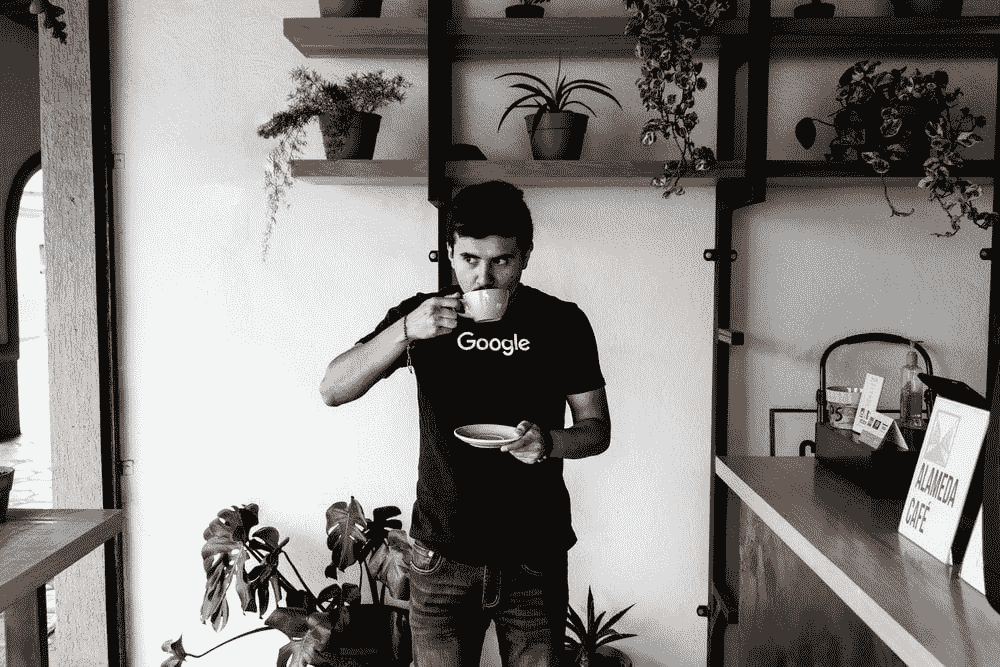
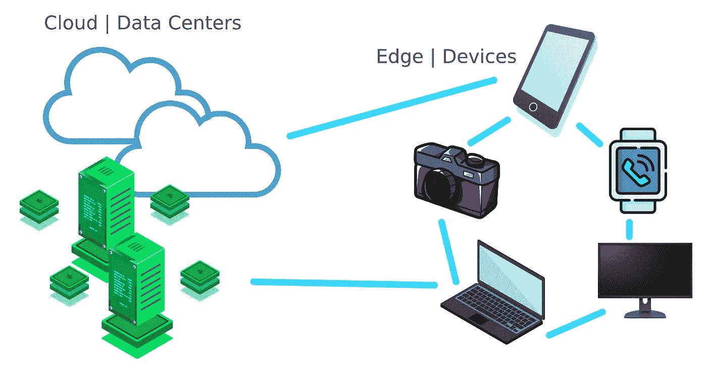
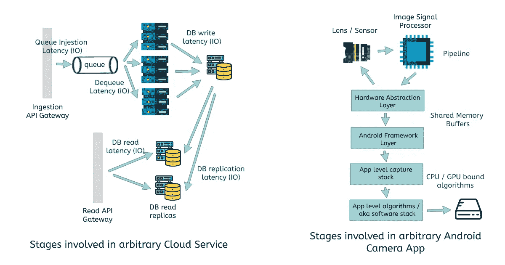

# 我在微软云和谷歌移动工作了 3 年——这是生态系统的不同之处

> 原文：<https://betterprogramming.pub/why-working-on-cloud-vs-mobile-edge-is-so-different-e32930f1c801>

## 为什么云与移动(边缘)的工作如此不同？

费尔南多·埃尔南德斯在 [Unsplash](https://unsplash.com/photos/CGrdzzSceAw) 上的照片。

最近，我迎来了在谷歌工作的第三个周年纪念日！

那是在 5 月 21 日。我有几个同事和我的妻子为此向我表示祝贺。这让我怀疑这是否真的是值得表扬的事情。不知不觉中，它带我踏上了一段回顾之旅，现在我们在这里——写了一篇很长的文章！

我于 2019 年 5 月 21 日加入谷歌，在此之前，我在微软工作了三年。

对我来说，这不仅仅是雇主或标签的变化，当我做出改变时，我:

*   从印度搬到新加坡。
*   从云计算转向移动/相机技术。
*   从考虑强大的分布式系统转向考虑低功耗的边缘设备。
*   从为企业客户构建转变为为最终用户构建。
*   从或多或少独立工作转向领导他人。

所以在某种程度上，我在所有这些垂直领域都获得了 50%到 50%的经验。尽管我必须承认，第二部分从第一部分的所有经历中受益匪浅。

在这篇文章中，我将讨论第二点

> 从云计算转向移动和摄像技术

回顾过去，我意识到在我们处理的约束、我们在构建两者时的思维过程、发布周期的性质以及我们向客户提供的服务水平协议方面有多么大的不同。

我将从我一直在做的事情的更多的背景开始。

# 重要说明

> 这是一篇很长的文章！比我写过的任何一部都长。当我开始的时候，我没有意识到有这么多要说的，但是确实有。
> 
> 如果你不想看那么久，我完全理解。
> 
> 如果您有兴趣获得关键见解，请直接转到**云与移动工作的差异(边缘)**部分。我将差异划分为关键的垂直市场，请随意挑选感兴趣的垂直市场。

这些是我将一节一节讨论的云和移动之间的差异:

*   问题陈述的差异
*   我们作为工程师处理的约束的差异。
*   这两种团队在一般发布周期上的差异。
*   产品经济性的差异
*   我们向客户提供的服务级别协议的差异及其对开发人员的影响

# 我到底在做什么

如果你有兴趣直接了解两者的区别，可以跳过这一部分。

## 在谷歌

到目前为止，我在谷歌开发一款名为[相机的产品。](https://developers.google.com/camera)

这是一款面向低端安卓设备的安卓相机。我主要从事计算摄影方面的工作，包括 HDR、夜间模式、人像模式等。我还花了大量时间在处理和存储层上。

我的工作一直专注于研究计算摄影算法和编写高度优化的实现，这些实现可以在目标设备的低延迟和低内存限制下运行。

由[作者](https://unsplash.com/@mebjas)在马来西亚兰卡威的 Pixel 6 Pro 上拍摄的 HDR 照片。 [Unsplash](https://unsplash.com/photos/BFoEa5guBjU) 上的照片。

## 在微软

在微软，我是 [Azure Monitor / Alerts](https://docs.microsoft.com/en-us/azure/azure-monitor/overview) 团队的一员。Azure 是微软的云平台，我的团队是该服务的一部分，负责向云用户提供触发警报。

> 例如:假设像宝马这样的客户在 Azure 上托管了几个服务，其中一个部分或完全关闭了——宝马的 SRE 团队需要迅速获得关于此类问题的警报。

在这个团队中，我致力于两个关键方面

*   提高服务的可用性:考虑到监控的核心性质，服务需要高度可用。
*   构建警报聚合服务:通过关联活动警报和对由于单一根本原因而产生的警报进行分组，减少客户端必须筛选的警报数量。这更多的是云+数据科学问题陈述。

# 云与移动

云 vs 边缘层|作者图片

当我说“在云上工作”时，我将它作为一个总括术语，用于不同类型的工程工作，包括构建在数据中心运行的实时服务。例如

*   构建属于云服务提供商产品的服务，比如构建 Azure、Google 云平台或 AWS 的一部分。
*   在这些云服务提供商的基础上构建分布式服务——假设您正在使用谷歌云平台构建一个 SaaS 解决方案。

我们在云上构建的东西运行在全球托管的多台服务器上。

另一方面，当我看到“在移动设备上工作”时，它可以被认为是运行在终端消费者硬件上的软件产品的同义词。这方面的一个例子是:

*   手机上运行的相机应用程序。
*   智能手表上运行的闹钟应用程序
*   数码相机上运行的图库应用程序

根据我的经验，我将把移动部分的重点放在智能手机上运行的应用程序上。但是考虑到智能手机，尤其是运行 Android 的智能手机，可能会有不同的硬件规格，这些约束可能会扩展到上述所有示例。

在本文的其余部分，我可能会交替使用术语“边缘”和“移动”。

通常一个产品包含两种产品，其中一个边缘应用是运行在后端的云服务的前端。在本文中，当我说 edge 或 mobile 时，我纯粹是指在边缘设备上运行的应用程序，类似地，云也指后端部分。

# 云与移动工作的差异(边缘)

## 问题陈述

Volodymyr Hryshchenko 在 [Unsplash](https://unsplash.com/photos/inI8GnmS190) 上拍摄的照片。

工程师在构建云服务和边缘应用时关注的关键问题陈述有很大不同。

对我来说，在使用 Azure 时，主要的问题陈述包括以下几个方面。

## 我们在云中经常遇到的问题陈述

**可用性** —构建服务时，需要确保服务尽可能长时间地运行。

它也指停机时间，在这种情况下，我们努力将停机时间降至最低。它通常以 9 的可用性来衡量。4 个 9 的可用性，即 99.99%的可用性意味着您的服务在一个月内最多只能停机 4 分 22 秒！

为了提高系统的可用性，我们必须投资冗余。服务实例可能由于各种原因而变得不可用，确保整体可用性的最佳方法是使您的服务冗余，以便始终有一部分服务保持运行，从而使您的整体产品可供用户使用。

这比听起来要难，通常需要沉溺于更多的问题陈述，如热与冷故障转移、回退、断路器、重试模式等。

> 在我在微软的角色中，我领导的一个项目涉及即使 Azure 数据中心宕机，也要让部分警报服务正常运行。
> 
> 为此，我们必须投资跨地理位置冗余，即不同地理位置的每个数据中心都将与物理位置足够远的数据中心配对，以确保两个地理位置发生物理灾难的可能性最小(例如:洪水)。但与此同时，跨地域网络请求的时间成本并没有使我们的服务变慢太多。
> 
> 例如，美国东部数据中心将与美国西部数据中心配对，而不是与东南亚数据中心配对。

**一致性—** 与可用性相比，这通常是一种折衷(查找上限定理)。工程师/团队必须决定哪种一致性适合他们的需求。一些问题可能需要很强的一致性，而另一些问题可能需要最终的一致性。

**多租户和隐私—** 在云中，计算资源用于处理来自不同用户(或租户)的数据。这需要我们非常小心地确保数据边界。不同的租户应该永远不能访问或修改彼此的数据，除非这是预期的行为。

**成本因素** —我刚刚提到了计算资源如何在云中的用户之间共享，这与移动应用程序不同。在移动应用程序中，计算对用户是私有的，并由用户付费。

在云的情况下，计算资源(即物理硬件)归服务提供商所有，并在用户之间共享(在抽象层下)。

因此，在云的情况下，人们需要注意计算资源的经济性，因为它很容易失控。当您开始处理像高可用性这样的问题时，这变得尤其重要。

我将在一个特定的章节中详细介绍这一点。

## 构建移动应用程序时的问题陈述

**异构设备—** 这尤其与 Android 设备相关。有各种各样的设备具有不同的计算能力(CPU、总内存/ RAM、GPU、DSP 等专用硬件加速器)、不同的摄像头、不同的电池容量&不同的显示器尺寸和分辨率。

实际上，这更像是一个总括性的问题陈述。因此，我们需要构建可跨不同设备扩展的应用程序。

就计算而言，算法需要在特定的延迟限制内跨设备运行(稍后将详细介绍)。这与我工作的相机应用程序非常相关。

> 在谷歌的相机中，我们需要确保我们的算法，如 HDR 或夜间模式，可以在几秒钟内生成高质量的图像，即使是在我们支持的最低端设备上。但与此同时，我们不希望算法在高端设备上表现不佳。

这有时通过使算法适应可用的计算能力来实现。当这不可行时，我们需要确保这些功能仅在能够提供愉快用户体验的设备上启用。

通常，随着新版本操作系统的出现，它们会提供新的产品。这些应用需要能够在运行不同操作系统版本的设备之间扩展。

**电池消耗—** 对于所有类型的应用来说，这可能不是一个大问题。考虑到相机应用程序依赖于多个硬件，所有这些硬件都很耗电，这对于相机这样的应用程序来说无疑是一个问题。这是我在云后端工作时从来不需要考虑的事情。

> 我故意没有在这里把用户体验作为问题陈述，因为我们需要在构建云应用程序和移动应用程序的同时处理 UX。通常，移动应用程序是运行在后端的服务的前端。处理 A11y 和国际化等问题也是如此。

# 制约因素

照片由 [**阿卜杜勒一**](https://unsplash.com/@abdullishere) 上的 [Unsplash](https://unsplash.com/photos/CxRBtNe243k) 。

在这方面，我既看到了很多不同之处，也看到了很多相似之处。

## **相似点第一**

不用说，每个人都希望他们的应用程序很快。我们必须通过面试来展示这些技能。

无论是云还是移动，每个人都在尝试编写高效的算法。“高效”一词实际上比“快速”更恰当。

有时我们可能需要算法具有低延迟，有时需要低内存占用，对于移动应用程序，有时甚至需要二进制大小(APK 大小)。通常是所有这些的混合。例如，在手机中，我们通常会看到

> 在内存占用和二进制大小的上限内尽可能快。

## 差异

让我们考虑一些与 Azure 等云服务提供商的警报服务相关的**关键绩效指标(KPI)** 。

*   **服务的可用性—** 服务应在至少 99.9%的时间内保持正常运行。我们会从正常运行时间和停机时间的角度来考虑这个问题。
*   **警报触发延迟—** 假设我们有一个 CPU 警报规则，如果 CPU 在过去 5 分钟内以高于 95%的速度运行，就会触发警报。延迟是事件实际发生和警报触发之间的时间(以秒为单位)。
*   **警报通知延迟—** 这是事件发生(如上所述)和用户实际收到通知之间的时间延迟，单位为秒或分钟。

另一方面，对于运行在 Android 操作系统上的相机应用程序，KPI 将是

*   **应用程序启动延迟—** 用户点击应用程序图标和应用程序实际准备就绪之间的时间延迟，以毫秒为单位。
*   **应用崩溃率—** 应用崩溃的时间占应用打开时间的百分比。对于一个设计良好的应用程序来说，这应该是非常低的。
*   **ANR 速率(App 无响应)——**与上述相似。如果应用程序帧被冻结超过 K 秒，它被视为没有响应。该指标将意味着发生这种情况的时间与用户打开应用程序的时间的百分比。这个也应该低得离谱。
*   **镜头的端到端延迟—** 这是特定于摄像机的延迟。这将指示从用户点击快门按钮到最终图像被保存到磁盘所花费的总时间。这是以毫秒计量的**。**
*   **捕捉镜头的延迟时间—** 同样是相机特有的。从用户点击快门按钮到照片被拍摄的时间。这通常是更多的面向用户的延迟，并控制用户连续拍摄的速度。有时称为镜头间延迟。

不知道你是否注意到了，但一个关键的区别是，云中的 KPI 通常以秒为单位来衡量，而移动应用程序的 KPI 则以毫秒为单位。

这张图表显示了我们过去如何看待云中的延迟和改进领域。

图表显示了任意云服务(左)与任意 Android 相机应用(右)中涉及的步骤。图片由作者使用 Photopea。

将大型服务实现为一套微型服务有几个优点。在这篇文章中，我不打算讨论微服务 vs .整体 vs .混合，但这就是我们所拥有的。

> 在云中，网络或 I/O 延迟通常是最大的瓶颈。在没有整体 KPI 的情况下，对算法运行时进行几毫秒的优化没有多大帮助。

如果我们考虑跨数据中心的话，网络呼叫通常可以达到 10-100ms，甚至更高(参见每个工程师都应该知道的[数字](https://gist.github.com/jboner/2841832))。

在云中，我们使用的大部分存储也是分布式的。无论是 blob 还是存储在某些数据库中的结构化数据。

> 我们的优化包括思考如何减少网络呼叫，尤其是跨数据中心的呼叫。但是，与高弹性相比，这是一种折衷，因为我们需要在另一端运行冗余服务。

我们曾经用优雅的故障转移机制来解决这个问题。

在移动领域，这是一个不同的游戏。对于 1300 万像素的图像，我们编写的算法需要处理 1300 万次，在一个小的延迟阈值内。

> 缓存在移动和云中都很常见，不同之处在于，在移动中，我们希望减少将数据/引用从主内存提取到 CPU 寄存器的时间，而在云中，我们希望减少将数据从分布式存储提取到单个服务实例的内存的时间。

当我在相机上优化一个算法时，如果我从`60ms`到`30ms`优化一个算法，这是一个幸运日。在云数的情况下，这个数字可能不会产生影响。

在云中，我们的服务器实例是具有 32 GB 总内存和 8–16 个 CPU 内核的 Linux 机器。它们是支持高级指令集的现代 CPU。

> 老实说，在我的云时代，我既不知道如何利用现代 CPU，也不关心。

对于相机应用程序，我们今天的目标硬件有时是低时钟速度(例如 1300MHz)的四核 CPU 和低至 1GB 的 LPDDR3 内存芯片(相当于< 200 Mb for the app to use) and 【 instruction sets.

> Also, some Android OS variants running on low end hardware are 32 bit.

In cloud, we used to load large ML models (worth 1000Mb+) and keep them in our main memory. On the other hand, in case of mobile, we do consider cleaning up ML models from main memory as soon as they are no longer needed (they are usually much smaller).

In cloud there is always an option of horizontal scaling — i.e. increasing the server instances to handle the load (thus keeping the latencies stable most of time). In mobile, this is not an option. We have to think hard on vertical optimisation.

> **TL；DR；**与云相比，在移动中，算法需要在运行较低计算资源的同时，在延迟方面有更严格的阈值。

> PS:有这样一个案例，我们确实受益于云中的垂直优化。我们维护着一个围绕警报的贝叶斯网络，我们过去常常将这些数据序列化为 JSON，并将其存储在分布式存储 blobs 中。我们开始观察到，对于某个具有高警报量的用户，网络会变得不合理地大(1000Mb+)。那时我们才发现 json 编码、解码和传输如此大量的数据是多么昂贵。
> 
> 我们投资了自己的密集序列化/去序列化方法，该方法通过疯狂的因素(IIRC 300 倍)减少了运行时延迟和 IO 延迟。

# 发布周期

柴坦尼亚电视台在 [Unsplash](https://unsplash.com/photos/1Kqc8ymfMKY) 拍摄的照片。

发布周期代表了一个团队发布新版本的频率。在云服务的情况下，这将表明最新验证的二进制文件的部署，而对于 Android 应用程序，这将意味着更新 Play Store 上的应用程序。

云和移动用户之间的一个主要区别是

*   在云上，一旦开发团队将服务部署到云上，用户就可以开始从更新中受益

> 只要客户端程序能够尽快利用它——想象一个网页作为客户端。

*   对于移动应用程序，用户需要更新到应用程序的最新版本。

> 忽略内部使用基于网络的方法或在应用更新中的移动应用。

我所看到的是，这种差异极大地影响了产品的发布周期。

> 云服务可以更频繁地部署，因为使用它的用户负担更轻。

测试或进行 canary 部署或监控发布的负担落在了团队一方。另一方面，对于一个移动应用程序，你需要更加小心，不要让用户负担过重。

在相机的情况下，我们经常看到最新版本的采用遵循某种曲线，最终停滞不前。我们从来没有让 100%的用户采用最新的版本。

一个雄心勃勃的云服务团队可以每周进行部署，或者为不同的微服务解耦发布周期，或者拥有[连续部署](https://www.atlassian.com/continuous-delivery/principles/continuous-integration-vs-delivery-vs-deployment)模型。

为了测试我工作的移动应用程序，我们非常依赖自动化+手动测试的组合。每个候选版本都经过了严格和详尽的测试。如果我们最终向 PlayStore 部署了一个损坏的二进制文件，这将破坏用户的原生相机体验。如果发生这种情况，用户必须再次更新应用程序到最新版本(如果可用)。

像这样的移动应用程序可能会有一个月、六周甚至两个月的发布周期。

> 这可能不适用于所有类型的移动应用程序，因为它在很大程度上取决于应用程序的设计。如果应用程序基本上呈现基于 web 的数据，团队可以遵循更快速的部署模型。

# 经济学

由[莎伦·麦卡琴](https://unsplash.com/@sharonmccutcheon)在 [Unsplash](https://unsplash.com/photos/8lnbXtxFGZw) 上拍摄的照片。

> 我在问题陈述部分简要介绍了这一点。

我们来谈谈钱吧！

对于纯粹在移动设备上运行的应用程序，计算完全来自设备。它是由用户支付的。开发团队不承担计算成本。它们通常作为完全免费的应用程序或以免费增值模式或一次性支付模式甚至订阅模式出售给用户。

对于云服务，开发团队要么需要承担硬件基础设施的成本，要么需要承担底层云服务的成本。前者适用于投资建设和维护数据中心及相关基础设施的核心云服务提供商(如谷歌、微软或亚马逊的核心云团队)。后者是建立在其他核心云服务之上的服务。

我曾经工作过的 Azure alerting 服务(虽然是 Azure 的一部分)在其他核心 Azure 服务(后者)之上构建了基础设施。

无论哪种方式，团队都要承担底层基础架构的成本，这些成本通常以不透明的方式在客户之间共享。例如，全球部署的几个云服务实例将为消费者处理数百万的数据和处理。这里的经济学包括找到一个最佳点，从数百万消费者那里获得的净收入可以高于基础设施成本和其他运营成本。

相信我，使用云服务的成本会迅速飙升。虽然这对微软来说没什么大不了的，但对新创公司来说意义重大。精心设计的服务在这方面可能很有效。

> 通常，构建弹性云服务需要向系统添加冗余，这会导致运营成本增加。这通常是向上游推送给用户的，例如，他们可以使用带有或不带有地理弹性的服务产品，具有不同的成本和可用性模型。

# 服务水平协议

> 这对工程师产生了影响

塞巴斯蒂安·赫尔曼在 [Unsplash](https://unsplash.com/photos/NbtIDoFKGO8) 上的照片。

这一个可能不是关于云服务和移动应用本身。更多的是关于产品及其对顾客的影响。服务水平协议是证明服务质量的一种很好的合同方式。

付费 Azure 客户的服务水平协议的一个例子是

> 在一个月的时间范围内，99.9%的时间都可以使用监控服务。如果可用性低于 99.9%，Azure 将向客户返还 25%的费用。如果可用性低于 90%，Azure 将向客户返还 50%的费用。

这是不同云服务提供商提供的常见方法。

对于像股票相机应用程序这样的应用程序，我们没有这样的 SLA。尽管与此同时，团队政策将包括以最高优先级修复任何核心用例阻塞问题，并且理想情况下不允许将这种不完整的体验交付给用户。

> 如果你为一个开发移动应用的团队工作，同时也为客户提供严格的 SLA，请让我知道(我可以更新我的知识库并在这里添加例子)。

这对工程团队产生了有趣的影响。为了实现上述 SLA，云团队通常有一个随叫随到的**的概念。**

在 Azure 每周(持续时间可能因团队或产品而异)团队中的一名工程师会随叫随到。该工程师负责监控服务，并对可能已经发出的任何警报进行分类。根据严重程度，工程师应在一定的时间范围内采取行动。

> 我不喜欢这样！在待命期间，我经常不得不在凌晨 2 点醒来，试图找到问题的根源。

在相机应用程序中，虽然我们没有随叫随到，但我们有值班的概念。每周我们中的一个人会负责监控问题，分类错误，监控仪表板，并确保构建进展顺利。不过这仅限于我们的正常工作时间。

> 我真的更喜欢这个！

# 结束语

到目前为止，这是一段有趣的旅程，我真的很享受我在谷歌的工作，并且可能会在这个领域继续工作更长时间！

如果你一直读到这里，那你就太棒了。希望听听大家的意见。

# 参考

*   [谷歌相机](https://developers.google.com/camera)
*   [蔚蓝监视器](https://docs.microsoft.com/en-us/azure/azure-monitor/overview)
*   [正常运行时间计算器](https://uptime.is/) — 99.99%正常运行时间
*   [边缘计算和云计算有什么区别？](https://blogs.nvidia.com/blog/2022/01/05/difference-between-cloud-and-edge-computing/#:~:text=The%20main%20difference%20between%20cloud,deploy%20them%20at%20the%20edge.)
*   [最终一致性与强一致性](https://medium.com/system-design-blog/eventual-consistency-vs-strong-consistency-b4de1f92534d)

# 照片致谢

*   费尔南多·埃尔南德斯在 [Unsplash](https://unsplash.com/photos/CGrdzzSceAw) 上拍摄的照片。