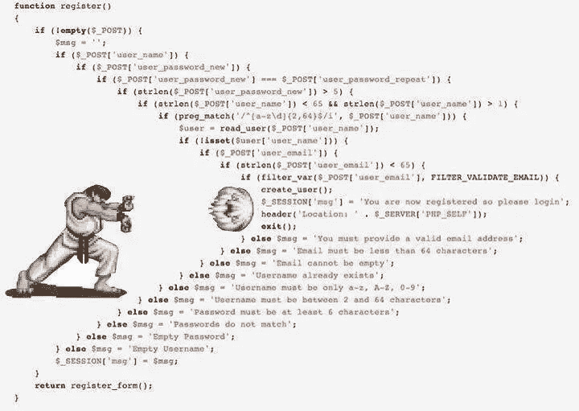

# 停止在程序中使用 Else

> 原文：<https://betterprogramming.pub/why-you-need-to-stop-using-else-statements-5b1fd09dea9e>

## 保护条款实用介绍

[亚历杭德罗·埃斯卡米拉](https://unsplash.com/@alejandroescamilla?utm_source=unsplash&utm_medium=referral&utm_content=creditCopyText)在 [Unsplash](https://unsplash.com/search/photos/it?utm_source=unsplash&utm_medium=referral&utm_content=creditCopyText) 拍摄的照片

当我第一次开始编程时，我希望有人告诉我一些不同的概念，让我在编写第一个网站时考虑。

我在开始时犯的一个错误是在写条件句时过度使用了`else`关键字。我发现很多其他人也在他们自己的代码中这样做，所以我想我应该对这个主题做一些说明。

免责声明；我对这个话题的看法纯属主观。

在某些情况下，您可能无法将这种方法应用到您的代码中。有时，解决方案是使用`else`关键字。这篇文章是为了告诉人们构造逻辑的另一种方法。

缩进 Hadouken

# 保护条款

根据[维基百科](https://en.wikipedia.org/wiki/Guard_(computer_science))的说法，保护条款是对完整性前提条件的检查，用于避免执行过程中的错误。

让我们用通俗的语言来解释这个定义。我们执行完整性先决条件检查(在我们代码的开始)，以避免在我们逻辑的主要流程中出现任何错误。

在完美流程中(当验证正确时)，我们希望程序的主要逻辑在所有验证检查之后。

让我们想象一下，我们运行一个网站，我们有一个高级购买区，仅限于付费客户，只在晚上 12 点后开放。

在实际应用中，我们可能会返回某种形式的异常。

虽然这是一种遍历条件句的方法，但是`else`关键字变得难以理解，即使我们只有少量的关键字。

这是条件逻辑的一个小例子，但是，在野外，想象一下试图导航一个具有更复杂逻辑的类。在我看来，通过这个标准编码是不可持续的，我们应该做得更好。

对于保护条款，我们希望遵循以下框架:

采用该框架，我们可以像下面这样重新构建前面的代码:

在 guard 子句中，我们通常将布尔表达式反转为我们想要断言的内容。如果我们想让用户登录来查看这个页面，我们想检查他们是否*而不是*登录。

这种方法捕获了相同的逻辑流程，但是，在我和其他人看来，这是一种处理条件逻辑时更干净的方法。

# 结论

当编码时，我们应该始终牢记这样一个问题:“保持 6 个月的时间有多容易？”

在当前的时间创造一个问题的解决方案是很棒的。但是未来呢？不考虑未来开发软件是愚蠢的。

这让我不得不从头开始重写所有的功能，因为随着时间的推移，我积累了大量的技术债务。

当新的需求被添加到你的计划中时，利用保护条款将为你未来的自我/团队的成功做好准备。