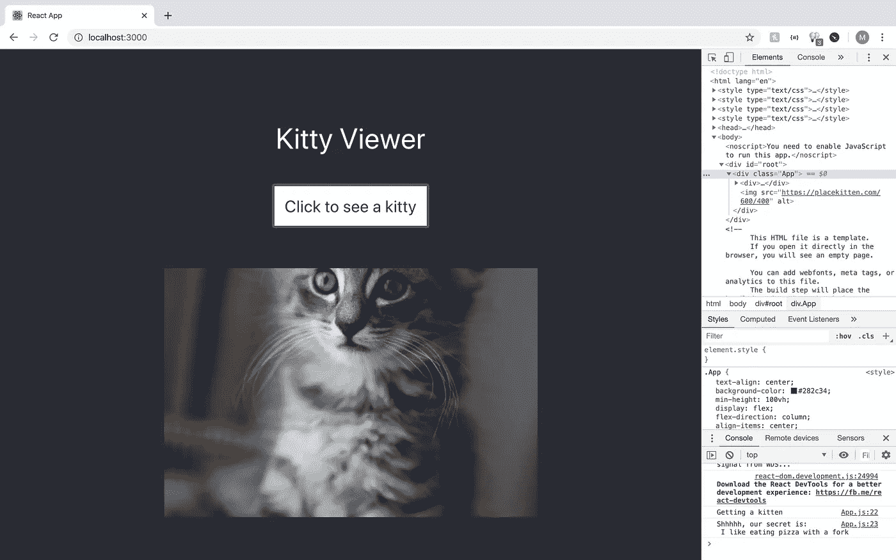
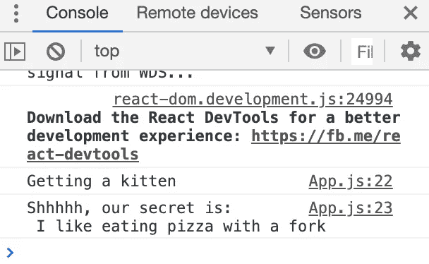
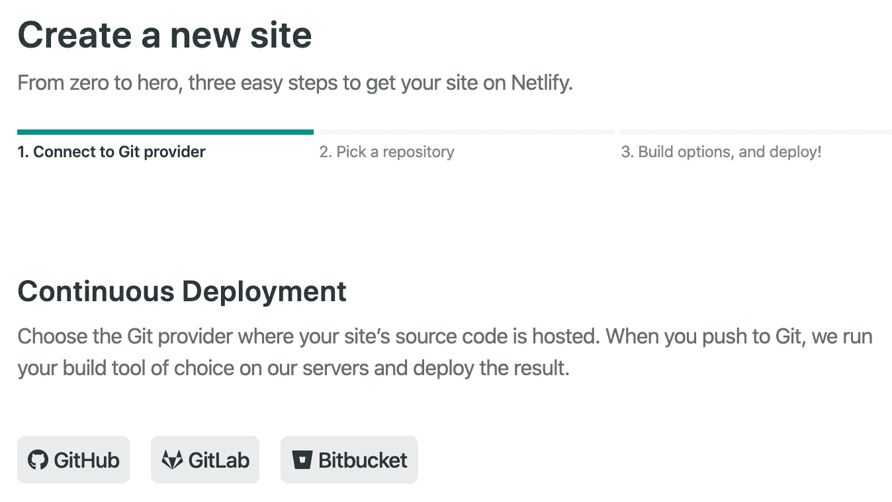
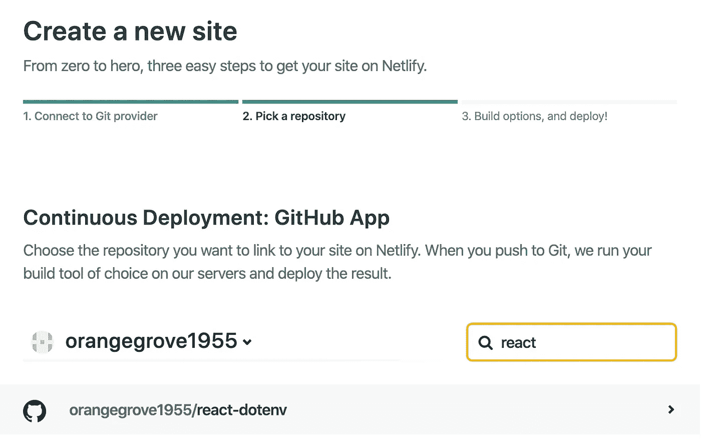
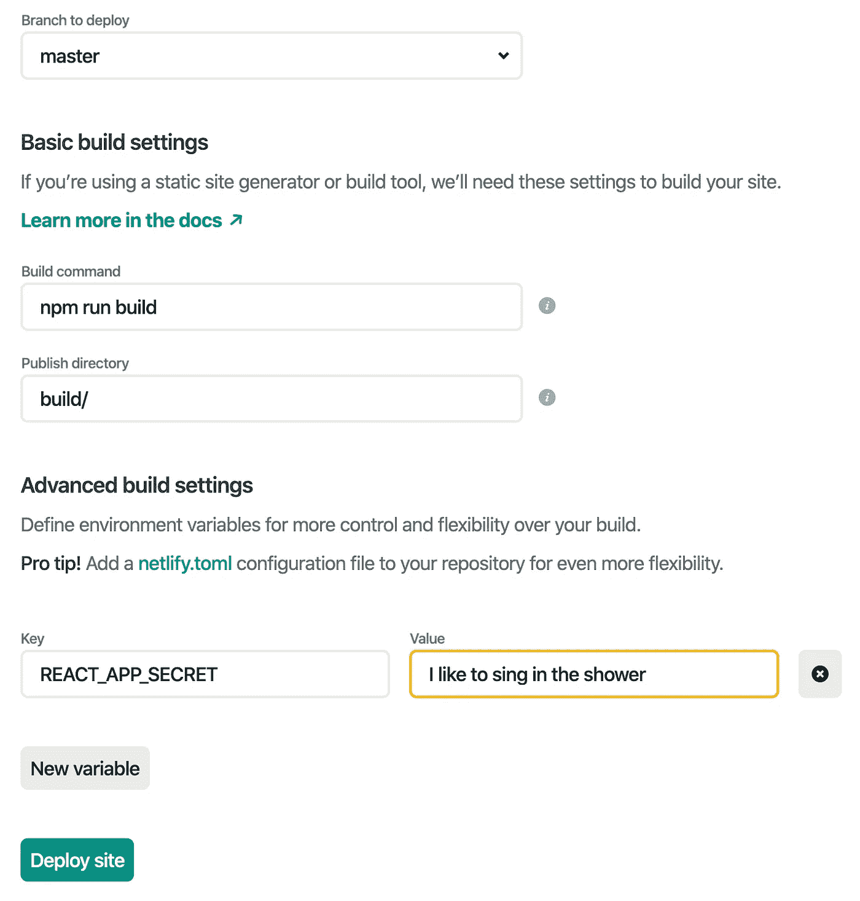
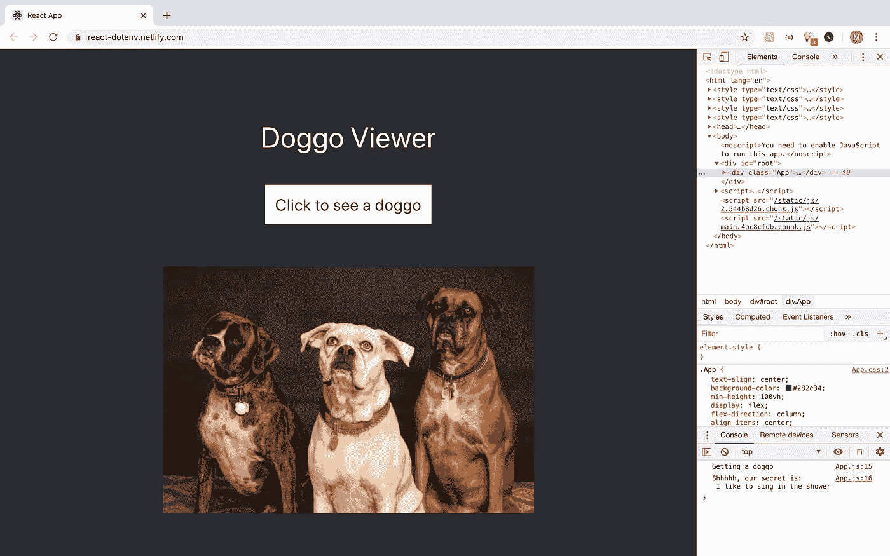
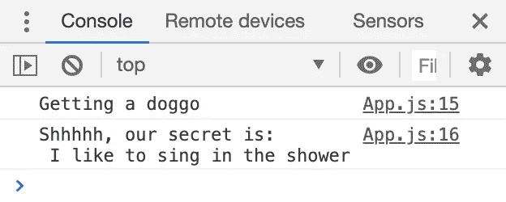

# 为什么应该向网络站点添加环境变量

> 原文：<https://betterprogramming.pub/why-you-should-add-environment-variables-to-netlify-sites-bae57012cc74>

## 仅仅因为它是无服务器的并不意味着你在安全上妥协

由[皮埃特罗·詹](https://unsplash.com/@pietrozj?utm_source=unsplash&utm_medium=referral&utm_content=creditCopyText)在 [Unsplash](https://unsplash.com/s/photos/future?utm_source=unsplash&utm_medium=referral&utm_content=creditCopyText) 拍摄的照片

当创建一个项目时，通常有一些我们不想添加到我们的存储库中的秘密值。环境变量提供了一种简单的方法来将这些值排除在 repo 之外，同时仍然能够在我们的代码中使用它们。

本文简要解释了什么是环境变量，为什么它们可能对您有用，以及如何将它们添加到您的网络构建中。

# 什么是环境变量？

首先，我们需要理解什么是环境变量，以及为什么我们想要使用它们。如果你已经处于编程的初级水平，我肯定你以前听说过变量这个术语——它只是一个可以改变的值，并不总是保持不变。

环境变量是由构建发生的环境设置的。例如，如果您在本地计算机上的开发环境中进行构建，则该变量将与您在 Netlify 构建中为生产而构建的变量不同。

## 改变行为

通过在不同的环境中拥有不同的价值，我们能够改变我们构建的行为。假设我们想要一些前端代码在开发中构建时查询`localhost`，但是在生产中需要它使用一些其他的 URL。通过用这些值设置一个环境变量，我们可以允许我们的程序改变请求的位置，从而改变它的行为。

## 让信息更加安全

除了改变行为之外，环境变量还允许我们保持 API 密钥和其他敏感信息更加安全。我们可以将值存储为环境变量，供 Netlify 在构建时使用，而不是将值硬编码并上传到任何人都可以查看和使用的公共存储库中。

但是，请记住，虽然这些环境变量在您的 repo 中不可见，但它们仍然会被浏览器中的前端代码使用——它们不能从其他人的视图中完全删除。

# 向代码中添加环境变量

现在我们已经了解了环境变量的能力，是时候看看如何将一些环境变量添加到我们的代码库中了。在这个例子中，我们将使用一个基本的 React 应用程序，但是这个例子背后的原理也适用于其他框架和语言。

## 创建应用程序

首先，运行`npx create-react-app react-dotenv`创建一个新的 React 应用程序。构建完成后，进入目录，用下面的代码替换`App.js`中的代码:

将此添加到 App.js 文件中

本文不会给出创建代码的一步一步的说明，但是我会强调环境变量的关键部分。

## 添加变量

第八行的`environment`常量从`process.env.NODE_ENV`中获取值，以表示我们是处于生产环境还是开发环境中。我们可以在后面的代码中使用它来改变应用程序的行为。

第 11 行的`secret`常量是我们将添加到环境变量文件中的一个值。创建一个名为`.env.local`的新文件，并添加以下内容:

将它添加到. env.local

这是我们要保密的环境变量。来自`create-react-app`的默认`.gitignore`文件会自动添加`.env.local`，但是对于其他情况，请确保将存储变量的文件添加到`.gitignore`。

## 检查网站

添加这些文件后，运行`npm start`来启动开发服务器。我们应该看到网站的 Kitty 版本，因为我们处于开发环境中:

我们还可以从我们的`.env.local`文件中看到秘密被记录到控制台。

保持双手干净

# 向 Netlify 添加环境变量

现在我们的代码库已经准备好了，是时候把它上传到 Github，把我们的 repo 连接到 Netlify 了。如果你以前从未向 Github 添加过代码，快速阅读一下这些指令[并在代码上线后继续。](https://help.github.com/en/github/importing-your-projects-to-github/adding-an-existing-project-to-github-using-the-command-line)

## 创建网络生活网站

一旦我们的回购启动并准备就绪，我们就可以登录 Netlify 并从 Git 创建一个新站点。我们将选择 Github 作为我们的主机，因为我们的代码就在那里。

这将为我们提供一个存储库列表，我们可以通过搜索找到我们上传项目的存储库:

当选择我们的构建选项时，我们希望从 master 部署。React 使用`npm`进行部署构建，使用`build/`进行发布，因此我们可以保留默认的构建命令。

## 添加变量

最重要的部分是更改高级构建设置。点击“显示高级”打开这些设置，并添加一个与本地`.env`文件同名的新变量(例如本例中的`REACT_APP_SECRET`)。

不要告诉任何人，但我真的知道

现在我们的秘密已经被添加，我们可以点击页面底部的“部署网站”。给 Netlify 几分钟时间来构建所有的东西，然后前往您部署的站点来查看结果。

## 检查网站

因为我们现在在生产环境中，我们看到 Doggo 版本而不是 Kitty 版本，因为`process.env.NODE_ENV`值现在变成了`production`

多好的孩子啊

我们还可以看到，我们刚刚添加的环境变量正用于确定控制台的秘密日志记录。我们当地版本的秘密无处可寻。

又来了。不要告诉任何人。

至此，我们已经成功地向 Netlify 添加了环境变量！当在浏览器中查看时，这个秘密仍然在前端可见，但是它没有存储在我们的存储库中的任何地方。不同的环境允许我们改变应用程序的行为。

环境变量在将 API 键和其他敏感数据排除在 repos 之外的过程中起着至关重要的作用。Netlify 隐藏环境变量，并允许您在构建、无服务器功能和其他服务中使用它们。

如果您很快就要开始一个新项目，或者想要回到以前的项目，使其更适合不同的环境，那么使用环境变量是一个不错的选择。Netlify 帮你搞定了。

# 资源

*   [Netlify 文档](https://docs.netlify.com/configure-builds/environment-variables/#declare-variables)
*   [创建-反应-应用文档](https://create-react-app.dev/docs/adding-custom-environment-variables/)
*   [本例中的 Github repo](https://github.com/orangegrove1955/react-dotenv)

 [## orangegrove1955/react-dotenv

### 这个项目是用 Create React App 引导的。在项目目录中，您可以运行:在…中运行应用程序

github.com](https://github.com/orangegrove1955/react-dotenv)