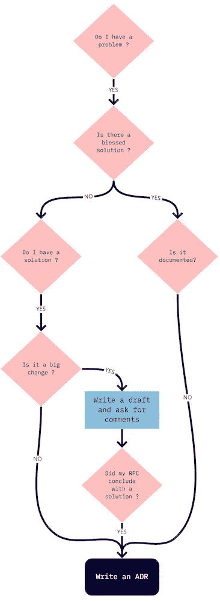

# 为什么您应该总是写下您的架构决策记录

> 原文：<https://betterprogramming.pub/why-you-should-always-write-down-your-architecture-decision-records-3e654d9782e2>

## 通过不重复做同样的事情来帮助你的软件团队节省时间

托拜厄斯·凯勒在 [Unsplash](https://unsplash.com?utm_source=medium&utm_medium=referral) 上拍摄的照片。

在我的团队中，我们最近引入了*架构决策记录*的原则。

架构决策记录(ADR)是一个文档，它记录了一个重要的架构决策及其背景和结果。

这是跟踪我们决策的一种非常棒、非常简单的方式，它让我们的产品和团队更加经得起未来的考验。

# TL；速度三角形定位法(dead reckoning)

ADR 框架是一个很棒的工具，可以帮助新员工理解你的团队是如何做决策的，以及为什么你的软件看起来是这样的。

你应该为几乎所有影响你的工程师工作的事情写一个 ADR(大的新决定，未记录的团队标准，当你决定不改变某事时，等等)。).

# 有什么好处？

## 团队的变化

我们的组织正在快速变化和发展，所以每个新加入的人都必须了解团队当前的堆栈——包括其中奇怪的部分。

现在我们有了 ADR，我们理解了为什么要做出某个决定，以及做出决定时的背景是什么。

这降低了辩论的成本，即使我们每次在环境发生变化时都要重新考虑一个决定。

## 入职

未来的团队成员有一个地方可以阅读决策的历史，并快速了解决策的方式和原因，以及该决策的影响。

让我们举一个例子:我们有一个定制的索引服务，我们已经看到我们可以用一个标准的开源工具来代替它。

在 ADR 中，我们将做出“保留我们当前的定制解决方案”的决定，以及我们进行 POC 的原因。我们已经对这两个解决方案进行了负载测试，发现我们当前解决方案的指标更好。

因此，现在团队的新成员知道了为什么我们在做定制工作，而不是使用这个其他开源工具，除非环境发生了变化(例如，工具的重大改进)，否则我们不会重新考虑这个解决方案。

## 对齐

ADR 对于团队之间的合作也很重要，因为它们允许与其他团队共享最佳实践。

你已经决定了一个特定的上下文。如果另一个团队面临同样的问题，您可以分享您的 ADR，帮助他们不要从零开始。

# 看起来怎么样

ADR 的好处是它们不会太正式。你可以把它们放在任何你想放的地方(Confluence，Google Doc，Git 等。).它只需要是一个每个人都可以进入的地方。

我们对这四个项目使用基本文档格式:

*   状态— 我们有两种状态:`IN PROGRESS`和`ACCEPTED`。
    当它正在进行时，意味着我们仍在质疑这一决定，并且仍在接受意见。接受后，我们都同意采取与此 ADR 相关的行动。
*   背景——我们看到的促使我们做出这一决定或改变的问题是什么？
*   决策——我们提议和/或正在做的改变是什么？
*   后果— 因为这种改变，什么事情变得更容易或更难做了？

如果您想了解更多 ADR 示例，您可以访问[这个资源库](https://github.com/joelparkerhenderson/architecture_decision_record#adr-example-templates)。

# 我们应该什么时候写 ADR？

现在最大的问题是你什么时候应该写一份 ADR。这很简单。大多数时候，你想去做——即使是很小的事情。

下面的流程图将帮助您准确理解何时需要撰写 ADR，但这几乎是所有的时间:

作者照片。

## 书写你的过去

有时候，决定是在很久以前做出的。这是团队的标准，但每个新员工都会问为什么我们决定走这条路。这意味着你需要写一份 ADR。

识别未记录的决策的一个好方法是在代码审查期间。如果有人没有遵循团队的标准，你应该有一个文档来解释为什么这是标准。如果没有，就要写了。

## 提议大的改变

当你提出大的改变时，最好记录下帮助你最终做出决定的过程。

如果您打开一份 ADR 草案(状态为`IN PROGRESS`)，本文档将帮助您记录最终决策的过程。所以你可以把你考虑过的所有解决方案和你为什么没有选择它们放在上面。

## 提议小改动/不改动

当我们决定*而不是*改变某件事时，跟踪也非常重要。

我知道记录什么都没有改变听起来很奇怪，但是如果你已经考虑过改变并决定不去做，写一份 ADR 来解释你为什么最终做出这个决定可能是好的。

# 结论

综上所述，我们可以说:“写出来或者从来没发生过！”