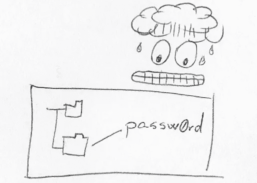

# 为什么您应该在 GitOps 部署中避免密封机密

> 原文：<https://betterprogramming.pub/why-you-should-avoid-sealed-secrets-in-your-gitops-deployment-e50131d360dd>

## 将部署转移到生产环境时，这种常见 GitOps 实践的缺陷和替代方案。


照片由 [Praveen Thirumurugan](https://unsplash.com/@praveentcom?utm_source=medium&utm_medium=referral) 在 [Unsplash](https://unsplash.com?utm_source=medium&utm_medium=referral) 上拍摄

GitOps 是在 Git 存储库中表示系统配置，然后使用 Git 工作流来管理配置更改和系统更新的实践。

在存储库中表示系统配置的过程最初很简单，播种配置文件，从产品文档中复制声明性请求，甚至可能是偶尔的脚本序列。

起初，你觉得进步是不可避免的，成功就在眼前，然后你碰到了终极 GitOps 箔:秘密。

## **为什么简单的秘密不好**

虽然将普通凭证放在 Git 存储库上显然不是最好的主意，但是仍然有必要说明为什么这样做有问题，以免有人觉得在使用私有存储库时这可能是一个可以接受的折衷方案:

*使用 GitOps 存储库的人可能不是被授权管理目标环境的人。*

假设您是一个“拉”请求的批准者，需要常驻网络专家来审查与防火墙相关的更改。您不知道凭证以纯文本的形式存储在存储库中，您要求存储库管理员将该专家添加到用户列表中。突然，网络专家可以访问充满私人数据的客户数据库。如果此人没有获得该级别的访问权限，您将面临各种文书工作和补救程序，以轮换和部署新凭据。

现在，让我们假设一个更好的场景，其中您知道存储库中的凭证，从而避免了意外的泄露:现在您需要在拉请求工作流之外让那个人参与到审查过程中。

当更好的情况是效率低下，而最坏的情况类似于蒙着眼睛玩杂耍刀，你知道是时候转向更好的实践了。



## **密封解决方案**

GitOps 中密封秘密的概念是在将秘密添加到存储库之前对其进行加密，与需要使用这些秘密的人共享私有加密密钥。通常，这些加密密钥放在目标系统上，由本地代理用来解密凭证，并将它们放在目标环境中需要它们的任何地方。

这种技术允许人们在没有意外泄露凭证的风险的情况下使用存储库，这是对在众目睽睽之下存储凭证的改进。

这种方法很聪明，在我开始 GitOps 之旅时，我非常喜欢它。初始设置有些容易，存储库还没有在日常基础上广泛使用，并且很容易找到处于相同采用阶段的其他人来证明这种方法，因此您也可以在社区中找到支持。

度过初始阶段，进入更大和更持久的部署，这种简单性让位于限制和风险，我完全放弃了这种做法。在接下来的部分中，我将强调您可能也应该放弃它的主要原因。

## **原因#1** :哪个环境的关键？

假设您有一个由“开发”、“测试”、“试运行”和“生产”环境组成的部署管道。每个环境将运行相同的软件，但是如果您使用良好的 SecOps 实践，它们将使用不同的凭据集。

一些 GitOps 存储库被设计为每个目标环境有一个子树，而另一些被设计为跨不同环境部署一个参数化的树。

在每个目标环境都有一个文件夹树的情况下，git 存储库必须为每个环境的键提供单独的位置。当您使用企业中无处不在的 Kubernetes 集群时，您将处理分布在多个名称空间中的单个“秘密”资源，这使得文件夹和文件的蔓延不可避免。

如果我们看看参数化的树，情况会稍微好一点，每个环境的所有秘密都集中到每个环境的一个文件中。

不管[如何设计 GitOps 知识库](https://dnastacio.medium.com/gitops-repositories-the-right-way-part-1-mapping-strategies-6409dff758b5)，使用密封的秘密会产生更多的文件夹和文件，这增加了人们需要吸收的信息量，以及交付管道需要处理的工件数量。

## **理由二**:秘密就在那里*。*

是的，它们是加密的，需要一个加密密钥才能得到实际的凭证，但是它们仍然掌握在潜在的不良分子手中。想象一下，告诉某人他们的数据库凭证对全世界都是可见的，然后继续通过解释坏人仍然没有密钥来打消他们的焦虑。

你可以在评论区插话，解释为什么这是一种毫无根据的恐惧的技术原因，但任何从事安全工作的人都会告诉你，心理方面也是让客户对他们的选择感到安全的一部分。


密封机密遵循“神剑”方法，任何人都可以访问(编码的)机密，但只有特权用户才能解码。

在更技术性的方面，我让人们争论公开密封的秘密与使用公钥对加密流量没有什么不同，但是那些是非对称的密钥对，其中你*永远不会*将私钥公开、加密或以其他方式公开。

最后，虽然秘密本身是加密的，但它们周围的元数据没有加密。不良参与者可以利用提交者信息来播种社会工程漏洞，推断基础设施组件的轮换策略，确定机密是否跨环境重用，并收集许多其他有助于攻击目标环境的线索。

从抵御网络攻击的所有防线上撤退，把所有希望都寄托在防御单点故障上，对于安全系统来说是一个可怕的起点。

(8 月 8 日更新)Warren Parad 指出，将存储库私有可以减轻这种风险。使存储库私有带来了关于潜在贡献者池的其他考虑和假设，但是它可能是一些采纳者的选择。

## **原因#3** :保护所有钥匙的钥匙还是一把钥匙。

存储库中机密的生命周期可能会有所不同，这取决于它们所保护的内容。数据库凭据可能每 30 天过期一次，而群集凭据可能每 60 天过期一次。

密封秘密本身的主加密密钥呢？安全策略最终会迫使您轮换该主密钥，这将需要一个单独的过程来将新密钥安全地重新分发到所有目标环境。

但是等等！没有一个单独的过程将密钥分发到目标环境是您选择将秘密密封在 Git 存储库中的原因。有人可能认为处理一个主密钥比处理多个主密钥更好，但是管理一个密钥或多个密钥的成本实际上是相同的，还增加了自己管理密封密钥的挑战，并且仍然需要某种密码管理器来保护和分发主密钥。

## **理由四**:有更好的解决办法。

Git 存储库在设计时并没有考虑到密钥管理。它们不支持密钥轮换，不支持将机密作为符号引用，无法执行使用审计，不支持对管理员的不同访问级别，等等。

密钥管理解决方案旨在解决所有这些需求，减少潜在泄漏的表面区域，并在密钥泄露的情况下提供缓解途径。

表面积的减少尤其重要，因为如果密钥从未离开系统，您就不会意外泄露或丢失密钥。例如，在 Kubernetes 的世界中，集群总是位于包含多个密钥管理解决方案的服务平面中。IaaS 提供商通常会在服务之间提供后端集成，其中关键值永远不会离开环境。

以 Kubernetes 为例，您可能会在 GitOps 实践中使用 ArgoCD 和 Flux，但它们目前缺乏直接从 KMS 提供商那里读取关键值的本地集成。

例如， [ArgoCD 文档](https://argo-cd.readthedocs.io/en/stable/operator-manual/secret-management/)说，*“ArgoCD 在如何管理机密方面不固执己见”*，但是接着提供了一长串解决方案来与专用服务集成。虽然 Flux CD 在其 kustomize 控制器中支持来自 KMS 的密钥的[全局解密，但它](https://fluxcd.io/docs/components/kustomize/kustomization/#controller-global-decryption)[仍然需要将这些秘密存储(加密)在 git 存储库中](https://www.weave.works/blog/hashicorp-vault-flux-secret-management)。


在部署时将秘密名称“后期绑定”到秘密值。

一种更有前途的方法是通过[“外部秘密操作者”项目](https://external-secrets.io/)开始，该项目将来自各种密钥管理服务的秘密同步到 Kubernetes 集群中的本地秘密中(这要归功于我的同事[卡洛斯·辛坦拿](https://csantanapr.medium.com/))。)

(3/16 更新) [Thomas Boerger](https://medium.com/@thomasboerger) 在评论部分加入了另一个密封秘密的替代方案:使用 Flux 和 Argo 的 [SOPS](https://dev.to/camptocamp-ops/argo-cd-secrets-management-using-sops-1eke) 。

(8/8 更新) [Stefan Prodan](https://twitter.com/stefanprodan) 基于 Flux 对[密钥](https://fluxcd.io/docs/components/kustomize/kustomization/#controller-global-decryption)全局解密的支持，提出了一个关于 Flux 缺乏与 KMS 提供商的本地集成的错误概括。我重写了那个声明，以澄清 Flux(像 Argo CD 一样)缺乏直接从 KMS 提供商那里读取秘密的能力。到今天为止，Flux [可以利用 KMS 提供商在工件被包含到 Git 存储库之前对其进行加密](https://www.weave.works/blog/hashicorp-vault-flux-secret-management)。

# **结论**

使用密封机密可能有正当的理由。尽管如此，除了“密封的秘密”是“足够好”之外，我还没有看到一个积极的框架，这意味着它们比适当的密钥管理解决方案部署起来更便宜。我很少看到讨论涉及到处理这些秘密的其他事情。

我不怀疑那些在代码回购中用文本文件模仿密钥管理服务的人的工程能力，但我质疑这些方法的成本效益。DIY 人群必须求助于将文件放置在 git repo 中、将密钥循环映射到 git pull 请求，以及使用解密密钥检测连续部署管道来解析 repo 的内容的组合。如果你想知道如何管理这些主密钥，你可能会发现自己陷入了一个不断想出[创造性的方法让 Git 充当密钥管理服务](https://medium.com/@ismailyenigul/take-backup-of-all-sealed-secrets-keys-or-re-encrypt-regularly-297367b3443)的循环中。

人们总是可以支持“随增长而构建”的方法，但是这将把“密封的秘密”定位为使用密钥管理服务的垫脚石，而事实并非如此。试图“摆脱”使用密封机密意味着改变 GitOps 后端的选择，并重新培训操作人员，以彻底改变他们处理凭证的方式。没有自然的递进，只是同样的结果付出两次。

避开密封的秘密，正确地开始 GitOps 实践，并使用托管密钥服务。

```
(Update on 5/23: If you like this topic, I wrote [a new story](https://dnastacio.medium.com/gitops-repo-content-a31884d4104f) including a couple of other things to avoid.)
```