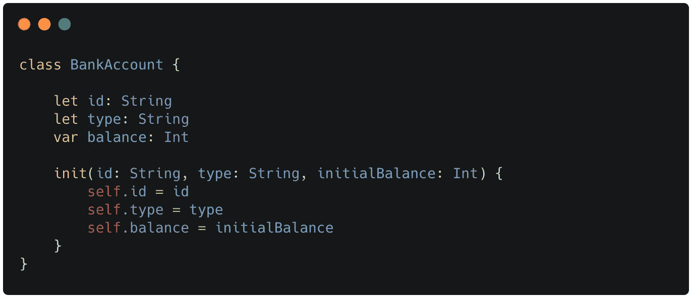
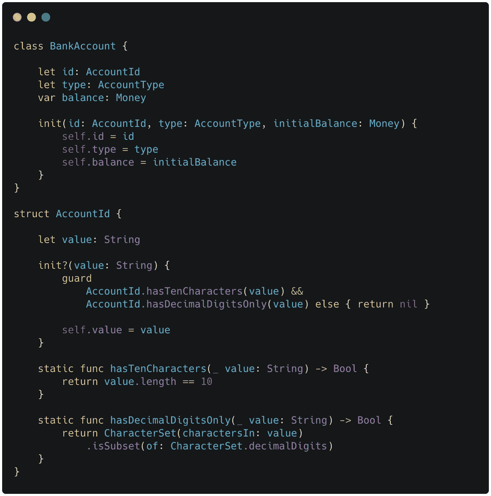
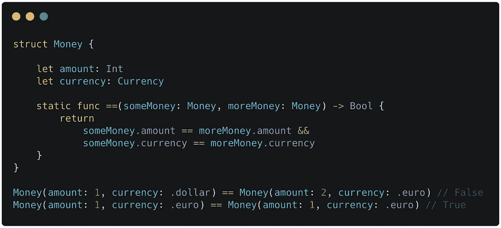
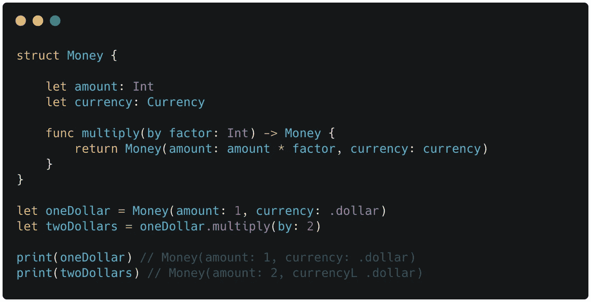

# 为什么应该避免使用基本类型

> 原文：<https://betterprogramming.pub/why-you-should-avoid-using-primitive-types-cb55857baa39>

## 基本类型隐藏了领域的重要细节

劳伦·里奇蒙在 [Unsplash](https://unsplash.com?utm_source=medium&utm_medium=referral) 上的照片。

你好，欢迎光临！

今天，我将谈论为什么你应该避免在你的代码中使用基本类型。

原语类型是编程语言提供的基本类型。基本类型的例子包括`Int`、`String`、`Dictionary`和`Array`。这些是我们每天使用的基本类型。

# 所以我不应该使用原始类型？

不要误解我。基本类型本身并不坏。它们是我们创建计算机程序的基本构件。我们需要他们。

但是我们倾向于滥用原始类型——尤其是在我们的域对象中。例如，注意银行账户的下一个实现:

看它的属性。考虑可能适用于这些属性的业务规则。

现在你可能会问自己以下问题:

*   任何一个`String`都是有效的 id 吗？它应该有特定的格式吗？是数字还是字母数字？
*   账户类型可以用任意`String`表示吗？空的`String`怎么办？存在哪些类型的账户？
*   余额中使用什么货币？美元？欧元？或许是比索？分币呢？

通过使用基本类型来表示这些属性，我们错过了关于领域及其业务规则的重要信息。基元类型是导致错误的歧义的主要来源。

此外，与这些属性相关的领域概念可以遍布整个代码库。如果您需要知道什么规则适用于银行帐户 ID，您会去哪里找？

# 用值对象增强明确性

原始类型是不够的。我们需要新的类型来表示领域逻辑，并使隐式显式化。

我们可以通过将基本类型包装成值对象来实现这一点。值对象是一种对描述性属性进行建模的类型。它是一个测量、量化或描述领域中某些事物的概念。

让我们再次看看银行账户的例子，但是我们将用值对象替换基本类型`String`和`Int`:

类型`AccountId`、`AccountType`和`Money`是值对象的例子。

值对象包装基本类型(或其他值对象)以增强模型的表达能力。仅仅拥有一个命名领域概念的类是值得的。想想吧。`Money`比`Int`提供更多信息。

## 行为丰富

值对象不是名字好听的简单数据结构。相反，他们应该将所有与他们所代表的领域概念相关的行为紧密地组合在一起。

这个特性使得值对象成为一个非常有用的工具。

再次检查上面的例子。`AccountId`类包含与银行账户 ID 相关的业务规则。在这个(虚构的)例子中，ID 由十个十进制数字组成。

此信息并非来自代码中的注释或我们可能从银行领域获得的知识。这些信息来自模型本身。您不需要在整个代码库中跟踪与帐户 ID 相关的业务规则。他们在`AccountId`班。

## 创建边界

我看到的使用值对象的另一个好处是，你创建了一个边界，减少了变化的影响。

假设我们使用一个`String`来表示一个银行账户 ID。在银行领域，这个概念在系统中被广泛使用。

但出于某种原因，我们被迫改变所使用的类型。现在需要一个更复杂的结构，比如一个`Array`。我们必须搜索帐户 id 的所有引用，用`Array`替换`String`，并修复任何可能的问题。

这项任务既耗时又容易出错。

使用一个值对象来表示 ID，比如一个`AccountId`类，可以最小化变化的影响。我们需要做的就是在`AccountId`类中将`String`改为`Array`，并解决那里的任何问题。应用程序的其余部分不应改变。

# 价值对象的特征

在本文中，我将重点放在值对象上，它们是增加模型表达能力的元素。它们包装了与它们所代表的概念相关的基本类型和组行为。

但是值对象不仅仅如此。先说价值对象的一些特征。

## 价值平等

如果两个值对象持有相同的值，则认为它们相等。如果它们是不同的对象，这并不重要。

## 不变的

值对象不能变异。如果某个值需要更改，将使用所需的值创建 value 对象的新实例。

这使得值对象更容易测试，并且避免了副作用。

## 没有身份

由于“按值相等”属性，如果两个值对象持有相同的值，则无法区分它们。由于不可变的属性，值对象的实例是可丢弃的，因为当值需要改变时会创建新的实例。

由于这些特征，将标识分配给值对象是没有意义的。

# 包扎

基本类型是我们拥有的基本构件，但是我们不应该过度使用它们。基本类型不是表示重要领域概念的好选择。

值对象包装了一个基本类型，增强了它的表达能力，并对相关的域行为进行了分组。

让原始类型休息一下。使用值对象。

感谢阅读！