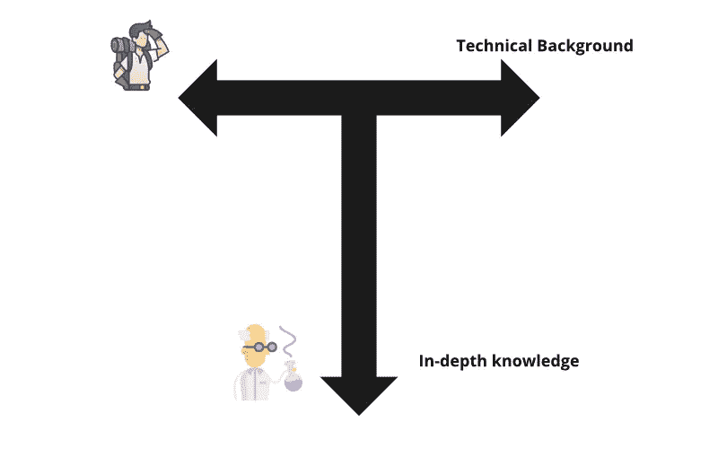
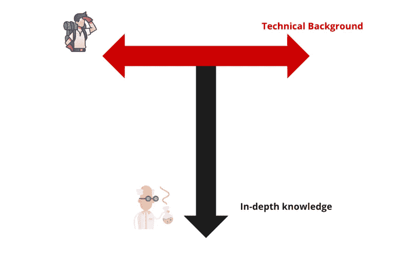
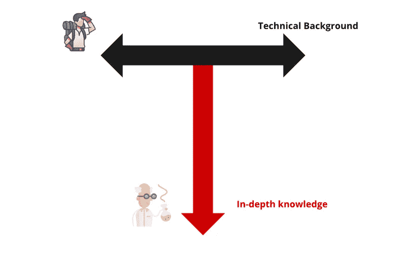

# 为什么你应该成为一名 T 型工程师？

> 原文：<https://betterprogramming.pub/why-you-should-be-a-t-shaped-engineer-fc49f797ecea>

## 以及如何成为其中一员

本·赫尔希在 [Unsplash](https://unsplash.com?utm_source=medium&utm_medium=referral) 上的照片

2022 年做软件工程师要求很高。一方面，你必须了解越来越多的技术，才能成为所谓的全栈开发者，并且对前端和后端都有所了解。您还需要了解一些 DevOps 实践和工具，以了解您的应用程序如何以自动化的方式从您的本地环境进入生产环境。您必须对您的开发环境感到满意，并且知道将使您富有成效的提示和技巧。

简而言之，你得知道很多。

但是您仍然需要对您日常使用的堆栈有深入的了解。对许多事情了解一点可能很有趣，但是当涉及到工作环境时，当您每天主要使用相同的技术堆栈工作时，对许多事情的浅薄知识将不会对您有所帮助。知道如何用 10 种语言构建 hello world 应用程序可能会给你的朋友留下深刻印象，但你的经理不会。为了带来真正的商业价值，您通常需要对您正在使用的堆栈有深入的了解。

找到一份要求 X 年特定语言或框架经验的工作机会是很常见的。尽管随着你获得更多的经验，转换技术变得更容易，但这是当今就业市场的现实，我们必须服从规则。

那么我们如何处理这种差异呢？

我们需要找到一种方法，将这两个方面结合起来，同时又不忽视其中的一个方面。

而途径就是成为 T 型工程师。

# 什么是 T 型工程师？

T 型工程师是专家和多面手的混合体。由于他熟悉大量的概念和模式，他不仅能够解决专业领域的难题，还能理解新问题，并快速掌握新技术、工具或实践。

竖线代表你在专业领域的知识深度。它可能是像 Java backend 这样的技术堆栈，像银行或医疗这样的业务领域，或者像 web performance 或复杂的分布式系统这样的技术领域

当你必须解决一个难题，而这个难题需要对某个特定主题有很深的了解时，这种类型的知识是很有用的。

水平条代表你对软件工程相关的所有主题的知识广度。它是你用来学习新概念的技术背景，即使你没有实际经验，你也能大致理解你另一个团队的同事所面临的问题。

这种类型的知识对于所有的软件工程师来说都是必要的，但是对于需要解决架构问题的有经验的工程师来说更是如此，在这种情况下，对现有的东西有一个宽广的视野，知道什么是潜在的解决方案，以及哪个解决方案最适合当前的挑战是很重要的。

# 为什么成为 T 型工程师很重要？

软件工程师当前的趋势是在大量的技术上工作，结果是使用越来越多的抽象。这些抽象已经开始到处出现，从 Kubernetes 的基础设施，到像 Spring Boot 这样的大型框架的后端，或者像 React、Angular 或 Svelte 这样的单页面应用框架和库的前端。抽象的必要性已经变得不可避免，因为对于工程师来说，了解他们正在使用的堆栈的每一部分已经变得不可能了。

但是使用所有这些抽象是可以的，直到你遇到一个需要更深入了解当前主题的问题。

专业知识也很重要，可以让你知道什么时候不要使用这些抽象概念，而应该使用更轻量级或自制的解决方案，最适合手头的问题，从而避免使用最新的闪亮工具，因为每个人都已经开始使用它了。

此外，我发现擅长某件事本身就是一种技能，一旦你擅长一件事，就更容易擅长另一件事，因为你可以利用以前的经验知道什么是重要的，什么是不重要的。

一个好的设置是有一个由 T 型工程师组成的团队，他们有很大一部分共同的知识，但每个人都专注于堆栈的一个特定主题，这样任何可能出现的潜在问题都可以由至少一个成员来解决。随着时间的推移，这些深入的知识将开始传播到整个团队。

成为 T 型工程师的另一个重要部分是，它减少了你的盲点，让你更加意识到你所不知道的。这可以防止你和你团队努力解决 X 的问题，而如果你知道 y 的话，你可以用十分之一的时间解决它

当然，这完全取决于你工作的环境。一些公司仍然需要专家，在单一主题上进行深入研究，或者需要多面手，研究跨越许多主题的浅层次问题。

但是我认为，即使你处于这种情况下，努力增加你的最短 T 形杆的长度将使你成为一个更经得起未来考验、更全面的软件工程师，随时准备解决你将遇到的任何问题。只专注于一项技术或一个领域，你可能会搬起石头砸自己的脚，停下来学习新事物，冒着关门的风险。由于被过多的技术分散，你可能永远也不会擅长某件事，遇到只有当你有深入的知识时才能遇到的那种问题。

# 如何成为一名 T 型工程师？

要成为一名 T 型工程师，你需要专注于 T 型的两个横杠。根据你的情况，你想要么放大你的单杠，要么加长你的竖杠。

如果你觉得自己正在变成一只只会一招的小马，你会想要放大你的 T 型杆。如果你已经在同一家公司工作了很多年，做着同样的工作，情况可能就是这样。要做到这一点，你需要拓宽你的技术背景，找出存在的东西。目标是熟悉许多概念、工具和技术，理解为什么使用它们，何时使用它们，以及它们的利弊。这样，当你面临一个新的问题时，你总是会有一个解决方案，并且在需要时，你只需要深入了解。

您可以通过消耗不同类型的资源来实现这一点:

*   **听播客**:有大量关于任何技术或领域的播客。这种类型的资源很方便，因为它可以在做其他事情时被动地被消耗。你仍然需要专注于所说的内容，但是你可以一边听一边做其他的事情。我经常听的一些很棒的播客的例子是更侧重于 web 开发的 [Syntax](https://syntax.fm/) ，关于软件架构的 [InfoQ](https://www.infoq.com/the-infoq-podcast/) ，或者关于所有 Javascript 内容的 [Javascript Jabber](https://javascriptjabber.com/) ，但是还有更多有待发现。
*   **阅读概述文章**:通过阅读这些类型的文章，你将开始对主题有一个广泛的理解，了解主要概念，并对关键方面有一个概述。这些文章可以在网上的任何个人博客或出版物上找到。其中最受欢迎的是 freecodecamp.org。
*   **观看概述会议演讲或视频**:这一条与概述文章非常相似。只是形式变了。例如，来自 [Pluralsight](https://www.pluralsight.com/) 的大图片视频是快速获得某个主题的简要概述的好方法。
*   阅读通才出版物和时事通讯:通过这样做，你会遇到你自己可能没有搜索到的新概念。例如，[黑客新闻](https://news.ycombinator.com/)每周时事通讯是打开你的视野和发现你感兴趣的各种话题的好方法。这不是 100%的技术相关，但每周总有一些有趣的事情可以发现。

为了延长你在专业领域的垂直条，你需要深入研究。为此，您可以使用一些资源和实践。

*   建立一个项目并交付生产:通过这样做，你将开始拥有实用的知识。在我看来，没有什么可以取代在做自己的事情的同时，通过奋斗获得的实用知识。这才是你要重点去超越浅薄知识的地方。也许将它交付生产并不总是相关的，这取决于你试图改进什么，但是获得生产经验是一个有价值的学习经历。
*   **阅读关于高级话题的文章**:一旦你知道了基本知识，你就可以去搜索更深入的文章。通过这样做，你会学到不同的或更好的做事方法。然后你将能够把这些新技巧应用到你的项目中，并付诸实践。找到这些文章的最好方法是通过识别该主题的专家，并检查他们的产品或推荐。这种角色的一些例子是 React 的[丹·阿布拉莫夫](https://overreacted.io/)或者软件架构的[马丁·福勒](https://martinfowler.com/)。
*   **钻研文档**:这个只适用于技术或工具。大多数时候，致力于构建技术的工程师对该主题更了解，而官方文档通常是获得可靠知识的最佳途径。
*   **读书**:尽管随着网络的兴起，书籍变得越来越不受欢迎，但它们仍然是一种很好的学习资源。我发现，当学习宽泛的概念或领域时，书籍更有意义，而当学习最新的热门技术或工具时，书籍就不那么有意义了。有些书已经成为所有软件工程师都应该知道的经典，比如[干净代码](https://www.amazon.com/Clean-Code-Handbook-Software-Craftsmanship/dp/0132350882)、[领域驱动设计](https://www.amazon.com/Domain-Driven-Design-Tackling-Complexity-Software/dp/0321125215/ref=sr_1_1?crid=FY7GWIN3GLWT&keywords=domain+driven+design&qid=1651488202&s=books&sprefix=domain+driven+design%2Cstripbooks-intl-ship%2C125&sr=1-1)、[设计模式](https://www.amazon.com/Design-Patterns-Elements-Reusable-Object-Oriented/dp/0201633612/ref=sr_1_2?crid=Z1MF5JMGMVQZ&keywords=design+pattern&qid=1651488227&s=books&sprefix=design+pattern%2Cstripbooks-intl-ship%2C121&sr=1-2)等等。
*   参加面对面的会议和研讨会:通过这样做，你会遇到和你有共同兴趣的工程师。然后，你将能够分享你的经验，挑战你现有的知识，也许会发现一种新的方法来做一些你已经挣扎了几个月的事情。例如， [Java 用户组](https://jcp.org/en/participation/JUG_list)是认识其他 Java 开发者的好方法。

最后一件重要的事情是关注基本面。与最新炒作的框架相反，这种类型的知识将始终保持相关性，并将帮助您适应许多情况，并快速交换技术或领域。

像干净代码、重构或测试这样的事情是每个软件工程师都应该擅长的基本原则的一些例子。

# 包裹

成为一名软件工程师意味着你将踏上终生学习的旅程，而在我看来，成为一名 T 型工程师是经历这一过程的最佳方式。它可以让你专注于你的专业领域，通常是你日常工作中的领域，并且仍然可以通过发现和学习新概念和新技术来获得乐趣。这个模型不是灵丹妙药，也不适合每个工程师，但是我发现它最适合大多数工程师。

【https://gauthier-cassany.com】最初发表于**。**