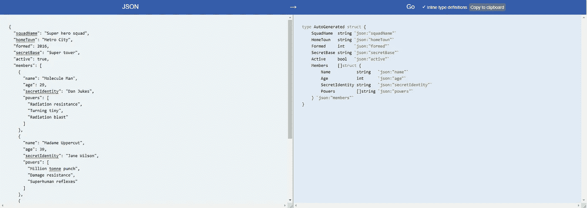

# 为什么在使用 JSON 时应该使用 Go

> 原文：<https://betterprogramming.pub/why-you-should-be-using-go-when-working-with-json-cfdfc5369e1>

## 停止使用 Python 与 JSON 交互，转而使用 Go


照片由[希望之家出版社-皮革日记工作室](https://unsplash.com/@hope_house_press_leather_diary_studio?utm_source=medium&utm_medium=referral)在 [Unsplash](https://unsplash.com?utm_source=medium&utm_medium=referral) 拍摄

如果您曾经在另一种语言(如 Python)中使用过 JSON，您可能会习惯于看到以下变量:

```
jsonData = res.son()
value_i_need = jsonData["key"][0]["key"][4]
```

上面的代码片段是一个小例子，展示了 Python 中的 JSON 操作可能会变得混乱，而且在那个*会变得很快。*

现在，我知道每个人都喜欢 Python，但是请听我说——Go 是 Google 开发的一种编程语言，它的速度非常快。有很多很棒的教程告诉你如何用 Go 编程和最佳实践。

在本文中，我想向您展示一个简单的例子，说明为什么您应该为 JSON 使用 Go。

# 使用 JSON 时，Go 应该是您事实上的选择

如果您使用的 API 每次都为内容提供相同的结构，那么可以考虑实现 Go 结构，以便更容易地操作 JSON。

我们可以将 JSON 字典对象转换成 Go 结构。有一个很棒的在线[开源工具](https://mholt.github.io/json-to-go/)，它使用 JSON 并为 JSON 提供一个生成的 Go 结构。

关于 Go 结构的快速介绍或复习，你可以阅读[这篇](https://pythonprogramming.net/go/structs-go-language-programming-tutorial/)和[这篇](https://medium.com/r?url=https%3A%2F%2Fgobyexample.com%2Fstructs)文章。

我们将使用 Mozilla 的[文章中的 JSON 示例。](https://developer.mozilla.org/en-US/docs/Learn/JavaScript/Objects/JSON)

我们将使用 Mozilla 文章中的 JSON:

要访问`members`列表中第一个英雄的第二个超能力，我们需要使用下面的代码:

```
superHeroes['members'][0]['powers'][1]
```

这看起来有点乱，对吧？我认为括号、引号的组合，不知道你是在访问字典还是列表，会使它变得相当混乱。

它让您不断回头看 JSON 本身，这可能会浪费很多时间。我们可以在 Go 中使用 Struct，而不是直接将 JSON 解析为 Python 中的字典和列表，这类似于 C 中的结构或 Python 中的类。

然而，我们不需要手写 JSON 的所有模式，这就是乐趣所在。

让我们看看如何将这个 JSON 转换成 Go 结构。将 JSON 更改为 Go 结构将使解析 JSON 更容易查看和理解您正在处理的数据类型。

使用 https://mholt.github.io/json-to-go/中的[，我们将 JSON 粘贴到左侧文本字段中。](https://mholt.github.io/json-to-go/)



JSON 正在被转换为 Go 结构定义

在转换之后，我们使用的 Go 结构被定义为:

Struct.go 示例文件

如上所示，JSON-to-Go 从 JSON 数据创建了一个 Go 结构，它还将 JSON 模式放在定义右侧的字段声明标记中。

JSON 模式在它的右边，您不需要回头参考 JSON 文件或者在控制台中不断地打印它来查看您当前正在处理的数据级别。

一旦 JSON 被解组(类似于 Python 中的`json.loads()`)成 Go 结构，下面的代码将访问`members`列表中列出的第一个英雄的第二个超能力:

```
squad.Members[0].Powers[1]
```

看起来更干净，对吧？我认为这使得遍历 JSON 更加简单。您不仅会丢失括号中的引用键，使用 Go 结构还可以让您的 IDE 帮助自动完成您可能正在寻找的字段。

这让你的眼睛更容易看，也可以节省你的时间，不用回头去查阅 JSON 来记住你是否需要一个字典键或者一个列表索引。

虽然这只是一个简单的例子，但我希望它能将您转化为一个进行 JSON 操作和遍历的 Go 用户！

在 Go 中访问 JSON 的示例程序:

# 资源

*   [围棋编程语言](https://golang.org/)
*   [JSON-to-Go](https://mholt.github.io/json-to-go/)

感谢阅读！如果你喜欢这篇文章，请考虑在 Twitter 上关注我。