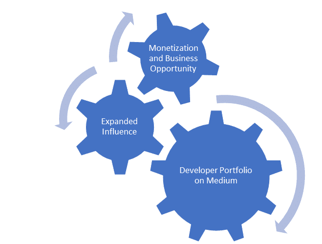
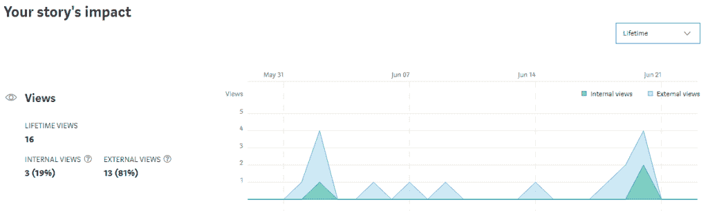

# 为什么您应该在 Medium 上构建开发人员组合

> 原文：<https://betterprogramming.pub/why-you-should-build-your-developer-portfolio-on-medium-and-how-to-get-paid-to-do-it-4b883881c66c>

## (以及如何获得报酬)

[斯科特·格雷厄姆](https://unsplash.com/@sctgrhm?utm_source=medium&utm_medium=referral)在 [Unsplash](https://unsplash.com?utm_source=medium&utm_medium=referral) 上拍照。

我选择在 Medium 上构建我的开发人员组合，因为我想要成功。我想在我的职业生涯、面试、日常工作、副业中取得成功——在我把自己的工作和声誉拿出来接受评判的任何地方。

为什么我想(必须)成功？

1.  我的家人指望着我。
2.  擅长我的工作(我对社会的贡献)是我快乐的关键组成部分。
3.  我个人的韧性带给我平静。

作为开发人员，我们如何取得成功？如果我们有写好代码的名声，我们就赢了。沟通和团队合作能力等软技能也很重要。但是如果你写不出像样的代码，你就不会成为成功的开发者。

# 为什么要在媒体上建立你的投资组合？

作者照片。

我将深入探讨使用 Medium 作为投资组合平台的三个主要原因:

*   让你的努力惠及无限多的人
*   从你的投资组合中赚钱
*   将流量从您的中型投资组合转移到您拥有的任何其他数字资产的网络效应。

# 以很少的开销接触到大量的观众

Medium 是一个平台，内容创作者可以在这个平台上做到这一点:立即投入工作，在 Medium 上构建他们的开发者组合，而不会被演示、货币化和流量等细节所困扰。你的开发人员组合的目标是展示你的 React/Node/Java/Python/无论什么技能组合——而不是花几天时间摆弄主机或 CMS。

“中等”也可以作为你建立的展示技能的独立投资组合网站的补充。如果您想深入讨论您创建的 SVG 动画的技术细节，那么您需要一个内容平台。如果你想一周写三次或者一个月写一次，它会为你提供灵活性和机会。

## 没有运行博客的开销

应该用 WordPress 还是盖茨比？你应该用什么主题？你关心链接建设、域名授权和处理隐私需求吗？媒介是越过这些问题的捷径。如果你的目标是写代码或者谈论写代码，Medium 会让你最快到达那里。

此外，没有托管费或域名注册。没有安全问题。Medium 对于有进取心的软件开发人员来说只是一个机会，让他们在撰写第一篇优秀文章的过程中脱颖而出，甚至赚钱。

## 瞄准长尾关键词，推动有机流量

然而，博客世界仍然有一些策略可以帮助你的文章被发现(例如，从谷歌获得有机搜索流量)。

图片由 [janjf93](https://pixabay.com/users/janjf93-3084263/?utm_source=link-attribution&utm_medium=referral&utm_campaign=image&utm_content=3614763) 来自 [Pixabay](https://pixabay.com/?utm_source=link-attribution&utm_medium=referral&utm_campaign=image&utm_content=3614763)

Medium 的优势之一是平台已经和 Google 有了域名权限。一个新的博客可能会在“谷歌沙箱”里呆上六个月，然后谷歌才会决定这个网站是权威的，值得拥有流量。对于试图建立在线形象的开发者来说，Medium 是一个不可思议的捷径。在 Medium 上发表一篇文章，并在当天晚些时候在 Google 的第一页或第二页看到它，这是不可思议的。

在接下来的几个月或几年里，产生搜索流量的一个主要策略是就那些还没有被广泛涉及的话题写一些好文章。谷歌使用页面标题和内容中的关键词来“知道”一篇文章是关于什么的，以及如何将它与用户搜索术语匹配。有 [Ubersuggest](https://neilpatel.com/ubersuggest/) 这样的工具可以帮助你从现有文章中找到月搜索量低、竞争度低的关键词。

瞄准这些低竞争“长尾”关键词，加上 Medium 固有的领域权威，意味着你的文章可以从搜索某个主题的人那里产生持续的流量。例如，如果有一个新的州管理图书馆正在获得一些牵引力，并且你有兴趣写它，你可以看到人们搜索它的频率以及现有网站的竞争。软件开发是不断增长和高度动态的，提供了许多机会来瞄准长尾关键词。

## 专注于你的编码利基，并建立一个追随者

有机搜索不是唯一的机会——只是最被动和持久的机会。Medium 还托管“出版物”，即某些特定领域的一组作者的作品。这些出版物拥有已经注册的追随者，他们会被告知出版物中的新帖子。您只需向出版物提交一篇文章，如果文章被接受，您将立即拥有读者。就像在任何社交媒体网络上一样，个人作者也会获得追随者。

如果你经常为特定的读者写文章，你可能想写一些关于编码世界中的特定领域的文章。无论如何，大多数软件开发人员都有他们特定的技术体系，所以你的写作定位很可能会反映这种技术体系。

在一个特定的领域写作会让你从你的追随者和出版物追随者那里获得一致的观点。但这也会强化你的技能，并在你努力擅长的领域建立你的技术组合。对于大多数人来说，开发人员组合的最终目的是展示他们的专业知识，以便他们有更多的专业机会。如果这是你的目标，在选择研究和写作的内容时，请记住这一点。

## 写高质量的内容，带动流量，增加阅读时间

不用说，为你的开发者组合写高质量的内容(阅读:适当的长和详细的)是应该的。这是你的专业简历。然而，这里还有三个原因可以解释为什么优秀的内容是一份不断送出的礼物:

*   读者参与度和页面停留时间增加中等收入。
*   高质量的内容是获得新的追随者或点击链接到你的其他内容的诱饵。
*   伟大的内容带来更多的有机流量===更多的浏览量/收益/新的关注者。

高质量的内容通常意味着 2000 多个单词，引人入胜的图形，好的标题等。对于一篇软件开发文章来说，这也包括了大量的 gists/CodePens/repo 链接。这些文章的目标是为其他软件开发人员解决问题或提供资源，如果没有健康的代码，这是不可能实现的。

## 中等的统计强化了你是专家的感觉

Medium 最有趣的一个方面是为作者提供了大量的统计数据页面。每个故事都有浏览量、收入、观众阅读时间、外部流量来源等细分。

上面的统计数据来自我写的一篇关于 Material-UI 中一个非常特殊的问题的文章(它是新的，所以还没有很多观点)。在这种情况下，我写了我如何解决我遇到的一个很难找到解决方案的问题。我不指望这篇文章在某一天会有很多人浏览，但我预计在一年的时间里，这篇文章将帮助 200 人左右克服我面临的相同问题。这当然是一个面试的话题。

招聘过程的一部分是找到那些脱颖而出的候选人。如果你每天有几十篇中型文章帮助数百人，你将在面试中令人难忘，同时磨练你的编码技能。

当然，每天查看页面浏览量统计也很有趣！如果你在 Medium 上构建你的开发人员组合，你可以获得许多关于你工作的有用的统计数据，以保持你的积极性。

# 将你的投资组合货币化

将你的投资组合货币化可能不是你的首要目标，但你也可以通过努力工作获得现金。Medium 有内置的货币化功能，但有许多途径可以从您的 Medium 投资组合中创造收入流。

## 长尾关键词带动有机搜索流量，会带来被动收入

如上所述，长尾关键词会给你的文章带来长期的流量。这意味着有效使用长尾关键词策略的每篇文章都有稳定的浏览量。源源不断的观点在媒体上转化为源源不断的被动收入。

迈克尔·朗米尔在 [Unsplash](https://unsplash.com?utm_source=medium&utm_medium=referral) 上的照片。

Medium 向作者支付 Medium 订阅者阅读文章所花费的时间。长尾战略自然会获得中等会员的观点，但大多数观点将来自“外部”会员(每月获得少量免费观点的非付费读者)。有很多方法可以将外部成员的观点货币化，我们将在下面介绍。请记住，增加内部观点的最佳方式是持续的高质量写作，涵盖利基市场并获得追随者。把这些优秀的文章发表在刊物上，让这些内部观点倍增。

## 一篇好文章可以在外部渠道推广，增加收入

在 [Unsplash](https://unsplash.com?utm_source=medium&utm_medium=referral) 上 [Daria Shevtsova](https://unsplash.com/@daria_shevtsova?utm_source=medium&utm_medium=referral) 的照片。

[这篇文章](https://hackernoon.com/how-to-monetize-a-medium-article-b4c1aeb7fdae)是一个有趣的案例研究，讲述了如何在文章最初写完几个月后推广一篇文章并增加其收入。简而言之，作者爱德华多·莫拉莱斯(Eduardo Morales)写了一篇关于如何创建 Instagram 机器人的文章。然后，他开始通过媒体出版物推广这篇文章，关注他的 Twitter，在其他播客上接受嘉宾采访，写更多文章推广原创内容，最终在谷歌上排名第一。

最终结果是从这篇文章中每月获得 2000 多美元的会员收入。这还没算上 Medium 的直接收入。最初，这篇文章每月有 1200 次浏览，但随着持续的推广，它增长到每月 20000 次浏览。

如果你没有社交媒体关注或访问客座博文/客座主持，你会怎么做？将你的文章提交给像 CodePen Spark 这样的外部出版物，他们已经有了一批追随者，可能会选择将你的文章或 CodePen 展示给成千上万的读者。

还有，去 Quora，Reddit，等平台。回答相关和相关的问题，并在适当的时候偶尔链接到你的中型投资组合。在这些网站上建立声誉，你会为你的媒体文章建立一个观众流。

这些策略比针对长尾关键词更费时。然而，它们对于在你的投资组合构建的早期获得牵引力是无价的。一篇发表在主要出版物上的好文章，不管是内部的还是外部的，都可以获得数百甚至数千的浏览量。

# 创建您的数字帝国

丁满·斯图德勒在 [Unsplash](https://unsplash.com?utm_source=medium&utm_medium=referral) 上的照片。

您可以通过 Medium 向您支付的浏览量和收入，直接在 Medium 上将您的开发者组合货币化。然而，你的投资组合还有更大的货币化潜力:用它来增加你拥有的其他数字资产的流量。

## 吸引重叠受众的流量

当读者发现你的长尾关键词文章，并通过你优秀的代码解决了他们的技术问题时，你就有机会向他们介绍你拥有的其他资产。例如，我在[我的博客](https://smartdevpreneur.com/)上写了关于特定开发者的兼职，我知道许多开发者对兼职感兴趣。当他们发现我的中型文章时，他们可能不会想到副业，但我在每篇技术文章的底部放了一个链接到我的博客，并试图激起他们的兴趣。

我的开发组合和我的博客有一点点关联，但是两者的潜在受众有重叠。

## 链接到您的博客或其他数字资产

在链接中有一个好的挂钩——这将会吸引那些你刚刚解决了问题的开发者到你的博客上来。

或者写一篇文章，免费提供与你写的电子书相关的内容。例如，我的下一篇文章将是一个免费的 Docker 实践测试。我计划在文章末尾放上我的 *Docker 认证助理实践测试*书的链接。Medium 文章在 Google 中的排名会比我的书高得多，这仅仅是因为这篇文章受益于 Medium 的领域权威。

附属链接是可以接受的，只要他们完全公开，就像上面的一个。从属链接是莫拉莱斯每月从一篇文章中赚取 2000 多美元的原因。联盟链接的一个奇妙的副作用是，如果链接被点击，即使书没有被购买，你也可以从亚马逊(或其他平台)上的电子书中赚钱。你将从点击链接的人在未来 24 小时内购买的任何物品中获得佣金。

即使你除了中等开发者投资组合之外还没有创造任何数字资产，你仍然可以用它来吸引客户到你提供的任何辅导或自由职业服务。如果你是自由职业者，只需在 Medium 之外创建一个登陆页面，在你优秀的技术文章的底部链接到它，你就成功了。提供自由职业者服务是一种基本上没有准备时间、高利润(唯一可能的成本是你的时间)和无限潜力(同样，约束是你的时间)的商业模式。一旦你[体验了收取高额时薪的快乐](https://www.mrmoneymustache.com/2011/06/08/the-joy-of-self-employment/),从你自己的智慧和意志力中获得现金(我是说，银行账户),你会看到一个充满无限可能的世界。

# 最终目标——用优秀的作品集赢得面试

无论您选择如何利用您的开发人员组合，您都会对您的编码技能充满信心。你将通过创建一个在线的存在来体验新的机会。也许最重要的是，你会有更多的面试机会，在那些面试中表现得更好。

另外，不要忘记在介质上创建你的文章的备份。这是很好的实践。