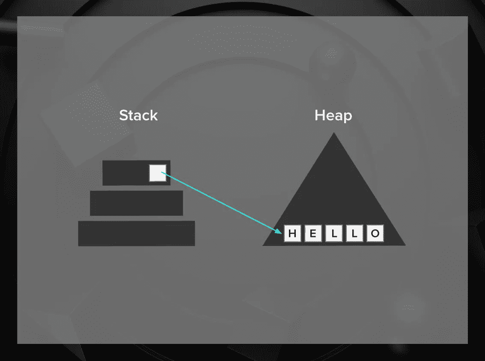
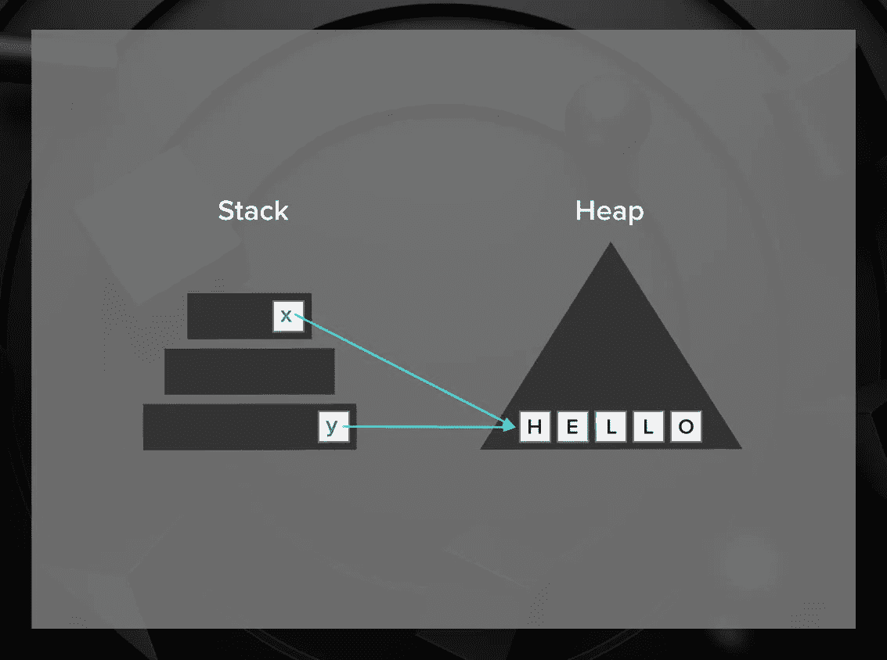
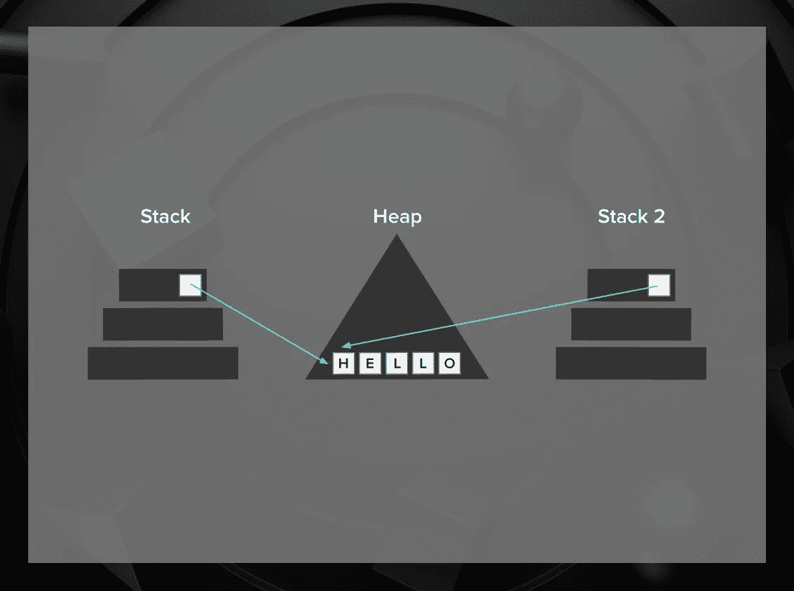
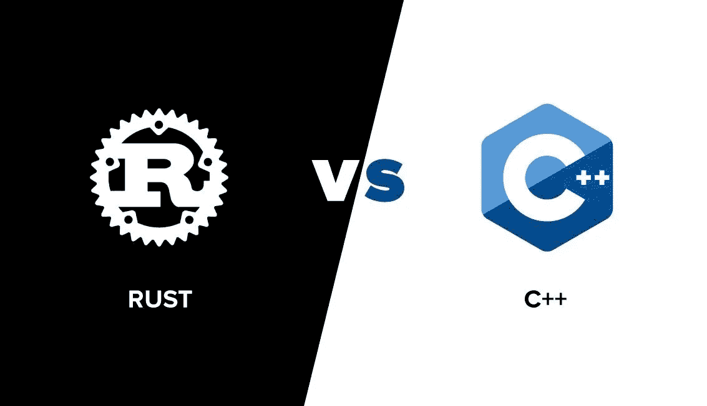

# 为什么你应该考虑在下一门语言中使用 Rust

> 原文：<https://betterprogramming.pub/why-you-should-consider-rust-for-the-next-language-you-learn-39652d8e1bbe>

## 铁锈入门


照片由[德拉诺尔 S](https://unsplash.com/@dlanor_s?utm_source=unsplash&utm_medium=referral&utm_content=creditCopyText) 在 [Unsplash](https://unsplash.com/?utm_source=unsplash&utm_medium=referral&utm_content=creditCopyText)

根据 StackOverflow 的调查，Rust 已经连续四年成为[最受欢迎的编程语言](https://insights.stackoverflow.com/survey/2020#most-loved-dreaded-and-wanted)。大多数试用过 Rust 的人都愿意继续使用它。

但是如果你没有用过，你可能会想 Rust 是什么，为什么它如此特别，是什么让它如此受开发者欢迎？

在本指南中，我将尝试给出一个快速的介绍，并回答您可能会有的关于 Rust 的所有问题。

# 什么是铁锈？

Rust 是一种低级的、静态类型的多范例编程语言，专注于安全性和性能。

Rust 解决了 C/C++长期纠结的问题，比如内存错误，构建并发程序。

它有三个主要好处:

*   更好的内存安全，由于编译器；
*   由于防止数据竞争的数据所有权模型，更容易并发；和
*   零成本抽象。

让我们依次看一下每一个。

## 无 segfaults

如果你想做系统编程，你需要内存管理提供的底层控制。不幸的是，手动管理在像 c 这样的语言中会带来很多问题。尽管有像 Valgrind 这样的工具，但是发现内存管理问题是很棘手的。

生锈可以防止这些问题。Rust 的所有权系统在编译时分析程序的内存管理，确保不会发生由于内存管理不善而导致的错误，并且垃圾收集是不必要的。

此外，如果你想以类似 C 语言的方式实现超级优化的实现，你可以这样做，同时用 [unsafe](https://doc.rust-lang.org/book/ch19-01-unsafe-rust.html) 关键字明确地将它们与代码的其余部分分开。

## 更轻松的并发

由于借用检查器，Rust 可以防止编译时的数据竞争。

当两个线程同时访问同一个内存时，就会发生数据竞争，这可能会导致一些令人讨厌的、不可预测的行为。幸运的是，防止未定义的行为是 Rust 所要做的。

## 零成本抽象

零成本抽象确保你使用的抽象实际上没有运行时开销。简而言之:低级代码和用抽象语言编写的代码在速度上没有区别。

这些东西重要吗？是的。例如，[在过去的 12 年里，微软解决的问题](https://www.zdnet.com/article/microsoft-70-percent-of-all-security-bugs-are-memory-safety-issues/)中大约有 70 %是内存错误。[谷歌 Chrome](https://www.zdnet.com/article/chrome-70-of-all-security-bugs-are-memory-safety-issues/) 也是如此。

# 生锈有什么好处？

Rust 是一种相当低级的语言；当你需要从你所拥有的资源中获取更多时，这是很有用的。因为它是静态类型的，类型系统可以帮助你在编译过程中阻止某些类型的错误。因此，当您的资源有限时，以及当您的软件不出故障很重要时，您会倾向于使用它。相比之下，像 Python 和 JavaScript 这样的高级动态类型语言更适合快速原型。

以下是 Rust 的一些使用案例:

*   强大的跨平台命令行工具。
*   分布式在线服务。
*   嵌入式设备。
*   在其他任何地方，你都需要系统编程，比如[浏览器引擎](https://research.mozilla.org/servo-engines/)，或许还有 [Linux 内核](https://www.theregister.com/2020/07/13/rust_code_in_linux_kernel/)。

比如下面几个操作系统，用 Rust 写的: [Redox](https://www.redox-os.org/) ， [intermezzOS](https://intermezzos.github.io/) ， [QuiltOS](https://github.com/QuiltOS/QuiltOS) ， [Rux](https://github.com/sorpaas/rux) ， [Tock](https://github.com/tock/tock) 。

## Rust 是面向对象的吗？

谁知道现在的面向对象是什么意思？

答案是*不会。Rust 有一些面向对象的特性:你可以创建结构，它们可以包含数据和数据上的相关方法，这有点类似于类减去继承。但与 Java 等语言不同，Rust 没有继承，而是使用特征来实现多态性。*

## Rust 是函数式编程语言吗？

尽管 Rust 表面上与 C 非常相似，但它深受 ML 语言家族的影响。(这个家族包括像 OCaml、F#和 Haskell 这样的语言。)比如 Rust traits 基本就是 Haskell 的类型类，Rust 有非常强大的模式匹配能力。

Rust 的特点是比函数式程序员通常习惯的更易变。我们可以这样想:Rust 和 FP 都试图避免共享可变状态。当 FP 专注于避免易变状态时，Rust 试图避免危险的共享部分。Rust 还缺少了许多使函数式编程在其中可行的东西，比如尾部调用优化和对函数式数据结构的良好支持。

总而言之，Rust 对函数式编程的支持足以让某人写了一本关于函数式编程的书。

## Rust 对游戏开发有好处吗？

理论上，是的。由于 Rust 专注于性能，并且不使用垃圾收集器，因此用它编写的游戏应该是高性能的，并且速度可以预测。

不幸的是，这个生态系统还很年轻，例如，Rust 中没有任何东西可以与虚幻引擎相比。不过，这些部分都在，而且 Rust 有一个活跃的社区。如果你想看用 Rust 写的游戏的例子，你可以去 [Rust 游戏开发子编辑](https://www.reddit.com/r/rust_gamedev/)。

更多关于 Rust 游戏开发:[我们游戏了吗？](https://arewegameyet.rs/)

## Rust 对 web 开发有好处吗？

Rust 有多个用于 web 开发的框架，像 [Actix Web](https://github.com/actix/actix-web) 和 [Rocket](https://rocket.rs/) ，这些都是非常有用和构建良好的。特别是，如果你正在寻找纯粹的速度，Actix Web 达到了[框架基准](https://www.techempower.com/benchmarks/)的顶端。

然而，Rust 没有任何东西可以与 Django 和 Rails 这样的框架生态系统相竞争。由于 Rust 是一种相当年轻的语言，所以缺少许多方便的实用程序库，这意味着开发过程并不那么简单和容易。

Rust 中更多关于 web 开发的内容:[我们已经是 web 了吗？](https://www.arewewebyet.org/)

**TL；Rust 博士是一个强大的工具，可以用来编写内存安全和线程安全的应用程序，同时保持它的速度。虽然它有很大的潜力，但目前还不清楚在需要大量库支持的领域选择 Rust 是否合理。**

# 数据所有权模型

让我们深入了解让 Rust 与众不同的东西之一——它的借用检查器。

为了开始解释 Rust 中的数据所有权，我需要向您介绍低级编程中的两种内存:堆栈和堆。

栈用于静态内存分配，堆用于动态内存分配。简而言之:stack 用于我们知道其内存大小的东西(比如 integers 或 str，在 Rust 中是内存中的字符串)，而 heap 用于其大小可能会显著变化的东西(常规字符串)。为了操作这些可变的东西，我们在堆上为它们分配空间，并在堆栈上放置一个指向该空间的指针。



## 移动的

但是有一个问题:如果给两个变量分配了一个指向堆上相同数据的指针，该怎么办？



如果我们试图通过改变底层的数据来改变其中一个变量，另一个也会改变，这通常不是我们想要的。

如果有两个线程处理相同的数据，会出现相同(甚至更糟)的情况。



想象一下，如果其中一个线程改变了堆上的数据，而另一个线程正在读取它。哦，从中可以得出的怪异的恐怖！我们称之为数据竞赛。

因此，在 Rust 中，只有一个变量可以拥有某条数据。一旦将该数据赋给另一个变量，它就会被移动或复制。

举个例子:

```
let mut s1 = String::from("All men who repeat a line from Shakespeare are William Shakespeare."); 
let mut s2 = s1; 
s1.push_str("― Jorge Luis Borges");
```

这不会被编译，因为数据的所有权被移动到 s2，并且在移动之后`s1`不能再被访问。

## 借款

现在手动移动所有权是相当麻烦的，因为你总是需要确保归还它。

为了解决这个问题，我们可以通过创建对变量的引用来借用变量。使用这些引用并不会转移所有权，而是让我们或者读取变量(不可变引用或`&`)或者甚至改变它(可变引用或`mut &`)。

但是引用是有限制的，因为拥有多个可变引用相当于拥有多个所有者。

这就是为什么编译器强制执行引用事物的规则。

您可以执行以下任一操作:

*   多个不可变引用(只读)，
*   一个可变引用(读写)。

我无耻地借用了 [Rust 用简单的英语](https://github.com/Dhghomon/easy_rust)解释的一个直观的比喻。

把引用的数据想象成 Powerpoint 演示文稿。您可以编辑演示文稿(可变 ref)，也可以将它呈现给任何数量的人(不可变 ref)，但是如果它在被编辑的同时呈现，那么相关部门的负责人可能会被解雇。

# Rust 与 C++

现在我们知道了 Rust 的特别之处，我们可以将它与其他主要的系统编程语言——c++进行比较。



## 为什么选择 Rust 而不是 C++？

在 C++中，开发人员在试图避免未定义的行为时会遇到更多问题。在 Rust 中，借用检查器使您能够通过设计来避免不安全的行为。这根除了一整类的错误，这是非常重要的。

此外，Rust 是一种更现代的语言，在某些方面，也是一种设计更好的语言。特别是，强大的类型系统将帮助您，即使它的主要目标不是捕捉内存错误，并且作为新的工具，它可以根据最佳实践来创建工具，而不用担心遗留的代码库。

如果你不想放弃旧的 C 代码，Rust 有一个解决方案。你可以通过 FFI(外来函数接口)轻松调用你的函数。当然，编译器不能保证这段代码的安全性，但这是一个很好的最后手段。

## 为什么选择 C++而不是 Rust？

C 和 C++已经存在几十年了。无论你想解决什么问题，很可能有很多人都有同样的问题。

有时，这意味着不可能使用 Rust，因为几乎不可能复制生态系统支持。特别是，C++有游戏引擎和框架，我们在相当一段时间内不会在 Rust 上看到。

Rust 解决的问题，现代 C++已经以(有些迂回的)方式解决了，所以如果你不想冒险使用 Rust，信任有经验的 C++开发人员是一个相当安全的选择。

当然，要编写 Rust，有时需要与编译器角力。这并不适合所有人。

最后，Rust 的口号是“一种让每个人都能构建可靠高效软件的语言。”

虽然 Rust 最初是作为 C++的替代品开始的，但很明显他们的目标更远，试图让越来越多可能不会使用 C++的人能够使用低级编程。

这使得这种比较有点意义。Rust 不是替代品，而是一种打开可能性新空间的语言，我们将在下一节讨论其中之一。

# Rust 和 web 组装

如果你还没听说过，WebAssembly 就像是 Web 的… [Assembly](https://en.wikipedia.org/wiki/Assembly_language) 。

历史上，浏览器能够运行 HTML、CSS 和 JavaScript，HTML 负责结构，CSS 负责外观，JavaScript 负责交互。如果您不喜欢用普通的 JavaScript 编写，您可以从添加了类型、Haskell-或 OCaml-like 代码和其他内容的各种其他语言中移植它。

但是，JavaScript 不具备运行游戏等计算密集型应用程序所需的可预测的快速性能。(这是由于垃圾收集器和动态类型。)

WebAssembly 在这方面有所帮助。它是一种浏览器语言，可以作为任何语言的编译目标，如 Rust、Python 和 C++。这意味着你可以用任何现代编程语言编写代码，并把它放到浏览器中。

与其他语言相比，Rust 非常适合编写编译成 WebAssembly 的代码。

*   **最小运行时间。** WebAssembly 没有自己的运行时，需要随代码一起发货。运行时越小，用户需要下载的东西就越少。
*   **静态键入。**由于 Rust 是静态类型的，它可以编译成更高效的 WebAssembly，因为编译器可以使用这些类型来优化代码。
*   我们领先一步。最重要的是，Rust 全心全意地拥抱了 WebAssembly。Rust 已经有了一个很棒的社区和工具来编译 WebAssembly，老实说，这是这三个中最重要的优势。

想了解更多关于 Rust 和 WebAssembly 的信息，请观看 Steve Klabnik 的演讲或查看 rustwasm 的书籍。

# 开始使用 Rust

要开始使用 Rust 代码，你可以在这里下载`rustup`或者使用 [Rust Playground](https://play.rust-lang.org/) ，这是一个在线工具，让你运行一些 Rust 代码并见证其后果。😅

一旦你准备好了你的 Rust 环境，让我们来做一些代码。在这里，我们将做一个 Rust 版本的 fizzbuzz，让大家对 Rust 的能力有一个简单的了解。

要创建一个新项目，请转到您希望项目所在的目录并执行`cargo new fizzbuzz`。这将指示 Rust 的构建经理创建一个新项目。一旦你这样做了，进入`/src`文件夹并打开`main.rs`。

首先，让我们写一些接受一个数字并返回的东西:

*   “嘶嘶”代表被 3 整除的数字，
*   “嗡嗡”代表被 5 整除的数字，
*   “fizzbuzz”表示被 3 和 5 整除的数字，
*   如果用两者都不除，则为字符串形式的数字。

Rust 在匹配语句中有一个非常强大的工具来做到这一点:

由于引号中的文本在内存中是一个字符串，或者在 Rust 中是`str`，我们需要将它转换成一个字符串。

现在，我们需要一种从 1 数到某个数字的方法。我们将编写一个新函数，它将数字作为参数，创建一个从 1 到数字的范围，应用`fizzbuzz`函数，并打印结果。在 Rust 中，我们可以通过一个简单的 for 循环来实现这一点。

为了在终端中实现任何结果，我们需要有一个主函数。让我们用这个替换`hello_world`:

现在，我们可以使用`cargo run main.rs`命令，很可能会在我们的终端上看到一串嘶嘶作响的声音。

但是嘿！也许 fizzbuzz 不是我们玩的唯一游戏？也许新的热门是 wubbalubba？让我们快速修改我们的计数代码，以确保我们可以在镇上玩任何计数游戏。

为此，我们需要 Rust 函数接受另一个函数，该函数接受一个无符号 32 位整数并返回一个字符串。在将所谓的*函数指针*添加到类型签名之后，最坏的情况已经过去了。在里面，我们只需要用函数变量替换 fizzbuzz。

如果我们添加一个新的游戏，以某种方式将整数转换成字符串，我们的函数将能够处理它。

为了方便起见，下面是 wubbalubba(几乎不是一个创造性的发明)和调用它所需的函数:

# 进一步学习

Rust 的社区很棒。无论你走到哪里，你都会发现许多解释清楚、面向初学者的学习材料，以及随时准备帮助你的人:

*   [**巡锈**](https://tourofrust.com/) **。关于 Rust 基础知识的交互式教程，直到泛型和智能指针。**
*   [**铁锈编程语言**](https://doc.rust-lang.org/book/) **。**Rust book 的首选，网上免费提供。
*   [**练习锈迹**](https://exercism.io) **。如果你想在语言和语法方面获得更多的经验，Exercism 是一个不错的选择。不幸的是，看起来 Rust track 现在有点人口过剩，所以不要指望得到很多导师的关注。**
*   [**锈经例**](https://doc.rust-lang.org/stable/rust-by-example/) **。**惯用 Rust 代码的例子集合。
*   [**锈小抄**](https://cheats.rs/) **。**如果你想快速浏览一下 Rust 最重要的概念，这是给你的。
*   [**沙沙作响**](https://github.com/rust-lang/rustlings) **。Rust 练习集，让你在一个受控的环境中与编译器角力。**

我希望这篇文章能帮助你理解为什么 Rust 现在如此受欢迎和喜爱。我还希望我已经让你走上了学习和尝试 Rust 的道路，无论是作为一个工具还是一个附带项目。如果你有问题，不要犹豫，问:我们在你身边。