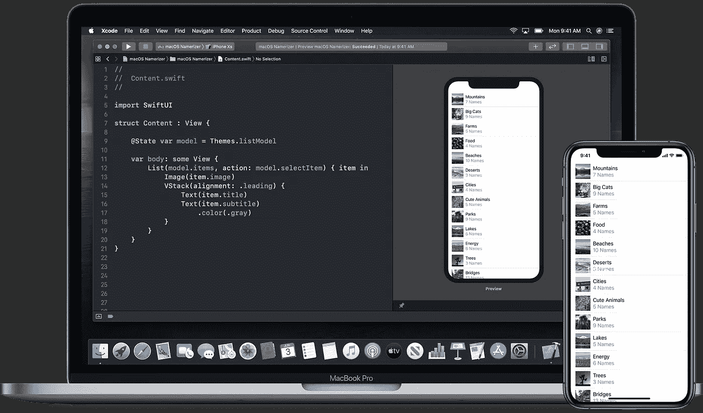

# 为什么您应该在下一个项目中考虑 SwiftUI

> 原文：<https://betterprogramming.pub/why-you-should-consider-swiftui-for-your-next-project-2d67a7e3745e>

## 这不仅仅是炒作或一个阶段——这是在苹果平台上制作应用程序的未来

来自苹果 SwiftUI 主页:[https://developer.apple.com/xcode/swiftui/](https://developer.apple.com/xcode/swiftui/)

我相信 [SwiftUI](https://developer.apple.com/xcode/swiftui/) 是自 iPhone 和 [UIkit](https://getuikit.com/) 问世以来苹果开发者生态系统中最大的转变。

这对开发者来说更好，因为，你不仅可以在 macOS 上运行你的 iPad 应用程序，而且现在你还可以使用现代 API 和声明式设计模式中的新 UI 工具包来创建新的 macOS 目标。

是的，它处于测试阶段，还处于早期。有些人会告诉你，你不应该浪费时间去学习一些还不能生产的东西，因为你现在还不能用它来制作“应用程序”。

然而，它会让你在未来的几年里领先一步。您将熟悉一种全新的应用程序设计方式。如果你已经熟悉了反应式/声明式编程，比如 [React](https://reactjs.org/) ，你很可能会做得很好。

但是如果你不是，你必须知道你不再对你的 UI 发号施令了。你描述它，然后更新你的状态让事情发生，并更新你的组件。

但是 SwiftUI 开创性的方法不仅仅是关于设计模式。事实是，我们第一次有了一个适用于所有苹果平台的统一的 UI 工具包，并且它超越了任何当前的 API。

> “SwiftUI 是一种创新的、极其简单的方式，利用 Swift 的力量在所有苹果平台上构建用户界面。只使用一套工具和 API 为任何苹果设备构建用户界面”——摘自苹果官方 SwiftUI 介绍[。](https://developer.apple.com/xcode/swiftui/)

当然，UIKit 和 AppKit 都立即被弃用。苹果实际上并没有提到这一点。但就我个人而言，我可以预见这将在未来十年发生。将组件引入或迁移到 SwiftUI 将是一个缓慢的趋势。

目前，由于 SwiftUI 缺乏数十年前的框架所提供的大量原生组件，苹果可以非常容易地将您需要的任何东西从 UIKit 或 AppKit 公开到 SwiftUI。你可以在这里跟随他们的[教程。](https://developer.apple.com/tutorials/swiftui/interfacing-with-uikit)

答:目前，SwiftUI 中的许多组件都由 UIKit 和 AppKit 的对应组件提供支持。

一个`List`在 iOS/iPadOS 上是一个`UITableView`(我猜在 macOS 上是`NSTableView`或`NSOutlineView`)。

而`NavigationView`的背后是`UINavigationController`。

但这意味着你应该把 SwiftUI 中的一切都看作一个契约(实际上 SwiftUI 中的一切都是一个协议)。

事实上，`NavigationView`的底层实现是一个`UINavigationController`，这是一个实现细节。

现在，苹果在其所有平台上提供了一种通用的 UI 语言来推送和弹出视图，在未来，他们可以提供一种新的实现/行为，而不会破坏你的应用程序代码。

SwiftUI 是当前 UI 框架之上的一层，同时仍然允许实现你想要的任何东西，因为它有一个[非常高效的自定义绘图](https://developer.apple.com/tutorials/swiftui/drawing-paths-and-shapes) API。

如果您需要的东西不存在，比如一个`UIPageViewController`，您可以从`UIKit`绑定它，但是您也可以很容易地用`ScrollView`和`GeometryReader` 作为本机高阶组件重新实现它。

我不是说你应该重新发明轮子，我是最后一个这样做的人，但这只是因为`SwiftUI`已经为你提供了实现任何你想要的东西所需的工具。

而且足够灵活。我猜苹果公司非常强调 UIKit 绑定/可表示性，因为他们不想因为缺乏原生`SwiftUI`组件而吓跑人们。

在我看来，SwiftUI 对于高阶组件的抽象程度会让苹果在 SwiftUI API 上迭代的速度快很多。我们目前缺少的所有原语(如`Grid` / `CollectionView`)都会及时出现。

# 但是我的新项目怎么办？

在我看来，如果你在 9 月或明年开始一个新的应用程序项目，几乎没有理由不将其保留为 Xcode 11 默认设置，也就是现在的 SwiftUI。

当然，这取决于你的用户目标，而且，目前，很多应用程序仍然需要支持 iOS 11 和 12，甚至可能是 iOS 10。

但如果你想快速出货，如果瞄准 80%的 iOS 生态系统就足够了，那么你绝对应该选择 SwiftUI(一旦你对它感到舒适)。这是一个面向未来的框架，由于有实时预览和声明式 API，迭代您的概念、想法和设计会更快。

您可以用很少几行代码从 UIKit 中导入过去错过的任何内容。

如果你像我一样，有一个大型应用程序作为日常工作，需要支持 iOS 10、11 和 12，那么，你完全可以在 SwiftUI 中提供一些新的、闪亮的 iOS 13 专用功能。

没有理由等待，SwiftUI 现在就在这里享受！

感谢阅读。