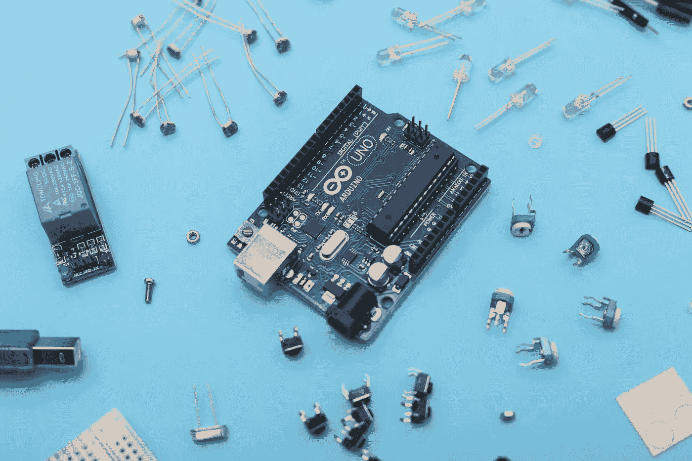

# 为什么你要在让事情变得更好之前放弃

> 原文：<https://betterprogramming.pub/why-you-should-discard-before-you-make-things-better-a971f5352e2e>

## 对战略思考的一个建议

在最近的一次 SpaceX 之旅中，埃隆·马斯克评论道，“一个聪明的工程师最常见的错误可能是优化一个不应该存在的东西。”马斯克的即兴评论抓住了一个普遍的人类倾向:当解决一个挑战时，我们的第一步通常是改善已经存在的东西，而不是质疑哪些东西可以丢弃。

这种行为在研究中出奇的普遍。社会心理学家加布里埃尔·亚当斯(Gabrielle Adams)去年发表的一项研究发现，当即将上任的大学校长征求改进意见时，只有 11%的建议涉及取消某些东西。同样，当被要求改进旅行路线时，只有 28%的参与者通过删除目的地来改进。

但是为什么我们要以这种方式面对挑战呢？抛弃的替代策略在哪些方面有助于激发创新？

# 我们对优化的偏好:先天和后天

由于复杂性偏差，我们更喜欢保留和优化；相对于简单的解释和解决方案，我们对复杂的解释和解决方案的自然偏好。给某些东西贴上复杂的标签给了我们一张许可证，让我们可以跳过对其真实工作原理的探究。我们也认为复杂的东西更有效，更高级。按照这种思路，放弃是令人生畏的，因为它要求我们真正理解一个问题，同时使我们正在处理的事情变得更糟。

对我们创造的东西投入感情也是人类的天性。丢弃某物就是失去它；破坏我们的努力。这在创造性职业中观察得很清楚，人们觉得他们把自己印在了工作中。著名作家斯蒂芬·金鼓励人们不要多愁善感，他呼吁“杀死你的宝贝，杀死你的宝贝，即使这会让你这个以自我为中心的小文人心碎，也要杀死你的宝贝。”

虽然这两种解释是我们与生俱来的，但我们的环境也扮演着重要的角色。马斯克认为，我们更喜欢优化，因为我们相信我们建立的逻辑基础是不可辩驳的。他将此归咎于教育系统，认为我们被训练来回答老师给我们的问题，从来不说“你的问题是愚蠢的”。他将这种模式——接受隐含假设并在此基础上构建——描述为“聚合逻辑”。

# 从基本原则中学习

那么，我们如何摆脱最优化，开始考虑我们可以丢弃什么呢？

第一性原理思维为以这种方式解决问题提供了重要的经验。它包括将事物浓缩到最基本的组成部分，以识别不必要的部分。在此基础上的后续推理有助于创造新的规则和系统，让你看到现有问题的新解决方案。这种思想可以被极其广泛地应用；产品环境中的物理部分，体验环境中的接触点，经营企业环境中的流程，创意环境中的想法。

例如，杰夫·贝索斯运用第一原则思维，围绕基本客户需求打造亚马逊。在 2012 年的一次亚马逊网络服务会议上，他评论说，“在我们的零售业务中，我们知道客户想要低价，我知道这将在 10 年后成为现实。他们想要快速交货；他们想要广泛的选择。”这种专注为贝佐斯在过去十年里将亚马逊的收入提高了 10 倍奠定了基础。

# 抛弃:创新的制胜策略

第一原则思维，以及寻求丢弃不必要的部分，已经导致了整个行业的变革。

在汽车行业，传统的汽油动力汽车通常由大约 30，000 个部件组成；充斥着零件故障和高成本维修的复杂机器。电气化的趋势提供了一个机会，在新技术的帮助下，从下至上重新思考汽车。如今，电动汽车所需的零部件数量约为传统汽车的一半，电动汽车的整个传动系统包含不到 20 个运动部件。从长远来看，更少的零件意味着更少的故障、更少的维修和更低的司机成本。

在零售业，消费者查看产品并选择我们想要购买的产品是至关重要的。但是我们需要排队、将商品放入收银台、扫描并付款，这一点就不那么清楚了。亚马逊的杂货业务——亚马逊生鲜——现在在英国和美国的 40 多家商店提供“走出去”的体验。商店通过使用自动驾驶汽车中发现的相同类型的技术来工作；检测商品何时被拿走或放回货架，在你的虚拟购物车中跟踪它们，并在你离开商店时向你的亚马逊账户收费。

当 Tiny Speck 意识到他们的电脑游戏 Glitch 并不成功时，他们面临着一个困境。他们没有试图让游戏变得更好，而是发现互动聊天功能是用户唯一喜欢的功能。凭借这种洞察力，该公司专注于构建专业的协作工具。这款应用最终以 Slack 的形式推向了市场——这款不可或缺的商业应用如今拥有超过 1000 万的日活用户。

# 在你让事情变得更好之前，一个需要放弃的电话

在我们努力让事情变得更好之前，考虑我们可以放弃什么，这似乎是违反直觉的。毕竟，我们的目的是保持现状。但正如管理大师彼得·德鲁克所说，“战略思考、规划和发展未来愿景的第一步必须从摆脱昨天开始。”这为完全不同的解决方案铺平了道路，而不是迭代式的解决方案——无论你是在制造产品、塑造体验、经营公司，还是仅仅在产生新想法的业务中。