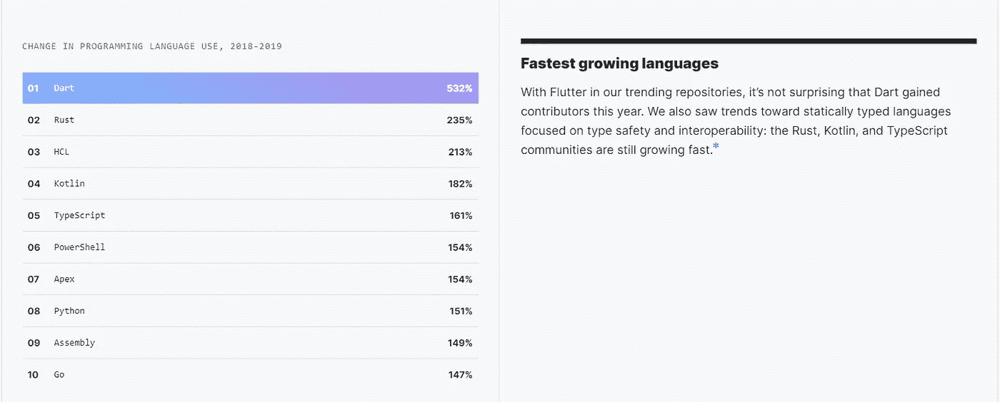

# 为什么你应该学习颤振

> 原文：<https://betterprogramming.pub/why-you-should-learn-flutter-33294c300d79>

## 跨平台的利与弊

对于那些不知道什么是 Flutter 的人，我将非常简要地介绍一下它是什么，以及它与同一领域的其他解决方案有何不同。如果你已经知道什么是颤振，你可以跳到下一节，因为你已经读过了。

Flutter 是 Google 使用 Dart 编程语言构建的跨平台开发框架(也是 Google 构建的)。这意味着程序员可以使用 Flutter 在 iOS、Android、桌面和 web(目前处于测试阶段)上使用单一代码库开发应用程序。Flutter 并不是第一个创建跨平台解决方案的公司。有很多，最受欢迎的是 [React Native](https://reactnative.dev/?ref=producthunt) 、 [PhoneGap](https://phonegap.com/) 、 [Ionic](https://ionicframework.com/) 和 [Xamarin](https://visualstudio.microsoft.com/xamarin/) 。Flutter 不同，因为它使用 Dart，Dart 提前编译(AoT)。这意味着它无需桥就能编译成本机代码。相反，Flutter 使用自己的渲染引擎(稍后会详细介绍)。其他解决方案要么使用 JavaScript 桥(如 React Native)，要么使用 WebViews(如 Phonegap 和 Ionic)。Xamarin 将其视图转换为 iOS/Android 视图，当一个 OS 的新版本出来时，这并不理想。谷歌是这样描述 Flutter 的:

> Flutter 是 Google 的 UI 工具包，用于从单一代码库为移动、web 和桌面构建漂亮的本地编译应用程序。

# 颤振的优点

## 表演

Flutter 使用 Dart，它提前编译成本机代码。这意味着您不会有由于使用 JavaScript 桥、WebView 或 Xamarin 而可能出现的性能问题。Flutter 还使用 Skia 引擎渲染其所有图形，该引擎用于 Google Chrome、Chrome OS、Android 和其他应用程序(包括 Mozilla 的一些应用程序)。这意味着所有的 Flutter 小部件都使用 Skia 引擎渲染，该引擎提供高达 120 FPS 的速度，而不是作为原生小部件构建。这使得用户界面非常流畅和可定制。

## 流行

尽管 Flutter 是一个相对较新的框架，Dart 也不是最受欢迎的编程语言之一，但您仍然应该学习它，因为它的受欢迎程度有了巨大的提高。Flutter 正在席卷跨平台框架世界，并在 GitHub 的贡献者增长最快的开源项目(2019 年)中排名第二。

由于这一增长，Dart 也将见证受欢迎程度的飙升。它进一步成为 2019 年增长最快的语言，比 2018 年增加了 532%。

## 开发者体验

这对我来说是个大问题！设置并不有趣——尤其是当它涉及许多错误和堆栈溢出时——所以这是开发人员不喜欢的少数事情之一。好吧，也许你喜欢设置。这里没有判断。但谷歌在让 Flutter 的设置变得超级简单方面做得非常好。在 Windows、Mac 或 Linux 上的设置非常流畅，为了在上面添加一个樱桃，他们甚至将 Dart 与 Flutter 包捆绑在一起，这样您就可以一次获得所有东西。

现在我们来看看编码体验。VS 代码和 Android Studio 都有扩展，简直不可思议！您可以从包装盒中获得所需的一切。这还包括 Dart 开发人员工具，可以让您深入到代码的不同部分。在开发模式下使用 Flutter 时，Dart 会及时编译。这意味着开发人员能够热重装他们的应用程序。热重新加载是指在您保存对代码的更改后，立即在设备上看到更改。

Flutter 还允许开发人员通过使用单元、集成和小部件测试来测试他们应用程序的不同部分，以使一切正常工作。在 Flutter 中也支持 CI 工作流，将它们集成到您的项目中的一种方法是使用浪子。

## 高级用户界面

Flutter 中的所有东西都是一个小部件(你可能已经听说过或者将会经常听到)。这意味着您需要的所有构件都是小部件，一直到一个简单的“hello world”文本。这使得开发人员可以完全控制屏幕的每个像素，以创建他们需要的功能，并使其看起来令人难以置信。

动画也是开发 Flutter 的一大优势。在开发应用程序时，Flutter 团队已经使创建动画变得尽可能简单。它感觉起来就像微风一样，看起来比其他任何框架都要流畅。这是唯一可能的，因为 Flutter 在幕后使用 Skia 引擎。

## 长期支持

谷歌刚刚发布了 Fuchsia 的编程语言政策。它指出 Dart 是为 OS 构建应用程序的主要方法之一，Fuchsia 的大部分用户界面都是使用 Flutter 构建的。它还列出了更多使用这种语言的优点。Web 和桌面也将很快变得稳定，这意味着这将是一个真正的跨平台框架，可以完成通常至少需要 2-3 个 JavaScript 框架才能完成的工作。

谷歌显然在语言和体验上投入了很多。如果您使用了我前面提到的工具，并使用 Flutter 开发了一个应用程序，您就会理解它们为提供如此好的开发人员体验付出了额外的努力。

# 一些缺点

我谈了很多使用 Flutter 的好处，但我不想让它看起来完美，因为它有一些缺点。你们中的一些人(像我一样)不会被这些困扰，但其他人可能会认为它们是交易破坏者:

*   与 JavaScript 和其他语言相比，Dart 和 Flutter 社区规模较小。您可能需要做额外的研究，或者从零开始想出编码解决方案，因为您正在寻找的包并不存在。
*   您可能无法访问底层的本机特性(大多数跨平台解决方案都存在这个问题)。
*   与素材相比，iOS 小工具的数量较少。如果你计划在 iOS 和 Android 上开发看起来很自然的应用，那么你需要做一些额外的工作来实现这一点。
*   相比原生和 Javascript 开发，职位空缺更少。如果你想学点东西来让自己被录用，JavaScript 可能是个更好的选择，尽管谷歌已经发布了含有 Flutter/Dart 的职位。

# 结论

尽管 Flutter 有一些缺点，但数字表明 Dart 和 Flutter 的社区都在变大——这意味着更多的包、更多的栈溢出帖子和更好的整体体验。我也相信 Flutter 团队会扩展和构建更多的 iOS 和 Android 小部件。随着桌面和 web 的到来以及 Fuchsia 在不久的将来的到来，我相信如果你是一个前端/移动开发人员或者有兴趣学习其中的任何一个，我强烈建议你跳上 Flutter 船，成为这个年轻但快速增长的社区的一部分。

 [## 费萨尔·舒拉💙

### 费萨尔·舒拉的最新推文💙(@fchoura)。瑞士信贷|day☀️的 Javascript 开发者#Flutter 开发者…

twitter.com](https://twitter.com/fchoura)