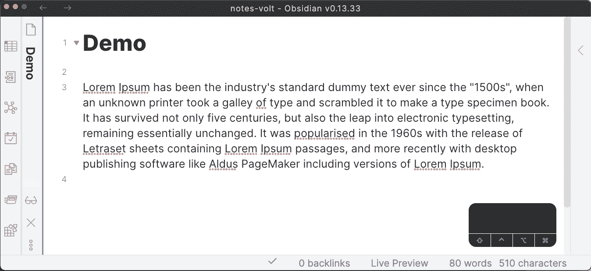

# 为什么即使不使用 Vim 也应该学习 Vim-Keybindings

> 原文：<https://betterprogramming.pub/why-you-should-learn-vim-keybindings-even-if-you-dont-use-vim-6563c5357b64>

## 使用广泛采用的快捷方式集的优势


照片由[帕特里克](https://unsplash.com/@pf91_photography?utm_source=medium&utm_medium=referral)在 [Unsplash](https://unsplash.com?utm_source=medium&utm_medium=referral) 拍摄

在我作为软件开发人员的整个职业生涯中，我们总是试图选择覆盖尽可能多的用例的工具。例如，我们不会选择没有调试器的 IDE。此外，我们试图在团队之间做同样的事情，我们喜欢对所有人都有用的工具，因为它使协作和切换团队变得毫不费力。此外，这一原则在整个行业得到了复制，使得跳槽时的学习曲线更加温和。

类似地，当选择我个人使用的工具来最大化它们的好处时，我喜欢遵循同样的思维模式，其中一个工具就是 Vim 键绑定。

在这篇文章中，我不是试图说服你使用 Vim，而是使用 Vim 键绑定。正如我在本文的[中解释的，我不使用 Vim 进行任何大规模的项目开发，但是我在任何可能的地方都使用 Vim 键绑定。例如，我在 Pycharm 中使用它，如另一篇文章](https://levelup.gitconnected.com/dear-vim-i-q-5df03b763ae4)中的[所述。](https://towardsdatascience.com/the-essential-ideavim-remaps-291d4cd3971b)

# 为什么不是 Emacs 键绑定？

如果您是 Emacs 高级用户或其他工具用户，您可能会问我为什么选择 Vim 键绑定，原因很简单，因为这是我最了解的。

同样的原则也适用于任何可以跨多个工具轻松配置的快捷方式集。因此，即使您不喜欢 Vim 键绑定，也值得花时间遵循这种思维方式。

# 为什么是 Vim 键绑定？

我在任何地方都使用 Vim 键绑定的主要原因是，对于大量的应用程序，我只需要学习一套快捷方式，这有很多好处。

首先，我已经熟练使用这些快捷方式。

秒，它减少了从文本编辑角度使用新应用程序时必须经历的学习曲线。此外，它为您使用的所有编辑器带来了高级文本编辑功能。

在某些情况下，默认编辑器可能是针对鼠标驱动的使用，可能不会为您提供设置所需快捷方式的可能性。例如，在下面的 GIF 中，当我的光标在我的笔记应用程序中的一个命令(`ci”`)的行首时，我能够删除双引号内的字符串(“1500s”)，这太棒了。而且，我不知道其他任何应用程序在设置快捷方式时能提供这种粒度级别。



图片由作者提供。

从软件开发的角度来看，可以肯定的是，目前存在的任何像样的 IDE 都有一些 vim 模拟。基于 vim 仿真的日益流行，我认为这也将适用于未来的应用。

当然，你可以在你使用的每个应用程序上花费时间来匹配快捷方式，但这可能是一项繁琐的任务。相比之下，只需启用 vim 仿真，您就可以使用默认的快捷键集合来满足 90%的需求，对于额外的 10%，您可以设置一个所有应用程序都可以使用的单个`vimrc`文件。

最后，当您不得不在 Vi 是唯一可用编辑器的服务器上编辑配置文件时，您会感谢自己。我记得在我知道如何使用 Vim 之前，我第一次不得不这样做，感觉就像我已经进入了矩阵。

# 我经常使用 Vim 键绑定

以下是我使用某种 vim 模拟的一些用例，但不是全部。

## 网页浏览器

我从 web 浏览器用例开始，因为这是我最不可能寻找 vim 仿真的地方。

有几个不错的模拟器适用于各种网络浏览器，但我使用的是 Chrome 浏览器的 [Vimium](https://chrome.google.com/webstore/detail/vimium/dbepggeogbaibhgnhhndojpepiihcmeb?hl=en) 。

我不使用模拟器浏览 youtube 或 Reddit。当我需要浏览一些文档或检查一些构建结果时，我主要在编码时使用它。所以有了 Vimium，我可以做到手不离键盘。

## 末端的

我认为终端中的 vim-emulation 是我最喜欢的一个，因为没有它，编辑您刚刚输入的命令有时会很痛苦，并且您通常必须使用鼠标。

因为我使用 Zsh，所以我依赖于 [zsh-vi-mode](https://github.com/jeffreytse/zsh-vi-mode) 插件，但是你可以找到任何 shell 的插件。

## JetBrains IDEs

我主要依靠 JetBrains IDEs 来满足我的日常软件开发需求，我使用 [IdeaVim](https://github.com/JetBrains/ideavim) 插件来启用 Vim 仿真。通过这种组合，我可以利用 Vim 的文本编辑优势和 JetBrains IDEs 的健壮性，您可以在本文中了解更多信息。

## 黑曜石和背面

黑曜石和背面是我使用 vim-emulation 做基本笔记或写科学文章的例子。您可以在这两个应用程序中通过简单的配置切换来启用仿真。

我认为软件开发之外的用例是我从使用 vim-emulation 中获得巨大收益的地方，因为有时编辑器只是一些应用程序中的事后想法。

# 最后的话

虽然这篇文章的目的是向您展示学习 Vim-keybindings 是多么有价值，以及它能最大化您学习快捷键所付出的努力的回报。我还想强调不要重新发明轮子的基本理念。

在一些应用程序中，作者花费了大量的时间来构建编辑器。最终，他们 70%的用户依赖 vim-emulation，这是对资源和能源的巨大浪费。想象一下他们会添加多少功能或健壮性。

因此，如果您正在为软件开发人员构建一个需要文本编辑器的应用程序，我认为您应该有一个合理的理由不使用类似 vim 的编辑器，特别是因为 Neovim 使它比以前更容易了。

# 参考

*   亲爱的维姆，我问:！
*   [精华意念图](https://towardsdatascience.com/the-essential-ideavim-remaps-291d4cd3971b)
*   [Vimium Chrome 扩展](https://chrome.google.com/webstore/detail/vimium/dbepggeogbaibhgnhhndojpepiihcmeb?hl=en)
*   [Github—jeffreytse/zsh-VI-mode](https://github.com/jeffreytse/zsh-vi-mode)
*   [Github — JetBrains/ideavim](https://github.com/JetBrains/ideavim)

```
**Want to Connect With the Author?**Follow me on [Twitter](https://twitter.com/amine_elhattami), where I regularly tweet about software development and machine learning, or [Youtube](https://www.youtube.com/channel/UC5HESU2PZakGoNS2pYeO5Og), where I share hands-on video tutorials.
```