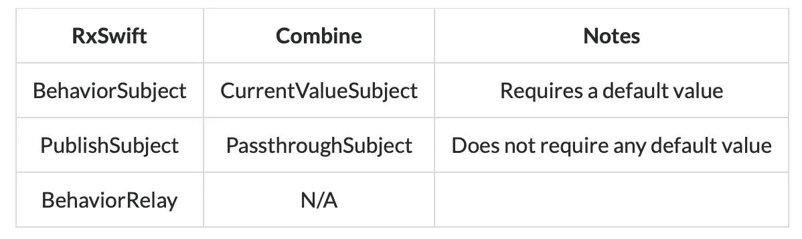
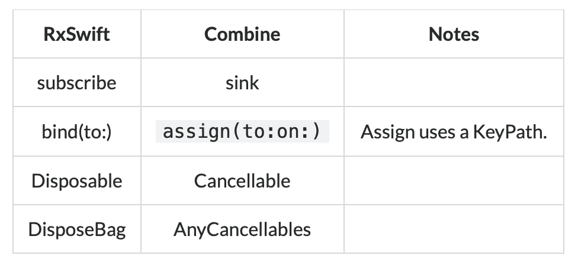

# 为什么您应该从 RxSwift 迁移到 Combine

> 原文：<https://betterprogramming.pub/why-you-should-migrate-from-rxswift-to-combine-6a3118751b31>

## 一个简短的讨论，帮你摆脱疑惑


照片由 [Goran Ivos](https://unsplash.com/@goran_ivos?utm_source=medium&utm_medium=referral) 在 [Unsplash](https://unsplash.com?utm_source=medium&utm_medium=referral) 上拍摄

有很多方法可以看。除了苹果的库，我喜欢在项目中使用更少的第三方库的想法。此外，Combine 和 RxSwift 在反应式编程方面也可以做同样的事情。

权衡这些，我已经开始从 RxSwift 迁移到 Combine，这相当简单。

# RxSwift

在此之前，我想花时间感谢贡献者创造和维护 RxSwift 是一个游戏规则改变者，它对我们许多人来说是一个非常棒的工具。每个贡献者所做的都不是一件容易的事情。随着越来越多的人选择 Combine，我可以提出另一种观点，你可以自豪而大胆地说，Combine 是因为你创建/维护了 RxSwift 而创建的吗？

为此，我衷心感谢每一位贡献者，我相信许多其他人也有同感。

# 结合

现在让我们转到 Combine，这是一个由 Apple 创建的本机框架，它使用了 RxSwift 的许多概念。另外值得注意的是，Combine 仅在 iOS 13.0+，iPadOS 13.0+，macOS 10.15+，Mac Catalyst 13.0+，tvOS 13.0+，watchOS 6.0+上支持。

使用 Combine 也将使将来使用 SwiftUI 的过渡过程更加容易。

# 迁移过程

迁移的关键是了解 RxSwift 的正确替代品是什么。



一些代码示例将有助于进一步加强我们的理解。这个简单的实现向你展示了如何初始化和发送值。

```
// RxSwiftlet isLoading = PublishSubject<Bool>()
let buttonIsLoading = BehaviorSubject<Bool>(false)
..
..isLoading.onNext(true)
buttonIsLoading.onNext(true)
```

使用 Combine，可以选择发射`Error`或`Never`。下面的实现不会发出`Error`，但如果你需要发出`Error`，只需将`Never`替换为`Error`。

```
// Combinelet isLoading = PassthroughSubject<Bool, Never>()
let buttonIsLoading = CurrentValueSubject<Bool, Never>(false)
..
..isLoading.send(true)
buttonIsLoading.send(true)
```

接下来，获取要在我们的 UI 上显示的值



按照上面实现的其余代码，下面是一些获取值的方法:

仔细看的话，迁移过程只涉及到用词替换词。所以，这个过程相当简单快捷。然而，出于额外的谨慎，您仍然需要测试您的代码，以确保它的工作是相同的。

这些技巧将帮助您开始迁移代码。不要在过程中停滞不前。联合社区小组已经创建了一个备忘单来帮助您识别这些关键字。在 [GitHub](https://github.com/CombineCommunity/rxswift-to-combine-cheatsheet) 查看它们。

联合收割机社区使我们所有人的过渡变得容易，这是值得称赞的。

*感谢阅读！敬请关注更多内容。*