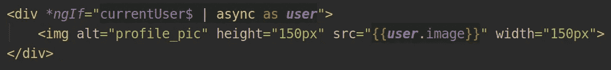
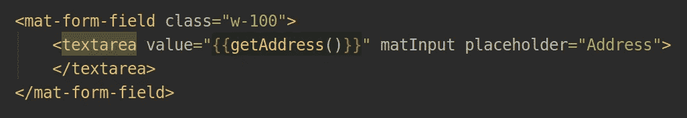
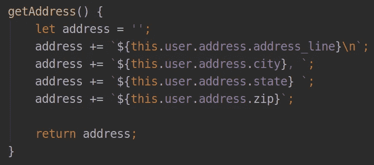
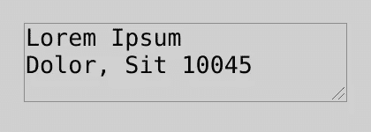
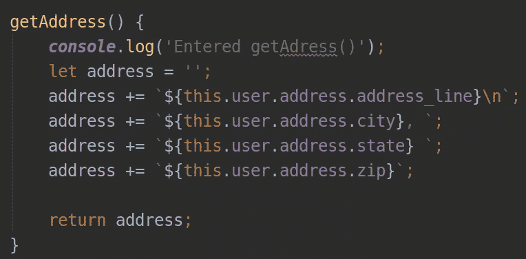
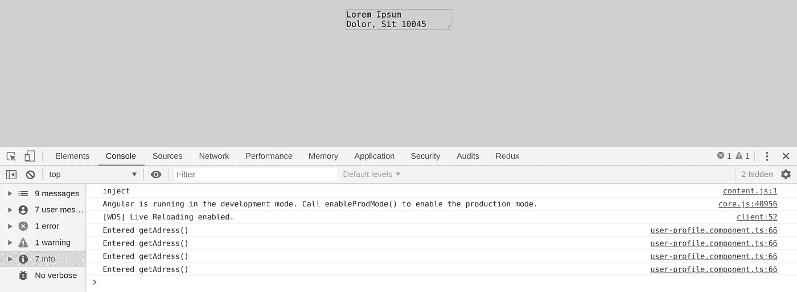
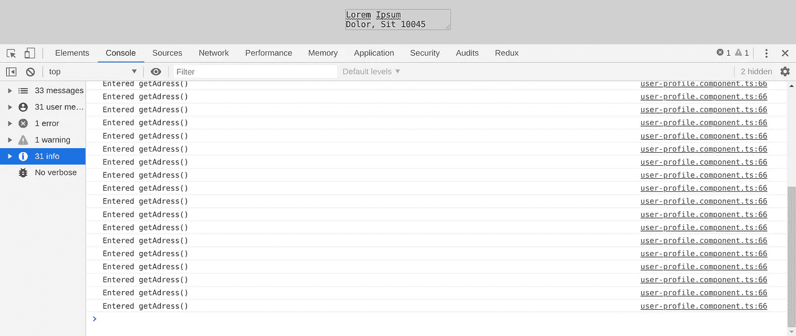
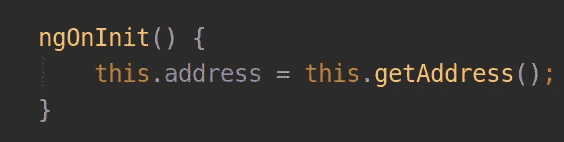
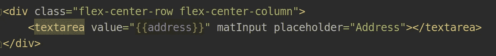
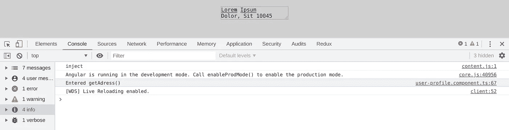

# 为什么不应该在 Angular 中使用模板内部的方法

> 原文：<https://betterprogramming.pub/why-you-should-never-use-methods-inside-templates-in-angular-497e0e11f948>

## 以及取而代之做什么

Angular 是一个很好的框架，它为开发人员提供了很好的工具来轻松构建 web 应用程序。它的核心特性之一是 HTML 被写入模板，这些模板是没有任何 DOCTYPE 声明的 HTML 文件。它们可以以你想要的任何 HTML 标签开始，因为它们；将被附加到`index.html`文件，该文件包含 DOCTYPE、元数据、脚本和样式的链接等元素。

模板最酷的地方不是它们不需要文档类型或元数据。最酷的是它们可以包含一些普通 HTML 文件不能包含的东西。其中之一是，你可以在任何地方打开双括号，并在其中包含一些类型脚本。(就是那样)突如其来

这里有用户对象，我们将它的`image`的路径分配给`img`标签的`src`属性。这是一个非常有用的特性。就像`user`变量一样，你也可以在双括号内使用方法。

一个例子是这样的:

这里，我们使用一个名为`getAddress()`的助手方法，以一种有代表性的方式从用户对象获取地址。这个方法很基本:

不会出事的，对吧？

看起来我们已经得到了我们需要的。地址就在那里。

你想知道它有什么问题吗？让我们在方法的开始放置一个日志。

这样，我们可以知道这个方法何时被触发。我们现在期待的是只看一次这个主机，但是会发生吗？

当我刷新页面并打开控制台时，我看到:

页面刷新后，`getAddress()`方法被触发了四次。而且每次我点击页面，将鼠标悬停在文本区域上，或者点击它，我都会得到越来越多的控制台。

这是因为角度变化检测。我可以向你保证，Angular 的变化检测没有问题，问题出在我们这边。我们在双括号内的模板中使用了一个方法。那不是很聪明。我们应该做的是将这个地址表示赋给一个变量，并确保只调用这个方法一次。

这样，`getAddress()`方法将只被调用一次，用户地址的字符串表示将被赋给`address`变量。

我们可以通过查看控制台来确定这个方法只被调用了一次。

通过在每次点击或悬停在文本区域时触发`getAddress`，我们只是减慢了应用程序的速度。

对于如此简单的情况，这可能不明显。但是想象一下，使用这样的方法有一个填充了值的大型表单。该应用程序的性能将受到更大的影响。

# **结论**

有了 Angular 这样的框架，我们得到了很多普通 HTML 所没有的很酷的特性。

但是如果这些特性的力量被不加思考地使用，那么我们开始听到我们的团队谈论缓慢的框架，有棱角有多糟糕，等等。事实上，在大多数情况下，问题出在我们的代码内部——我们只是没有注意到而已。

感谢阅读！