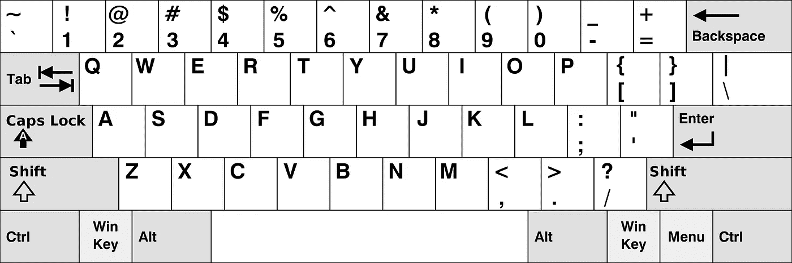
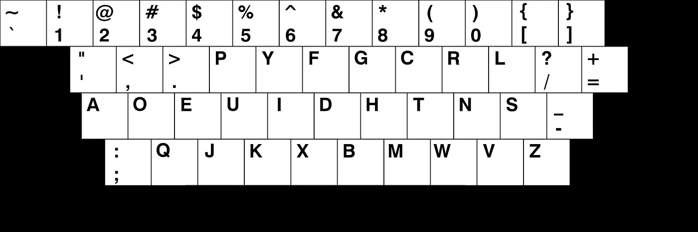
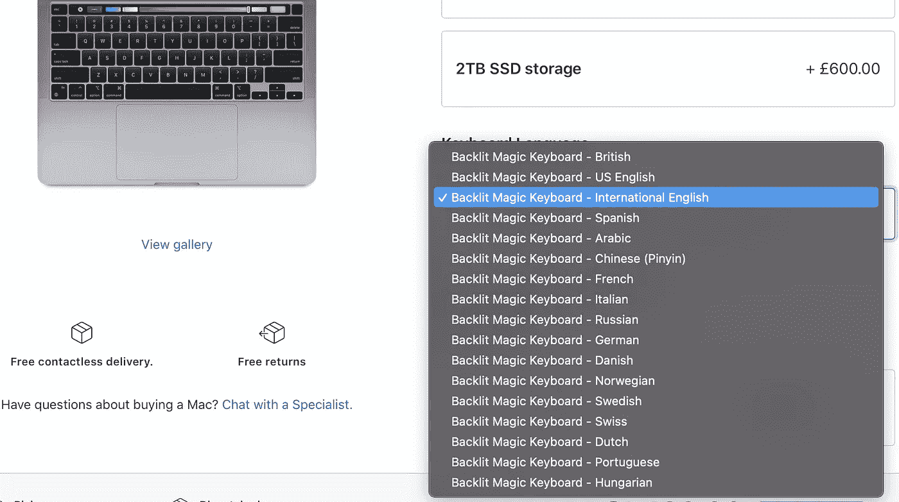

# 为什么你不应该转向德沃夏克

> 原文：<https://betterprogramming.pub/why-you-should-not-switch-to-dvorak-6404d4b75f7b>

## 我使用德沃夏克已经三年多了，我不推荐它

弗洛里安·克拉姆在 [Unsplash](https://unsplash.com?utm_source=medium&utm_medium=referral) 上拍摄的照片。

QWERTY 的起源一直是很多讨论的主题。一种说法是，放置字母是为了让用户打字慢一些，因为打字机的硬件限制。英语中最常见的字母组合被分开。

QWERTY 键盘布局。图片来自[维基百科](https://en.wikipedia.org/wiki/QWERTY)。

无论这个理论是否正确，我们都同意，QWERTY 的布局乍一看并不符合逻辑。

# 为什么要考虑德沃夏克？

德沃夏克键盘布局。图片来自[维基百科](https://en.wikipedia.org/wiki/Dvorak_keyboard_layout)。

另一方面，德沃夏克被设计成一种更符合人体工程学的 QWERTY 替代品，考虑到了英语。你会在首页找到英语中使用最多的字符。元音字母都方便地放在左边。与 QWERTY 相比，如果你把手指放在静止的位置，你将不必移动你的手指那么多。

据说这种键盘布局的好处是让你打字更舒服，减少错误，提高打字速度。特别是一些软件开发人员，已经尝试用它来提高他们的工作效率，因为打字是工作中必不可少的部分。

> “当我从 QWERTY 换到德沃夏克时，我全身心投入。我彻底抛弃了 QWERTY，再也没有回头。在全职使用德沃夏克的两周内，我达到了标准键盘的速度。不久之后，我打败了他们，我的最高速度超过了 100 wpm(高于 QWERTY 上的 75-80)。”— [埃里克·埃利奥特](https://medium.com/@_ericelliott/when-i-switched-from-qwerty-to-dvorak-i-went-all-in-221142715fad)

过去三年我一直使用 Dvorak，它是我目前使用的唯一键盘布局。在那之前，我不能触摸打字(在保持注意力在屏幕上并用我的五个手指打字)。尽管 Dvorak 比 QWERTY 有优势，但我不建议你改用它。我经历过一些你应该考虑的使用 Dvorak 的负面影响。

# 为什么你不应该使用它

## 非标准键盘布局

尽管拥有良好的声誉，并且是非标准键盘布局中最受欢迎的一种，但它并不是主流。您可以在 Apple 网站上配置 MacBook Pro 并选取键盘布局。Dvorak 不是一个可用的选项。你将很难找到具有 Dvorak 布局的键盘。注意，iOS 的设置中也没有 Dvorak 键盘布局。

MacBook 键盘选项

一种解决方案是获得一个带有可互换按键的机械键盘，并手动更改布局。这是一个乏味的任务，你最终必须做一次。在 iOS 上，您可以安装第三方键盘应用程序来更改键盘布局和使用 Dvorak。

## 快捷键

使用 Dvorak 意味着你可以触摸打字，而不必看着键盘打字。所以你可能会说上一节没什么大不了的。但是键盘快捷键有点不一样。

使用快捷键时，我经常发现自己低头看键盘。我会看一个教程告诉我需要怎么按 Crtl+W，用鼠标拿着我的右手，试着快速的按下按键。但是 W 到底在哪里呢？让我回到休息的位置来弄清楚。

出于这个原因，你需要在物理按键和软件/Dvorak 按键之间建立一个心理映射——除非你也物理地切换按键。

即使你很长时间没有使用 QWERTY，你可能也已经习惯了一个最常用的键盘快捷键组合:Ctrl+C- Crtl+V。如果你看看 QWERTY 键盘，你会发现 C 和 V 就在旁边。

一些应用程序设计了尽可能方便用户的快捷键，他们并没有考虑 Dvorak 用户。一种解决方案是使用自动热键脚本或第三方应用程序来重新映射按键。

## 结对编程

打字可以合作。它是一种必需的输入法。当你和某人结对编程时，你会希望能够合作。您最终将无法使用安装了 Dvorak 键盘布局的笔记本电脑。所以准备让你的同事来安装。

如果你和我一样的情况，以前没学过 QWERTY，你会拖队友的后腿。用 QWERTY 键盘打字是令人沮丧和尴尬的，因为你打字会慢五倍。如果你想通过键入几个命令来帮助某人，你将不得不回到你的办公桌并通过信息发送命令。

## 技术面试

虽然老牌公司通常会让你使用笔记本电脑，但初创公司并不总是这样。他们没有预料到的一件事是有人使用 QWERTY 以外的东西。

如果你花了几年时间用 Dvorak 打字，而你的 QWERTY 键盘速度和我一样是每分钟 20 个字，那么在面试中你有两个选择:

*   请他们在笔记本电脑上设置 Dvorak。
*   用 QWERTY 键盘打字，让他们惊讶于你在键盘上打字的糟糕程度。

当我不得不当场要求改变键盘布局时，我 100%的面试都失败了。虽然我不认为这是那些失败的主要原因，但这绝对不是面试的一个好部分。

面试是你应该自信的时刻。这可能是有时间限制的，你应该专注于你的任务。当你拿到一台装有 Ubuntu 的 MacBook Pro，却没人能想出如何让 Dvorak 在上面运行超过五分钟的时候，你的处境就已经很糟糕了。

你的解决方案是询问技术面试将如何进行，以及你是否需要一台笔记本电脑。如果他们告诉你将提供一台笔记本电脑，让他们知道它需要配置有键盘布局。

# 结论

据说德沃夏克的键盘布局优于 QWERTY。我在这方面的一些负面体验来自于这样一个事实，即我不具备在 QWERTY 键盘上打字的技能，而我所处的位置确实需要与其他人合作。

从网上的推荐和我转投 it 行业的朋友那里，如果你符合以下条件，我会推荐德沃夏克:

*   你用 QWERTY 以平均速度打字(每分钟 50 个字以上),可以在 QWERTY 之间来回切换，而且仍然很舒服。
*   你不能在一个协作的环境中工作，你必须经常使用别人的电脑(反之亦然)。远程软件开发者就是这种情况。
*   当涉及到键盘快捷键和重新学习打字时，你可以轻松地改变你所有的习惯。

# 资源

 [## 虚构的事实？标准键盘的传奇

### smithsonianmag.com:打字员和键盘孰先孰后？答案取决于键盘。最近的一篇文章…

www.smithsonianmag.com](https://www.smithsonianmag.com/arts-culture/fact-of-fiction-the-legend-of-the-qwerty-keyboard-49863249/)