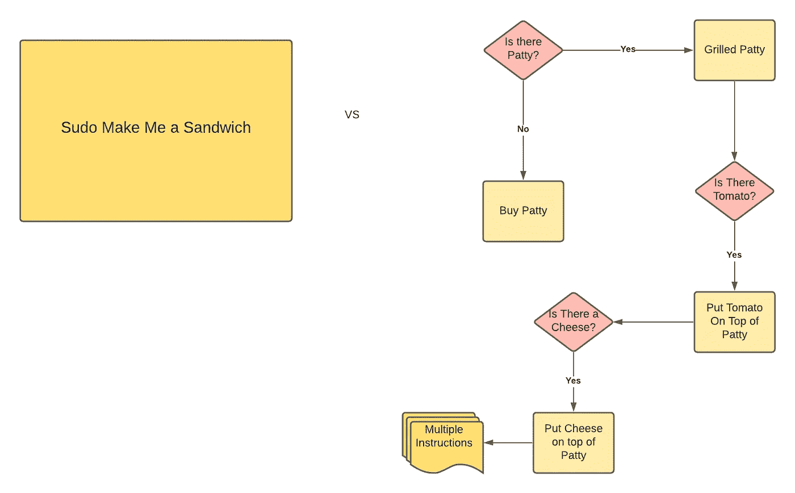
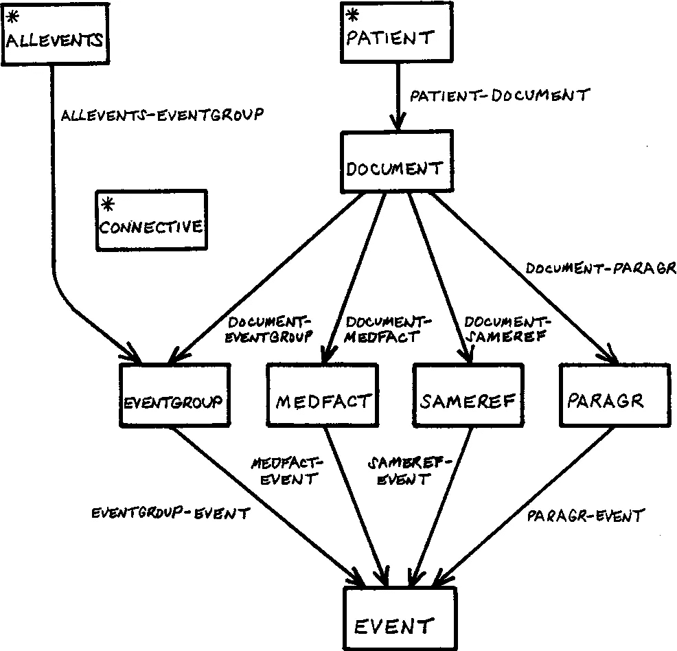

# 为什么你更喜欢声明式 API 设计而不是命令式？

> 原文：<https://betterprogramming.pub/why-you-should-prefer-declarative-api-designs-over-imperative-ddbc1192f9f6>

## React 是声明性的。SQL 也是声明性的。有共性吗？

由作者提供

如今，我们的许多应用程序都围绕着 API。例如，我们应用程序代码的许多核心都是通过 API 进行通信的。我们通过用可理解的抽象将应用分层来构建应用。这个抽象层是必不可少的，因为它帮助我们解决我们的软件是如何编写的及其问题。

定义 API 有两种流行的方式——命令式和声明式。SQL 是一种声明式查询语言，而 IMS 和 CODASYL 使用命令式代码查询数据库。最常用的编程语言是命令式。

然而，在本文中，更广泛使用声明式 API 的一个重要原因是，与命令式 API 相比，它使用起来更简洁，并且提供了更好的抽象。

# 数据模型中的命令式声明

在有 SQL 之前，1960 年，IBM 设计了信息管理系统(IMS ),它有一个分层模型，叫做 CODASYL，类似于文档数据库中使用的 JSON 模型。

这个模型称为网络模型，它有助于为多对多关系创建一个数据模型。每个记录都有多个父记录，我们标记一个记录与另一个记录的关系的方法是在编程语言中使用指针而不是外键。

来源:天然 la 的 Codasyl 型 Schela 通用医学记录

如果你想得到一个特定链接的值，你必须从列表的头部开始遍历，一次查看一条记录，直到找到你想要的那条。

这种检索数据的方式使得开发人员很难进行任何更新或更改，因为他们必须跟踪所有的关系和链接的父链接，否则他们就无法找到他们想要的数据。

# 关系模型数据查询有何不同

关系模型使用不同的方式查询数据。我们，作为开发者，会告诉程序“*”做什么“*”，而不是“*如何*”去做。因此，查询优化器将自动决定以何种顺序执行查询的哪一部分以及使用哪些索引。

告诉程序“做”什么，而不是“如何”做。

声明式方法的一个好处是，查询语言使用 API 抽象了客户机的实现细节。这可以为优化查询优化器留下空间，以产生更好的性能并引入更新的功能，而无需任何查询更改。

随着越来越多的计算逻辑转向软件而不是硬件，SQL 因其灵活性而变得更加流行和广泛使用。

让我们看一下 web 浏览器中声明性 API 和命令性 API 的另一个类比和说明。

# 以 Web 服务为例

让我们举一个在 web 浏览器中使用声明式和命令式方法操作 DOM 元素的例子。

一般来说，使用 CSS 是声明性的，用 JavaScript 操作 DOM 元素是必须的。在下面的例子中，你可以看到为什么 CSS 比 JavaScript 更擅长在网上查询数据。

更改 HTML 标签上的段落“逃脱的那个人”中文本的颜色，如下所示:

使用 CSS，您的代码将如下所示:

相对简单，因为它声明了我们想要将文本的蓝色应用到的元素的模式。不在`class`名称`topClass`下的段落、`
`标签不会改变颜色，因为它与声明不匹配。

另一方面，使用 JavaScript 操作 DOM 元素将如下所示:

使用 JavaScript 来操作 DOM 元素，我们必须告诉程序如何去做。它没有抽象地告诉程序我们想要的结果是什么。这段代码并不比 CSS 长多少，但也更难理解。新开发人员需要完全按照 HTML 页面的指示来理解该功能的意图。

此外，我们必须跟踪我们在 DOM 节点上设置了什么，以及我们没有在 DOM 节点上放置什么。例如，如果用户转到下一页，我们需要手动知道如何将`color:blue`设置回黑色。而且，如果 API 发生了变化，比如新的函数，`getElementByTagNameV2`(我只是瞎编的)，客户端将需要重写函数，因为 API 与客户端的实现是紧密耦合的。

另一方面，在定义 API 的声明方式中——我们可以优化浏览器性能，而无需客户更改他们编写的任何 CSS 标签。

我们知道，在 web 浏览器中查询数据时，CSS 比 JavaScript 更灵活，也更容易向后兼容。

# 在实践中

最终，API 的抽象程度越高，API 的声明性就越强。所有的低级 API 都公开了你想要调用的动词，如果没有命令式 API，我们就无法封装更高级别的抽象 API。换句话说，需要存在一个命令式 API 来将 API 封装成声明式 API。

如果您想让您的 API 更具声明性，请在 API 上放置 config 以进行进一步的抽象。通常，声明式 API 会通过在底层提供一些容错功能来抽象某些方面，因此您不必考虑这些。

假设您想从队列中创建一个轮询值的抽象。你可以通过给一个函数`poll()`来提到轮询的机制。

在声明`poll()`的强制方式中，它只会做一件事——轮询。如果在这个过程中有一些网络问题或故障，它将抛出一个异常。

编写 API 的一种声明性方式是提及函数意图的配置。例如，如果您希望重试次数为 2，并在失败时采取特定的操作。客户端需要考虑的任何特定的错误处理或功能都可以封装在一个配置值中，让 API 为您完成所有困难的工作。

# 关闭

我们开始明白为什么声明式 API 比命令式 API 更容易理解和使用。首先，我们知道目前广泛使用的查询语言——SQL，以及它与前身 CODASYL 的比较。然后，我们看到查询 web 浏览器的声明性方式比命令性形式更容易。最后，理解用户的意图，并使用配置来抽象他们需要实现的所有逻辑，这是过渡到声明式 API 的一个很好的方法。